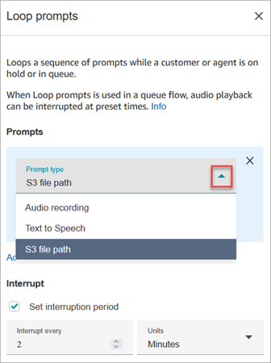
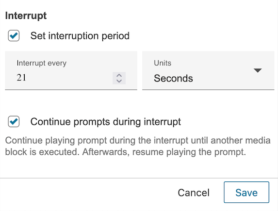
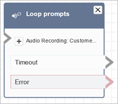
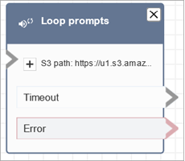

# Flow block in Amazon Connect: Loop prompts

This topic defines the flow block for looping a sequence of prompts while a customer
or agent is on hold or in a queue.

## Description

- Loops a sequence of prompts while a customer or agent is on hold or in
  queue.

## Supported channels

The following table lists how this block routes a contact who is using the
specified channel.

| Channel | Supported?           |
| ------- | -------------------- |
| Voice   | Yes                  |
| Chat    | No • Error branch |
| Task    | No • Error branch |
| Email   | No • Error branch |

## Flow types

You can use this block in the following [flow
types](create-contact-flow.md#contact-flow-types "create-contact-flow.md#contact-flow-types"):

- Customer Queue flow
- Customer Hold flow
- Agent Hold flow

## Properties

The following image shows the **Properties** page of the
**Loop prompts** block. It shows there are three types of
prompts you can choose from the dropdown list: **Audio recording**,
**Text to Speech**, **S3 file path**.

### How the Interrupt option

works

Let's say you have multiple prompts and you set **Interrupt**
to 60 seconds. Following is what will happen:

- The block plays prompts in the order that they are listed for the
  entirety of the prompt length.
- If the combined play time for the prompts is 75 seconds, after 60
  seconds the prompt is interrupted and reset to the 0 second point again.
- It's possible your customers would never hear potentially important
  information that is supposed to play after 60 seconds.

This scenario is especially possible when using the default audio prompts that
Amazon Connect provides since these audio prompts can be as long as 4 minutes.

## How the interrupt option works

In the Loop prompts block, you can choose to enable the **Continue prompts
during interrupt** option.

Consider a scenario where you've configured three 40-second prompts in this loop,
with an Interrupt set to 60 seconds. Here's what happens in each case:

If you don't enable **Continue prompts during interrupt**:

- The block plays prompts in order until the 60-second timeout. This means
  the first prompt plays entirely, followed by 20 seconds of the second
  prompt.
- At 60 seconds, Connect executes the Flows logic in the timeout branch for
  the Loop prompts block. This may include different audio treatments, such as
  brief silences or a separate prompt via a Play prompt block.
- After executing the Resume block in the timeout branch, Connect restarts
  the prompts from the beginning of the first prompt.
- This behavior may prevent customers from hearing important information
  scheduled after 60 seconds (such as in the third prompt). This is
  particularly likely when using default Amazon Connect audio prompts, which
  can be up to 4 minutes long.

If you enable **Continue prompts during interrupt**:

- The block plays prompts in order.
- At 60 seconds, after playing the first prompt and 20 seconds of the
  second, Connect executes the Flows logic in the timeout branch for the Loop
  prompts block.
  - If your timeout branch doesn't use Flow blocks that play different
    audio (such as Play prompt, Get customer input, Store customer
    input, or Invoke Lex bot), Connect continues playing the prompt
    audio from where it was interrupted. To the customer, this sounds
    like uninterrupted playback of the second prompt, followed by the
    third.
  - If the timeout branch includes different audio configurations
    (like a callback offer prompt for long wait times), Connect
    interrupts the Loop prompts block to play this audio. It then
    executes the timeout branch logic before resuming at the start of
    the next prompt in the Loop prompts block. For example, if
    interrupted during the second prompt, Connect resumes at the
    beginning of the third prompt after executing the timeout branch
    logic.

## Configuration tips

- The following blocks are not allowed before the **Loop
  prompts** block:
  - [Get customer input](get-customer-input.md "get-customer-input.md")
  - [Loop](loop.md "loop.md")
  - [Play prompt](play.md "play.md")
  - [Start media streaming](start-media-streaming.md "start-media-streaming.md")
  - [Stop media streaming](stop-media-streaming.md "stop-media-streaming.md")
  - [Store customer input](store-customer-input.md "store-customer-input.md")
  - [Transfer to phone
    number](transfer-to-phone-number.md "transfer-to-phone-number.md")
  - [Transfer to queue](transfer-to-queue.md "transfer-to-queue.md"), including
    **Transfer to callback queue**

- For information about choosing a prompt from the Amazon Connect library or an S3
  bucket, see the [Play prompt](play.md "play.md") block.
- When **Loop prompts** is used in a Queue flow, audio
  playback can be interrupted with a flow at preset times.
- Always use an interruption period that's greater than 20 seconds. This is
  the amount of time an available agent has to accept the contact. If the
  interruption period is less than 20 seconds, you might get contacts going
  down the **Error** branch. This is because Amazon Connect doesn't
  support dequeuing the customer when they are being routed to an active agent
  and are in the 20 second window to join.
- The internal counter for the loop is persisted for the call, not the flow.
  If you reuse the flow during a call, the loop counter isn't reset.
- If this block is triggered during a chat conversation, the contact is
  routed down the **Error** branch.
- Some existing flows have a version of the **Loop
  prompts** block that doesn't have an **Error**
  branch. In this case, a chat contact stops execution of the customer queue
  flow. The chat is routed when the next agent becomes available.

## Configured block

The following image shows what this block looks like when it is configured to play
a prompt from the Amazon Connect library. Choose + next to **Audio
Recording** to view the full name of the file. The configured block has
two branches: **Timeout** and **Error**.

The following image shows what this block looks like when it is configured to play
a prompt from Amazon S3. Choose + next to **S3 path** to view the full
path. The configured block has two branches: **Timeout** and
**Error**.

## Sample flows

Amazon Connect includes a set of sample flows. For instructions that explain how to access the sample flows in the flow designer, see
[Sample flows in Amazon Connect](contact-flow-samples.md "contact-flow-samples.md"). Following are topics
that describe the sample flows which include this block.

- [Sample interruptible queue flow with
  callback in Amazon Connect](sample-interruptible-queue.md "sample-interruptible-queue.md")

## Scenarios

See these topics for scenarios that use this block:

- [Set up a flow to manage contacts in a queue in
  Amazon Connect](queue-to-queue-transfer.md "queue-to-queue-transfer.md")
