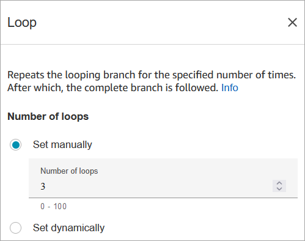
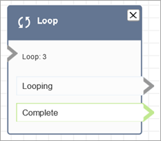

# Flow block in Amazon Connect: Loop

This topic defines the flow block for counting the number of times that customers are
looped through the **Looping** branch.

## Description

- Counts the number of times customers are looped through the
  **Looping** branch.
- After the loops are completed, the **Complete** branch is
  followed.
- This block is often used with a **Get customer input**
  block. For example, if the customer doesn't succeed in entering their
  account number, you can loop to give them another opportunity to enter it.

## Supported channels

The following table lists how this block routes a contact who is using the
specified channel.

| Channel | Supported? |
| ------- | ---------- | ----------------------------------------------------------------------------------------------------------------------------------------------------------------------------------------------------------------------------------------------------------------------------------------------------------------------------------------------------------------------------------------------------------------------------------------------------------------------------------------------------------------------------------------------------------------------------------------------------------------------------------------------------------------------------------------------------------------------------------------------------------------- |
| Voice   | Yes        |
| Chat    | Yes        |
| Task    | Yes        |
| Email   | Yes        | ## Flow types You can use this block in the following [flow types](create-contact-flow.md#contact-flow-types "create-contact-flow.md#contact-flow-types"):  • All flows ## Properties The following image shows the **Properties** page of the **Loop** block. It is configured to repeat three times, and then it branches.  ## Configuration tips  • If you enter 0 for the loop count, the **Complete** branch is followed the first time this block runs. ## Configured block The following image shows an example of what this block looks like when it is configured. It has two branches: **Looping** and **Complete**.  |
