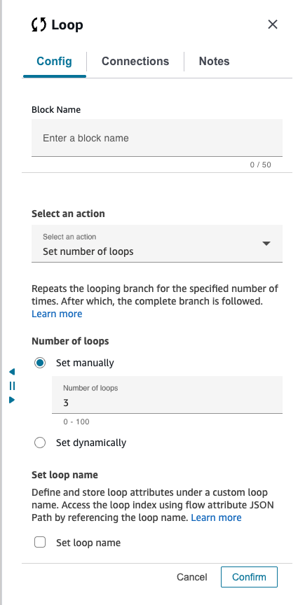
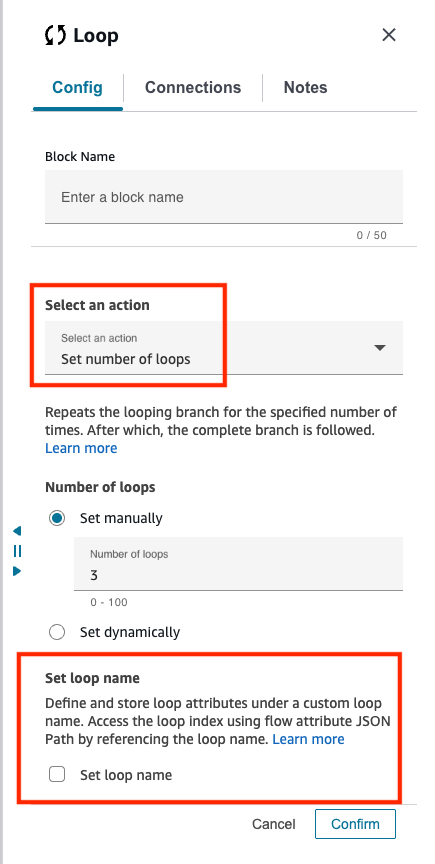
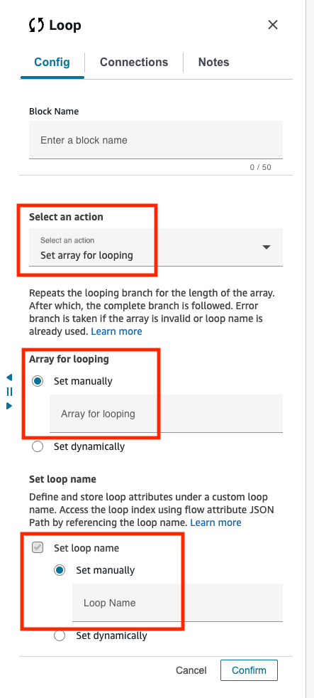
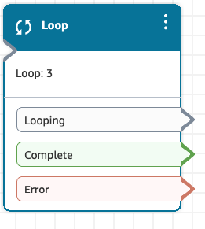

# Flow block in Amazon Connect: Loop

This topic defines the flow block for counting the number of times that
customers are looped through the **Looping** branch.

## Description

- Loops over the same blocks for the configured number through the **Looping** branch.
- After the loop is completed, the **Complete** branch is
  followed.
- If the provided input is incorrect, the **Error** branch is followed.
- This block is often used with a **Get customer input**
  block. For example, if the customer doesn't succeed in entering their
  account number, you can loop to give them another opportunity to enter it.

## Supported channels

The following table lists how this block routes a contact who is using the
specified channel.

| Channel | Supported? |
| ------- | ---------- |
| Voice   | Yes        |
| Chat    | Yes        |
| Task    | Yes        |
| Email   | Yes        |

## Flow types

You can use this block in the following [flow
types](create-contact-flow.md#contact-flow-types "create-contact-flow.md#contact-flow-types"):

- All flows

## Properties

The following image shows the **Properties** page of the
**Loop** block. It is configured to repeat three times, and
then it branches.

In the **Select an action** dropdown, choose from
the following options:

- Set number of loops
- Set array for looping

## Set number of loops

When select an action is set to “Set number of loops”, note the following properties:

- The loop block will loop over for the specified count
- If the provided input is not a valid number, error branch is taken
- If Loop Name is provided, you can access the current index through
  $.Loop.<yourLoopName>.Index, starts from 0

## Set array for looping

When select an action is set to “Set array for looping”, note the following
properties :

- You can provide an array or list to loop through each element in the loop
  block
- The block will loop for the number of elements in the input
- Loop name is required to loop over an array
- You can access the following with the Loop Name
  - $.Loop.<yourLoopName>.Index - Current Index, starts from
    0
  - $.Loop.<yourLoopName>.Element - Current looping element
  - $.Loop.<yourLoopName>.Elements - The provided input
    Array

- Error branch is taken if invalid array is provided

## Configuration tips

- If you enter 0 for the loop count, the **Complete**
  branch is followed the first time this block runs.
- If a loop name is provided, it must be unique i.e. no other loop should be
  active with the same loop name.

## Configured block

The following image shows an example of what this block looks like when it is
configured. It has three branches: **Looping**,
**Complete**, and **Error**
.

