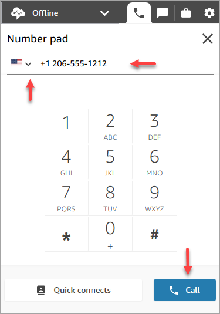

# Make outbound calls using the Contact Control

Panel (CCP)

Before you can make an outbound call, your contact center must be set up to allow
agents to make calls. For more information, see [Step 3: Set telephony](amazon-connect-instances.md#get-started-telephony "amazon-connect-instances.md#get-started-telephony") in [Create an Amazon Connect instance](amazon-connect-instances.md "amazon-connect-instances.md").

For information about the caller ID that's displayed when you make an outbound
call, see [Set up outbound caller ID in Amazon Connect](queues-callerid.md "queues-callerid.md").

###### Note

**IT administrators**: For a list of countries
available for outbound calls based on the Region of your instance, see [Amazon Connect pricing](https://aws.amazon.com/connect/pricing/ "https://aws.amazon.com/connect/pricing/"). If a country
is not available in your dropdown menu, open a ticket to add it to your allow
list. For more information, see [Countries that call centers using Amazon Connect can
call by default](country-code-allow-list.md "country-code-allow-list.md").

###### To make an outbound call

1. In your Contact Control Panel, choose **Number
   pad**.
2. Use the dropdown menu to choose the country, then enter the number.

 3. Choose **Call**.
