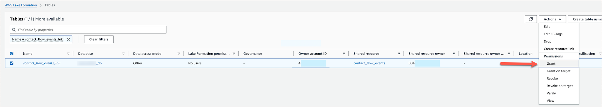
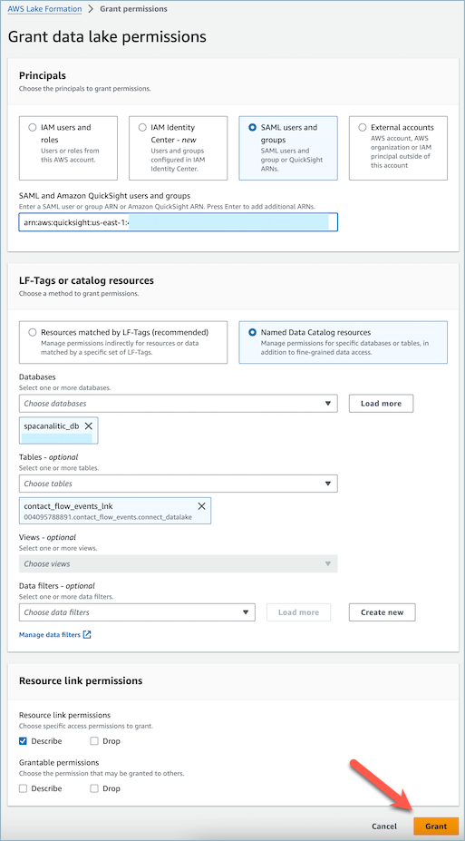
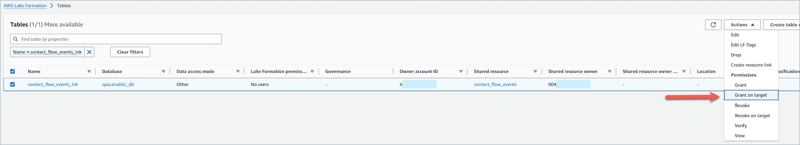
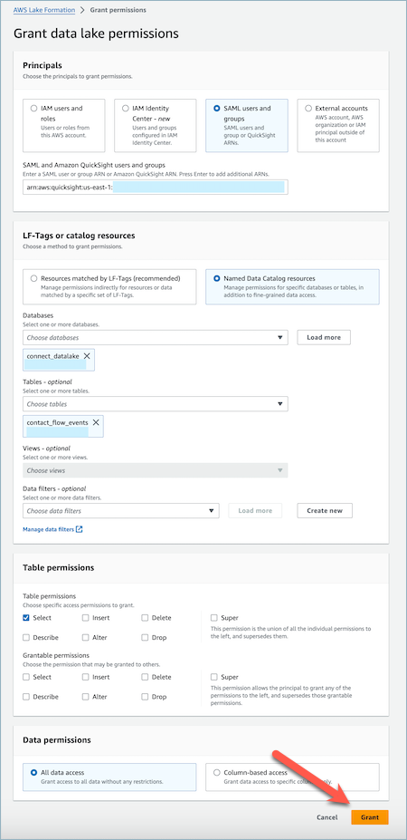

# Manage access to Resource link

tables

In a cross-account access scenario in Lake Formation, in order to grant Select
permission to a user, the user has to have Describe permission on the resource link
since resource links are required for integrated AWS services like Amazon Athena and
Amazon Redshift, and Select permission on the shared table to have read access to the
underlying resource link data. Therefore, it is a two-step grant process.

In order to grant resource link access to a QuickSight user, complete the following
steps:

1. Log into the consumer account as the data lake administrator and go to the
   Lake Formation Console.
2. On the left navigation pane, go to Tables and select the resource link of the
   shared table created in the previous section.
3. Choose **Actions** and select **Grant**.

 4. In the grant data permissions menu, in the Principals section, choose SAML
users and groups and enter the ARN of the QuickSight user. 5. In the Table permissions section choose Describe as a table permission. 6. Choose **Grant**.

Now, the QuickSight user can see that the table exists within Quicksight's dataset
console.

However, if the QuickSight user tries to preview or visualize the data at this stage,
an exception will be raised since the user does not have access to the underlying data.

Now, we will grant the user read access to the data in the resource link's target,
which is the table shared by Amazon Connect. To do that, complete the following steps:

1. Log into the consumer account as the data lake administrator and go to the
   Lake Formation Console.
2. On the left navigation pane, go to **Tables** and select the
   resource link of the shared table created in the previous section.
3. Choose **Actions** and select **Grant on
   Target**.

 4. In the grant data permissions menu, in the **Principals**
section, choose SAML users and groups and enter the ARN of the QuickSight user. 5. In the Table permissions section choose Select as a table
permission. 6. Choose **Grant**.

