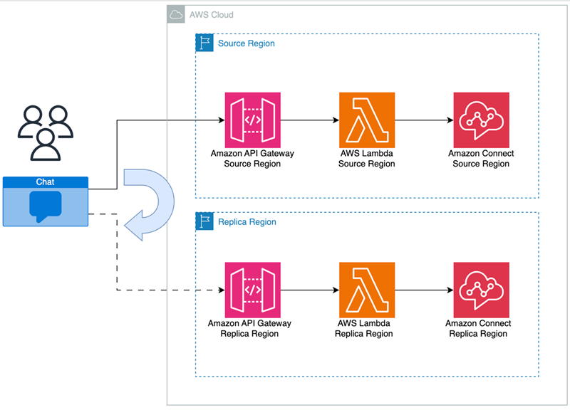
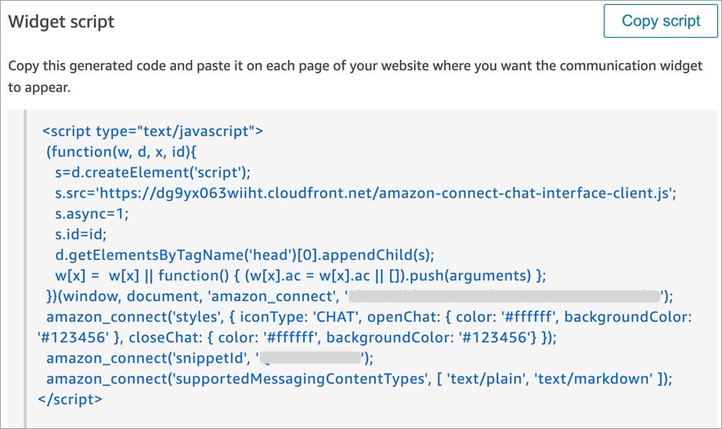

# Manage chat in your Amazon Connect instance across

Regions

You manage chat across AWS Regions by creating two custom chat interfaces or two
out-of-the-box communication widgets: one in the source Region and another in the
replica Region. You manually switch between them depending on which Region's chat
interface or out-of-the-box communication widget you want to use.

- Custom chat interfaces: Configure the chat interface in the replica Region to
  use the API endpoint of the replica Region. For examples of custom interfaces,
  see the [Amazon Connect open source library](https://github.com/amazon-connect/amazon-connect-chat-ui-examples/tree/master "https://github.com/amazon-connect/amazon-connect-chat-ui-examples/tree/master") on GitHub. For more information, see
  [Customize chat with the Amazon Connect open source
  example](download-chat-example.md "download-chat-example.md").
- Out-the-box communication widgets: Create a communication widget in the
  replica Amazon Connect instance. For instructions, see [Configure a communication
  widget in the replica instance](#communicationswidget-multiple-regions "#communicationswidget-multiple-regions").
  Following are the chat configuration parameters that are required in your website or
  app to initiate a client side chat:

- **Amazon Connect instance ID** and **flow ID**: These parameters are the same in the source and replica
  Regions.
- **Target AWS Region** and usually an **API endpoint** to start the chat (that is, to acquire
  the participant token): These parameters are different in the source and replica
  Regions.
  For example, the following diagram shows how the chat configuration needs to be
  updated to point to the API Gateway in the replica Region when chat traffic needs to be
  moved across Regions.

## Configure a communication

widget in the replica instance

1. On your source Amazon Connect instance, create a communication widget for chat if
   one doesn't already exist. For instructions, see [Add a chat user interface to your website hosted by
   Amazon Connect](add-chat-to-website.md "add-chat-to-website.md").
2. On your replica instance, create another communication widget for chat.
   Configure the widget with the same flow that is used in the widget on the
   source instance. The flow is already in the replica instance because Amazon Connect
   Global Resiliency copies all flows from the source to replica and keeps them
   continuously synchronized.
3. Copy the new communication widget script that you created in the replica
   instance. Embed the script on the website or app that should be activated
   when chat traffic is forwarded to the replica instance.
4. To switch traffic between Regions, replace the source instance
   communications widget with the replica instance communications widget in
   your webpage.

The following image shows an example widget script.

 5. If you make any changes to the communication widget in the source instance
at a later time, you also need to make the same changes in the communication
widget in the replica instance.

## Option to add more

seamlessness

To make shifting chat traffic across Regions more seamless, and to require fewer
manual changes, following is another way you can customize your chat
experience:

1. Add a parameter to a centrally controlled database (for example, DynamoDB
   Global Table). The purpose of this parameter is to define which Region is
   currently active.
2. Update your website or application to check the status of the Region
   parameter in the central database.
3. Depending on which Region is active, the website or application will use
   that Region's API endpoint or communication widget.
4. This parameter should be updated at the same time that the [UpdateTrafficDistribution](../APIReference/API_UpdateTrafficDistribution.md "../APIReference/API_UpdateTrafficDistribution.md") API is called to shift voice traffic
   and agents across Regions where applicable.
