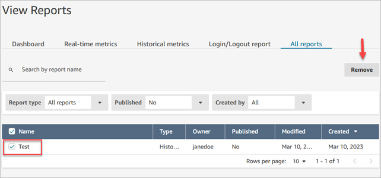

# Manage saved reports as an admin in

Amazon Connect

You can view and delete all saved reports in your instance, including reports that
were not created by you or that are not currently published.

To do this, you need the **Analytics and Optimization** -
**Saved reports (admin)** permission in your security profile.

## View and delete reports

1. Log in to the Amazon Connect admin website at https://`instance name`.my.connect.aws/. Use an account that has **Save reports (admin) -
   All** in it's the security profile.
2. On the navigation menu, choose **Analytics and
   Optimization**, **Dashboards and reports**.
3. On the **View Reports** page, choose **All
   reports**.
4. Use the filters to search by report name, report type, published status,
   and user.
5. To delete reports, select the reports by using the boxes on the left and
   then choose **Remove**, as shown in the following
   image.

