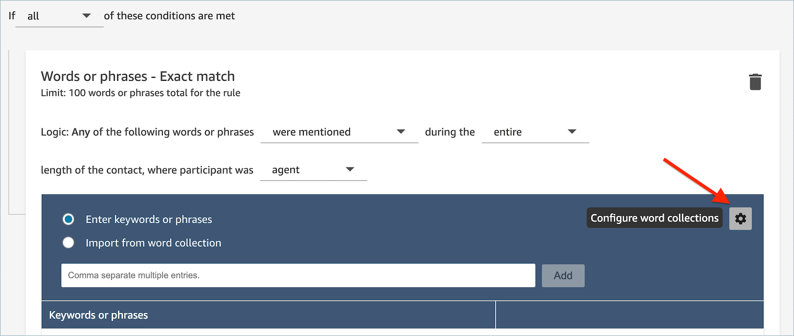
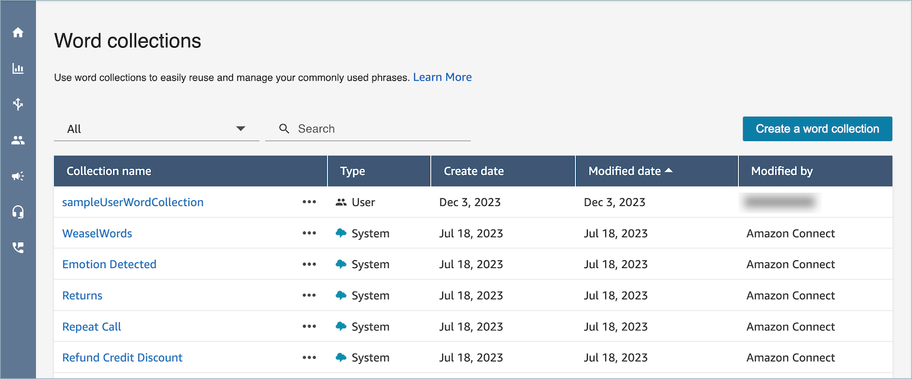
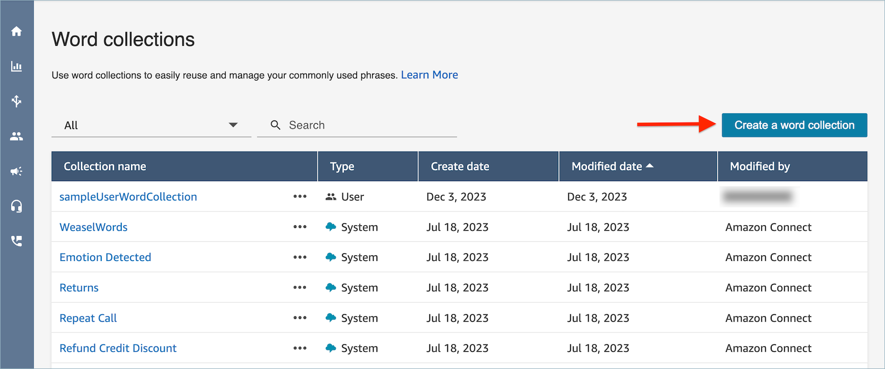
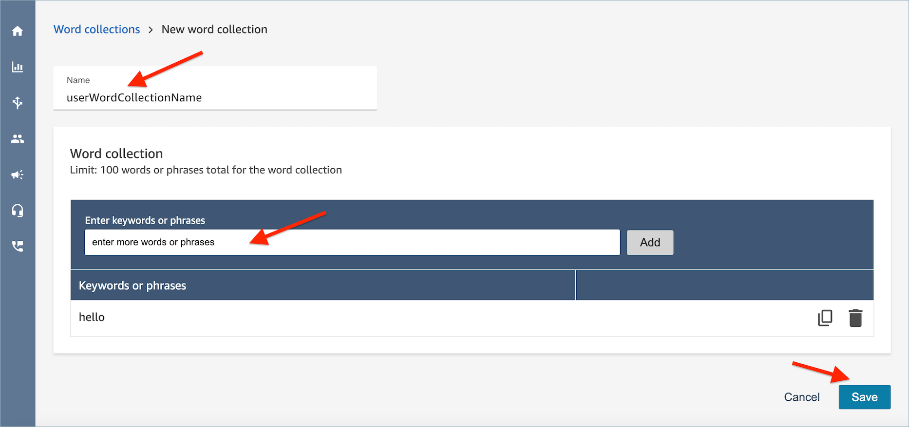

# Manage word collections when you

create conversational analytics rules in Contact Lens

A _word collection_ is a set of pre-built words and phrases
that you can use to define the exact match condition when you create
conversational analytics rules. When you add exact match conditions to a rule,
you can choose a list of words and phrases from a dropdown menu.

## Required permissions

Contact Lens Rules - Word Collections uses the same set of security
profile permissions as Contact Lens Rules. For more information, see
[Security profile permissions for
Contact Lens rules](permissions-for-rules.md "permissions-for-rules.md").

## How to access

the word collection management page

1. When you create or update a conversational analytics rule, choose
   the gear icon on top right of the **Exact match**
   condition card, as shown in the following image.

 2. On the **Word collections** management page, you
can view existing word collections and create new word
collections.

## How to create a user word

collection

######

1. On the **Word collections** management page,
   choose **Create a word collection**.

 2. Enter the name of the word collection, add words and phrases, then
choose **Save**.

## Word collection limits

- Amazon Connect has a default limit of 100 user word collections per
  instance.
- Each word collection can have a maximum of 100 words or
  phrases.
- Each word or phrase is limited to no more than 512
  characters.
- You can manage only user word collections. You can not manage or
  edit system word collections.
