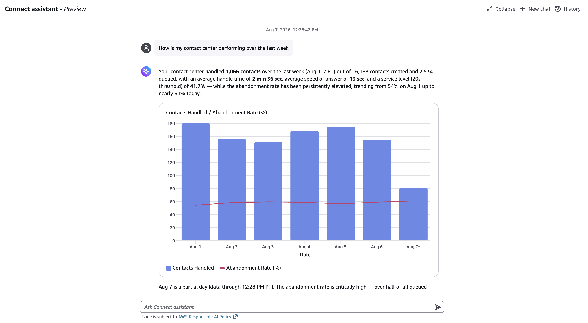

# Visualizations

You can generate charts and tables to help you understand metric trends and
patterns. When you ask a question about your contact center data, the response can be
supplemented with an interactive chart or table that is rendered in the chat
panel.

## Supported visualizations

- **Line charts** – for trends and
  time-series data, such as average handle time over the past two weeks.
- **Bar charts** – for categorical
  comparisons, such as contacts handled by queue. Bar charts support multiple
  series, stacked bars, and horizontal orientation.
- **Mixed line and bar charts** – for
  combining a metric with a reference line, such as contacts handled per day as
  bars with average handle time as a line on the same chart.
- **Area charts** – for cumulative volume
  over time, such as contact volume per day for the last two weeks.
- **Pie charts** – for distributions across
  categories, such as contacts by channel.
- **Tables** – for detailed breakdowns with
  labeled, sorted columns, such as per-agent metrics.

## Request a visualization

You can request your data in a specific visual format, or let manager assist select the format. For example:

- Show me contacts handled by queue today in a bar chart.
- Chart the average handle time trend for this week as a line chart.
- Give me a pie chart of contact volume by channel.
- Plot service level by day against an 80 percent target line.

## Modify a visualization

Generated visualizations are part of the chat, so you refine them the same way that you
refine any other response: by continuing the chat. Responses reflect the visualization
that was last rendered, so follow-up requests such as `that
 chart` or `the table above` work as expected. You can
make the following types of changes:

- **Change the chart type** – for example,
  `Show me that in a bar chart instead.`
- **Change formatting and layout** – for
  example, `Make it taller.`
- **Refine the data** – for example,
  `Only show the top 5 queues`, or `Break that
 down by channel instead.`
- **Add reference points** – for example,
  `Add the target service level as a line.`

## Update a previously generated visualization

You can request a refresh of a previously generated visualization with new data or
parameters. The existing visualization is updated in place instead of creating a
duplicate. For example:

- Refresh that chart with the latest data.
- Show the same chart for last week instead of today.
- Change the date range to the last 30 days.
- Update the table to include contacts handled as a column.
