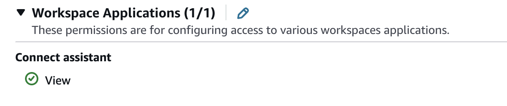
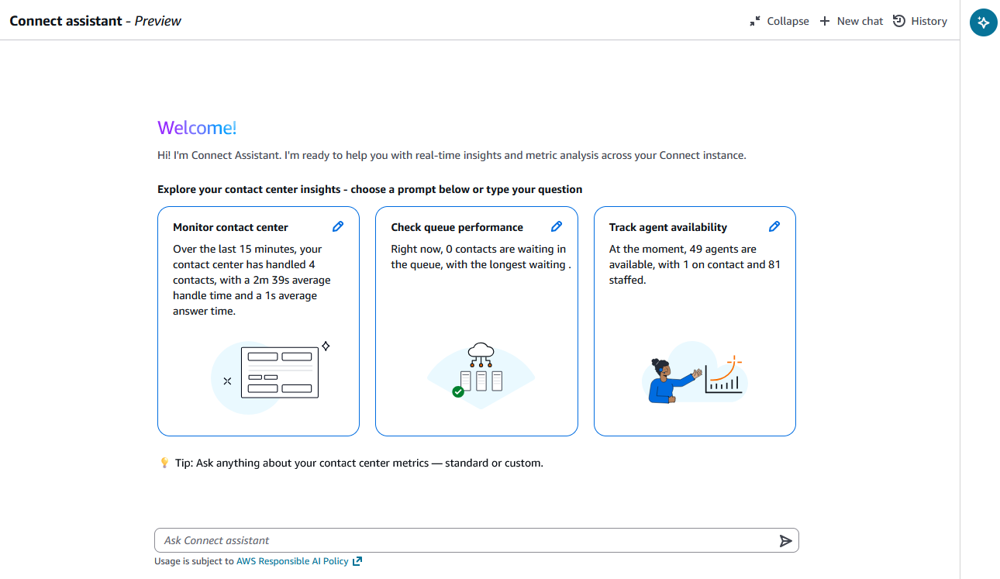
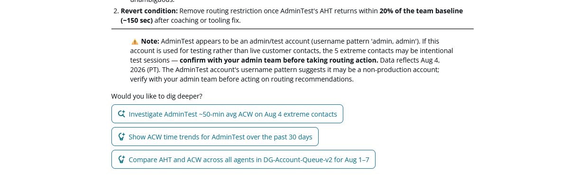

# Get started with manager assistant in Connect Customer

Before you can use manager assistant, assign the required permissions and verify
access.

## Assign permissions for manager assistant

Assign users the following security profile permissions so that they can open
manager assistant and view performance metrics for users, queues, routing profiles,
flows, cases, self-service, AI agents, evaluation forms, and test cases.

- **Workspace Applications, Connect assistant,
  **View**** – grants access to the
  assistant. For information about assigning permissions, see [Security profiles](connect-security-profiles.md "connect-security-profiles.md").

- **Resource-specific view permissions** –
  viewing metric data through manager assistant requires the same permissions
  that are required to view that data elsewhere in Connect Customer. For example, to view
  flows data, you need the **Flows - View** permission, and to
  view users data, you need the **Users - View** permission. For
  the full list, see [List of security profile
  permissions](security-profile-list.md "security-profile-list.md").
- **Access control tags and agent hierarchies**
  – you can use resource tags, agent hierarchies, and access control tags
  to apply granular access to the metric data that manager assistant returns.
  For more information, see [Apply tag-based access
  control](dashboard-tag-based-access-control.md "dashboard-tag-based-access-control.md") and [Apply hierarchy-based access
  control](dashboard-access-control.md "dashboard-access-control.md").

## Ask your first question

###### To ask a question in manager assistant

1. In the Connect Customer admin website, choose the assistant icon in the right
   panel.

 2. Type a question, or choose one of the suggested prompts. For example,
`How is my contact center performing over the last
 week?`

 3. Review the response, and then ask a follow-up question to drill into your data
or to view historical trends. Manager assistant also suggests follow-up
prompts that you can choose. For more information about the types of questions
that you can ask, see [Capabilities
overview](manager-assistant-capabilities.md "manager-assistant-capabilities.md").

