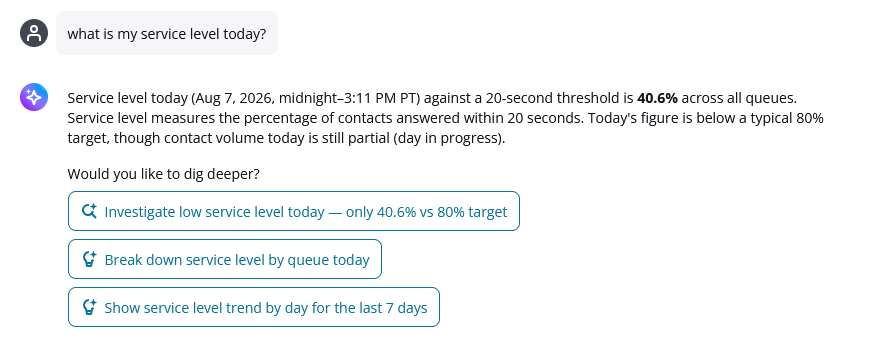
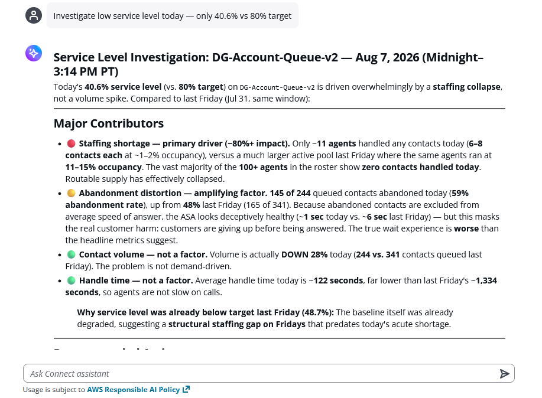

# Investigations and recommendations in manager assistant

When you ask manager assistant a question that starts with `why`, or
when you request an investigation into a metric change, manager assistant runs an
investigation. An investigation is a multi-step analysis that goes beyond returning a single
metric value: it examines multiple related data points across your contact center to identify
which factors contributed to the change, and what you can do about it.

###### Important

Responses generated during investigations might contain inaccuracies.
Manager assistant identifies correlations in your data, and cannot confirm definitive
root causes. Always validate investigation findings before you make operational
decisions.

## How investigations work

When you ask an investigative question, manager assistant performs the following
steps:

1. **Identify** – determines the metric or
   condition that you want explained.
2. **Investigate** – examines related metrics
   across multiple dimensions, including agent activity, contact patterns, and
   historical trends.
3. **Correlate** – identifies patterns and
   contributing factors across your contact center data.
4. **Recommend** – returns the findings with
   recommended actions.

## Example investigation

The following example shows an investigation of a service level drop, starting with
this question: `Our service level is impacted in the last hour but volume looks
 normal. Investigate what happened.`

When manager assistant identifies a potential issue, it also suggests investigation
prompts. Choosing a prompt starts the multi-step analysis.

During the investigation, manager assistant displays a processing state while it
examines multiple data dimensions. Investigations require more processing time than
standard metric lookups, so expect responses to take longer than they do for a simple
question.

When the investigation is complete, manager assistant returns a structured analysis.
The format varies with the complexity of the issue, and typically includes the major
contributing factors, the factors that were eliminated, and recommended actions.

Following the analysis of the major contributing factors, manager assistant provides
prioritized recommended actions. Each recommendation includes the reasoning for why it
addresses the identified issue, and might include a confidence indicator that reflects how
directly the action addresses that issue. The following table shows example recommended
actions for this investigation.

| Priority  | Action                                                                                                                                                                                                                                                                                                                      | Confidence     |
| --------- | --------------------------------------------------------------------------------------------------------------------------------------------------------------------------------------------------------------------------------------------------------------------------------------------------------------------------- | -------------- |
| Immediate | Escalate to workforce management to restore staffing for the remainder of today. Identify why agents are absent: unscheduled absences, status misuse, or a scheduling gap. With volume down 28 percent, even a partial staffing restoration should recover service level quickly.                               | High           |
| Now       | Enable queue callbacks to deflect the 59 percent of contacts that are currently abandoning. Each callback converts an abandonment into a recoverable contact, and reduces the wait for other customers.                                                                                                            | Medium         |
| Avoid     | Do not increase agent concurrency as a substitute for headcount. Handle time is already low (about 122 seconds), so the bottleneck is the number of agents online, not how quickly they handle contacts. Adding concurrency to an understaffed queue does not resolve the issue, and risks quality degradation. | Not applicable |
| Strategic | Investigate the Friday baseline. Last Friday's service level of 48.7 percent was also well below target, which suggests that this is not a one-time event. A structural review of Friday staffing is warranted.                                                                                                    | High           |

## Characteristics of investigation responses

- **Baseline comparison** – each finding is
  compared against the same day of the week in the prior period, rather than
  against an arbitrary threshold.
- **Primary and secondary attribution** –
  investigations distinguish contributing factors from symptoms. For example,
  because abandoned contacts are excluded from average speed of answer, that metric
  can appear healthy while customers are abandoning.
- **Explicit elimination** – when a factor
  did not contribute, such as contact volume in the preceding example, the response
  states that with supporting data.
- **Reasoning in recommendations** – each
  recommended action explains why it addresses the issue.
- **Signal strength** – when the available
  data is insufficient to support a conclusion, such as a low number of
  evaluations, the response reports the absence of a signal instead of drawing an
  unsupported conclusion.

## Tips for effective investigation questions

| Instead of this     | Try this                                                                                            |
| ------------------- | --------------------------------------------------------------------------------------------------- |
| Why are things bad? | Our service level dropped to 40 percent in the last hour but volume looks normal. What happened? |
| What is wrong?      | Why is average handle time higher today compared to last Tuesday?                                |
| Fix the queue.      | What caused the abandonment spike in the Support queue between 2 PM and 3 PM?                    |

## Supported investigations

You can start an investigation by asking why questions such as the following.

| Investigation type         | Example question                                                                     |
| -------------------------- | ------------------------------------------------------------------------------------ |
| Service level drop         | Our service level dropped to 40.6 percent but volume looks normal. What happened? |
| Handle time increase       | Why is handle time 2 minutes higher today than last Tuesday?                      |
| Abandonment spike          | What caused the abandonment spike in the last hour?                               |
| Volume anomaly             | Why did volume spike 50 percent today?                                               |
| Occupancy change           | Why is occupancy at 30 percent when we are fully staffed?                         |
| Adherence gap              | Why is adherence low today across the billing team?                               |
| Agent performance variance | Why are 3 agents handling twice the average handle time of the rest of the team?  |

## Important considerations

- Investigations are read-only. Manager assistant cannot make changes to your
  contact center configuration.
- Findings identify correlations and relationships in your data. They are not
  guaranteed root causes.
- When the available data is insufficient to support a conclusion,
  manager assistant states that explicitly instead of speculating.
- Investigations examine the same data that is available in your Connect Customer
  dashboards and reports.
