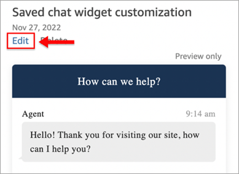
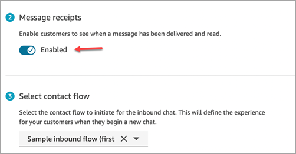

# Enable notifications for chat customers in Amazon Connect

You can enable message _Delivered_ and _Read_ in
your [chat user interface](add-chat-to-website.md "add-chat-to-website.md") so your customers know
the status of the messages they send. This provides transparency to customers, and improves
the overall chat experience.

Regardless of whether message receipts are enabled, the message receipt data and events
are always sent and can be seen in the network log. Enabling and disabling message receipts
in your chat user interface only affects whether the receipts appear in the communication
widget transcript.

###### Tip

By default message receipts are already enabled in the [Test
chat](chat-testing.md#test-chat "chat-testing.md#test-chat") experience, the Contact Control Panel (CCP), and [downloadable open source example](download-chat-example.md "download-chat-example.md") of the chat
widget.

###### To enable message receipts in your chat user interface

1. Log in to the Amazon Connect admin website at https://`instance name`.my.connect.aws/. Choose **Customize communications widget**.

 2. Choose **Edit**.

 3. By default **Message receipts** is not enabled. Set to
**Enabled**.

Message receipts are now enabled. Customers who are using the communications widget will start
seeing _Delivered_ and _Read_ receipts immediately.
