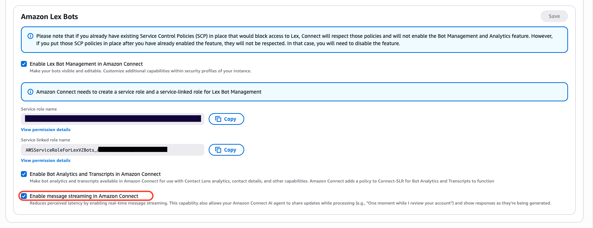

# Enable message streaming for AI-powered

chat

Amazon Connect supports message streaming for AI-powered chat interactions. Responses from AI
agents appear progressively as they're generated, improving the customer experience
during conversations.

The following are integration options, along with features of each option:

- Amazon Connect agents
  - Eliminates Amazon Lex timeout limitations
  - Provides fulfillment messages during processing (such as "One moment
    while I review your account")
  - Displays partial responses with progressive text (growing text
    bubble)

- Third-party bots via Amazon Lex or Lambda

      + Eliminates Amazon Lex timeout limitations
      + Standard bot response behavior

  Instances created starting December 2025 are automatically opted into this feature.
  For existing instances, you must enable message streaming manually using the API or
  through the console.

## Enable message streaming using the

API

Use the [UpdateInstanceAttribute](../APIReference/API_UpdateInstanceAttribute.md "../APIReference/API_UpdateInstanceAttribute.md") API to enable message streaming. Set the
`MESSAGE_STREAMING` attribute to `true`.

```
aws connect update-instance-attribute \
  --instance-id `your-instance-id` \
  --attribute-type MESSAGE_STREAMING \
  --value true
```

To opt out, set the attribute to `false`.

## Enable message streaming using the

console

For newly created instances, message streaming is enabled by default.

For existing instances:

1. Open the Amazon Connect console and choose your instance.
2. In the navigation pane, choose **Flows** >
   **Amazon Lex bots**.
3. Under **Lex bots configuration**, select
   **Enable message streaming in Amazon Connect**.

###### Note

When you enable message streaming using the console, the required
`lex:RecognizeMessageAsync` permission is automatically added to
the bot alias resource-based policy. When using the API, you must add this
permission manually.



## Update Lex bot permissions

After message streaming is enabled, Amazon Connect needs permission to call the Amazon Lex
API:

```
lex:RecognizeMessageAsync
```

You must update the resource-based policy for each Amazon Lex bot alias used by
the Amazon Connect instance.

### When to update the bot's

resource-based policy

- **New instances** – Any newly
  associated Amazon Lex bot alias will have
  `lex:RecognizeMessageAsync` in its alias policy by
  default.
- **Existing instances with existing bots**
  – If the instance previously used Amazon Lex and you enable message
  streaming now, you must update the resource-based policy on all
  associated Amazon Lex bot aliases to include the new permission.

### Example snippet for Lex bot alias

resource-based policy

```
{
  "Version": "2012-10-17",
  "Statement": [
    {
      "Sid": "connect-us-west-2-MYINSTANCEID",
      "Effect": "Allow",
      "Principal": {
        "Service": "connect.amazonaws.com"
      },
      "Action": [
        "lex:RecognizeMessageAsync",
        "lex:RecognizeText",
        "lex:StartConversation
      ],
      "Resource": "arn:aws:lex:us-west-2:123456789012:bot-alias/MYBOT/MYBOTALIAS",
      "Condition": {
        "StringEquals": {
          "AWS:SourceAccount": "123456789012"
        },
        "ArnEquals": {
          "AWS:SourceArn": "arn:aws:connect:us-west-2:123456789012:instance/MYINSTANCEID"
        }
      }
    }
  ]
}
```

You can add this permission by calling the Amazon Lex [UpdateResourcePolicy](../../../lexv2/latest/APIReference/API_UpdateResourcePolicy.md "../../../lexv2/latest/APIReference/API_UpdateResourcePolicy.md") API to update the Amazon Lex bot alias
resource-based policy to include the `lex:RecognizeMessageAsync`
action for the Amazon Connect instance ARN resource.

###### Important

This feature currently does not support branching back to the same [Flow block in Amazon Connect: Get customer input](get-customer-input.md "get-customer-input.md") flow block or reusing a Amazon Lex bot with the same
alias in another **Get customer input** block. Instead, create a
new **Get customer input** block using a different Amazon Lex bot
alias.

## Timeout limits

The following timeout limits apply to chat experiences:

- **Standard chat experience** –
  10-second timeout
- **Chat streaming** – 60-second
  timeout
