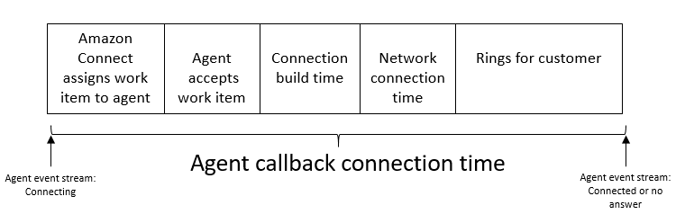
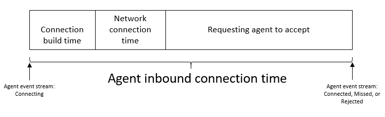
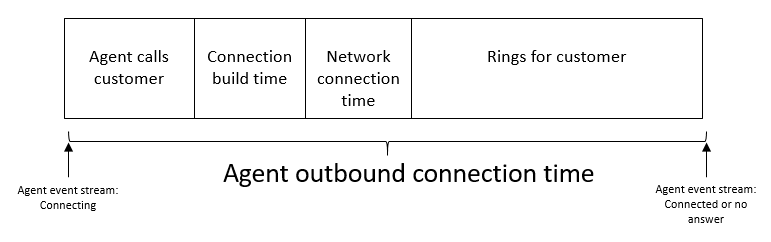
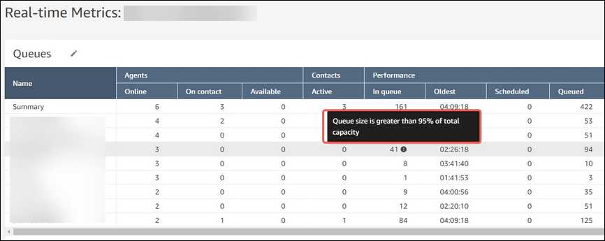

# Metric definitions in Amazon Connect

This topic lists all metrics in alphabetical order. For lists of metrics that apply only
to a specific feature area, see these topics:

- [Custom metric primitives](metric-primitive-definitions.md "metric-primitive-definitions.md")
- [Amazon Connect Cases metrics](case-management-metrics.md "case-management-metrics.md")
- [Amazon Connect bot metrics and analytics](bot-metrics.md "bot-metrics.md")
- [Conversational analytics
  metrics](contact-lens-metrics.md "contact-lens-metrics.md")
- [Evaluation metrics](evaluation-metrics.md "evaluation-metrics.md")
- [Outbound campaign metrics](outbound-campaign-metrics.md "outbound-campaign-metrics.md")
- [Schedule Adherence
  metrics](scheduling-metrics.md "scheduling-metrics.md")

## Abandonment rate

This metric measures the percentage of abandoned contacts. An abandoned contact refers
to a contact that was disconnected by the customer while in queue. This means that they
weren't connected to an agent. Contacts queued for callback are not counted as
abandoned.

The abandonment rate helps you identify potential issues with long wait times or
inefficient queue management. A high abandonment rate may indicate a need for additional
staffing, improved call routing strategies, or addressing queue bottlenecks.

**Metric type**: String

- Min value: 0.00%
- Max value: 100.00%

**Metric category**: Contact record-driven metric

**How to access using the Amazon Connect API**:

- [GetMetricDataV2](../APIReference/API_GetMetricDataV2.md "../APIReference/API_GetMetricDataV2.md") API: `ABANDONMENT_RATE`

**How to access using the Amazon Connect admin website**:

- Real-time metrics reports: Abandonment rate
- Historical metrics reports: Abandonment rate

**Calculation logic**:

- (Contacts abandoned / Contacts queues ) \* 100.0

## Active AI Agents

This metric measures the total number of unique [AI Agents](create-ai-agents.md "create-ai-agents.md"), where each AI
Agent is identified by its unique combination of `Name` and `Version`.

**Metric type**: Integer

**Metric category**: AI Agent

**How to access using the Amazon Connect API**:

- [GetMetricDataV2](../APIReference/API_GetMetricDataV2.md "../APIReference/API_GetMetricDataV2.md")
  API metric identifier: `ACTIVE_AI_AGENTS`

**How to access using the Amazon Connect admin website**:

- Dashboard: [AI Agent performance dashboard](ai-agent-performance-dashboard.md "ai-agent-performance-dashboard.md"),
  Active AI Agents

**Calculation logic**:

- For each AI Agent record
  - If aiAgentId is NOT present, then skip this record.
  - If aiAgentNameVersion is present, then return noncontroversial.

- Return final_result = approximate unique count of aiAgentNameVersion values from matching records.

## Active slots

This metric counts the number of active contact handling slots across all
agents.

A slot is considered active when it contains a contact that is:

- Connected
- On Hold
- In After Contact Work
- Paused
- In Outbound ring state

This metric helps organizations:

- Monitor concurrent contact handling capacity.
- Track real-time channel utilization.
- Plan capacity management.

**Metric type**: COUNT

- Min value: 0
- Max value: Total configured slots across all agents

**Metric category**: Current agent metric

**How to access using the Amazon Connect API**:

- [GetCurrentMetricData](../APIReference/API_GetCurrentMetricData.md "../APIReference/API_GetCurrentMetricData.md") API identifier:
  `SLOTS_ACTIVE`

**How to access using the Amazon Connect admin website**:

- Real-time metrics reports: Active
- Historical metrics reports: Active
- Dashboard: Active Slots

## Adherence

This metric is available in AWS Regions only where
[Forecasting, capacity planning, and
scheduling](regions.md#optimization_region "regions.md#optimization_region") is available.

This metric measures the percentage of time that an agent correctly follows their schedule.

**Metric type**: String

- Min value: 0.00%
- Max value: 100.00%

**Metric category**: Agent activity-driven metric

**How to access using the Amazon Connect API**:

- [GetMetricDataV2](../APIReference/API_GetMetricDataV2.md "../APIReference/API_GetMetricDataV2.md") API metric identifier:
  `AGENT_SCHEDULE_ADHERENCE`

**How to access using the Amazon Connect admin website**:

- Historical metrics reports: Adherence

**Notes**:

- Any time you change the schedule, Schedule Adherence is re-calculated up
  to 30 days in the past from the current date (not the date of the schedule),
  if schedules are changed.

For a list of all schedule adherence metrics, see [Schedule Adherence metrics in Amazon Connect](scheduling-metrics.md "scheduling-metrics.md").

## Adherent time

This metric is available in AWS Regions only where
[Forecasting, capacity planning, and
scheduling](regions.md#optimization_region "regions.md#optimization_region") is available.

This metric measures the total time an agent adhered to their schedule.

**Metric type**: String

**Metric category**: Agent activity-driven metric

**How to access using the Amazon Connect API**:

- [GetMetricDataV2](../APIReference/API_GetMetricDataV2.md "../APIReference/API_GetMetricDataV2.md") API metric identifier:
  `AGENT_ADHERENT_TIME`

**How to access using the Amazon Connect admin website**:

- Historical metrics reports: Adherent time

For a list of all schedule adherence metrics, see [Schedule Adherence metrics in Amazon Connect](scheduling-metrics.md "scheduling-metrics.md").

## After contact work time

This metric measures the total time that an agent spent doing ACW for a contact. In
some businesses, also known as Call Wrap Up time.

You specify the amount of time an agent has to do ACW in their [agent configuration settings](configure-agents.md "configure-agents.md"). When a conversation
with a contact ends, the agent is automatically allocated to do ACW for the contact. ACW
ends for a contact when the agent changes to an alternate state such as available or the
configured timeout is reached.

**Metric type**: String (_hh:mm:ss_)

**Metric category**: Contact record-driven metric

**How to access using the Amazon Connect API**:

- [GetMetricData](../APIReference/API_GetMetricData.md "../APIReference/API_GetMetricData.md") API metric identifier:
  `AFTER_CONTACT_WORK_TIME`
- [GetMetricDataV2](../APIReference/API_GetMetricDataV2.md "../APIReference/API_GetMetricDataV2.md") API metric identifier:
  `SUM_AFTER_CONTACT_WORK_TIME`

**How to access using the Amazon Connect admin website**:

- Real-time metrics reports: Duration (when Agent Activity is in After Contact
  Work state)
- Historical metrics reports: After contact work time

**Calculation logic**:

- For each contact record
  - If Agent.AfterContactWorkDuration is present, then set result =
    Agent.AfterContactWorkDuration.
  - Else, if Agent.ConnectedToAgentTimestamp (the contact was connected to
    an agent) is present, then set result = 0.
  - Else, skip this record.

- Return final_result = sum of all the result values from matching
  records.

## Agent Activity

This column heading appears on Real-time metrics reports. It's not a metric exactly,
but a indicator of the agent's activity state.

If an agent is handling a single contact, this metric may have the following values:
Available, Incoming, On contact, Rejected, Missed, Error, After contact work, or a
custom status.

If an agent is handling concurrent contacts, Amazon Connect uses the following
logic to determine the state:

- If at least one contact is in Error, Agent Activity =
  **Error**.
- Else if at least one contact is Missed contact, Agent Activity =
  **Missed**.
- Else if at least one contact is Rejected contact, Agent Activity =
  **Rejected**.
- Else if at least one contact is Connected, On Hold, Paused, or Outbound
  contact/Outbound callback, Agent Activity = **On
  contact**.
- Else if at least one contact is After contact work, Agent Activity =
  **After Contact Work**.
- Else if at least one contact is Incoming/Inbound Callback, Agent Activity =
  **Incoming**.
- Else if agent status is a custom status, Agent Activity is the custom
  status.
- Else if agent status is Available, Agent Activity =
  **Available**.
- Else if agent status is Offline, Agent Activity =
  **Offline**. (After an agent moves to Offline, they disappear
  from the real-time metrics page in 5-10 minutes.)

If a manager is using the Manager Monitor feature to monitor a particular agent as
they interact with a customer, then the manager's Agent Activity will display as
Monitoring. The Agent Activity of the agent who is being monitored is still On
Contact.

## Agent After contact work

This metric counts contacts that are in an **AfterContactWork** (ACW)
state. After a conversation between an agent and
customer ends, the contact is moved into the ACW state.

This metric helps organizations:

- Monitor post-contact processing time.
- Identify potential bottlenecks in contact handling.
- Plan staffing needs accounting for ACW time.

**Metric type**: COUNT

- Min value: 0
- Max value: unlimited

**Metric category**: Current agent metric

**How to access using the Amazon Connect API**:

- [GetCurrentMetricData](../APIReference/API_GetCurrentMetricData.md "../APIReference/API_GetCurrentMetricData.md") API identifier:
  `AGENTS_AFTER_CONTACT_WORK`

Despite the API name suggesting this metric counts agents, it actually counts
contacts in ACW state, not the number of agents.

**How to access using the Amazon Connect admin website**:

- Real-time metrics reports: ACW
- Historical metrics reports: Contacts in ACW
- Dashboard: ACW contacts

To learn more about agent status and contact states, see [Agent status in the Contact Control Panel
(CCP)](metrics-agent-status.md "metrics-agent-status.md") and [About contact states in Amazon Connect](about-contact-states.md "about-contact-states.md").

## Agent API connecting time

This metric measures the total time between when a contact is initiated using an
Amazon Connect API, and the agent is connected.

**Metric type**: String (_hh:mm:ss_)

**Metric category**: Agent activity-driven metric

**How to access using the Amazon Connect API**:

- [GetMetricDataV2](../APIReference/API_GetMetricDataV2.md "../APIReference/API_GetMetricDataV2.md") API metric identifier:
  `SUM_CONNECTING_TIME_AGENT`

This metric can be retrieved by using a [MetricFilters](../APIReference/API_MetricV2.md "../APIReference/API_MetricV2.md")
parameter set as follows:

    + `MetricFilterKey = INITIATION_METHOD`
    + `MetricFilterValues = API`

**How to access using the Amazon Connect admin website**:

- Historical metrics reports: Agent API connecting time

**Calculation logic**:

- Check connectingTimeMetricsNested.connectingTime present?
- Convert milliseconds to seconds (value / 1000.0).
- Return connecting time in seconds or null if not present.

**Notes**:

- Measures the duration of connection attempts.
- Time is converted from milliseconds to seconds.
- Returns null if connecting time data is not present.
- Can be filtered by initiation method.
- Data for this metric is available starting from December 29, 2023 0:00:00
  GMT.

## Agent answer rate

This metric measures the percentage of contacts routed to an agent that were answered.
It provides insights into agent responsiveness and availability by calculating the ratio
of accepted contacts to total routing attempts.

**Metric type**: String

- Min value: 0.00%
- Max value: 100.00%

**Metric category**: Agent activity-driven metric

**How to access using the Amazon Connect API**:

- [GetMetricDataV2](../APIReference/API_GetMetricDataV2.md "../APIReference/API_GetMetricDataV2.md") API identifier:
  `AGENT_ANSWER_RATE`.

**How to access using the Amazon Connect admin website**:

- Historical metrics reports: Agent answer rate

**Calculation logic**:

- Get total contacts accepted by agent.
- Get total contact routing attempts to agent.
- Calculate the percentage: (Contacts accepted / Total routing attempts) \* 100.

**Notes**:

- Returns a percentage value between 0 and 100.
- Uses AVG statistic for aggregation.
- Helps measure agent efficiency in handling routed contacts.
- Can be filtered by queue, channel, and agent hierarchy.
- Data for this metric is available starting from December 29, 2023 0:00:00
  GMT.

## Agent average contact

first response wait time

This metric measures the average time (in seconds) elapsed from the chat session
enqueue timestamp to the timestamp of the first agent reply to the customer. It only
supports filtering and grouping by channel = CHAT.

**Metric type**: Double

- Min value: 0.0
- Max value: unlimited

**Metric category**: Contact record-driven metric

**How to access using the Amazon Connect API**:

- [GetMetricDataV2](../APIReference/API_GetMetricDataV2.md "../APIReference/API_GetMetricDataV2.md") API metric identifier:
  `AVG_CONTACT_FIRST_RESPONSE_TIME_AGENT`

**How to access using the Amazon Connect admin website**:

- Dashboard: Avg. contact first response wait time

**Calculation logic**:

- For each contact record
  - If `QueueInfo.EnqueueTimestamp` and
    `ChatMetrics.ContactMetrics.AgentFirstResponseTimestamp`
    attributes are not present, skip the contact record
  - If present, set result = difference between
    `QueueInfo.EnqueueTimestamp` and
    `ChatMetrics.ContactMetrics.AgentFirstResponseTimestamp`
    (in milliseconds)

- For the final result, average of the result values across all contact records
  not skipped.

## Agent callback connecting time

This metric measures the total time between when a callback contact is initiated by
Amazon Connect reserving the agent for the contact, and the agent is
connected.

**Metric type**: String (_hh:mm:ss_)

**Metric category**: Agent activity-driven metric

**How to access using the Amazon Connect API**:

- [GetMetricDataV2](../APIReference/API_GetMetricDataV2.md "../APIReference/API_GetMetricDataV2.md") API identifier:
  `SUM_CONNECTING_TIME_AGENT`

This metric can be retrieved by using a [MetricFilters](../APIReference/API_MetricV2.md "../APIReference/API_MetricV2.md")
parameter set as follows:

    + `MetricFilterKey = INITIATION_METHOD`
    + `MetricFilterValues = CALLBACK`

**How to access using the Amazon Connect admin website**:

- Historical metrics reports: Agent callback connecting time

## Agent error

This metric counts agents in an Error state. An agent enters this state when
they:

- Miss a call
- Reject a chat/task (most common scenario)
- Experience a connection failure

This metric helps organizations:

- Monitor technical issues affecting agent availability.
- Identify potential training needs for proper contact handling.
- Track rejected/missed contact patterns.

**Metric type**: COUNT

- Min value: 0
- Max value: unlimited

**Metric category**: Current agent metric

**How to access using the Amazon Connect API**:

- [GetCurrentMetricData](../APIReference/API_GetCurrentMetricData.md "../APIReference/API_GetCurrentMetricData.md") API identifier:
  `AGENTS_ERROR`

**How to access using the Amazon Connect admin website**:

- Real-time metrics reports: Error
- Historical metrics reports: Agents in error
- Dashboard: Error state agents

## Agent idle time

After the agent sets their status in the CCP to **Available**, this
metric measures is the amount of time they weren't handling contacts + any time their
contacts were in an Error state.

Agent idle time includes the amount of time from when Amazon Connect starts routing the contact
to the agent to when the agent picks up or declines the contact. After an agent accepts
the contact, the agent is no longer considered idle.

**Metric type**: String (_hh:mm:ss_)

**Metric category**: Agent activity-driven metric

**How to access using the Amazon Connect API**:

- [GetMetricDataV2](../APIReference/API_GetMetricDataV2.md "../APIReference/API_GetMetricDataV2.md") API metric identifier:
  `SUM_IDLE_TIME_AGENT`

**How to access using the Amazon Connect admin website**:

- Historical metrics reports: Agent idle time

**Calculation logic**:

- Check idleTime present and not empty?
- Convert milliseconds to seconds (idleTime / 1000.0).
- Return Idle time in seconds or null if not present.

**Notes**:

- This metric can't be grouped or filtered by queue. For example, when you
  create a historical metrics report and filter by one or more queues, Agent idle
  time is not displayed.
- This metric measures available time without contact handling.
- It includes error state duration.
- Time is converted from milliseconds to seconds.
- It is used in occupancy calculations.
- It returns null if idle time data is not present.
- Data for this metric is available starting from December 29, 2023 0:00:00
  GMT.

## Agent incoming connecting time

This metric measures the total time between when a contact is initiated by Amazon Connect reserving the agent for the contact, and the agent is connected.

**Metric type**: String (_hh:mm:ss_)

**Metric category**: Agent activity-driven metric

**How to access using the Amazon Connect API**:

- [GetMetricDataV2](../APIReference/API_GetMetricDataV2.md "../APIReference/API_GetMetricDataV2.md"): `SUM_CONNECTING_TIME_AGENT`

This metric can be retrieved by using a [MetricFilters](../APIReference/API_MetricV2.md "../APIReference/API_MetricV2.md")
parameter set as follows:

    + `MetricFilterKey = INITIATION_METHOD`
    + `MetricFilterValues = INBOUND`

**How to access using the Amazon Connect admin website**:

- Historical metrics reports: Agent incoming connecting time

**Calculation logic**:

- In the agent event stream, this is the duration between the contact state of
  `STATE_CHANGE` event changes from `CONNECTING` to
  `CONNECTED`/`MISSED`/ `ERROR`.

## Agent interaction and hold

time

This metric measures the total time an agent spends on a customer interaction,
including [Agent interaction time](#agent-interaction-time "#agent-interaction-time") and [Customer hold time](#customer-hold-time "#customer-hold-time"). It applies to both inbound
and outbound calls.

**Metric type**: String (_hh:mm:ss_)

**Metric category**: Contact record-driven metric

**How to access using the Amazon Connect API**:

- [GetMetricDataV2](../APIReference/API_GetMetricDataV2.md "../APIReference/API_GetMetricDataV2.md"): `SUM_INTERACTION_AND_HOLD_TIME`

**How to access using the Amazon Connect admin website**:

- Historical metrics reports: Agent interaction and hold time

**Calculation logic**:

- For each contact record
  - If Agent.AgentInteractionDuration is present, then set
    agent_interaction = Agent.AgentInteractionDuration.
  - If Agent.CustomerHoldDuration is present, then set customer_hold =
    Agent.CustomerHoldDuration.
  - If all above fields ARE null, then skip this record.
  - Else set result = agent_interaction + customer_hold.

- Return final_result = sum of all the result values from matching
  records.

## Agent interaction time

This metric measures the total time that agents spent interacting with customers on
inbound and outbound contacts. This does not include [Customer Hold Time](#customer-hold-time "#customer-hold-time"), [After Contact
Work Time](#after-contact-work-time "#after-contact-work-time"), or agent pause duration (which applies only to tasks).

**Metric type**: String (_hh:mm:ss_)

**Metric category**: Contact record-driven metric

**How to access using the Amazon Connect API**:

- [GetMetricDataV2](../APIReference/API_GetMetricDataV2.md "../APIReference/API_GetMetricDataV2.md"): `SUM_INTERACTION_TIME`

**How to access using the Amazon Connect admin website**:

- Historical metrics reports: Agent interaction time

**Calculation logic**:

- For each contact record
  - If Agent.AgentInteractionDuration is NOT present, then skip this
    record.
  - If Agent.ConnectedToAgentTimestamp is NOT present, then skip this
    record.
  - If Agent.AgentInteractionDuration is present, then set result =
    Agent.AgentInteractionDuration

- Return final_result = sum of all the result values from matching records (both
  inbound and outbound contacts).

## Agent non-productive

This metric counts agents who have set their status in the CCP to a [custom status](agent-custom.md "agent-custom.md"). That is, any status other than
**Available** or **Offline**.

Important notes:

- Agents can handle contacts while their CCP status is set to a custom status /
  in NPT state. For example, agents can be **On contact** or
  doing **ACW** while their CCP is set to a custom status.
- This means it's possible for agents to be counted as **On
  contact** and **NPT** at the same time.

For example, if an agent changes their status to a custom status, and then
makes an outbound call, it would be counted as non-productive time.

- No new inbound contacts are routed to agents in NPT state.

This metric helps organizations:

- Track scheduled and unscheduled breaks.
- Monitor training time.
- Analyze agent productivity patterns.

**Metric type**: COUNT

- Min value: 0
- Max value: unlimited

**Metric category**: Current agent metric

**How to access using the Amazon Connect API**:

- [GetCurrentMetricData](../APIReference/API_GetCurrentMetricData.md "../APIReference/API_GetCurrentMetricData.md") API identifier:
  `AGENTS_NON_PRODUCTIVE`

**How to access using the Amazon Connect admin website**:

- Real-time metrics reports: NPT
- Historical metrics reports: Non-Productive Time
- Dashboard: NPT agents

## Agent non-productive time

This metric measures the total time that agents spent in a custom status. That is,
their CCP status is other than Available or Offline. This metric doesn't mean that the
agent was spending their time unproductively.

**Metric type**: String (_hh:mm:ss_)

**Metric category**: Agent activity driven metric

**How to access using the Amazon Connect API**:

- [GetMetricDataV2](../APIReference/API_GetMetricDataV2.md "../APIReference/API_GetMetricDataV2.md") API metric identifier:
  `SUM_NON_PRODUCTIVE_TIME_AGENT`

**How to access using the Amazon Connect admin website**:

- Historical metrics reports: Non-Productive Time

**Calculation logic**:

- Check nonProductiveTime present and not empty.
- Convert milliseconds to seconds (nonProductiveTime / 1000.0)
- Return Non-productive time in seconds.

**Notes**:

- This metric tracks time in custom status states.
- It does not imply unproductive work.
- Time is converted from milliseconds to seconds.
- Agents can handle contacts while in custom status.
- It returns null if non-productive time data is not present.
- Data for this metric is available starting from December 29, 2023 0:00:00
  GMT.

## Agent non-response

This metric counts the contacts routed to an agent but not answered by that agent,
including contacts abandoned by the customer.

If a contact is not answered by a given agent, Amazon Connect attempts to route it to another
agent to handle; the contact is not dropped. Because a single contact can be missed
multiple times (including by the same agent), it can be counted multiple times: once for
each time it is routed to an agent but not answered.

**Metric type**: Integer

**Metric category**: Agent activity driven metric

**How to access using the Amazon Connect API**:

- [GetMetricData](../APIReference/API_GetMetricData.md "../APIReference/API_GetMetricData.md") API metric identifier:
  `CONTACTS_MISSED`
- [GetMetricDataV2](../APIReference/API_GetMetricDataV2.md "../APIReference/API_GetMetricDataV2.md") API metric identifier:
  `AGENT_NON_RESPONSE`

**How to access using the Amazon Connect admin website**:

- Real-time metrics reports: Agent non-response
- Historical metrics reports: Agent non-response
- Scheduled reports and exported CSV files: Contact missed

**Calculation logic**:

- Check agentNonResponse present and not empty.
- Return agentNonResponse value or null if not present.

**Notes**:

- This metric includes customer abandons that occur in the ~20 second span while
  the contact is being routed to an agent but not yet connected.
- Use this metric to track missed contact opportunities.
- It helps measure agent responsiveness.
- It returns null if non-response data is not present.
- Data for this metric is available starting from October 1, 2023 0:00:00 GMT.

## Agent non-response

without customer abandons

This metric counts the voice contacts routed to an agent but not answered by that agent,
excluding contacts abandoned by the customer.

If a voice contact is not answered by a given agent, Amazon Connect attempts to route it to another
agent to handle; the contact is not dropped. Because a single contact can be missed
multiple times (including by the same agent), it can be counted multiple times: once for
each time it is routed to an agent but not answered.

This metric supports only voice contacts.
For chat, task, and email contacts,
use the **Agent non-response** metric.

**Metric type**: Integer

**Metric category**: Agent activity-driven metric

**How to access using the Amazon Connect API**:

- [GetMetricDataV2](../APIReference/API_GetMetricDataV2.md "../APIReference/API_GetMetricDataV2.md") API metric identifier:
  `AGENT_NON_RESPONSE_WITHOUT_CUSTOMER_ABANDONS`

**How to access using the Amazon Connect admin website**:

- Historical metrics reports: Agent non-response without customer
  abandons

**Calculation logic**:

- Check agentNonResponseWithoutCustomerAbandons present.
- Return value or null if not present.

**Notes**:

- This metric excludes customer abandons.
- It provides a more accurate measure of agent missed contacts.
- It helps identify agent responsiveness issues.
- It returns null if data is not present.
- Data for this metric is available starting from October 1, 2023 0:00:00 GMT.

## Agent contact time

This metric measures the total time that an agent spent on a contact, including [Customer Hold Time](#customer-hold-time "#customer-hold-time") and [After Contact Work Time](#after-contact-work-time "#after-contact-work-time"). This does
**not** include time spent on a contact while in a
custom status or **Offline** status. (Custom status = the agent's CCP
status is other than **Available** or **Offline**. For
example, Training would be a custom status.)

**Metric type**: String (_hh:mm:ss_)

**Metric category**: Agent activity-driven metric

**How to access using the Amazon Connect API**:

- [GetMetricDataV2](../APIReference/API_GetMetricDataV2.md "../APIReference/API_GetMetricDataV2.md") API metric identifier:
  `SUM_CONTACT_TIME_AGENT`

**How to access using the Amazon Connect admin website**:

- Historical metrics reports: Agent on contact time

**Calculation logic**:

- Check contactTime present.
- Convert milliseconds to seconds (contactTime / 1000.0)
- Return value or null if not present.

**Notes**:

- If you want to include the time spent in a custom status and
  **Offline** status, see [Contact handle time](#contact-handle-time "#contact-handle-time").
- This metric includes total handling time for all contacts.
- It includes hold time and after contact work time.
- Time is converted from milliseconds to seconds.
- It returns null if contact time data is not present.
- Data for this metric is available starting from October 1, 2023 0:00:00 GMT.

## Agents count

This metric counts the number of agents logged into the CCP.

This metric helps organizations monitor what agents are doing in the contact
center.

An agent is defined as online when their CCP status is:

- Routable
- OR a custom CCP status

**Metric type**: COUNT

- Min value: 0
- Max value: unlimited

**Metric category**: Current agent metric

**How to access using the Amazon Connect API**: Not available

**How to access using the Amazon Connect admin website**:

- Dashboard: [Agents count](queue-performance-dashboard.md#agent-status-drill-down "queue-performance-dashboard.md#agent-status-drill-down")

## Agents on contact

This metric counts agents currently handling at least one contact. An agent is
considered "on contact" when they are handling a contact that is either:

- Connected
- On hold
- In After Contact Work (ACW)
- Paused
- In outbound ring state

This metric helps organizations track agent utilization and workload distribution in
real-time. Note that this metric accounts for concurrent contacts, that is, an agent who
handles multiple contacts simultaneously is still counted as one "on contact"
agent.

**Metric type**: COUNT

- Min value: 0
- Max value: unlimited

**Metric category**: Current Agent Metric

**How to access using the Amazon Connect API**:

- [GetCurrentMetricData](../APIReference/API_GetCurrentMetricData .md "../APIReference/API_GetCurrentMetricData .md") API metric identifier:
  `AGENTS_ON_CONTACT`

Legacy API Identifier: AGENTS_ON_CALL (still supported)

**How to access using the Amazon Connect admin website**:

- Real-time metrics reports: On contact
- Historical metrics reports: Agents on contact
- Dashboard: Active contacts

## Agent outbound connecting time

This metric measures the total time between when an outbound contact is initiated by
Amazon Connect reserving the agent for the contact, and the agent is
connected.

**Metric type**: String (_hh:mm:ss_)

**Metric category**: Agent activity-driven metric

**How to access using the Amazon Connect API**:

- [GetMetricDataV2](../APIReference/API_GetMetricDataV2.md "../APIReference/API_GetMetricDataV2.md") API: `SUM_CONNECTING_TIME_AGENT`

This metric can be retrieved by using a [MetricFilters](../APIReference/API_MetricV2.md "../APIReference/API_MetricV2.md")
parameter set as follows:

    + `MetricFilterKey = INITIATION_METHOD`
    + `MetricFilterValues = OUTBOUND`

**How to access using the Amazon Connect admin website**:

- Historical metrics reports: Agent outbound connecting time

## Agent talk time percent

This metric measures the talk time by an agent in a voice conversation as a percent of the total
conversation duration.

**Metric type**: Percent

**Metric category**: Conversational analytics driven metric

**How to access using the Amazon Connect API**:

- [GetMetricDataV2](../APIReference/API_GetMetricDataV2.md "../APIReference/API_GetMetricDataV2.md") API metric identifier:
  `PERCENT_TALK_TIME_AGENT`

**How to access using the Amazon Connect admin website**:

- Historical metrics reports: Agent talk time percent

**Calculation logic**:

- Sum all the intervals in which an agent was engaged
  in conversation (talk time agent).
- Divide the sum by the total conversation duration.

**Notes**:

- This metric is available only for contacts analyzed by Contact Lens conversational
  analytics.

For a list of all metrics driven by Contact Lens Conversational analytics, see [Conversational analytics metrics in
Amazon Connect](contact-lens-metrics.md "contact-lens-metrics.md").

## AI Handoffs

This metric measures the total count of contacts handled by [AI Agents](create-ai-agents.md "create-ai-agents.md")
that escalated to human agents. This metric is specifically applicable to self-service use cases where AI agents
initially handle customer inquiries.

**Metric type**: Integer

**Metric category**: AI Session

**How to access using the Amazon Connect API**:

- [GetMetricDataV2](../APIReference/API_GetMetricDataV2.md "../APIReference/API_GetMetricDataV2.md")
  API metric identifier: `AI_HANDOFFS`

**How to access using the Amazon Connect admin website**:

- Historical metrics reports: Active
- Dashboard: [AI Agent performance dashboard](ai-agent-performance-dashboard.md "ai-agent-performance-dashboard.md"),
  Active AI Agents

**Calculation logic**:

- For each AI Agent record
  - If aiAgentId is NOT present, then skip this record.
  - If aiAgentNameVersion is present, then return noncontroversial.

- Return final_result = approximate unique count of aiAgentNameVersion values from matching records.

## AI Handoff Rate

This metric measures the percentage of contacts handled by [AI Agents](create-ai-agents.md "create-ai-agents.md")
that had escalation to human agents or additional support.

**Metric type**: Percent

**Metric category**: AI Session

**How to access using the Amazon Connect API**:

- [GetMetricDataV2](../APIReference/API_GetMetricDataV2.md "../APIReference/API_GetMetricDataV2.md")
  API metric identifier: `AI_HANDOFF_RATE`

**How to access using the Amazon Connect admin website:**

- Dashboard [AI Agent performance dashboard](ai-agent-performance-dashboard.md "ai-agent-performance-dashboard.md"),
  Handoff Rate

**Calculation logic**:

- Get total AI handoffs count.
- Get total AI involved contacts count.
- Calculate percentage: (AI handoffs / AI involved contacts) \* 100.0

## AI Agent Invocations

This metric measures the total count of [AI Agents](create-ai-agents.md "create-ai-agents.md") invocations across all
AI-Agents per instance.

**Metric type**: Integer

**Metric category**: AI Agent

**How to access using the Amazon Connect API**:

- [GetMetricDataV2](../APIReference/API_GetMetricDataV2.md "../APIReference/API_GetMetricDataV2.md")
  API metric identifier: `AI_AGENT_INVOCATIONS`

**How to access using the Amazon Connect admin website**:

- Dashboard: [AI Agent performance dashboard](ai-agent-performance-dashboard.md "ai-agent-performance-dashboard.md"), AI
  Agent Invocation Count

**Calculation logic**:

- For each AI Agent record
  - If aiAgentId is present, then count this record as 1.
  - Else, skip this record.

- Return final_result = sum of the counts from matching records.

## AI Agent Invocation Success

This metric measures the number of [AI Agents](create-ai-agents.md "create-ai-agents.md") invocations that executed
successfully without technical failures such as API errors, timeouts, or system issues.

**Metric type**: Integer

**Metric category**: AI Agent

**How to access using the Amazon Connect API**:

- [GetMetricDataV2](../APIReference/API_GetMetricDataV2.md "../APIReference/API_GetMetricDataV2.md")
  API metric identifier: `AI_AGENT_INVOCATION_SUCCESS`

**Calculation logic**:

For each AI Agent record

- If aiAgentId is NOT present, then skip this record.
- If invocationSuccess is present and equals true, then count this record as 1.
- Else, count this record as 0.

- Return final_result = sum of the counts from matching records.

## AI Agent Invocation Success Rate

This metric measures the percentage of [AI Agents](create-ai-agents.md "create-ai-agents.md") invocations that
executed successfully without technical failures.

**Metric type**: Percent

**Metric category**: AI Agent

**How to access using the Amazon Connect API**:

- [GetMetricDataV2](../APIReference/API_GetMetricDataV2.md "../APIReference/API_GetMetricDataV2.md")
  API metric identifier: `AI_AGENT_INVOCATION_SUCCESS_RATE`

**How to access using the Amazon Connect admin website**:

- Dashboard: [AI Agent performance dashboard](ai-agent-performance-dashboard.md "ai-agent-performance-dashboard.md"), AI
  Agent Invocation Success Rate

**Calculation logic**:

- Get total AI agent invocation success count.
- Get total AI agent invocations count.
- Calculate percentage: (AI agent invocation success / AI agent invocations) \* 100.0

## AI Response Completion Rate

This metric measures the percentage of [AI sessions](../APIReference/API_amazon-q-connect_CreateSession.md "../APIReference/API_amazon-q-connect_CreateSession.md") that successfully
responded to incoming customer requests.

This metric measures the total count of customer contacts where [AI
Agents](create-ai-agents.md "create-ai-agents.md") were involved, either providing self-service automation or assisting human agents in resolving
customer inquiries.

**Metric type**: Percent

**Metric category**: AI Session

**How to access using the Amazon Connect API**:

- [GetMetricDataV2](../APIReference/API_GetMetricDataV2.md "../APIReference/API_GetMetricDataV2.md")
  API metric identifier: `AI_RESPONSE_COMPLETION_RATE`

**How to access using the Amazon Connect admin website**:

- Dashboard: [AI Agent performance dashboard](ai-agent-performance-dashboard.md "ai-agent-performance-dashboard.md"),
  Response Completion Rate

**Calculation logic**:

- Get weighted sum of AI completed responses calculated as agentInvocationCount \* agentResponseCompletionRate
- Get total AI session invocation sum calculated as sum of agentInvocationCount
- Calculate percentage: (weighted sum of AI completed responses / AI session invocation sum) \* 100.0

## AI Involved Contacts

This metric measures the total count of customer contacts where [AI
Agents](create-ai-agents.md "create-ai-agents.md") were involved, either providing self-service automation or assisting human agents in resolving
customer inquiries.

**Metric type**: Integer

**Metric category**: AI Session

**How to access using the Amazon Connect API**:

- [GetMetricDataV2](../APIReference/API_GetMetricDataV2.md "../APIReference/API_GetMetricDataV2.md")
  API metric identifier: `AI_INVOLVED_CONTACTS`

**How to access using the Amazon Connect admin website**:

- Dashboard: [AI Agent performance dashboard](ai-agent-performance-dashboard.md "ai-agent-performance-dashboard.md"), AI
  Involved Contacts

**Calculation logic**:

- For each AI session record
  - If contactId is NOT present, then skip this record.
  - If sessionId is NOT present, then skip this record.
  - Else, count this record as 1.

- Return final_result = sum of the counts from matching records.

## AI Prompt Invocation Success

This metric measures the number of [AI
Prompts](create-ai-prompts.md "create-ai-prompts.md") invocations that executed successfully without errors.

**Metric type**: Integer

**Metric category**: AI Prompt

**How to access using the Amazon Connect API**:

- [GetMetricDataV2](../APIReference/API_GetMetricDataV2.md "../APIReference/API_GetMetricDataV2.md")
  API metric identifier: `AI_PROMPT_INVOCATION_SUCCESS`

**Calculation logic**:

- For each AI Prompt record
  - If aiPromptId is NOT present, then skip this record.
  - If invocationSuccess is present and equals true, then count this record as 1.
  - Else, count this record as 0.

- Return final_result = sum of the counts from matching records.

## AI Prompt Invocation Success Rate

This metric measures the number of [AI
Prompts](create-ai-prompts.md "create-ai-prompts.md") invocations that executed successfully without errors.

**Metric type**: Percent

**Metric category**: AI Prompt

**How to access using the Amazon Connect API**:

- [GetMetricDataV2](../APIReference/API_GetMetricDataV2.md "../APIReference/API_GetMetricDataV2.md")
  API metric identifier: `AI_PROMPT_INVOCATION_SUCCESS_RATE`

**How to access using the Amazon Connect admin website**:

- Dashboard: [AI Agent performance dashboard](ai-agent-performance-dashboard.md "ai-agent-performance-dashboard.md"), AI
  Prompt Invocation Success Rate

**Calculation logic**:

- Get total AI prompt invocation success count.
- Get total AI prompt invocations count.
- Calculate percentage: (AI prompt invocation success / AI prompt invocations) \* 100.0

## AI Prompt Invocations

This metric measures the total count of [AI Prompts](create-ai-prompts.md "create-ai-prompts.md") invocations.

**Metric type**: Integer

**Metric category**: AI Prompt

**How to access using the Amazon Connect API**:

- [GetMetricDataV2](../APIReference/API_GetMetricDataV2.md "../APIReference/API_GetMetricDataV2.md")
  API metric identifier: `AI_PROMPT_INVOCATIONS`

**How to access using the Amazon Connect admin website**:

- Dashboard: [AI Agent performance dashboard](ai-agent-performance-dashboard.md "ai-agent-performance-dashboard.md"), AI
  Prompt Invocation Count

**Calculation logic**:

- For each AI Prompt record
  - If aiPromptId is present, then count this record as 1.
  - Else, skip this record.

- Return final_result = sum of the counts from matching records.

## AI Tool Invocation Success

This metric measures the total count of [AI Tools](ai-agent-mcp-tools.md "ai-agent-mcp-tools.md") invocations that
executed successfuly.

**Metric type**: Integer

**Metric category**: AI Tool

**How to access using the Amazon Connect API**:

- [GetMetricDataV2](../APIReference/API_GetMetricDataV2.md "../APIReference/API_GetMetricDataV2.md")
  API metric identifier: `AI_TOOL_INVOCATION_SUCCESS`

**Calculation logic**:

- For each AI Tool record
  - If aiToolId is NOT present, then skip this record.
  - If invocationSuccess is present and equals true, then count this record as 1.
  - Else, count this record as 0.

- Return final_result = sum of the counts from matching records.

## AI Tool Invocation Success Rate

This metric measures the percentage of [AI Tools](ai-agent-mcp-tools.md "ai-agent-mcp-tools.md") invocations.

**Metric type**: Percent

**Metric category**: AI Tool

**How to access using the Amazon Connect API**:

- [GetMetricDataV2](../APIReference/API_GetMetricDataV2.md "../APIReference/API_GetMetricDataV2.md")
  API metric identifier: `AI_TOOL_INVOCATION_SUCCESS_RATE`

**How to access using the Amazon Connect admin website**:

- Dashboard: [AI Agent performance dashboard](ai-agent-performance-dashboard.md "ai-agent-performance-dashboard.md"), AI
  Tool Invocation Success Rate

**Calculation logic**:

- Get total AI tool invocation success count.
- Get total AI tool invocations count.
- Calculate percentage: (AI tool invocation success / AI tool invocations) \* 100.0

## AI Tool Invocations

This metric measures the percentage of [AI Tools](ai-agent-mcp-tools.md "ai-agent-mcp-tools.md") invocations.

**Metric type**: Integer

**Metric category**: AI Tool

**How to access using the Amazon Connect API**:

- [GetMetricDataV2](../APIReference/API_GetMetricDataV2.md "../APIReference/API_GetMetricDataV2.md")
  API metric identifier: `AI_TOOL_INVOCATIONS`

**How to access using the Amazon Connect admin website**:

- Dashboard: [AI Agent performance dashboard](ai-agent-performance-dashboard.md "ai-agent-performance-dashboard.md"), AI
  Tool Invocation Count

**Calculation logic**:

- For each AI Tool record
  - If aiToolId is present, then count this record as 1.
  - Else, skip this record.

- Return final_result = sum of the counts from matching records.

## Average AI Agent Conversation Turns

This metric measures the average number of conversation turns that [AI
Agents](create-ai-agents.md "create-ai-agents.md") took to reach an outcome.

**Metric type**: Double

**Metric category**: AI Agent

**How to access using the Amazon Connect API**:

- [GetMetricDataV2](../APIReference/API_GetMetricDataV2.md "../APIReference/API_GetMetricDataV2.md")
  API metric identifier: `AVG_AI_AGENT_CONVERSATION_TURNS`

**How to access using the Amazon Connect admin website**:

- Dashboard: [AI Agent performance dashboard](ai-agent-performance-dashboard.md "ai-agent-performance-dashboard.md"),
  Avg. AI agent conversation turns

**Calculation logic**:

- For each AI Agent record
  - If aiAgentId is NOT present, then skip this record.
  - If conversationTurnsInResponse is present, then set result = conversationTurnsInResponse.
  - Else, skip this record.

- Return final_result = average of the result values from matching records.

## Average AI Conversation Turns

This metric measures the average number of conversation turns across all AI involved contacts.

**Metric type**: Double

**Metric category**: AI Session

**How to access using the Amazon Connect API**:

- [GetMetricDataV2](../APIReference/API_GetMetricDataV2.md "../APIReference/API_GetMetricDataV2.md")
  API metric identifier: `AVG_AI_CONVERSATION_TURNS`

**How to access using the Amazon Connect admin website**:

- Dashboard: [AI Agent performance dashboard](ai-agent-performance-dashboard.md "ai-agent-performance-dashboard.md"),
  Avg. AI Conversation Turns

**Calculation logic**:

- For each AI session record
  - If contactId is NOT present, then skip this record.
  - If sessionId is NOT present, then skip this record.
  - If avgConversationTurnsInResponse is present, then set result = avgConversationTurnsInResponse.
  - Else, skip this record.

- Return final_result = average of the result values from matching records.

## Average AI Prompt Invocation Latency

This metric measures the average invocation latency of [AI Prompts](create-ai-prompts.md "create-ai-prompts.md") in
milliseconds.

**Metric type**: Double

**Metric category**: AI Prompt

**How to access using the Amazon Connect API**:

- [GetMetricDataV2](../APIReference/API_GetMetricDataV2.md "../APIReference/API_GetMetricDataV2.md")
  API metric identifier: `AVG_AI_PROMPT_INVOCATION_LATENCY`

**How to access using the Amazon Connect admin website**:

- Dashboard: [AI Agent performance dashboard](ai-agent-performance-dashboard.md "ai-agent-performance-dashboard.md"),
  Avg. AI Prompt Invocation Latency

**Calculation logic**:

- For each AI Prompt record
  - If aiPromptId is NOT present, then skip this record.
  - If invocationLatency is present, then set result = invocationLatency.
  - Else, skip this record.

- Return final_result = average of the result values from matching records.

## Average AI Tool Invocation Latency

This metric measures the average invocation latency of [AI Tools](ai-agent-mcp-tools.md "ai-agent-mcp-tools.md") in
milliseconds.

**Metric type**: Double

**Metric category**: AI Prompt

**How to access using the Amazon Connect API**:

- [GetMetricDataV2](../APIReference/API_GetMetricDataV2.md "../APIReference/API_GetMetricDataV2.md")
  API metric identifier: `AVG_AI_TOOL_INVOCATION_LATENCY`

**How to access using the Amazon Connect admin website**:

- Dashboard: [AI Agent performance dashboard](ai-agent-performance-dashboard.md "ai-agent-performance-dashboard.md"),
  Avg. AI Tool Invocation Latency

**Calculation logic**:

- For each AI Tool record
  - If aiToolId is NOT present, then skip this record.
  - If invocationLatency is present, then set result = invocationLatency.
  - Else, skip this record.

- Return final_result = average of the result values from matching records.

## Knowledge Content References

This metric measures the count of knowledge content articles referenced by [AI
Agents](create-ai-agents.md "create-ai-agents.md").

**Metric type**: Integer

**Metric category**: AI Knowledge Base

**How to access using the Amazon Connect API**:

- [GetMetricDataV2](../APIReference/API_GetMetricDataV2.md "../APIReference/API_GetMetricDataV2.md")
  API metric identifier: `KNOWLEDGE_CONTENT_REFERENCES`

**How to access using the Amazon Connect admin website**:

- Dashboard: [AI Agent performance dashboard](ai-agent-performance-dashboard.md "ai-agent-performance-dashboard.md"),
  Knowledge Base Reference Count

**Calculation logic**:

- For each KnowledgeBase record
  - If knowledgeBaseId is present, then count this record as 1.
  - Else, skip this record.

- Return final_result = sum of the result values from matching records.

## Proactive Intents Answered

This metric measures the number of proactive intents (customer queries) that were successfully answered by [AI Agents](create-ai-agents.md "create-ai-agents.md") during AI sessions.

**Metric type**: Integer

**Metric category**: AI Session

**How to access using the Amazon Connect API**:

- [GetMetricDataV2](../APIReference/API_GetMetricDataV2.md "../APIReference/API_GetMetricDataV2.md")
  API metric identifier: `PROACTIVE_INTENTS_ANSWERED`

**Calculation logic**:

- For each AI session record
  - If If contactId is NOT present, then skip this record.
  - If sessionId is NOT present, then skip this record.
  - If proactiveIntentsAnswered is present, then set result = proactiveIntentsAnswered.
  - Else, skip this record.

- Return final_result = sum of the result values from matching records.

## Proactive Intents Detected

This metric measures the number of proactive intents (customer queries) detected during AI sessions,
particularly for Agent Assistance use cases.

**Metric type**: Integer

**Metric category**: AI Session

**How to access using the Amazon Connect API**:

- [GetMetricDataV2](../APIReference/API_GetMetricDataV2.md "../APIReference/API_GetMetricDataV2.md")
  API metric identifier: `PROACTIVE_INTENTS_DETECTED`

**Calculation logic**:

- For each AI session record
  - If If contactId is NOT present, then skip this record.
  - If sessionId is NOT present, then skip this record.
  - If proactiveIntentsDetected is present, then set result = proactiveIntentsDetected.
  - Else, skip this record.

- Return final_result = sum of the result values from matching records.

## Proactive Intents Engaged

This metric measures the number of proactive intents (customer queries) detected during AI sessions,
particularly for Agent Assistance use cases.

**Metric type**: Integer

**Metric category**: AI Session

**How to access using the Amazon Connect API**:

- [GetMetricDataV2](../APIReference/API_GetMetricDataV2.md "../APIReference/API_GetMetricDataV2.md")
  API metric identifier: `PROACTIVE_INTENTS_ENGAGED`

**Calculation logic**:

- For each AI session record
  - If If contactId is NOT present, then skip this record.
  - If sessionId is NOT present, then skip this record.
  - If proactiveIntentsEngaged is present, then set result = proactiveIntentsEngaged.
  - Else, skip this record.

- Return final_result = sum of the result values from matching records.

## Proactive Intent Engagement Rate

This metric measures the percentage of detected proactive intents that were clicked or engaged with by human
agents.

**Metric type**: Percent

**Metric category**: AI Session

**How to access using the Amazon Connect API**:

- [GetMetricDataV2](../APIReference/API_GetMetricDataV2.md "../APIReference/API_GetMetricDataV2.md")
  API metric identifier: `PROACTIVE_INTENT_ENGAGEMENT_RATE`

**How to access using the Amazon Connect admin website**:

- Dashboard: [AI Agent performance dashboard](ai-agent-performance-dashboard.md "ai-agent-performance-dashboard.md"),
  Proactive Intent Engagement Rate

**Calculation logic**:

- Get total proactive intents engaged count.
- Get total proactive intents detected count.
- Calculate percentage: (proactive intents engaged / proactive intents detected) \* 100.0

## Proactive Intent Response Rate

This metric measures the percentage of detected proactive intents that were clicked or engaged with by human
agents.

**Metric type**: Percent

**Metric category**: AI Session

**How to access using the Amazon Connect API**:

- [GetMetricDataV2](../APIReference/API_GetMetricDataV2.md "../APIReference/API_GetMetricDataV2.md")
  API metric identifier: `PROACTIVE_INTENT_RESPONSE_RATE`

**How to access using the Amazon Connect admin website**:

- Dashboard: [AI Agent performance dashboard](ai-agent-performance-dashboard.md "ai-agent-performance-dashboard.md"),
  Proactive Intent Engagement Rate

**Calculation logic**:

- Get total proactive intents answered count.
- Get total proactive intents engaged count.
- Calculate percentage: (proactive intents answered / proactive intents engaged) \* 100.0

## API contacts

This metric counts the contacts that were initiated using an Amazon Connect API
operation, such as `StartOutboundVoiceContact`. This includes contacts that
were not handled by an agent.

**Metric type**: Integer

**Metric category**: Contact record-driven metric

**How to access using the Amazon Connect API**:

- [GetMetricDataV2](../APIReference/API_GetMetricDataV2.md "../APIReference/API_GetMetricDataV2.md") API: `CONTACTS_CREATED`

This metric can be retrieved by using a [MetricFilters](../APIReference/API_MetricV2.md "../APIReference/API_MetricV2.md")
parameter set as follows:

    + `MetricFilterKey = INITIATION_METHOD`
    + `MetricFilterValues = API`

**How to access using the Amazon Connect admin website**:

- Historical metrics reports: API Contacts

**Calculation logic**:

- For each contact record
  - If CONTACTS_CREATED with INITIATION_METHOD = API, then count this
    record.

- Return final_result = sum of the counts from matching records.

## API contacts handled

This metric counts the contacts that were initiated using an Amazon Connect API
operation, such as `StartOutboundVoiceContact`, and handled by an
agent.

**Metric type**: Integer

**Metric category**: Contact record-driven metric

**How to access using the Amazon Connect API**:

- [GetMetricData](../APIReference/API_GetMetricData.md "../APIReference/API_GetMetricData.md") API metric identifier:
  `API_CONTACTS_HANDLED`
- [GetMetricDataV2](../APIReference/API_GetMetricDataV2.md "../APIReference/API_GetMetricDataV2.md") API metric identifier:
  `CONTACTS_CREATED`

This metric can be retrieved by using a [MetricFilters](../APIReference/API_MetricV2.md "../APIReference/API_MetricV2.md")
parameter set as follows:

    + `MetricFilterKey = INITIATION_METHOD`
    + `MetricFilterValues = API`

**How to access using the Amazon Connect admin website**:

- Real-time metrics reports: API contacts handled
- Historical metrics reports: API contacts handled

**Calculation logic**:

- For each contact record
  - If CONTACTS_HANDLED with INITIATION_METHOD = API, then count this
    record.

- Return final_result = sum of the counts from matching records.

## Automatic fails percent

This metric provides the percentage of performance evaluations with automatic fails.
Evaluations for calibrations are excluded from this metric.

If a question is marked as an automatic fail, then the parent section and the form is also marked as an automatic fail.

**Metric type**: Percent

**Metric category**: Contact evaluation driven metric

**How to access using the Amazon Connect admin website**:

- Dashboard: [Agent performance evaluations
  dashboard](agent-performance-evaluation-dashboard.md "agent-performance-evaluation-dashboard.md")

**Calculation logic**:

- Get total automatic fails count.
- Get total evaluations performed.
- Calculate percentage: (automatic fails / total evaluations) \* 100.

**Notes**:

- Automatic fail cascades up (question → section → form).
- Excludes calibration evaluations.
- Returns percentage value.
- Requires at least one filter from: queues, routing profiles, agents, or
  user hierarchy groups.
- Based on submitted evaluation timestamp.
- Data for this metric is available starting from January 10, 2025 0:00:00 GMT.

## Availability

This metric shows the current number of slots that are available for each agent for
routing new contacts. A slot is considered available when:

- The agent is in Available status
- The slot is not currently handling a contact
- The agent's routing profile allows for that channel
- The agent is not at their concurrent contact limit

A slot becomes unavailable when it contains a contact that is:

- Connected
- In ACW
- Inbound/outbound ringing
- Missed
- In error state
- On hold
- Agent is in a custom status
- Agent can't take contacts from that channel per routing profile

The number of available slots for an agent are based on their [routing profile](routing-profiles.md "routing-profiles.md"). For example, let's say an agent's
routing profile specifies they can handle either one voice contact **or** up to three chat contacts simultaneously. If they are currently
handling one chat, they have two available slots left, not three.

What causes this number to go down? A slot is considered unavailable when:

- A contact in the slot is: connected to the agent, in After Contact Work,
  inbound ringing, outbound ringing, missed, or in an error state.
- A contact in the slot is connected to the agent and on hold.

Amazon Connect doesn't count an agent's slots when:

- The agent has set their status in the CCP to a custom status, such as Break or
  Training. Amazon Connect doesn't count these slots because agents can't take
  inbound contacts when they've set their status to a custom status.
- The agent can't take contacts from that channel per their routing profile.

**Metric type**: COUNT

- Min value: 0
- Max value: MAX_AVAILABLE_SLOTS value

**Metric category**: Current Agent Metric

**How to access using the Amazon Connect API**:

- [GetCurrentMetricData](../APIReference/API_GetCurrentMetricData.md "../APIReference/API_GetCurrentMetricData.md") API metric identifier:
  `SLOTS_AVAILABLE`

**How to access using the Amazon Connect admin website**:

- Real-time metrics reports: Availability
- Dashboard: Available Capacity

## Available

This metric measures the number of agents who can take an inbound contact. An agent
can only take inbound contacts when they manually set their status to Available in the
CCP (or in some cases when their manager changes it).

This is different from how many more inbound contacts an agent could take. If you want
to know how many more contacts an agent can have routed to them, look at the
Availability metric. It indicates how many slots the agent has free.

What causes this number to go down? An agent is considered **unavailable** when:

- The agent has set their status in the CCP to a custom status, such as Break or
  Training. Amazon Connect doesn't count these slots because agents can't take
  inbound contacts when they've set their status to a custom status.
- The agent has at least one contact ongoing.
- The agent has a contact in a missed or error state, which prevents the agent
  from taking any more contacts until they are flipped back to routable.

**How to access using the Amazon Connect API**:

- [GetCurrentMetricData](../APIReference/API_GetCurrentMetricData.md "../APIReference/API_GetCurrentMetricData.md") API metric identifier:
  `AGENTS_AVAILABLE`

**How to access using the Amazon Connect admin website**:

- Real-time metrics reports: Available

## Average active time

This metric measures the average time an agent spends on a customer interaction,
including Agent interaction time, Customer hold time, and After contact work (ACW) time.
Average Active Time includes time spent handling contacts while in a custom
status.

(Custom status = the agent's CCP status other than **Available** or
**Offline**. For example, Training would be a custom
status.)

**Metric type**: String (_hh:mm:ss_)

**Metric category**: Contact record-driven metric

**How to access using the Amazon Connect API**:

- [GetMetricDataV2](../APIReference/API_GetMetricDataV2.md "../APIReference/API_GetMetricDataV2.md") API metric identifier:
  `AVG_ACTIVE_TIME`

**How to access using the Amazon Connect admin website**:

- Real-time metrics reports: Average active time
- Historical metrics reports: Average active time

**Calculation logic**:

- For each contact record
  - If Agent.AgentInteractionDuration > 0, then set agent_interaction =
    Agent.AgentInteractionDuration.
  - If Agent.CustomerHoldDuration > 0, then set customer_hold =
    Agent.CustomerHoldDuration.
  - If Agent.AfterContactWorkDuration > 0, then set after_contact_work =
    Agent.AfterContactWorkDuration.
  - If all three variables (agent_interaction AND customer_hold AND
    after_contact_work )are null, then skip the record
  - Else, set result = the sum of the non-null values of
    agent_interaction, customer_hold AND after_contact_work

- Return final_result = sum of all the result values / total number of matching
  contact records.

## Average after contact work

time

This metric measures the average time that an agent spent doing After Contact Work
(ACW) for contacts.

**Metric type**: String (_hh:mm:ss_)

**Metric category**: Contact record-driven metric

**How to access using the Amazon Connect API**:

- [GetMetricDataV2](../APIReference/API_GetMetricDataV2.md "../APIReference/API_GetMetricDataV2.md") API metric identifier:
  `AVG_AFTER_CONTACT_WORK_TIME`

**How to access using the Amazon Connect admin website**:

- Real-time metrics reports: Avg ACW
- Historical metrics reports: Average after contact work time

**Calculation logic**:

- For each contact record
  - If Agent.AfterContactWorkDuration is present, then set result =
    Agent.AfterContactWorkDuration.
  - Else, if Agent.ConnectedToAgentTimestamp (the contact was connected to
    an agent) is present, then set result = 0
  - Else, skip this record.

- Return final_result = average of the result values across all contact
  records.
- Return final_result = sum of all the result values / total number of contact
  records (excluding skipped records).

## Average agent API connecting

time

This metric measures the average time between when a contact is initiated using an
Amazon Connect API, and the agent is connected.

**Metric type**: String (_hh:mm:ss_)

**Metric category**: Agent activity-driven metric

**How to access using the Amazon Connect API**:

- [GetMetricDataV2](../APIReference/API_GetMetricDataV2.md "../APIReference/API_GetMetricDataV2.md") API metric identifier:
  `AVG_AGENT_CONNECTING_TIME`

This metric can be retrieved by using a [MetricFilters](../APIReference/API_MetricV2.md "../APIReference/API_MetricV2.md")
parameter set as follows:

    + `MetricFilterKey` = `INITIATION_METHOD`
    + `MetricFilterValues` = `API`

**How to access using the Amazon Connect admin website**:

- Real-time metrics reports: Avg API connecting time
- Historical metrics reports: Average agent API connecting time

## Average agent callback

connecting time

This metric measures the average time between when a callback contact is initiated by
Amazon Connect reserving the agent for the contact, and the agent is connected.

**Metric type**: String (_hh:mm:ss_)

**Metric category**: Agent activity-driven metric

**How to access using the Amazon Connect API**:

- [GetMetricDataV2](../APIReference/API_GetMetricDataV2.md "../APIReference/API_GetMetricDataV2.md") API metric identifier:
  `AVG_AGENT_CONNECTING_TIME`

This metric can be retrieved by using a [MetricFilters](../APIReference/API_MetricV2.md "../APIReference/API_MetricV2.md")
parameter set as follows:

    + `MetricFilterKey` = `INITIATION_METHOD`
    + `MetricFilterValues` = `CALLBACK`

**How to access using the Amazon Connect admin website**:

- Real-time metrics reports: Avg callback connecting time
- Historical metrics reports: Average agent callback connecting time
- Dashboard: Avg. agent connecting time - agent first callback

**Calculation logic**:

- The following image shows the five parts that go into calculating this metric:
  Amazon Connect assign work item to agent, agent accepts work item, connection build time,
  network connection time, rings for customer. It also shows what is in the agent
  event stream: Connecting, Connected or no answer.

## Average agent first response

time

This metric measures the average time (in seconds) taken by an agent to respond after
obtaining a chat contact. It only supports filtering and grouping by channel =
CHAT.

**Metric type**: Double

- Min value: 0.0
- Max value: unlimited

**Metric category**: Contact record-driven metric

**How to access using the Amazon Connect API**:

- [GetMetricDataV2](../APIReference/API_GetMetricDataV2.md "../APIReference/API_GetMetricDataV2.md") API metric identifier:
  `AVG_FIRST_RESPONSE_TIME_AGENT`

**How to access using the Amazon Connect admin website**:

- Dashboard: Avg. agent first response time

**Calculation logic**:

- For every contact record:
  - If
    `ChatMetrics.ContactMetrics.AgentFirstResponseTimeInMillis`
    is absent, skip the contact record
  - Else set result =
    `ChatMetrics.ContactMetrics.AgentFirstResponseTimeInMillis`

- Final_result = average of result across all contacts not skipped
- Further divide the result by 1000.0 to convert milliseconds to seconds

## Average agent greeting time

This metric provides the average first response time of agents on chat,
indicating how quickly they engage with customers after joining the chat.

**Metric type**: String (_hh:mm:ss_)

**Metric category**: Conversational analytics driven metric

**How to access using the Amazon Connect API**:

- [GetMetricDataV2](../APIReference/API_GetMetricDataV2.md "../APIReference/API_GetMetricDataV2.md") API metric identifier:
  `AVG_GREETING_TIME_AGENT`

**How to access using the Amazon Connect admin website**:

- Historical metrics reports: Average agent greeting time

**Calculation logic**:

- This metric is calculated by dividing the total time it takes for an agent to initiate their
  first response by the number of chat contacts.

**Notes**:

- This metric is available only for contacts analyzed by Contact Lens conversational
  analytics.

For a list of all metrics driven by Contact Lens Conversational analytics, see [Conversational analytics metrics in
Amazon Connect](contact-lens-metrics.md "contact-lens-metrics.md").

## Average agent incoming

connecting time

This metric measures the average time between when contact is initiated by Amazon Connect reserving the agent for the contact, and the agent is connected. This is
the ring time for configurations where the agent is not set to auto-answer.

**Metric type**: String (_hh:mm:ss_)

**Metric category**: Agent activity-driven metric

**How to access using the Amazon Connect API**:

- [GetMetricDataV2](../APIReference/API_GetMetricDataV2.md "../APIReference/API_GetMetricDataV2.md") API metric identifier:
  `AVG_AGENT_CONNECTING_TIME`

This metric can be retrieved by using a [MetricFilters](../APIReference/API_MetricV2.md "../APIReference/API_MetricV2.md")
parameter set as follows:

    + `MetricFilterKey` = `INITIATION_METHOD`
    + `MetricFilterValues` = `INBOUND`

**How to access using the Amazon Connect admin website**:

- Real-time metrics reports: Avg incoming connecting time
- Historical metrics reports: Average agent incoming connecting time

**Calculation logic**:

- In the agent event stream, this time is calculated by averaging the duration
  between the contact state of STATE_CHANGE event changes from CONNECTING to
  CONNECTED/MISSED/ERROR.

The following image shows the three parts that go into calculating this
metric: connection build time, network connection time, and requesting agent to
accept. It also shows what is in the agent event stream: Connecting, Connected,
Missed, or Rejected.

## Average agent

interaction and customer hold time

This metric measures the average time an agent spends on a customer interaction,
including Agent interaction time and Customer hold time. It applies to both inbound and
outbound calls.

**Metric type**: String (_hh:mm:ss_)

**Metric category**: Contact record-driven metric

**How to access using the Amazon Connect API**:

- [GetMetricData](../APIReference/API_GetMetricData.md "../APIReference/API_GetMetricData.md") API metric identifier:
  `INTERACTION_AND_HOLD_TIME`
- [GetMetricDataV2](../APIReference/API_GetMetricDataV2.md "../APIReference/API_GetMetricDataV2.md") API metric identifier:
  `AVG_INTERACTION_AND_HOLD_TIME`

**How to access using the Amazon Connect admin website**:

- Real-time metrics reports: Avg interaction and hold time
- Historical metrics reports: Average agent interaction and customer hold
  time

**Calculation logic**:

- For each contact record
  - If Agent.AgentInteractionDuration is present, then set
    agent_interaction = Agent.AgentInteractionDuration.
  - If Agent.CustomerHoldDuration is present, then set customer_hold =
    Agent.CustomerHoldDuration.
  - If agent_interaction AND customer_hold ARE null, then skip this
    record.
  - Else, set result = (agent_interaction + customer_hold).

- Return final_result = sum of all the result values / total number of contact
  records (excluding skipped records).

## Average agent interaction time

This metric measures the average time that agents interacted with customers during
inbound and outbound contacts. This does not include [Customer Hold Time](#customer-hold-time "#customer-hold-time"), [After Contact
Work Time](#after-contact-work-time "#after-contact-work-time"), or agent pause duration.

**Metric type**: String (_hh:mm:ss_)

**Metric category**: Contact record-driven metric

**How to access using the Amazon Connect API**:

- [GetMetricData](../APIReference/API_GetMetricData.md "../APIReference/API_GetMetricData.md") API metric identifier:
  `INTERACTION_TIME`
- [GetMetricDataV2](../APIReference/API_GetMetricDataV2.md "../APIReference/API_GetMetricDataV2.md") API metric identifier:
  `AVG_INTERACTION_TIME`

**How to access using the Amazon Connect admin website**:

- Real-time metrics reports: Avg interaction time
- Historical metrics reports: Average agent interaction time

**Calculation logic**:

- For each contact record
  - If Agent.AgentInteractionDuration is NOT present, then skip this
    record.
  - If Agent.ConnectedToAgentTimestamp is NOT present, then skip this
    record.
  - If Agent.AgentInteractionDuration is present, then set result =
    Agent.AgentInteractionDuration.

- Return final_result = sum of all the result values / total number of contact
  records (excluding skipped records).

## Average agent interruptions

This metric quantifies the average frequency of agent interruptions during
customer interactions.

**Metric type**: String (_hh:mm:ss_)

**Metric category**: Conversational analytics driven metric

**How to access using the Amazon Connect API**:

- [GetMetricDataV2](../APIReference/API_GetMetricDataV2.md "../APIReference/API_GetMetricDataV2.md") API metric identifier:
  `AVG_INTERRUPTIONS_AGENT`

**How to access using the Amazon Connect admin website**:

- Historical metrics reports: Average agent interruptions

**Calculation logic**:

- This metric is calculated by dividing the total number of agent interruptions by the
  total number of contacts.

**Notes**:

- This metric is available only for contacts analyzed by Contact Lens conversational
  analytics.

For a list of all metrics driven by Contact Lens Conversational analytics, see [Conversational analytics metrics in
Amazon Connect](contact-lens-metrics.md "contact-lens-metrics.md").

## Average agent interruption

time

This metric measures the average of total agent interruption time while talking to a contact.

**Metric type**: String (_hh:mm:ss_)

**Metric category**: Conversational analytics driven metric

**How to access using the Amazon Connect API**:

- [GetMetricDataV2](../APIReference/API_GetMetricDataV2.md "../APIReference/API_GetMetricDataV2.md") API metric identifier:
  `AVG_INTERRUPTION_TIME_AGENT`

**How to access using the Amazon Connect admin website**:

- Historical metrics reports: Average agent interruption time

**Calculation logic**:

- Sum the interruption intervals within each
  conversation.
- Divide the sum the number of conversations that
  experienced at least one interruption.

**Notes**:

- This metric is available only for contacts analyzed by Contact Lens conversational
  analytics.

For a list of all metrics driven by Contact Lens Conversational analytics, see [Conversational analytics metrics in
Amazon Connect](contact-lens-metrics.md "contact-lens-metrics.md").

## Average agent message length

This metric measures the average length (in characters) of messages sent by agents. It
only supports filtering and grouping by channel = CHAT.

**Metric type**: Double

- Min value: 0.0
- Max value: unlimited

**Metric category**: Contact record-driven metric

**How to access using the Amazon Connect API**:

- [GetMetricDataV2](../APIReference/API_GetMetricDataV2.md "../APIReference/API_GetMetricDataV2.md") API metric identifier:
  `AVG_MESSAGE_LENGTH_AGENT`

**How to access using the Amazon Connect admin website**:

- Dashboard: Avg. agent message length

**Calculation logic**:

- For every contact record:
  - If either `ChatMetrics.AgentMetrics.MessageLengthInChars`
    or `ChatMetrics.AgentMetrics.MessagesSent` are null or not
    present skip the contact record
  - If present then:
    - set messageLengthInCharsResult =
      `ChatMetrics.AgentMetrics.MessageLengthInChars`
    - set messagesSentResult =
      `ChatMetrics.AgentMetrics.MessagesSent`

- The final result = division of (sum of messageLengthInCharsResult) / (sum of
  messagesSentResult)

## Average agent messages

This metric measures the average number of messages sent by agent across contacts. It
only supports filtering and grouping by channel = CHAT.

**Metric type**: Double

- Min value: 0.0
- Max value: unlimited

**Metric category**: Contact record-driven metric

**How to access using the Amazon Connect API**:

- [GetMetricDataV2](../APIReference/API_GetMetricDataV2.md "../APIReference/API_GetMetricDataV2.md") API metric identifier:
  `AVG_MESSAGES_AGENT`

**How to access using the Amazon Connect admin website**:

- Dashboard: Avg. agent messages

**Calculation logic**:

- For every contact record:
  - If `ChatMetrics.AgentMetrics.MessagesSent` attribute is not
    present skip the contact record
  - If present, set result =
    `ChatMetrics.AgentMetrics.MessagesSent`

- The final result = average of the result across all the contacts not
  skipped

## Average agent outbound

connecting time

This metric measures the average time between when an outbound contact is initiated by
Amazon Connect reserving the agent for the contact, and the agent is connected.

**Metric type**: String (_hh:mm:ss_)

**Metric category**: Agent activity-driven metric

**How to access using the Amazon Connect API**:

- [GetMetricDataV2](../APIReference/API_GetMetricDataV2.md "../APIReference/API_GetMetricDataV2.md") API: `AVG_AGENT_CONNECTING_TIME`

This metric can be retrieved by using a [MetricFilters](../APIReference/API_MetricV2.md "../APIReference/API_MetricV2.md")
parameter set as follows:

    + `MetricFilterKey = INITIATION_METHOD`
    + `MetricFilterValues = OUTBOUND`

**How to access using the Amazon Connect admin website**:

- Real-time metrics reports: Avg outbound connecting time
- Historical metrics reports: Average agent outbound connecting time

**Calculation logic**:

- The following image shows the four parts that go into calculating this metric:
  agent call customer, connection build time, network connection time, rings for
  customer. It also shows what is in the agent event stream: Connecting, Connected
  or No answer.

## Average agent pause time

This metric calculates the average time that an agent paused a contact after the
contact was connected to the agent during inbound and outbound contacts.

It provides insight into how much time, on average, agents spend pausing contacts,
which could be an indicator of agent efficiency or the complexity of the contacts they
handle. A higher average pause time could suggest that agents may need additional
training or support to handle contacts more efficiently.

This metric applies only to tasks. For other channels, you'll notice a value of 0 on
the report for them.

**Metric type**: String (_hh:mm:ss_)

**Metric category**: Contact record-driven metric

**How to access using the Amazon Connect API**:

- [GetMetricDataV2](../APIReference/API_GetMetricDataV2.md "../APIReference/API_GetMetricDataV2.md") API metric identifier:
  `AVG_AGENT_PAUSE_TIME`

**How to access using the Amazon Connect admin website**:

- Real-time metrics reports: Average agent pause time
- Historical metrics reports: Average agent pause time

**Calculation logic**:

- For each contact record
  - If Agent.AgentPauseDuration > 0, then set result =
    Agent.AgentPauseDuration.
  - Else, skip the record.

- Return final_result = sum of all the result values / total number of matching
  contact records.

## Average agent response time

This metric measures the average time (in seconds) taken by agents to respond to
customer messages. It only supports filtering and grouping by channel = CHAT.

**Metric type**: Double

- Min value: 0.0
- Max value: unlimited

**Metric category**: Contact record-driven metric

**How to access using the Amazon Connect API**:

- [GetMetricDataV2](../APIReference/API_GetMetricDataV2.md "../APIReference/API_GetMetricDataV2.md") API metric identifier:
  `AVG_RESPONSE_TIME_AGENT`

**How to access using the Amazon Connect admin website**:

- Dashboard: Avg. agent response time

**Calculation logic**:

- For every contact record:
  - If `ChatMetrics.AgentMetrics.TotalResponseTimeInMillis` or
    `ChatMetrics.AgentMetrics.NumResponses` is missing skip
    the contact record
  - If present,
    - set totalResponseTimeInMillisResult =
      `ChatMetrics.AgentMetrics.TotalResponseTimeInMillis`
    - set numResponsesResult =
      `ChatMetrics.AgentMetrics.NumResponses`

- Final_result = divide (sum of totalResponseTimeInMillisResult) / (sum of
  numResponsesResult)
- Further divide the result by 1000.0 to convert milliseconds to seconds

## Average agent talk time

This metric measures the average time that was spent talking in a conversation by an agent.

**Metric type**: String (_hh:mm:ss_)

**Metric category**: Conversational analytics driven metric

**How to access using the Amazon Connect API**:

- [GetMetricDataV2](../APIReference/API_GetMetricDataV2.md "../APIReference/API_GetMetricDataV2.md") API metric identifier:
  `AVG_TALK_TIME_AGENT`

**How to access using the Amazon Connect admin website**:

- Historical metrics reports: Average agent talk time

**Calculation logic**:

- Sum the durations of all intervals during which the agent
  was speaking.
- Divide the sum by the total number of contacts.

**Notes**:

- This metric is available only for contacts analyzed by Contact Lens conversational
  analytics.

For a list of all metrics driven by Contact Lens Conversational analytics, see [Conversational analytics metrics in
Amazon Connect](contact-lens-metrics.md "contact-lens-metrics.md").

## Average bot conversation time

This metric measures the average duration of completed conversations for which the invoking
resource (flow or flow module) started between the specified start and end time.

**Metric type**: String (_hh:mm:ss_)

**Metric category**: Flow driven metric

**How to access using the Amazon Connect API**:

- [GetMetricDataV2](../APIReference/API_GetMetricDataV2.md "../APIReference/API_GetMetricDataV2.md") API metric identifier:
  `AVG_BOT_CONVERSATION_TIME`

It can be filtered on specific conversation outcomes with
`BOT_CONVERSATION_OUTCOME_TYPE` metric level filter.

**Calculation logic**:

- Sum(Conversation Start Time - Conversation End Time of all
  filtered conversations) / (Count of all filtered conversations)

**Notes**:

- Data for this metric is available starting from December 2, 2024 00:00:00
  GMT.

For a list of all bot metrics, see [Amazon Connect bot metrics and analytics](bot-metrics.md "bot-metrics.md").

## Average bot conversation turns

This metric provides the average number of turns for completed conversations for which the invoking
resource (flow or flow module) started between the specified start and end time.

A single turn is a request from the client application and a response from the
bot.

**Metric type**: Double

**Metric category**: Flow driven metric

**How to access using the Amazon Connect API**:

- [GetMetricDataV2](../APIReference/API_GetMetricDataV2.md "../APIReference/API_GetMetricDataV2.md") API metric identifier:
  `AVG_BOT_CONVERSATION_TURNS`

It can be filtered on specific conversation outcomes with
`BOT_CONVERSATION_OUTCOME_TYPE` metric level filter.

**Calculation logic**:

- Sum(Conversation Turn of all filtered conversations) /
  (Count of all filtered conversations)

**Notes**:

- Data for this metric is available starting from December 2, 2024 00:00:00
  GMT.

For a list of all bot metrics, see [Amazon Connect bot metrics and analytics](bot-metrics.md "bot-metrics.md").

## Average bot messages

This metric measures the average number of messages sent by bots across contacts. It
only supports filtering and grouping by channel = CHAT.

**Metric type**: Double

- Min value: 0.0
- Max value: unlimited

**Metric category**: Contact record-driven metric

**How to access using the Amazon Connect API**:

- [GetMetricDataV2](../APIReference/API_GetMetricDataV2.md "../APIReference/API_GetMetricDataV2.md") API metric identifier:
  `AVG_MESSAGES_BOT`

**How to access using the Amazon Connect admin website**:

- Dashboard: Avg. bot messages

**Calculation logic**:

- For each contact record
  - If `ChatMetrics.ContactMetrics.TotalBotMessages` is absent,
    skip the contact record
  - If present, set result =
    `ChatMetrics.ContactMetrics.TotalBotMessages`

- final_result = average of result across all contact ids not skipped

## Average case resolution time

This metric measures the average amount of time spent to resolve a case during the provided time
interval.

**Metric type**: String (_hh:mm:ss_)

**Metric category**: Case driven metric

**How to access using the Amazon Connect API**:

- [GetMetricDataV2](../APIReference/API_GetMetricDataV2.md "../APIReference/API_GetMetricDataV2.md") API metric identifier:
  `AVG_CASE_RESOLUTION_TIME`

**How to access using the Amazon Connect admin website**:

- Historical metrics reports: Average Case Resolution Time

For a list of all case driven metrics, see [Amazon Connect Cases metrics](case-management-metrics.md "case-management-metrics.md").

## Average contact duration

This metric measures the average time a contact spends from the contact initiation
timestamp to disconnect timestamp. For information about a contact, see [ContactTraceRecord](ctr-data-model.md#ctr-ContactTraceRecord "ctr-data-model.md#ctr-ContactTraceRecord").

**Metric type**: String (_hh:mm:ss_)

**Metric category**: Contact record-driven metric

**How to access using the Amazon Connect API**:

- [GetMetricDataV2](../APIReference/API_GetMetricDataV2.md "../APIReference/API_GetMetricDataV2.md") API metric identifier:
  `AVG_CONTACT_DURATION`

**How to access using the Amazon Connect admin website**:

- Historical metrics reports: Average contact duration

**Calculation logic**:

- For each contact record
  - If ContactTraceRecord.InitiationTimestamp is present, then
    - set result = ContactTraceRecord.DisconnectTimestamp -
      ContactTraceRecord.InitiationTimestamp.

  - Else, skip this record.

- Return final_result = sum of all the result values / total number of contact
  records (excluding skipped records).

## Average contacts per case

This metric measures the average number of contacts (calls, chat, tasks, and email) for cases created
during the provided time interval.

**Metric type**: String

**Metric category**: Case driven metric

**How to access using the Amazon Connect API**:

- [GetMetricDataV2](../APIReference/API_GetMetricDataV2.md "../APIReference/API_GetMetricDataV2.md") API metric identifier:
  `AVG_CASE_RELATED_CONTACTS`

**How to access using the Amazon Connect admin website**:

- Historical metrics reports: Average Case Related Contacts

For a list of all case driven metrics, see [Amazon Connect Cases metrics](case-management-metrics.md "case-management-metrics.md").

## Average conversation close

time

This metric measures the average time elapsed (in seconds) since last customer message
before the contact is disconnected. It only supports filtering and grouping by channel =
CHAT.

**Metric type**: Double

- Min value: 0.0
- Max value: unlimited

**Metric category**: Contact record-driven metric

**How to access using the Amazon Connect API**:

- [GetMetricDataV2](../APIReference/API_GetMetricDataV2.md "../APIReference/API_GetMetricDataV2.md") API metric identifier:
  `AVG_CONVERSATION_CLOSE_TIME`

**How to access using the Amazon Connect admin website**:

- Dashboard: Avg. conversation close time

**Calculation logic**:

- For each contact record calculate:
  - If
    `ChatMetrics.ContactMetrics.ConversationCloseTimeInMillis`
    attribute is not present, skip the record
  - If present, set result =
    `ChatMetrics.ContactMetrics.ConversationCloseTimeInMillis`

- Return final_result = average of the result values across all contact records
  not skipped

## Average conversation duration

This metric measures the average conversation duration of voice contacts with agents.

**Metric type**: String (_hh:mm:ss_)

**Metric category**: Conversational analytics driven metric

**How to access using the Amazon Connect API**:

- [GetMetricDataV2](../APIReference/API_GetMetricDataV2.md "../APIReference/API_GetMetricDataV2.md") API metric identifier:
  `AVG_CONVERSATION_DURATION`

**How to access using the Amazon Connect admin website**:

- Historical metrics reports: Average conversation duration

**Calculation logic**:

- This metric is calculated by the total time from the start of the conversation until the last
  word spoken by either the agent or the customer.
- This value is then divided by
  the total number of contacts to provide an average representation of the
  conversation time spent on the call.

**Notes**:

- This metric is available only for contacts analyzed by Contact Lens conversational
  analytics.

For a list of all metrics driven by Contact Lens Conversational analytics, see [Conversational analytics metrics in
Amazon Connect](contact-lens-metrics.md "contact-lens-metrics.md").

## Average customer hold time

This metric measures the average time that customers spent on hold after being
connected to an agent. This includes time spent on a hold when being transferred, but
does not include time spent in a queue. This metric doesn't apply to tasks so you'll
notice a value of 0 on the report for them.

**Metric type**: String (_hh:mm:ss_)

**Metric category**: Contact record-driven metric

**How to access using the Amazon Connect API**:

- [GetMetricData](../APIReference/API_GetMetricData.md "../APIReference/API_GetMetricData.md") API metric identifier:
  `AVG_HOLD_TIME`
- [GetMetricDataV2](../APIReference/API_GetMetricDataV2.md "../APIReference/API_GetMetricDataV2.md") API metric identifier:
  `AVG_HOLD_TIME`

**How to access using the Amazon Connect admin website**:

- Real-time metrics reports: Avg hold time
- Historical metrics reports: Average customer hold time

**Calculation logic**:

- For each contact record
  - If Agent.ConnectedToAgentTimestamp is NOT present, then skip this
    record.
  - If Agent.CustomerHoldDuration is NOT present, then skip this record.
  - If Agent.CustomerHoldDuration is present, then set result =
    Agent.CustomerHoldDuration.
  - Else, if Agent.NumberOfHolds is present, then set result = 0.
  - Else, all above conditions checked and nothing added to final result,
    then skip this record.
  -

- Return final_result = sum of all the result values / total number of contact
  records (excluding skipped records.

## Average customer hold time all

contacts

This metric measures the average hold time for all contacts handled by an agent. The
calculation includes contacts that were never put on hold.

**Metric type**: String (_hh:mm:ss_)

**Metric category**: Contact record-driven metric

**How to access using the Amazon Connect API**:

- [GetMetricDataV2](../APIReference/API_GetMetricDataV2.md "../APIReference/API_GetMetricDataV2.md") API metric identifier:
  `AVG_HOLD_TIME_ALL_CONTACTS`

**How to access using the Amazon Connect admin website**:

- Historical metrics reports: Average customer hold time all contacts

**Calculation logic**:

- For each contact record
  - If Agent.ConnectedToAgentTimestamp is NOT present, then skip this
    record.
  - If Agent.CustomerHoldDuration is NOT present, then skip this record.
  - If Agent.CustomerHoldDuration is present, then set result =
    Agent.CustomerHoldDuration.
  - If Agent.NumberOfHolds is present, then set result = 0.
  - Else, all above conditions checked and nothing added to final result,
    then skip this record.

- Return final_result = sum of all the result values / total number of all
  contact records (excluding skipped records).

## Average customer message

length

This metric measures the average length (in characters) of messages sent by customers.
It only supports filtering and grouping by channel = CHAT.

**Metric type**: Double

- Min value: 0.0
- Max value: unlimited

**Metric category**: Contact record-driven metric

**How to access using the Amazon Connect API**:

- [GetMetricDataV2](../APIReference/API_GetMetricDataV2.md "../APIReference/API_GetMetricDataV2.md") API metric identifier:
  `AVG_MESSAGE_LENGTH_CUSTOMER`

**How to access using the Amazon Connect admin website**:

- Dashboard: Avg. customer first response time

**Calculation logic**:

- For every contact record:
  - If either
    `ChatMetrics.CustomerMetrics.MessageLengthInChars` or
    `ChatMetrics.CustomerMetrics.MessagesSent` attributes are
    not present skip the record
  - If present, then:
    - set messageLengthInCharsResult =
      `ChatMetrics.CustomerMetrics.MessageLengthInChars`
    - set messagesSentResult =
      `ChatMetrics.CustomerMetrics.MessagesSent`

- For the final result, divide (sum of messageLengthInCharsSum across all
  contact) / (sum of messagesSentSum across all contact)

## Average customer messages

This metric measures the average number of messages sent by customers in a contact. It
only supports filtering and grouping by channel = CHAT.

**Metric type**: Double

- Min value: 0.0
- Max value: unlimited

**Metric category**: Contact record-driven metric

**How to access using the Amazon Connect API**:

- [GetMetricDataV2](../APIReference/API_GetMetricDataV2.md "../APIReference/API_GetMetricDataV2.md") API metric identifier:
  `AVG_MESSAGES_CUSTOMER`

**How to access using the Amazon Connect admin website**:

- Dashboard: Avg. customer messages

**Calculation logic**:

- From each contact record:
  - If `ChatMetrics.CustomerMetrics.MessagesSent` attribute is
    not present skip the record
  - If present, set result =
    `ChatMetrics.CustomerMetrics.MessagesSent` attribute
    value

- Return final_result = average of the result values across all contact records
  not skipped

## Average customer response time

This metric measures the average time (in seconds) from an agent's first message in a
turn until the customer responds, even if the agent sends multiple messages before
receiving a customer reply. It only supports filtering and grouping by channel =
CHAT.

**Metric type**: Double

- Min value: 0.0
- Max value: unlimited

**Metric category**: Contact record-driven metric

**How to access using the Amazon Connect API**:

- [GetMetricDataV2](../APIReference/API_GetMetricDataV2.md "../APIReference/API_GetMetricDataV2.md") API metric identifier:
  `AVG_RESPONSE_TIME_CUSTOMER`

**How to access using the Amazon Connect admin website**:

- Dashboard: Avg. customer response time

**Calculation logic**:

- For every contact record:
  - If `ChatMetrics.CustomerMetrics.TotalResponseTimeInMillis`
    or `ChatMetrics.CustomerMetrics.NumResponses` attributes are
    not present skip the record
  - If present,
    - set totalResponseTimeInMillisResult =
      `ChatMetrics.CustomerMetrics.TotalResponseTimeInMillis`
    - set numResponsesResult =
      `ChatMetrics.CustomerMetrics.NumResponses`

- For the final result, divide (sum of totalResponseTimeInMillisResult) / (sum
  of numResponsesResult)
- Further divide the result by 1000.0 (to convert milliseconds to
  seconds)

## Average customer talk time

This metric measures the average time that was spent talking in a
conversation by a customer.

**Metric type**: String (_hh:mm:ss_)

**Metric category**: Conversational analytics driven metric

**How to access using the Amazon Connect API**:

- [GetMetricDataV2](../APIReference/API_GetMetricDataV2.md "../APIReference/API_GetMetricDataV2.md") API metric identifier:
  `AVG_TALK_TIME_CUSTOMER`

**How to access using the Amazon Connect admin website**:

- Historical metrics reports: Average customer talk time

**Calculation logic**:

- Sum the durations of all intervals during which the
  customer was speaking.
- Divide the sum by the total number of contacts.

**Notes**:

- This metric is available only for contacts analyzed by Contact Lens conversational
  analytics.

For a list of all metrics driven by Contact Lens Conversational analytics, see [Conversational analytics metrics in
Amazon Connect](contact-lens-metrics.md "contact-lens-metrics.md").

## Average dials per minute

This metric measures the average
number of outbound campaign dials per minute for the specified
start time and end time.

**Metric type**: Double

**Metric category**: Outbound campaigns driven metric

**How to access using the Amazon Connect API**:

- [GetMetricDataV2](../APIReference/API_GetMetricDataV2.md "../APIReference/API_GetMetricDataV2.md") API metric identifier:
  `AVG_DIALS_PER_MINUTE`

**How to access using the Amazon Connect admin website**:

- Dashboard: [Outbound campaigns
  performance dashboard](outbound-campaigns-performance-dashboard.md "outbound-campaigns-performance-dashboard.md"),
  Avg. dials per minute

**Notes**:

- This metric is available only for outbound campaigns that use the
  agent assisted voice and automated voice delivery modes.
- Data for this metric is available starting from June 25, 2024 0:00:00
  GMT.

For a list of all Outbound campaigns driven metrics, see [Outbound campaign metrics in Amazon Connect](outbound-campaign-metrics.md "outbound-campaign-metrics.md").

## Average evaluation score

This metric provides the average
evaluation score for all submitted evaluations.
Evaluations for calibrations are excluded from this metric.

The average evaluation score corresponds to the grouping. For example, if the grouping contains evaluation questions, then the average evaluation score is provided for the questions.
If the grouping does not contain evaluation form, section or question, then the average evaluation score is at an evaluation form level.

**Metric type**: Percent

**Metric category**: Contact evaluation driven metric

**How to access using the Amazon Connect API**:

- [GetMetricDataV2](../APIReference/API_GetMetricDataV2.md "../APIReference/API_GetMetricDataV2.md") API metric identifier:
  `AVG_EVALUATION_SCORE`

**How to access using the Amazon Connect admin website**:

- Dashboard: [Agent performance evaluations
  dashboard](agent-performance-evaluation-dashboard.md "agent-performance-evaluation-dashboard.md")

**Calculation logic**:

- Get sum of of evaluation scores: forms + sections + questions.
- Get total number of evaluations where scoring has been completed and recorded.
- Calculate average score: (sum of scores) / (total evaluations).

**Notes**:

- Excludes calibration evaluations.
- Score granularity depends on grouping level.
- Returns percentage value.
- Requires at least one filter from: queues, routing profiles, agents, or
  user hierarchy groups.
- Based on submitted evaluation timestamp.
- Data for this metric is available starting from January 10, 2025 0:00:00 GMT.

## Average flow time

This metric measures the average duration of flow for the specified start time and end
time.

**Metric type**: String (_hh:mm:ss_)

**Metric category**: Flow driven metric

**How to access using the Amazon Connect API**:

- [GetMetricDataV2](../APIReference/API_GetMetricDataV2.md "../APIReference/API_GetMetricDataV2.md") API: `AVG_FLOW_TIME`

**Calculation logic**:

- Check flow_endTimestamp present?
- Calculate duration in milliseconds (end time - start time)
- Convert to seconds (duration / 1000.0)

**Notes**:

- Uses `AVG` statistic for aggregation.
- Time is converted from milliseconds to seconds.
- Only includes flows with valid end timestamps.
- Returns null if end timestamp is not present.
- Duration is calculated from flow start to end time.
- Data for this metric is available starting from April 22, 2024 0:00:00
  GMT.

## Average handle time

This metric measures the average time, from start to finish, that a contact is
connected with an agent (average handle time). It includes talk time, hold time, After
Contact Work (ACW) time, and agent pause duration (which applies only to tasks). It
applies to both inbound and outbound calls.

It is a crucial metric for understanding agent efficiency and productivity, as well as
identifying opportunities for process improvements and training.

**Metric type**: String (_hh:mm:ss_)

**Metric category**: Contact record-driven metric

**How to access using the Amazon Connect API**:

- [GetMetricData](../APIReference/API_GetMetricData.md "../APIReference/API_GetMetricData.md") API metric identifier:
  `HANDLE_TIME`
- [GetMetricDataV2](../APIReference/API_GetMetricDataV2.md "../APIReference/API_GetMetricDataV2.md") API metric identifier:
  `AVG_HANDLE_TIME`

**How to access using the Amazon Connect admin website**:

- Real-time metrics reports: AHT
- Historical metrics reports: Average handle time
- Dashboard: AHT

**Calculation logic**:

- For each contact record
  - If Agent.AgentInteractionDuration is present, then set
    agent_interaction = Agent.AgentInteractionDuration.
  - If Agent.CustomerHoldDuration is present, then set customer_hold =
    Agent.CustomerHoldDuration.
  - If Agent.AfterContactWorkDuration is present, then set
    after_contact_work = Agent.AfterContactWorkDuration.
  - If Agent.AgentPauseDuration is present, then set agent_pause =
    Agent.AgentPauseDuration. If all fields ARE null, then skip this record
  - Else, set result = sum of agent_interaction, customer_hold,
    after_contact_work and agent_pause.

- Return final_result = sum of all the result values / total number of all
  contact records (excluding skipped records).

## Average holds

This metric measures the average number of times voice contacts were put on hold while
interacting with an agent.

It provides insights into how often agents need to put customers on hold during
interactions, which can be an indicator of agent efficiency, customer experience, and
potentially highlight areas for improvement in agent training or process
optimization.

**Metric type**: String (_hh:mm:ss_)

**Metric category**: Contact record-driven metric

**How to access using the Amazon Connect API**:

- [GetMetricDataV2](../APIReference/API_GetMetricDataV2.md "../APIReference/API_GetMetricDataV2.md") API metric identifier:
  `AVG_HOLDS`

**How to access using the Amazon Connect admin website**:

- Historical metrics reports: Average holds

**Calculation logic**:

- For each contact record
  - If Agent.NumberOfHolds is present, then set result =
    Agent.NumberOfHolds.
  - Else, set result = 0.

- Return final_result = sum of all the result values / total number of all
  contact records (excluding skipped records).

## Average messages

This metric measures the average number of messages exchanged per contact. It only
supports filtering and grouping by channel = CHAT.

**Metric type**: Double

- Min value: 0.0
- Max value: unlimited

**Metric category**: Contact record-driven metric

**How to access using the Amazon Connect API**:

- [GetMetricDataV2](../APIReference/API_GetMetricDataV2.md "../APIReference/API_GetMetricDataV2.md") API metric identifier:
  `AVG_MESSAGES`

**How to access using the Amazon Connect admin website**:

- Dashboard: Avg. messages

**Calculation logic**:

- For each contact record
  - If `ChatMetrics.ContactMetrics.TotalMessages` is not
    present, then skip the contact record.
  - If present, set result =
    `ChatMetrics.ContactMetrics.TotalMessages` attribute
    value.

- For the final result, average of the result values across all contact records
  not skipped.

## Average non-talk time

This metric provides the average of total non-talk time in a voice conversation. Non-talk time refers
to the combined duration of hold time and periods of silence exceeding 3
seconds, during which neither the agent nor the customer is engaged in
conversation.

**Metric type**: String (_hh:mm:ss_)

**Metric category**: Conversational analytics driven metric

**How to access using the Amazon Connect API**:

- [GetMetricDataV2](../APIReference/API_GetMetricDataV2.md "../APIReference/API_GetMetricDataV2.md") API metric identifier:
  `AVG_NON_TALK_TIME`

**How to access using the Amazon Connect admin website**:

- Historical metrics reports: Average non-talk time

**Calculation logic**:

- Sum all the intervals in which
  both participants remained silent.
- Divide the sum by the number of contacts.

**Notes**:

- This metric is available only for contacts analyzed by Contact Lens conversational
  analytics.

For a list of all metrics driven by Contact Lens Conversational analytics, see [Conversational analytics metrics in
Amazon Connect](contact-lens-metrics.md "contact-lens-metrics.md").

## Average outbound after

contact work time

This metric measures the average time that agents spent doing After Contact Work (ACW)
for an outbound contact.

**Metric type**: String (_hh:mm:ss_)

**Metric category**: Contact record-driven metric

**How to access using the Amazon Connect API**:

- [GetMetricDataV2](../APIReference/API_GetMetricDataV2.md "../APIReference/API_GetMetricDataV2.md") API metric identifier:
  `AVG_AFTER_CONTACT_WORK_TIME`

This metric can be retrieved with a [MetricFilters](../APIReference/API_MetricV2.md "../APIReference/API_MetricV2.md")
parameter set as follows:

    + MetricFilterKey = INITIATION\_METHOD
    + MetricFilterValues = OUTBOUND

**How to access using the Amazon Connect admin website**:

- Historical metrics reports: Average outbound after contact work time

**Calculation logic**:

- Average after contact work time where INITIATION_METHOD = OUTBOUND.

## Average outbound agent

interaction time

This metric measures the average time that agents spent interacting with a customer
during an outbound contact. This does not include After Contact Work Time, Customer Hold
Time, Custom status time, or agent pause duration (which applies only to tasks).

**Metric type**: String (_hh:mm:ss_)

**Metric category**: Contact record-driven metric

**How to access using the Amazon Connect API**:

- [GetMetricDataV2](../APIReference/API_GetMetricDataV2.md "../APIReference/API_GetMetricDataV2.md") API: `AVG_INTERACTION_TIME`

This metric can be retrieved by using a [MetricFilters](../APIReference/API_MetricV2.md "../APIReference/API_MetricV2.md")
parameter set as follows:

    + `MetricFilterKey = INITIATION_METHOD`
    + `MetricFilterValues = OUTBOUND`

**How to access using the Amazon Connect admin website**:

- Historical metrics reports: Average outbound agent interaction time

**Calculation logic**:

- For each contact record
  - If Agent.AgentInteractionDuration is NOT present, then skip this
    record.
  - If Agent.ConnectedToAgentTimestamp is NOT present, then skip this
    record.
  - If Agent.AgentInteractionDuration is present, then set result =
    Agent.AgentInteractionDuration.

- Return final_result = average of the result values across all outbound contact
  records.

## Average queue abandon time

This metric measures the average time that contacts waited in the queue before being
abandoned.

A contact is considered abandoned if it was removed from a queue but not answered by
an agent or queued for callback.

**Average queue abandon time** provides insights into the customer
experience by measuring how long customers wait in the queue before abandoning the call.
A high average abandon time may indicate inefficient queue management or insufficient
staffing, leading to poor customer satisfaction.

**Metric type**: String (_hh:mm:ss_)

**Metric category**: Contact record-driven metric

**How to access using the Amazon Connect API**:

- [GetMetricData](../APIReference/API_GetMetricData.md "../APIReference/API_GetMetricData.md") API metric identifier:
  `ABANDON_TIME`
- [GetMetricDataV2](../APIReference/API_GetMetricDataV2.md "../APIReference/API_GetMetricDataV2.md") API metric identifier:
  `AVG_ABANDON_TIME`

**How to access using the Amazon Connect admin website**:

- Real-time metrics reports: Avg abandon time
- Historical metrics reports: Average queue abandon time

**Calculation logic**:

- For each contact record
  - If QueueInfo.EnqueueTimestamp is NOT present, then skip this
    record.
  - If QueueInfo.Duration is NOT present, then skip this record.
  - If Agent.ConnectedToAgentTimestamp is present, then skip this
    record.
  - If NextContactId is present, then skip this record
  - If (PreDisconnectState is present AND PreDisconnectState == "IN_QUEUE"
    AND ContactTraceRecord.TransferCompletedTimestamp is present), then skip
    this record.
  - If (PreDisconnectState is present AND PreDisconnectState == "IN_QUEUE"
    AND TransferCompletedTimestamp is present), then skip this
    record.
  - Else, set result = QueueInfo.Duration .

- Return final_result = average of the result values across all contact
  records.

## Average queue

abandon time - customer first callback

This metric measures the average time that callback contacts, who were called for
their first callback, waited in the queue before abandoning the call. A contact is
considered abandoned if it was removed from a queue but not answered by an agent.

**Metric type**: String (_hh:mm:ss_)

**Metric category**: Contact record-driven metric

**How to access using the Amazon Connect API**:

- [GetMetricDataV2](../APIReference/API_GetMetricDataV2.md "../APIReference/API_GetMetricDataV2.md") API metric identifier:
  `AVG_ABANDON_TIME`
- This metric can be retrieved by using a MetricFilters parameter set as
  follows:
  - MetricFilterKey = INITIATION_METHOD
  - MetricFilterValues = CALLBACK_CUSTOMER_FIRST_DIALED

**How to access using the Amazon Connect admin website**:

- Dashboard: Avg. queue abandon time - customer first callback

**Calculation logic**:

- For each contact record
  - If QueueInfo.EnqueueTimestamp is NOT present, then skip this
    record.
  - If QueueInfo.Duration is NOT present, then skip this record.
  - If Agent.ConnectedToAgentTimestamp is present, then skip this
    record.
  - If NextContactId is present, then skip this record.
  - If (PreDisconnectState is present AND PreDisconnectState == "IN_QUEUE"
    AND ContactTraceRecord.TransferCompletedTimestamp is present), then skip
    this record.
  - If (PreDisconnectState is present AND PreDisconnectState == "IN_QUEUE"
    AND TransferCompletedTimestamp is present), then skip this
    record.
  - Else, set result = QueueInfo.Duration.

- Return final_result = average of the result values across all contact
  records.

**Notes**:

- This metric is available when next generation Amazon Connect is [enabled](enable-nextgeneration-amazonconnect.md "enable-nextgeneration-amazonconnect.md") for your instance. It provides
  unlimited AI capabilities.

## Average queue answer time

This metric measures the average time that contacts waited in the queue before being
answered by an agent. In some businesses, this is also known as average speed of answer
(ASA).

**Average queue answer time** also includes the time during the agent
and customer whisper, because the contact remains in queue until the whisper is
completed.

This metric helps gauge the customer's waiting experience and is a key indicator of
service quality. A lower **Average queue answer time** generally means
better a customer experience.

**Metric type**: String (_hh:mm:ss_)

**Metric category**: Contact record-driven metric

**How to access using the Amazon Connect API**:

- [GetMetricData](../APIReference/API_GetMetricData.md "../APIReference/API_GetMetricData.md") API metric identifier:
  `QUEUE_ANSWER_TIME`
- [GetMetricDataV2](../APIReference/API_GetMetricDataV2.md "../APIReference/API_GetMetricDataV2.md") API metric identifier:
  `AVG_QUEUE_ANSWER_TIME`

**How to access using the Amazon Connect admin website**:

- Real-time metrics reports: Avg queue answer time
- Historical metrics reports: Average queue answer time

**Calculation logic**:

- For each contact record
  - If Agent.ConnectedToAgentTimestamp is NOT present, then skip this
    record.
  - If QueueInfo.EnqueueTimestamp is NOT present, then skip this
    record.
  - If QueueInfo.Duration is NOT present, then skip this record.
  - Else, set result = QueueInfo.Duration.

- Return final_result = average of the result values across all contact
  records.

## Average queue answer

time - customer first callback

This metric measures the average time that callback contacts were queued for their
first callback before being answered by an agent.

**Metric type**: String (_hh:mm:ss_)

**Metric category**: Contact record-driven metric

**How to access using the Amazon Connect API**:

- [GetMetricDataV2](../APIReference/API_GetMetricDataV2.md "../APIReference/API_GetMetricDataV2.md") API metric identifier:
  `AVG_QUEUE_ANSWER_TIME_CUSTOMER_FIRST_CALLBACK`

**How to access using the Amazon Connect admin website**:

- Dashboard: Avg. queue answer time - customer first callback

**Calculation logic**:

- For each contact record
  - If Agent.ConnectedToAgentTimestamp is NOT present, then skip this
    record.
  - If ContactTraceRecord.CallbackTotalQueueDurationMillis is NOT present,
    then skip this record.
  - Else, set result = ContactTraceRecord.CallbackTotalQueueDurationMillis
    / 1000.

- Return final_result = average of the result values across all contact
  records.

**Notes**:

- This metric is available when next generation Amazon Connect is [enabled](enable-nextgeneration-amazonconnect.md "enable-nextgeneration-amazonconnect.md") for your instance. It provides
  unlimited AI capabilities.

## Average queue answer time

(enqueue timestamp)

This metric measures the average time that contacts waited in the queue before being
answered by an agent. In some businesses, this is also known as average speed of answer
(ASA).

Average queue answer time (enqueue timestamp) is aggregated on the ENQUEUE timestamp.

Average queue answer time also includes the time during the agent whisper because the
contact remains in queue until the agent whisper is completed. This is the average of
Duration (from the contact record).

**Metric type**: String (_hh:mm:ss_)

**Metric category**: Contact record-driven metric

**How to access using the Amazon Connect API**:

- [GetMetricData](../APIReference/API_GetMetricData.md "../APIReference/API_GetMetricData.md") API metric identifier:
  `QUEUE_ANSWER_TIME`
- [GetMetricDataV2](../APIReference/API_GetMetricDataV2.md "../APIReference/API_GetMetricDataV2.md") API metric identifier:
  `AVG_QUEUE_ANSWER_TIME`

**How to access using the Amazon Connect admin website**:

- Dashboard: [Intraday forecast performance
  dashboard](intraday-forecast-performance-dashboard.md "intraday-forecast-performance-dashboard.md")

## Average resolution time

This metric measures the average time, beginning from the time a contact was initiated
to the time it resolved. The resolution time for a contact is defined as: beginning from
InitiationTimestamp, and ending at AfterContactWorkEndTimestamp or DisconnectTimestamp,,
whichever one is later.

**Average resolution time** measures the average time it takes to
resolve a contact, from the time it was initiated to the time it was resolved. This
metric provides insight into the efficiency of your contact center in resolving customer
issues and helps identify areas where the resolution process can be improved. A lower
**Average resolution time** indicates faster resolution of
contacts, leading to better customer satisfaction.

**Metric type**: String (_hh:mm:ss_)

**Metric category**: Contact record-driven metric

**How to access using the Amazon Connect API**:

- [GetMetricDataV2](../APIReference/API_GetMetricDataV2.md "../APIReference/API_GetMetricDataV2.md") API metric identifier: `AVG_RESOLUTION_TIME`

**How to access using the Amazon Connect admin website**:

- Real-time metrics reports: Average resolution time
- Historical metrics reports: Average resolution time

**Calculation logic**:

- For each contact record
  - If ContactTraceRecord.InitiationTimestamp is NOT present, then skip
    this record.
  - If Agent.AfterContactWorkEndTimestamp is present AND
    Agent.AfterContactWorkEndTimestamp > DisconnectTimestamp, then
    - set end_time = Agent.AfterContactWorkEndTimestamp.

  - Else, set end_time = DisconnectTimestamp.
  - set diff_value = end_time - InitiationTimestamp
  - If diff_value > 0, then set result = diff_value.
  - Else, set result = 0.

- Return final_result = average of the result values across all contact
  records.

## Average speed

of answer - customer first callback dialed

This metric measures the average time that callback contacts, who were called for
their first callback, waited in the queue before their call was answered by an agent.
This also includes the time during the agent and customer whisper, because the contact
remains in queue until the whisper is completed.

**Metric type**: String (_hh:mm:ss_)

**Metric category**: Contact record-driven metric

**How to access using the Amazon Connect API**:

- [GetMetricDataV2](../APIReference/API_GetMetricDataV2.md "../APIReference/API_GetMetricDataV2.md") API metric identifier:
  `AVG_QUEUE_ANSWER_TIME`
- This metric can be retrieved by using a MetricFilters parameter set as
  follows:
  - MetricFilterKey = INITIATION_METHOD
  - MetricFilterValues = CALLBACK_CUSTOMER_FIRST_DIALED

**How to access using the Amazon Connect admin website**:

- Dashboard: Avg. speed of answer - customer first callback dialed

**Calculation logic**:

- For each contact record
  - If Agent.ConnectedToAgentTimestamp is NOT present, then skip this
    record.
  - If QueueInfo.EnqueueTimestamp is NOT present, then skip this
    record.
  - If QueueInfo.Duration is NOT present, then skip this record.
  - Else, set result = QueueInfo.Duration.

- Return final_result = average of the result values across all contact
  records.

**Notes**:

- This metric is available when next generation Amazon Connect is [enabled](enable-nextgeneration-amazonconnect.md "enable-nextgeneration-amazonconnect.md") for your instance. It provides
  unlimited AI capabilities.

## Average talk time

This metric measures the average time that was spent talking during a voice contact across either the
customer or the agent.

**Metric type**: String (_hh:mm:ss_)

**Metric category**: Conversational analytics driven metric

**How to access using the Amazon Connect API**:

- [GetMetricDataV2](../APIReference/API_GetMetricDataV2.md "../APIReference/API_GetMetricDataV2.md") API metric identifier:
  `AVG_TALK_TIME`

**How to access using the Amazon Connect admin website**:

- Historical metrics reports: Average talk time

**Calculation logic**:

- Sum all the intervals in
  which either an agent, a customer, or both were engaged in conversation.
- Divide the sum by the total number of contacts.

**Notes**:

- This metric is available only for contacts analyzed by Contact Lens conversational
  analytics.

For a list of all metrics driven by Contact Lens Conversational analytics, see [Conversational analytics metrics in
Amazon Connect](contact-lens-metrics.md "contact-lens-metrics.md").

## Average Test Case Execution Duration

The max duration of test runs that successfully started and completed.

**Metric type**: Double

**Metric category**: Flow driven metric

**How to access using the Amazon Connect API**:

- [GetMetricDataV2](../APIReference/API_GetMetricDataV2.md "../APIReference/API_GetMetricDataV2.md") API.

**Calculation logic**:

- If executionStartTime and executionEndTime are present and executionEndTime > 0
  and executionEndTime > executionStartTime then return
  (executionEndTime-executionStartTime)/1000

## Average wait time after customer connection - customer first callback

This metric measures the average duration of customer's total wait time to be
connected to an agent after they answer their first callback.

**Metric type**: String (_hh:mm:ss_)

**Metric category**: Contact record-driven metric

**How to access using the Amazon Connect API**:

- [GetMetricDataV2](../APIReference/API_GetMetricDataV2.md "../APIReference/API_GetMetricDataV2.md") API metric identifier:
  `AVG_WAIT_TIME_AFTER_CUSTOMER_FIRST_CALLBACK_CONNECTION`

**How to access using the Amazon Connect admin website**:

- Dashboard: Avg. wait time after customer connection - customer first
  callback

**Calculation logic**:

- For each contact record
  - If ContactTraceRecord.AnsweringMachineDetectionStatus is NOT present
    or ContactTraceRecord.AnsweringMachineDetectionStatus is NOT answered by
    a human, then skip this record.
  - If ContactTraceRecord.GreetingEndTimestamp is NOT present, then skip
    this record.
  - If ContactTraceRecord.InitiationMethod is NOT present or
    ContactTraceRecord.InitiationMethod is NOT
    CALLBACK_CUSTOMER_FIRST_DIALED, then skip this record.
  - If Agent.ConnectedToAgentTimestamp is NOT present, then set the
    record's wait time to the contact record's
    (ContactTraceRecord.DisconnectTimestamp -
    ContactTraceRecord.GreetingEndTimestamp)/1000.
  - Else, set the record's wait time to (Agent.ConnectedToAgentTimestamp -
    ContactTraceRecord.GreetingEndTimestamp) / 1000.

- Return final_result = average record wait time across all contact
  records.

**Notes**:

- This metric is available when next generation Amazon Connect is [enabled](enable-nextgeneration-amazonconnect.md "enable-nextgeneration-amazonconnect.md") for your instance. It provides
  unlimited AI capabilities.

## Average wait time after

customer connection

This metric measures the average duration of total wait time by the customer after they answer the
outbound call through the Amazon Connect dialer.

**Metric type**: String (_hh:mm:ss_)

**Metric category**: Outbound campaigns driven metric

**How to access using the Amazon Connect API**:

- [GetMetricDataV2](../APIReference/API_GetMetricDataV2.md "../APIReference/API_GetMetricDataV2.md") API metric identifier:
  `AVG_WAIT_TIME_AFTER_CUSTOMER_CONNECTION`

**Notes**:

- This metric is available only for outbound campaigns that use the agent assisted
  voice and automated voice delivery modes.
- Data for this metric is available starting from June 25, 2024 0:00:00
  GMT.

For a list of all Outbound campaigns driven metrics, see [Outbound campaign metrics in Amazon Connect](outbound-campaign-metrics.md "outbound-campaign-metrics.md").

## Average weighted evaluation

score

This metric provides the average weighted evaluation score for all submitted evaluations.
Evaluations for calibrations are excluded from this metric.

The weights are per the evaluation form version that was used to perform the evaluation.

The average evaluation score corresponds to the grouping.
For example, if the grouping contains evaluation questions, then the average evaluation score is provided for the questions.
If the grouping does not contain evaluation form, section or question,
then the average evaluation score is at an evaluation form level.

**Metric type**: Percent

**Metric category**: Contact evaluation driven metric

**How to access using the Amazon Connect API**:

- [GetMetricDataV2](../APIReference/API_GetMetricDataV2.md "../APIReference/API_GetMetricDataV2.md") API metric identifier:
  `AVG_WEIGHTED_EVALUATION_SCORE`

**How to access using the Amazon Connect admin website**:

- Dashboard: [Agent performance evaluations
  dashboard](agent-performance-evaluation-dashboard.md "agent-performance-evaluation-dashboard.md")

**Calculation logic**:

- Get sum of weighted scores using form version weights.
- Get total number of evaluations where scoring has been completed and recorded.
- Calculate weighted average: (sum of weighted scores) / (total evaluations).

**Notes**:

- Uses evaluation form version-specific weights.
- Excludes calibration evaluations.
- Score granularity depends on grouping level.
- Returns percentage value.
- Requires at least one filter from: queues, routing profiles, agents, or user hierarchy groups.
- Based on submitted evaluation timestamp.
- Data for this metric is available starting from January 10, 2025 0:00:00 GMT.

## Bot conversations completed

This metric provides the count of completed conversations for which the invoking resource
(flow or flow module) started between the specified start and end time. The conversation
end time can be beyond the specified end time.

For example, if you request this metric with start time at 9 AM and end time
at 10 AM, the result includes conversations where the invoking resource (flow or
flow module):

- started at 9:15 AM and ended at 9:40 AM
- started at 9:50 AM and ended at 10:10 AM

but will exclude conversations for which the invoking resource (flow or flow
module):

- started at 8:50 AM and ended at 9:10 AM

**Metric type**: Integer

**Metric category**: Flow driven metric

**How to access using the Amazon Connect API**:

- [GetMetricDataV2](../APIReference/API_GetMetricDataV2.md "../APIReference/API_GetMetricDataV2.md") API metric identifier:
  `BOT_CONVERSATIONS_COMPLETED`

It can be filtered on the following conversation outcomes using metric level
filter `BOT_CONVERSATION_OUTCOME_TYPE`.

    + SUCCESS: The final intent in the conversation is categorized as
     *success*.
    + FAILED: The final intent in the conversation is failed. The
     conversation is also failed if Amazon Lex V2 defaults to the
     `AMAZON.FallbackIntent`.
    + DROPPED: The customer does not respond before the conversation is
     categorized as *success* or
     *failed*.

**Calculation logic**:

- Total count of conversations.

**Notes**:

- Data for this metric is available starting from December 2, 2024 00:00:00
  GMT.

For a list of all bot metrics, see [Amazon Connect bot metrics and analytics](bot-metrics.md "bot-metrics.md").

## Bot intents completed

This metric provides the count of completed intents. It includes intents for completed
conversations where the invoking resource (flow or flow module) started between
the specified start and end time.

**Metric type**: Integer

**Metric category**: Flow driven metric

**How to access using the Amazon Connect API**:

- [GetMetricDataV2](../APIReference/API_GetMetricDataV2.md "../APIReference/API_GetMetricDataV2.md") API metric identifier:
  `BOT_INTENTS_COMPLETED`

It can be filtered on the following conversation outcomes using metric level
filter `BOT_CONVERSATION_OUTCOME_TYPE`.

It can be filtered on the following intent outcomes using metric level filter
`BOT_INTENTS_OUTCOME_TYPE`.

    + SUCCESS: The bot successfully fulfilled the intent. One of the
     following situations is true:

    	- The intent *state* is
    	 *ReadyForFulfillment* and the type of
    	 *dialogAction* is
    	 *Close*.
    	- The intent `state` is `Fulfilled` and
    	 the type of `dialogAction` is
    	 `Close`.
    + FAILED: The bot failed to fulfill the intent. The intent state. One of
     the following situations is true:

    	- The intent `state` is `Failed` and the
    	 `type` of `dialogAction` is
    	 `Close` (for example, the user declined the
    	 confirmation prompt).
    	- The bot switches to the `AMAZON.FallbackIntent`
    	 before the intent is completed.
    + SWITCHED: The bot recognizes a different intent and switches to that
     intent instead, before the original intent is categorized as a
     *success* or *failed*.
    + DROPPED: The customer does not respond before the intent is categorized
     as *success* or *failed*.

**Calculation logic**:

- Total count of intents.

**Notes**:

- Data for this metric is available starting from December 2, 2024 00:00:00
  GMT.

For a list of all bot metrics, see [Amazon Connect bot metrics and analytics](bot-metrics.md "bot-metrics.md").

## Callback attempts

This metric represents the number of contacts where a callback was attempted, but the
customer did not answer the call.

**Metric type**: Integer

**Metric category**: Contact record-driven metric

**How to access using the Amazon Connect API**:

- [GetMetricDataV2](../APIReference/API_GetMetricDataV2.md "../APIReference/API_GetMetricDataV2.md") API metric identifier:
  `SUM_RETRY_CALLBACK_ATTEMPTS`

**How to access using the Amazon Connect admin website**:

- Real-time metrics reports: Callback attempts
- Historical metrics reports: Callback attempts
- Dashboard: Callback attempts

**Calculation logic**:

- For each contact record
  - If ContactTraceRecord.InitiationMethod is NOT present, then skip this
    record.
  - If Agent.ConnectedToAgentTimestamp, then skip this record.
  - If ContactTraceRecord.InitiationMethod == "CALLBACK", then skip this
    record.
  - If ContactTraceRecord.NextContactId is NOT present, then skip this
    record.
  - If (PreDisconnectState is present AND PreDisconnectState == "IN_QUEUE"
    AND ContactTraceRecord.TransferCompletedTimestamp is present), then skip
    this record.
  - If all above conditions checked, then count this record as 1.

- Return final_result = sum of the counts across all contacts.

## Callback attempts - customer

first callback

This metric represents the number of contacts where a callback was dialed for the
first time, but the customer did not answer the call.

**Metric type**: Integer

**Metric category**: Contact record-driven metric

**How to access using the Amazon Connect API**:

- [GetMetricDataV2](../APIReference/API_GetMetricDataV2.md "../APIReference/API_GetMetricDataV2.md") API metric identifier:
  `CONTACTS_CREATED`
- This metric can be retrieved by using a MetricFilters parameter set as
  follows:
  - MetricFilterKey = INITIATION_METHOD
  - MetricFilterValues = CALLBACK_CUSTOMER_FIRST_DIALED

**How to access using the Amazon Connect admin website**:

- Dashboard: Callback attempts - customer first callback

**Calculation logic**:

- For each contact record
  - If ContactTraceRecord.InitiationMethod is NOT present, then skip this
    record.
  - If Agent.ConnectedToAgentTimestamp, then skip this record.
  - If ContactTraceRecord.InitiationMethod == "CALLBACK", then skip this
    record.
  - If ContactTraceRecord.NextContactId is NOT present, then skip this
    record.
  - If (PreDisconnectState is present AND PreDisconnectState == "IN_QUEUE"
    AND ContactTraceRecord.TransferCompletedTimestamp is present), then skip
    this record.
  - If all above conditions checked, then count this record as 1.

- Return final_result = sum of the counts across all contacts.

**Notes**:

- This metric is available when next generation Amazon Connect is [enabled](enable-nextgeneration-amazonconnect.md "enable-nextgeneration-amazonconnect.md") for your instance. It provides
  unlimited AI capabilities.

## Callback contacts

This metric represents the count of contacts that were initiated from a queued
callback.

**Metric type**: Integer

**Metric category**: Contact record-driven metric

**How to access using the Amazon Connect admin website**:

- Historical metrics reports: Callback contacts

## Callback contacts handled

This metric counts the contacts that were initiated from a queued callback and handled
by an agent.

**Metric type**: Integer

**Metric category**: Contact record-driven metric

**How to access using the Amazon Connect API**:

- [GetMetricData](../APIReference/API_GetMetricData.md "../APIReference/API_GetMetricData.md") API metric identifier:
  `CALLBACK_CONTACTS_HANDLED`
- [GetMetricDataV2](../APIReference/API_GetMetricDataV2.md "../APIReference/API_GetMetricDataV2.md") API metric identifier:
  `CONTACTS_HANDLED`

This metric can be retrieved by using `CONTACTS_HANDLED` with a
[MetricFilters](../APIReference/API_MetricV2.md "../APIReference/API_MetricV2.md")
parameter set as follows:

    + `MetricFilterKey` = `INITIATION_METHOD`
    + `MetricFilterValues` = `CALLBACK`

**How to access using the Amazon Connect admin website**:

- Real-time metrics reports: Callback contacts handled
- Historical metrics reports: Callback contacts handled
- Dashboard: Contacts handled - agent first callback

## Campaign contacts abandoned after

X

This metric counts the outbound campaign calls that were connected to a live customer but did not get connected to an agent within X seconds.
The possible values for X are from 1 to 604800 inclusive.
This metric is only available with answering machine detection enabled. For more information about answering machine detection, see
[Best practices for answering machine detection](campaign-best-practices.md#machine-detection "campaign-best-practices.md#machine-detection").

**Metric type**: Integer

**Metric category**: Outbound campaigns driven metric

**How to access using the Amazon Connect API**:

- [GetMetricDataV2](../APIReference/API_GetMetricDataV2.md "../APIReference/API_GetMetricDataV2.md") API metric identifier:
  `CAMPAIGN_CONTACTS_ABANDONED_AFTER_X`

**How to access using the Amazon Connect admin website**:

- Dashboard: [Outbound campaigns
  performance dashboard](outbound-campaigns-performance-dashboard.md "outbound-campaigns-performance-dashboard.md"),
  Campaign contacts abandoned after x seconds rate

**Notes**:

- This metric is available only for outbound campaigns using the agent assisted
  voice and automated voice delivery modes.
- Data for this metric is available starting from June 25, 2024 0:00:00
  GMT.

For a list of all Outbound campaigns driven metrics, see [Outbound campaign metrics in Amazon Connect](outbound-campaign-metrics.md "outbound-campaign-metrics.md").

## Campaign contacts abandoned

after X rate

This metric measures the percentage of outbound campaign calls that were connected to a live customer
but did not get connected to an agent within X seconds divided by the count of contacts connected to a live customer in an outbound campaign.
The possible values for X are from 1 to 604800 inclusive.

**Metric type**: Percent

- Min value: 0.00%
- Min value: 100.00%

**Metric category**: Outbound campaigns driven metric

**How to access using the Amazon Connect API**:

- [GetMetricDataV2](../APIReference/API_GetMetricDataV2.md "../APIReference/API_GetMetricDataV2.md") API metric identifier:
  `CAMPAIGN_CONTACTS_ABANDONED_AFTER_X_RATE`

**How to access using the Amazon Connect admin website**:

- Dashboard: [Outbound campaigns
  performance dashboard](outbound-campaigns-performance-dashboard.md "outbound-campaigns-performance-dashboard.md"),
  Campaign contacts abandoned rate

**Notes**:

- This metric is only available with answering machine detection enabled. For more information about answering machine detection, see
  [Best practices for answering machine detection](campaign-best-practices.md#machine-detection "campaign-best-practices.md#machine-detection"). This metric is available only for outbound campaigns using the agent
  assisted voice and automated voice delivery modes.
- Data for this metric is available starting from June 25, 2024 0:00:00
  GMT.

For a list of all Outbound campaigns driven metrics, see [Outbound campaign metrics in Amazon Connect](outbound-campaign-metrics.md "outbound-campaign-metrics.md").

## Campaign interactions

This metric counts the outbound campaign
interactions after a successful delivery attempt.
Example interactions include `Open`, `Click`, and `Compliant`.

**Metric type**: Integer

**Metric category**: Outbound campaigns driven metric

**How to access using the Amazon Connect API**:

- [GetMetricDataV2](../APIReference/API_GetMetricDataV2.md "../APIReference/API_GetMetricDataV2.md") API metric identifier:
  `CAMPAIGN_INTERACTIONS`

- Dashboard: [Outbound campaigns
  performance dashboard](outbound-campaigns-performance-dashboard.md "outbound-campaigns-performance-dashboard.md")

**Notes**:

- This metric is available only for outbound campaigns that use the email delivery mode.
- Data for this metric is available starting from November 6, 2024 0:00:00 GMT.

For a list of all Outbound campaigns driven metrics, see [Outbound campaign metrics in Amazon Connect](outbound-campaign-metrics.md "outbound-campaign-metrics.md").

## Campaign progress rate

This metric measures the percentage of outbound campaign
recipients attempted for delivery, out of the total number of recipients targeted. This is calculated as: (Recipients attempted / Recipients targeted) \* 100.

**Metric type**: Percent

- Min value: 0.00%
- Max value: 100.00%

**Metric category**: Outbound campaigns driven metric

**How to access using the Amazon Connect API**:

- [GetMetricDataV2](../APIReference/API_GetMetricDataV2.md "../APIReference/API_GetMetricDataV2.md") API metric identifier:
  `CAMPAIGN_PROGRESS_RATE`

- Dashboard: [Outbound campaigns
  performance dashboard](outbound-campaigns-performance-dashboard.md "outbound-campaigns-performance-dashboard.md")

**Notes**:

- This metric is only available for outbound campaigns initiated using a customer segment. It is not available for event triggered campaigns.
- Data for this metric is available starting from April 30, 2025 0:00:00 GMT.

For a list of all Outbound campaigns driven metrics, see [Outbound campaign metrics in Amazon Connect](outbound-campaign-metrics.md "outbound-campaign-metrics.md").

## Campaign send attempts

This metric counts the outbound campaign
send requests sent by Amazon Connect for delivery.
A campaign send request represents a send attempt made to reach out to an recipient using email, SMS, or telephony delivery mode.

**Metric type**: Integer

**Metric category**: Outbound campaigns driven metric

**How to access using the Amazon Connect API**:

- [GetMetricDataV2](../APIReference/API_GetMetricDataV2.md "../APIReference/API_GetMetricDataV2.md") API metric identifier:
  `CAMPAIGN_SEND_ATTEMPTS`

**How to access using the Amazon Connect admin website**:

- Dashboard: [Outbound campaigns
  performance dashboard](outbound-campaigns-performance-dashboard.md "outbound-campaigns-performance-dashboard.md"),
  Send attempts

**Notes**:

- Data for this metric is available starting from November 6, 2024 0:00:00 GMT.

For a list of all Outbound campaigns driven metrics, see [Outbound campaign metrics in Amazon Connect](outbound-campaign-metrics.md "outbound-campaign-metrics.md").

## Campaign send exclusions

This metric measures the count of outbound campaign send attempts that were excluded from the targeted segment during a campaign execution. Example exclusion reasons: MISSING_TIMEZONE, MISSING_CHANNEL

**Metric type**: Integer

**Metric category**: Outbound campaigns driven metric

**How to access using the Amazon Connect API**:

- [GetMetricDataV2](../APIReference/API_GetMetricDataV2.md "../APIReference/API_GetMetricDataV2.md") API metric identifier:
  `CAMPAIGN_SEND_EXCLUSIONS`

**How to access using the Amazon Connect admin website**:

- Dashboard: [Outbound campaigns
  performance dashboard](outbound-campaigns-performance-dashboard.md "outbound-campaigns-performance-dashboard.md"),
  Campaign send exclusions

**Notes**:

- For more details on the exclusion reasons, see campaign_event_type under [Outbound Campaign Events](data-lake.md#campaign-events "data-lake.md#campaign-events") in the Data Lake documentation.
- Data for this metric is available starting from April 30, 2025 0:00:00 GMT.

For a list of all Outbound campaigns driven metrics, see [Outbound campaign metrics in Amazon Connect](outbound-campaign-metrics.md "outbound-campaign-metrics.md").

## Capacity

This column heading appears on Real-time metrics reports. It's not a metric exactly,
but a indicator of the agent's capacity.

Displays the maximum capacity that's set in the routing profile currently assigned to
the agent. This column can be filtered by channel.

If an agent's routing profile is configured to handle either one voice **or** up to three chats, then their maximum capacity equals
three, when not filtered by channel.

## Cases created

This metric counts all the cases created.

**Metric type**: Integer

**Metric category**: Case driven metric

**How to access using the Amazon Connect API**:

- [GetMetricDataV2](../APIReference/API_GetMetricDataV2.md "../APIReference/API_GetMetricDataV2.md") API metric identifier:
  `CASES_CREATED`

**How to access using the Amazon Connect admin website**:

- Historical metrics reports: Cases Created

**Calculation logic**:

- Check case_create_time createdDataTime present?
- Return count = 1 for each case, or null if not present.

**Notes**:

- Uses SUM statistic for aggregation.
- Counts each case creation event.
- Returns null if creation timestamp is not present.
- Can be filtered by case template and status.
- Data for this metric is available starting from January 26, 2024 0:00:00 GMT.

For a list of all case driven metrics, see [Amazon Connect Cases metrics](case-management-metrics.md "case-management-metrics.md").

## Cases reopened

This metric measures the number of times cases have been reopened.

**Metric type**: Integer

**Metric category**: Case driven metric

**How to access using the Amazon Connect API**:

- [GetMetricDataV2](../APIReference/API_GetMetricDataV2.md "../APIReference/API_GetMetricDataV2.md") API metric identifier:
  `REOPENED_CASE_ACTIONS`

**How to access using the Amazon Connect admin website**:

- Historical metrics reports: Reopen Case Actions Performed

**Calculation logic**:

- Check case_reopened_time lastReopenedDateTime present?
- Return count = 1 for each reopened case.

**Notes**:

- Uses SUM statistic for aggregation.
- Counts each reopen action.
- Returns null if reopen timestamp is not present.
- Can be filtered by case template and status.
- Data for this metric is available starting from January 26, 2024 0:00:00 GMT.

For a list of all case driven metrics, see [Amazon Connect Cases metrics](case-management-metrics.md "case-management-metrics.md").

## Cases resolved

This metric measures the number of times cases have been resolved.

**Metric type**: Integer

**Metric category**: Case driven metric

**How to access using the Amazon Connect API**:

- [GetMetricDataV2](../APIReference/API_GetMetricDataV2.md "../APIReference/API_GetMetricDataV2.md") API metric identifier:
  `RESOLVED_CASE_ACTIONS`

**How to access using the Amazon Connect admin website**:

- Historical metrics reports: Resolve Case Actions Performed

**Calculation logic**:

- Check case_resolved_time lastCloseDateTime present?
- Return count = 1 for each resolved case.

**Notes**:

- Uses SUM statistic for aggregation.
- Counts each resolution action.
- Returns null if resolution timestamp is not present.
- Can be filtered by case template and status.
- Data for this metric is available starting from January 26, 2024 0:00:00 GMT.

For a list of all case driven metrics, see [Amazon Connect Cases metrics](case-management-metrics.md "case-management-metrics.md").

## Cases resolved on first

contact

This metric measures the percent of cases that were resolved on the first contact (only including
calls, chats, or email). Cases that have been reopened and subsequently closed in the
specified interval will contribute to this metric. If cases are reopened but not
closed in the specified interval it will not contribute to this metric.

**Metric type**: String

- Min value: 0.00%
- Max value: 100.00%

**Metric category**: Case driven metric

**How to access using the Amazon Connect API**:

- [GetMetricDataV2](../APIReference/API_GetMetricDataV2.md "../APIReference/API_GetMetricDataV2.md") API metric identifier:
  `PERCENT_CASES_FIRST_CONTACT_RESOLVED`

**How to access using the Amazon Connect admin website**:

- Historical metrics reports: Case First Contact Resolution Rate

**Calculation logic**:

- Check if Case Status is closed?
- Count contacts (CHAT/VOICE/EMAIL) for the case.
- Calculate first contact resolution: Return true (1.0) if exactly one contact. Else false (0.0).

**Notes**:

- Uses AVG statistic for final percentage.
- Only considers closed cases.
- Counts only CHAT, VOICE, and EMAIL contacts.
- Returns null if case is not closed or has no contacts.
- True (1.0) if resolved in single contact.
- Data for this metric is available starting from December 4, 2023 0:00:00 GMT.

For a list of all case driven metrics, see [Amazon Connect Cases metrics](case-management-metrics.md "case-management-metrics.md").

## Consult

Deprecated May 2019. When used in a report, it returns a dash (-).

The count of contacts in the queue that were handled by an agent, and the agent
consulted with another agent or a call center manager during the contact.

## Contact flow time

This metric measures the total time a contact spent in a flow. It's the IVR time, the
time from the start until contact is queued.

Outbound contacts don't start in a flow, so outbound contacts aren't included.

**Metric type**: String (_hh:mm:ss_)

**Metric category**: Contact record-driven metric

**How to access using the Amazon Connect API**:

- [GetMetricDataV2](../APIReference/API_GetMetricDataV2.md "../APIReference/API_GetMetricDataV2.md") API metric identifier:
  `SUM_CONTACT_FLOW_TIME`

**How to access using the Amazon Connect admin website**:

- Historical metrics reports: Contacts flow time

**Calculation logic**:

- For each contact record
  - If InitiationMethod not in
    ['INBOUND','TRANSFER','QUEUE\_TRANSFER','API'], then skip this
    record.
  - If ConnectedToSystemTimestamp IS NOT present, then set result =0 and
    skip below steps for this record.
  - Else
    - contactFlowEndTime = DisconnectTimestamp
    - If TransferCompletedTimestamp is present, then set
      contactFlowEndTime = TransferCompletedTimestamp
    - If QueueInfo.EnqueueTimestamp is present, the set
      contactFlowEndTime = QueueInfo.EnqueueTimestamp
    - set diff_value = contactFlowEndTime -
      ConnectedToSystemTimestamp
    - set max_value = max of (diff_value, 0)

- Return final_result = sum of the max_value across all contacts.

## Contact handle time

This metric measures total time that an agent spent on contacts, including [Customer Hold Time](#customer-hold-time "#customer-hold-time") and [After contact work time](#after-contact-work-time "#after-contact-work-time"). This includes any
time spent on contacts while in a custom status. (Custom status = the agent's CCP status
is other than **Available** or **Offline**. For
example, Training would be a custom status.)

**Metric type**: String (_hh:mm:ss_)

**Metric category**: Contact record-driven metric

**How to access using the Amazon Connect API**:

- [GetMetricDataV2](../APIReference/API_GetMetricDataV2.md "../APIReference/API_GetMetricDataV2.md") API metric identifier:
  `SUM_HANDLE_TIME`

**How to access using the Amazon Connect admin website**:

- Historical metrics reports: Contact handle time

**Calculation logic**:

- For each contact record
  - If Agent.AgentInteractionDuration is present, then set
    agent_interaction = Agent.AgentInteractionDuration.
  - If Agent.CustomerHoldDuration is present, then set customer_hold =
    Agent.CustomerHoldDuration.
  - If Agent.AfterContactWorkDuration is present, then set
    after_contact_work = Agent.AfterContactWorkDuration.
  - If Agent.AgentPauseDuration is present, then set agent_pause =
    Agent.AgentPauseDuration.
  - If all above fields ARE null, then skip this record.
  - Else set result = sum of agent_interaction, customer_hold,
    after_contact_work and agent_pause.

- Return final_result = sum of the result values across all contact
  records.

**Notes**:

- Contact handle time includes any time the agent was
  **Offline** and made an outbound call, even if the call
  was personal.
- If you want to exclude the amount of time spent in a custom status, see [Agent contact time](#agent-contact-time "#agent-contact-time").

## Contact State

This column heading appears on Real-time metrics reports. It's not a metric exactly,
but a indicator of the state of the contacts the agent is currently handling.

The state of the contact can be: **Connected**, **On
Hold**, **After contact work**,
**Paused**, **Incoming**,
**Calling**, or **Missed contact**.

For queued callbacks, the contact state can also **Callback
incoming** or **Callback dialing**.

If a manager is using the Manager Monitor feature to monitor a particular agent as
they interact with a customer, the manager's contact state is Monitoring; the agent's
contact state is Connected.

## Contact volume

This metric counts the contacts that entered a queue with the following initiation
methods: Inbound, Transfer, Queue_Transfer, Callback, and API.

**Metric type**: Integer

**Metric category**: Contact record-driven metric

**How to access using the Amazon Connect admin website**:

- Dashboard: [Intraday forecast performance
  dashboard](intraday-forecast-performance-dashboard.md "intraday-forecast-performance-dashboard.md")

## Contact volume - agent first

callback

This metric counts the contacts in a queue that were initiated from a queued callback
for the first callback.

**Metric type**: Integer

**Metric category**: Contact record-driven metric

**How to access using the Amazon Connect API**:

- [GetMetricDataV2](../APIReference/API_GetMetricDataV2.md "../APIReference/API_GetMetricDataV2.md") API metric identifier:
  `CONTACTS_CREATED`
- This metric can be retrieved by using a MetricFilters parameter set as
  follows:
  - MetricFilterKey = INITIATION_METHOD
  - MetricFilterValues = CALLBACK

**How to access using the Amazon Connect admin website**:

- Dashboard: Contact volume - agent first callback

**Calculation logic**:

- The calculation definition returns a value of 1 for each contact record
  processed, effectively counting the number of contact records present within the
  specified time range.
- For each contact record processed during the specified time period with an
  INITIATION_METHOD of CALLBACK, the calculation returns a value of 1.
- The metric aggregates these individual values of 1 using the SUM calculation
  statistic, resulting in the total count of contacts created within the time
  range.

**Notes**:

- This metric is available when next generation Amazon Connect is [enabled](enable-nextgeneration-amazonconnect.md "enable-nextgeneration-amazonconnect.md") for your instance. It provides
  unlimited AI capabilities.

## Contact volume - customer first

callback

This metric counts the contacts in a queue that were initiated from a dialed callback
for the first callback.

**Metric type**: Integer

**Metric category**: Contact record-driven metric

**How to access using the Amazon Connect API**:

- [GetMetricDataV2](../APIReference/API_GetMetricDataV2.md "../APIReference/API_GetMetricDataV2.md") API metric identifier:
  `CONTACTS_CREATED`
- This metric can be retrieved by using a MetricFilters parameter set as
  follows:
  - MetricFilterKey = INITIATION_METHOD
  - MetricFilterValues = CALLBACK_CUSTOMER_FIRST_QUEUED

**How to access using the Amazon Connect admin website**:

- Dashboard: Contact volume - customer first callback

**Calculation logic**:

- The calculation definition returns a value of 1 for each contact record
  processed, effectively counting the number of contact records present within the
  specified time range.
- For each contact record processed during the specified time period with an
  INITIATION_METHOD of CALLBACK_CUSTOMER_FIRST_QUEUED, the calculation returns a
  value of 1.
- The metric aggregates these individual values of 1 using the SUM calculation
  statistic, resulting in the total count of contacts created within the time
  range.

**Notes**:

- This metric is available when next generation Amazon Connect is [enabled](enable-nextgeneration-amazonconnect.md "enable-nextgeneration-amazonconnect.md") for your instance. It provides
  unlimited AI capabilities.

## Contacts abandoned

This metric counts the number of contacts that were disconnected by the customer while
waiting in the queue. Contacts that were queued for callback are not counted as
abandoned.

When you create customized historical reports, to include this metric, on the
**Groupings** tab choose either **Queue** or
**Phone Number**.

When you create a customized real-time metrics report, to include this metric, choose
a **Queues** report for the type. On the **Filters**
tab, choose **Queues**, then on the **Metrics** tab
you'll have the option to include **Abandoned**.

This metric helps measure the customer experience by providing insights into how many
customers abandoned the queue before being connected to an agent.

**Metric type**: Integer

**Metric category**: Contact record-driven metric

**How to access using the Amazon Connect API**:

- [GetCurrentMetricData](../APIReference/API_GetCurrentMetricData.md "../APIReference/API_GetCurrentMetricData.md") API metric identifier:
  `CONTACTS_ABANDONED`
- [GetMetricDataV2](../APIReference/API_GetMetricDataV2.md "../APIReference/API_GetMetricDataV2.md") API metric identifier:
  `CONTACTS_ABANDONED`

**How to access using the Amazon Connect admin website**:

- Real-time metrics reports: Abandoned
- Historical metrics reports: Contacts abandoned

**Calculation logic**:

- For each contact record
  - If QueueInfo.EnqueueTimestamp is NOT present, then skip this
    record.
  - If Agent.ConnectedToAgentTimestamp is present, then skip this
    record.
  - If ContactTraceRecord.NextContactId is present, then skip this
    record.
  - If (PreDisconnectState is present AND PreDisconnectState == "IN_QUEUE"
    AND TransferCompletedTimestamp is present), then skip this
    record.
  - If all above conditions checked, then count this record as 1.

- Return final_result = ssum of the counts across all contacts.

## Contacts abandoned -

customer first callback

This metric counts the number of contacts that were dialed for their first callback,
but were disconnected by the customer while waiting in the queue. This metric helps
measure the customer experience by providing insights into how many callback customers
abandoned the queue before being connected to an agent.

**Metric type**: Integer

**Metric category**: Contact record-driven metric

**How to access using the Amazon Connect API**:

- [GetMetricDataV2](../APIReference/API_GetMetricDataV2.md "../APIReference/API_GetMetricDataV2.md") API metric identifier:
  `CONTACTS_ABANDONED`
- This metric can be retrieved by using a MetricFilters parameter set as
  follows:
  - MetricFilterKey = INITIATION_METHOD
  - MetricFilterValues = CALLBACK_CUSTOMER_FIRST_DIALED

**How to access using the Amazon Connect admin website**:

- Dashboard: Contacts abandoned - customer first callback

**Calculation logic**:

- For each contact record
  - If QueueInfo.EnqueueTimestamp is NOT present, then skip this
    record.
  - If Agent.ConnectedToAgentTimestamp is present, then skip this
    record.
  - If ContactTraceRecord.NextContactId is present, then skip this
    record.
  - If (PreDisconnectState is present AND PreDisconnectState == "IN_QUEUE"
    AND TransferCompletedTimestamp is present), then skip this
    record.
  - If all above conditions checked, then count this record as 1.

- Return final_result = sum of the counts across all contacts.

**Notes**:

- This metric is available when next generation Amazon Connect is [enabled](enable-nextgeneration-amazonconnect.md "enable-nextgeneration-amazonconnect.md") for your instance. It provides
  unlimited AI capabilities.

## Contacts abandoned in

_X_ seconds

This metric counts the queued contacts disconnected without being connected to an
agent for 0 to _X_ seconds. It provides the count of contacts that
were abandoned by customers within a specified time threshold (X seconds) after being
placed in the queue. It helps measure the customer experience by identifying the number
of contacts where customers hung up or disconnected while waiting in the queue, not
exceeding the defined time threshold.

The preset values for X are: 15, 20, 25, 30, 45, 60, 90, 120, 180, 240, 300, and 600
but you can define a custom duration for this metric such as minutes, hours, or days.
The maximum duration for a custom value is 7 days. That's because in Amazon Connect you can't
have a contact that goes longer than 7 days.

**Metric type**: Integer

**Metric category**: Contact record-driven metric

**How to access using the Amazon Connect API**:

- [GetMetricDataV2](../APIReference/API_GetMetricDataV2.md "../APIReference/API_GetMetricDataV2.md") API metric identifier:
  `SUM_CONTACTS_ABANDONED_IN_X`

**Calculation logic**:

- For each contact record
  - If QueueInfo.EnqueueTimestamp is NOT present, then skip this
    record.
  - If QueueInfo.Duration is NOT present, then skip this record.
  - If Agent.ConnectedToAgentTimestamp is present, then skip this
    record.
  - If NextContactId is present, then skip this record.
  - If (PreDisconnectState is present AND PreDisconnectState == "IN_QUEUE"
    AND TransferCompletedTimestamp is present), then skip this
    record.
  - If QueueInfo.Duration is less than the value of X, then count this
    record as 1.

- Return final_result = sum of the counts across all contacts.

**Notes**:

- QueueInfo.Duration should always be present on a contact record if
  QueueInfo.EnqueueTimestamp is present. However, it's included in the calculation
  because there are cases when upstream does not send that QueueInfo.Duration
  data, even though EnqueueTimestamp is present.

## Contacts agent hung up first

This metric counts the contacts disconnected where the agent disconnected before the
customer.

**Metric type**: Integer

**Metric category**: Contact record-driven metric

**How to access using the Amazon Connect API**:

- [GetMetricData](../APIReference/API_GetMetricData.md "../APIReference/API_GetMetricData.md")> API metric identifier:
  `CONTACTS_AGENT_HUNG_UP_FIRST`
- [GetMetricDataV2](../APIReference/API_GetMetricDataV2.md "../APIReference/API_GetMetricDataV2.md") API metric identifier:
  `CONTACTS_HANDLED`

This metric can be retrieved by using `CONTACTS_HANDLED` with a
MetricFilters parameter set as follows:

    + `MetricFilterKey` = `DISCONNECT_REASON`
    + `MetricFilterValues` = `AGENT_DISCONNECT`

**How to access using the Amazon Connect admin website**:

- Real-time metrics reports: Agent hung up
- Historical metrics reports: Contacts agent hung up first

**Calculation logic**:

- Contacts handled with disconnect reason = agent disconnect.

**Notes**:

- When an agent disconnects first after going idle in a chat, the disconnect
  isn't captured in this metric because chat timeouts have a different
  disconnectReason.

## Contacts answered in X seconds

This metric counts the contacts that were answered by an agent between 0 and X seconds
of being placed in the queue, based on the value of EnqueueTimestamp.

The possible values for X are: 15, 20, 25, 30, 45, 60, 90, 120, 180, 240, 300, and 600. You can define custom durations for this metric such as minutes, hours, or days.
The maximum duration for a custom value is 7 days. That's because in Amazon Connect you can't
have a contact that goes longer than 7 days.

**Metric type**: Integer

**Metric category**: Contact record-driven metric

**How to access using the Amazon Connect API**:

- [GetMetricDataV2](../APIReference/API_GetMetricDataV2.md "../APIReference/API_GetMetricDataV2.md") API metric identifier:
  `SUM_CONTACTS_ANSWERED_IN_X`

**How to access using the Amazon Connect admin website**:

- Real-time metrics reports: Contacts answered in X seconds
- Historical metrics reports: Contacts answered in X seconds

**Calculation logic**:

- For each contact record
  - If Agent.ConnectedToAgentTimestamp is NOT present, then skip this
    record.
  - If QueueInfo.EnqueueTimestamp is NOT present, then skip this
    record.
  - If QueueInfo.Duration is NOT present, then skip this record.
  - If QueueInfo.Duration is less than value of X, then count this
    record.

- Return final_result = sum of the counts across all contacts.

## Contacts created

This metric counts the contacts in a queue. It provides a count of contacts that were
initiated or created within the Amazon Connect instance. It tracks the number of inbound and
outbound contacts across all channels (voice, chat, task, etc.) that were generated
during the specified time period. It can be filtered by initiation methods.

This metric is useful for understanding the overall contact volume and workload within
the contact center.

**Metric type**: Integer

**Metric category**: Contact record-driven metric

**How to access using the Amazon Connect API**:

- [GetMetricDataV2](../APIReference/API_GetMetricDataV2.md "../APIReference/API_GetMetricDataV2.md") API metric identifier:
  `CONTACTS_CREATED`

**How to access using the Amazon Connect admin website**:

- Dashboard: [Intraday forecast performance
  dashboard](intraday-forecast-performance-dashboard.md "intraday-forecast-performance-dashboard.md"), Contacts created

**Calculation logic**:

- The calculation definition returns a value of 1 for each contact record
  processed, effectively counting the number of contact records present within the
  specified time range.
- For each contact record processed during the specified time period, the
  calculation returns a value of 1.
- The metric aggregates these individual values of 1 using the SUM calculation
  statistic, resulting in the total count of contacts created within the time
  range.

## Contacts consulted

Deprecated May 2019. When used in a report, it returns a dash (-).

The count of contacts handled by an agent who consulted with another agent in Amazon Connect. The agent interacts with the other agent, but the customer is not
transferred to the other agent.

**Metric type**: Integer

**Metric category**: Contact record-driven metric

**How to access using the Amazon Connect API**:

- [GetMetricData](../APIReference/API_GetMetricData.md "../APIReference/API_GetMetricData.md") API metric identifier:
  `CONTACTS_CONSULTED`

## Contacts disconnected

This metric counts the number of contacts that were disconnected by the customer while
waiting in the queue. It does not include contacts that were successfully connected to
an agent or contacts that were queued for a callback. This metric is useful for
understanding the abandonment rate and customer experience while waiting in the
queue.

**Metric type**: Integer

**Metric category**: Contact record-driven metric

**How to access using the Amazon Connect API**:

- [GetMetricDataV2](../APIReference/API_GetMetricDataV2.md "../APIReference/API_GetMetricDataV2.md") API metric identifier:
  `SUM_CONTACTS_DISCONNECTED`

**How to access using the Amazon Connect admin website**:

- Historical metrics reports: Contacts disconnected

**Calculation logic**:

- For each contact record
  - If PreDisconnectState is present AND PreDisconnectState == “IN_QUEUE”,
    then count this record as 1.
  - Else, skip this record.

- Return final_result = sum of the counts across all contacts.

## Contacts handled

This metric counts the contacts that were connected to an agent during a given time
period. It doesn't matter how the contact got to the agent. It could be a customer
calling your contact center, or an agent calling the customer. It could be a contact
transferred from one agent to another. It could be a contact where the agent answered
it, but then they weren't sure what to do and they transferred the contact away again.
As long as the agent was connected to the contact, it increments **Contacts
handled**.

This metric provides a measure of the workload handled by agents. You can use it to
understand agent utilization and capacity planning. Contacts handled is particularly
useful for contact centers that need to track the volume of customer interactions
handled by their agents.

**Metric type**: Integer

**Metric category**: Contact record-driven metric

**How to access using the Amazon Connect API**:

- [GetCurrentMetricData](../APIReference/API_GetCurrentMetricData.md "../APIReference/API_GetCurrentMetricData.md") API metric identifier:
  `CONTACTS_HANDLED`
- [GetMetricDataV2](../APIReference/API_GetMetricDataV2.md "../APIReference/API_GetMetricDataV2.md") API metric identifier:
  `CONTACTS_HANDLED`

**How to access using the Amazon Connect admin website**:

- Real-time metrics reports: Handled
- Historical metrics reports: Contacts handled

**Calculation logic**:

- For each contact record
  - If Agent.ConnectedToAgentTimestamp is present, then count this record
    as 1.

- Return final_result = sum of the counts across all contacts.

**Notes**:

- This metric gets incremented when a contact disconnects. To see the count of
  contacts handled as soon as a contact is connected to an agent, see [Contacts handled
  (connected to the agent timestamp)](#contacts-handled-by-connected-to-agent-timestamp "#contacts-handled-by-connected-to-agent-timestamp").

## Contacts handled

(connected to the agent timestamp)

This metric counts the contacts that were connected to an agent, updated as soon as a
contact is connected to an agent. **Contacts handled** is aggregated on
the `CONNECTED_TO_AGENT` timestamp.

**Metric type**: Integer

**Metric category**: Contact event-driven metric

**How to access using the Amazon Connect API**:

- [GetMetricDataV2](../APIReference/API_GetMetricDataV2.md "../APIReference/API_GetMetricDataV2.md") API metric identifier:
  `CONTACTS_HANDLED_CONNECTED_TO_AGENT_TIME`

**How to access using the Amazon Connect admin website**:

- Historical metrics reports: Contacts handled (connected to agent
  timestamp)

**Calculation logic**:

- Check contact connected to agent event.
- Return count = 1 for each connected contact.

**Notes**:

- Counts contacts at the moment they connect to an agent.
- Based on connected to agent timestamp.
- Uses SUM statistic for aggregation.
- Requires at least one filter from: queues, routing profiles, agents, or user
  hierarchy groups.
- Provides real-time visibility into agent connections.
- Can be filtered by initiation method.
- Data for this metric is available starting from January 12, 2024 0:00:00
  GMT.
- Contact events are from a near real-time stream of contact (voice calls, chat,
  task, and email) events (for example, call is queued) in your Amazon Connect contact
  center. For more information, see [Amazon Connect contact events](contact-events.md "contact-events.md").
- To see the count of contacts handled when a contact disconnects, see [Contacts handled](#contacts-handled "#contacts-handled").

## Contacts handled - customer

first callback

This metric counts the contacts handled by an agent for callback customers who were
dialed for their first callback.

**Metric type**: Integer

**Metric category**: Contact record-driven metric

**How to access using the Amazon Connect API**:

- [GetMetricDataV2](../APIReference/API_GetMetricDataV2.md "../APIReference/API_GetMetricDataV2.md") API metric identifier:
  `CONTACTS_HANDLED`
- This metric can be retrieved by using a MetricFilters parameter set as
  follows:
  - MetricFilterKey = INITIATION_METHOD
  - MetricFilterValues = CALLBACK_CUSTOMER_FIRST_DIALED

**How to access using the Amazon Connect admin website**:

- Dashboard: Contacts handled - customer first callback

**Calculation logic**:

- For each contact record
  - If Agent.ConnectedToAgentTimestamp is present, then count this record
    as 1.

- Return final_result = sum of the counts across all
  CALLBACK_CUSTOMER_FIRST_DIALED contacts.

**Notes**:

- This metric is available when next generation Amazon Connect is [enabled](enable-nextgeneration-amazonconnect.md "enable-nextgeneration-amazonconnect.md") for your instance. It provides
  unlimited AI capabilities.

## Contacts handled incoming

This metric counts the incoming contacts that handled by an agent, including inbound
contacts and transferred contacts, during the specified time range. This includes
contacts initiated using one of the following methods:

- Inbound call (INBOUND)
- Transfer to agent (TRANSFER)
- Transfer to queue (QUEUE_TRANSFER)
- Queue-to-queue transfer (QUEUE_TRANSFER)

It also includes contacts for all channels, such as voice, chat, tasks, and
email.

**Metric type**: Integer

**Metric category**: Contact record-driven metric

**How to access using the Amazon Connect API**:

- [GetMetricData](../APIReference/API_GetMetricData.md "../APIReference/API_GetMetricData.md") API metric identifier:
  `CONTACTS_HANDLED_INCOMING`
- [GetMetricDataV2](../APIReference/API_GetMetricDataV2.md "../APIReference/API_GetMetricDataV2.md") API metric identifier:
  `CONTACTS_HANDLED`

This metric can be retrieved by using `CONTACTS_HANDLED` with a
MetricFilters parameter set as follows:

    + `MetricFilterKey` = `INITIATION_METHOD`
    + `MetricFilterValues` = `INBOUND`,
     `TRANSFER`, `QUEUE_TRANSFER`

**How to access using the Amazon Connect admin website**:

- Real-time metrics reports: Handled in
- Historical metrics reports: Contacts handled incoming

**Notes**:

- Incoming **new** chats are not included in this
  metric. Only transferred chats (both agent transfers and queue transfers) are
  included.

## Contacts handled outbound

This metric counts the outbound contacts that were handled by an agent. This includes
contacts that were initiated by an agent using the CCP.

All calls made by agents are counted, as long as they use the CCP, a custom CCP or
other client app that use the Amazon Connect Streams API.

**Metric type**: Integer

**Metric category**: Contact record-driven metric

**How to access using the Amazon Connect API**:

- [GetMetricData](../APIReference/API_GetMetricData.md "../APIReference/API_GetMetricData.md") API metric identifier:
  `CONTACTS_HANDLED_OUTBOUND`
- [GetMetricDataV2](../APIReference/API_GetMetricDataV2.md "../APIReference/API_GetMetricDataV2.md") API metric identifier:
  `CONTACTS_HANDLED`

This metric can be retrieved by using `CONTACTS_HANDLED` with a
MetricFilters parameter set as follows:

    + `MetricFilterKey` = `INITIATION_METHOD`
    + `MetricFilterValues` = `OUTBOUND`

**How to access using the Amazon Connect admin website**:

- Real-time metrics reports: Handled out
- Historical metrics reports: Contacts handled outbound

## Contacts hold agent disconnect

This metric counts the contacts that were disconnected by the agent while the customer
was on hold.

**Metric type**: Integer

**Metric category**: Contact record-driven metric

**How to access using the Amazon Connect API**:

- [GetMetricDataV2](../APIReference/API_GetMetricDataV2.md "../APIReference/API_GetMetricDataV2.md") API metric identifier:
  `CONTACTS_ON_HOLD_AGENT_DISCONNECT`

**How to access using the Amazon Connect admin website**:

- Historical metrics reports: Contacts hold agent disconnect

**Calculation logic**:

- For each contact record
  - If ContactTraceRecord.DisconnectReason == AGENT_DISCONNECT and
    PreDisconnectState == CONNECTED_ONHOLD, then count this record as
  1.
  - Else, skip this record.

- Return final_result = sum of the counts across all contacts.

## Contacts hold customer disconnect

This metric counts the contacts that were disconnected by the customer while the
customer was on hold.

**Metric type**: Integer

**Metric category**: Contact record-driven metric

**How to access using the Amazon Connect API**:

- [GetMetricDataV2](../APIReference/API_GetMetricDataV2.md "../APIReference/API_GetMetricDataV2.md") API metric identifier:
  `CONTACTS_ON_HOLD_CUSTOMER_DISCONNECT`

**How to access using the Amazon Connect admin website**:

- Historical metrics reports: Contacts hold customer disconnect

## Contacts hold disconnect

This metric counts the contacts that disconnected while the customer was on hold. This
includes both contacts disconnected by the agent and contacts disconnected by the
customer.

This metric helps measure customer experience and identify potential issues with long
hold times or inefficient call handling procedures.

**Metric type**: Integer

**Metric category**: Contact record-driven metric

**How to access using the Amazon Connect API**:

- [GetMetricData](../APIReference/API_GetMetricData.md "../APIReference/API_GetMetricData.md") API metric identifier:
  `CONTACTS_HOLD_ABANDONS`
- [GetMetricDataV2](../APIReference/API_GetMetricDataV2.md "../APIReference/API_GetMetricDataV2.md") API metric identifier:
  `CONTACTS_HOLD_ABANDONS`

**How to access using the Amazon Connect admin website**:

- Real-time metrics reports: Hold abandons
- Historical metrics reports: Contacts hold disconnect

**Calculation logic**:

- For each contact record
  - If Agent.ConnectedToAgentTimestamp is NOT present, then skip this
    record.
  - If PreDisconnectState is NOT present, then skip this record.
  - If PreDisconnectState == "CONNECTED_ONHOLD", then count this
    record.
  - Else, skip this record

- Return final_result = sum of the counts across all contacts.

## Contacts in queue

This metric counts the contacts currently in the queue. The queue count updates when
the contact is routed to an agent, before the agent accepts the contact.

**Contacts in queue** helps organizations monitor queue load and make
staffing decisions. When queue size reaches 95% of capacity, a warning message is
displayed.

To learn how this is different from Scheduled contacts in a callback scenario, see
[How Initial delay affects Scheduled and In
queue metrics in Amazon Connect](scheduled-vs-inqueue.md "scheduled-vs-inqueue.md").

In the real-time metrics report, when queue size is greater than 95% of capacity, a
message is displayed, as shown in the following image. For more information about queue
capacity, see [Set queue capacity](set-maximum-queue-limit.md "set-maximum-queue-limit.md").

**Metric type**: COUNT

- Min value: 0
- Max value: Queue capacity limit

**Metric category**: Current Queue Metric

**How to access using the Amazon Connect API**:

- [GetCurrentMetricData](../APIReference/API_GetCurrentMetricData.md "../APIReference/API_GetCurrentMetricData.md") API metric identifier:
  `CONTACTS_IN_QUEUE`

**How to access using the Amazon Connect admin website**:

- Real-time metrics reports: In queue
- Dashboard: Queue size

## Contacts incoming

This metric counts the incoming contacts, including inbound contacts and transferred
contacts.

**Metric type**: Integer

**Metric category**: Contact record-driven metric

**How to access using the Amazon Connect API**:

- [GetMetricDataV2](../APIReference/API_GetMetricDataV2.md "../APIReference/API_GetMetricDataV2.md") API metric identifier: `CONTACTS_CREATED`

This metric can be retrieved with a [MetricFilters](../APIReference/API_MetricV2.md "../APIReference/API_MetricV2.md")
parameter set as follows:

    + `MetricFilterKey` = `INITIATION_METHOD`
    + `MetricFilterValues` = `INBOUND`,
     `TRANSFER`, `QUEUE_TRANSFER`

**How to access using the Amazon Connect admin website**:

- Historical metrics reports: Contacts incoming

**Notes**:

- Multiple join attempts don't increase this number for an agent, that is, a
  missed connection attempt for an agent does not populate this metric for that
  agent.

## Contacts put on hold

This metric counts the contacts put on hold by an agent one or more times.

**Metric type**: Integer

**Metric category**: Contact record-driven metric

**How to access using the Amazon Connect API**:

- [GetMetricDataV2](../APIReference/API_GetMetricDataV2.md "../APIReference/API_GetMetricDataV2.md") API metric identifier:
  `CONTACTS_PUT_ON_HOLD`

**How to access using the Amazon Connect admin website**:

- Historical metrics reports: Contacts put on hold

**Calculation logic**:

- If Agent.NumberOfHolds is NOT present, then skip this record.
- If Agent.NumberOfHolds is present, then count this record.
- Return final_result = sum of the counts across all contacts.

## Contacts queued

This metric counts the contacts placed in the queue.

**Contacts queued** is an essential metric for understanding the
volume of contacts waiting to be handled by agents. A higher number of contacts queued
can indicate longer wait times and potentially a higher rate of abandoned contacts. This
metric is useful for monitoring queue health, staffing levels, and overall contact
center performance.

**Metric type**: Integer

**Metric category**: Contact record-driven metric

**How to access using the Amazon Connect API**:

- [GetMetricData](../APIReference/API_GetMetricData.md "../APIReference/API_GetMetricData.md") API metric identifier:
  `CONTACTS_QUEUED`
- [GetMetricDataV2](../APIReference/API_GetMetricDataV2.md "../APIReference/API_GetMetricDataV2.md") API metric identifier:
  `CONTACTS_QUEUED`

**How to access using the Amazon Connect admin website**:

- Real-time metrics reports: Queued
- Historical metrics reports: Contacts queued

**Calculation logic**:

- For each contact record
  - If QueueInfo.EnqueueTimestamp is present, then count this record as
  1.

- Return final_result = sum of the counts across all contacts.

**Notes**:

- This metric gets incremented when a contact disconnects. To see the count of
  contacts queued as soon as a contact is enqueued, see [Contacts queued (enqueue timestamp)](#contacts-queued-by-enqueue "#contacts-queued-by-enqueue").

## Contacts queued (enqueue timestamp)

This metric counts the contacts placed in the queue, updated as soon as a contact is
enqueued. **Contacts queued (enqueue timestamp)** is aggregated on the
`ENQUEUE` timestamp.

**Metric type**: Integer

**Metric category**: Contact event-driven metric

**How to access using the Amazon Connect API**:

- [GetMetricDataV2](../APIReference/API_GetMetricDataV2.md "../APIReference/API_GetMetricDataV2.md") API metric identifier:
  `CONTACTS_QUEUED_BY_ENQUEUE`

**How to access using the Amazon Connect admin website**:

- Historical metrics reports: Contacts queued (enqueue timestamp)

**Notes**:

- Data for this metric is available starting from January 12, 2024 0:00:00
  GMT.
- Contact events are from a near real-time stream of contact (voice calls, chat,
  task, and email) events (for example, call is queued) in your Amazon Connect
  contact center. For more information, see [Amazon Connect contact events](contact-events.md "contact-events.md").
- To see the count of contacts queued when a contact disconnects, see [Contacts queued](#contacts-queued "#contacts-queued").

## Contacts removed from queue in X

seconds

This metric counts the contacts removed from the queue between 0 and X after being
added to it. A contact is removed from a queue when the following occurs: an agent
answers the contact, the customer abandons the contact, or the customer requests a call
back.

For X you can choose from pre-set times in seconds: 15, 20, 25, 30, 45, 60, 90, 120,
180, 240, 300, and 600.

**Metric type**: Integer

**Metric category**: Contact record-driven metric

**How to access using the Amazon Connect API**:

- [GetMetricDataV2](../APIReference/API_GetMetricDataV2.md "../APIReference/API_GetMetricDataV2.md") API metric identifier:
  `CONTACTS_REMOVED_FROM_QUEUE_IN_X`

**Calculation logic**:

- For each contact record
  - If QueueInfo.Duration is NOT present, then skip this record.
  - If QueueInfo.Duration less than value of X, then count this record as
    1

- Return final_result = sum of the counts across all contacts.

## Contacts resolved in X seconds

This metric provides the count of contacts that have a resolution duration between 0
and X seconds after being initiated based on `InitiationTimestamp`. The
resolution time for a contact is defined as: beginning from [InitiationTimestamp](ctr-data-model.md#initiationtimestamp "ctr-data-model.md#initiationtimestamp"), and ending at [AfterContactWorkEndTimestamp](ctr-data-model.md#acwendtimestamp "ctr-data-model.md#acwendtimestamp") or [DisconnectTimestamp](ctr-data-model.md#disconnecttimestamp "ctr-data-model.md#disconnecttimestamp"), whichever one is later.

You can create custom duration to get this metric. Choose from additional durations,
such as minutes, hours, or days. The maximum duration for a custom value is 7 days.
That's because in Amazon Connect you can't have a contact that lasts longer than 7 days.

This metric helps measure the efficiency of your contact center in resolving customer
inquiries within a specified time threshold.

**Metric type**: Integer

**Metric category**: Contact record-driven metric

**How to access using the Amazon Connect API**:

- [GetMetricDataV2](../APIReference/API_GetMetricDataV2.md "../APIReference/API_GetMetricDataV2.md") API metric identifier:
  `CONTACTS_RESOLVED_IN_X`

**How to access using the Amazon Connect admin website**:

- Historical metrics reports: Contacts Resolved in X

**Calculation logic**:

- For each contact record
  - If InitiationTimestamp is NOT present, then skip this record.
  - If Agent.AfterContactWorkEndTimestamp is present AND
    Agent.AfterContactWorkEndTimestamp is greater than DisconnectTimestamp,
    then:
    - set end_time = Agent.AfterContactWorkEndTimestamp.

  - Else, set end_time = DisconnectTimestamp.
  - set diff_value = end_time - InitiationTimestamp.
  - If diff_value is greater than 0, then set result = diff_value.
  - Else, set result = 0.

- Return final_result = sum of the counts across all contact records.

## Contacts transferred in

This metric counts the contacts transferred in from queue to queue, and transferred in
by an agent using the CCP.

**Metric type**: Integer

**Metric category**: Contact record-driven metric

**How to access using the Amazon Connect API**:

- [GetMetricData](../APIReference/API_GetMetricData.md "../APIReference/API_GetMetricData.md") API metric identifier:
  `CONTACTS_TRANSFERRED_IN`
- [GetMetricDataV2](../APIReference/API_GetMetricDataV2.md "../APIReference/API_GetMetricDataV2.md") API metric identifier:
  `CONTACTS_CREATED`

This metric can be retrieved with a [MetricFilters](../APIReference/API_MetricV2.md "../APIReference/API_MetricV2.md")
parameter set as follows:

    + `MetricFilterKey` = `INITIATION_METHOD`
    + `MetricFilterValues` = `TRANSFER`,
     `QUEUE_TRANSFER`

**How to access using the Amazon Connect admin website**:

- Real-time metrics reports: Transferred in
- Historical metrics reports: Contacts transferred in

## Contacts transferred in by

agent

This metric counts the contacts transferred in by an agent using the CCP.

**Metric type**: Integer

**Metric category**: Contact record-driven metric

**How to access using the Amazon Connect API**:

- [GetMetricData](../APIReference/API_GetMetricData.md "../APIReference/API_GetMetricData.md") API metric identifier:
  `CONTACTS_TRANSFERRED_IN_BY_AGENT`
- [GetMetricDataV2](../APIReference/API_GetMetricDataV2.md "../APIReference/API_GetMetricDataV2.md") API metric identifier:
  `CONTACTS_CREATED`

This metric can be retrieved with a [MetricFilters](../APIReference/API_MetricV2.md "../APIReference/API_MetricV2.md")
parameter set as follows:

    + `MetricFilterKey` = `INITIATION_METHOD`
    + `MetricFilterValues` = `TRANSFER`

**How to access using the Amazon Connect admin website**:

- Real-time metrics reports: Transferred in by agent
- Historical metrics reports: Contacts transferred in by agent

## Contacts transferred in from

queue

This metric counts the contacts transferred to the queue from another in a
**Transfer to queue** flow. It counts the contacts transferred in
by an agent using the CCP.

The count of contacts transferred into the queue from another queue during a
**Customer queue flow**.

**Metric type**: Integer

**Metric category**: Contact record-driven metric

**How to access using the Amazon Connect API**:

- [GetMetricData](../APIReference/API_GetMetricData.md "../APIReference/API_GetMetricData.md") API metric identifier:
  `CONTACTS_TRANSFERRED_IN_FROM_Q`
- [GetMetricDataV2](../APIReference/API_GetMetricDataV2.md "../APIReference/API_GetMetricDataV2.md") API metric identifier:
  `CONTACTS_CREATED`

This metric can be retrieved with a [MetricFilters](../APIReference/API_MetricV2.md "../APIReference/API_MetricV2.md")
parameter set as follows:

    + `MetricFilterKey` = `INITIATION_METHOD`
    + `MetricFilterValues` = `TRANSFER`

**How to access using the Amazon Connect admin website**:

- Real-time metrics reports: Transferred in from queue
- Historical metrics reports: Contacts transferred in from queue

## Contacts transferred out

This metric counts the contacts transferred out from queue to queue, and transferred
out by an agent using the CCP, during the specified time range.

Following is the difference between **Contacts transferred out** and
**Contacts transferred out by an agent**:

- **Contacts transferred out** includes all transferred
  contacts, including contacts who were not connected to an agent before they were
  transferred out.
- **Contacts transferred out by an agent** is limited to
  contacts who were connected to an agent before that agent transferred them
  out.

**Metric type**: Integer

**Metric category**: Contact record-driven metric

**How to access using the Amazon Connect API**:

- [GetMetricData](../APIReference/API_GetMetricData.md "../APIReference/API_GetMetricData.md") API metric identifier:
  `CONTACTS_TRANSFERRED_OUT`
- [GetMetricDataV2](../APIReference/API_GetMetricDataV2.md "../APIReference/API_GetMetricDataV2.md") API metric identifier:
  `CONTACTS_TRANSFERRED_OUT`

**How to access using the Amazon Connect admin website**:

- Real-time metrics reports: Transferred out
- Historical metrics reports: Contacts transferred out

**Calculation logic**:

- For each contact record
  - If ContactTraceRecord.TransferCompletedTimestamp is NOT present, then
    skip this record.
  - Else, then count this record.

- Return final_result = sum of the counts across all contacts.

## Contacts transferred out by

agent

This metric counts the contacts transferred out by an agent using the CCP.

Following is the difference between **Contacts transferred out** and
**Contacts transferred out by an agent**:

- **Contacts transferred out** includes all transferred
  contacts, including contacts who were not connected to an agent before they were
  transferred out.
- **Contacts transferred out by an agent** is limited to
  contacts who were connected to an agent before that agent transferred them
  out.

**Metric type**: Integer

**Metric category**: Contact record-driven metric

**How to access using the Amazon Connect API**:

- [GetMetricData](../APIReference/API_GetMetricData.md "../APIReference/API_GetMetricData.md") API metric identifier:
  `CONTACTS_TRANSFERRED_OUT_BY_AGENT`
- [GetMetricDataV2](../APIReference/API_GetMetricDataV2.md "../APIReference/API_GetMetricDataV2.md") API metric identifier:
  `CONTACTS_TRANSFERRED_OUT_BY_AGENT`

**How to access using the Amazon Connect admin website**:

- Real-time metrics reports: Transferred out by agent
- Historical metrics reports: Contacts transferred out by agent

## Contacts transferred out

external

This metric counts the contacts that an agent transferred from the queue to an
external source, such as a phone number other than the phone number for your contact
center.

**Metric type**: Integer

**Metric category**: Contact record-driven metric

**How to access using the Amazon Connect API**:

- [GetMetricDataV2](../APIReference/API_GetMetricDataV2.md "../APIReference/API_GetMetricDataV2.md") API metric identifier:
  `CONTACTS_TRANSFERRED_OUT_EXTERNAL`

**How to access using the Amazon Connect admin website**:

- Historical metrics reports: Contacts transferred out external

## Contacts transferred out internal

This metric counts the contacts for the queue that an agent transferred to an
internal source, such as a queue or another agent. An internal source is any source that
can be added as a quick connect.

**Metric type**: Integer

**Metric category**: Contact record-driven metric

**How to access using the Amazon Connect API**:

- [GetMetricDataV2](../APIReference/API_GetMetricDataV2.md "../APIReference/API_GetMetricDataV2.md") API metric identifier:
  `CONTACTS_TRANSFERRED_OUT_INTERNAL`

**How to access using the Amazon Connect admin website**:

- Historical metrics reports: Contacts transferred out internal

## Contacts transferred out queue

This metric counts the contacts that were transferred from one queue to another queue
using a **Transfer to Queue** flow.

When a contact is waiting in a queue, and a **Transfer to Queue**
flow is triggered, the contact is transferred to a different queue specified in the
flow. This metric captures the count of such contacts that were successfully transferred
out from their original queue to a different queue.

**Metric type**: Integer

**Metric category**: Contact record-driven metric

**How to access using the Amazon Connect API**:

- [GetMetricData](../APIReference/API_GetMetricData.md "../APIReference/API_GetMetricData.md") API metric identifier:
  `CONTACTS_TRANSFERRED_OUT_FROM_QUEUE`
- [GetMetricDataV2](../APIReference/API_GetMetricDataV2.md "../APIReference/API_GetMetricDataV2.md") API metric identifier:
  `CONTACTS_TRANSFERRED_OUT_FROM_QUEUE`

**How to access using the Amazon Connect admin website**:

- Real-time metrics reports: Transferred out from queue
- Historical metrics reports: Contacts transferred out queue

**Calculation logic**:

- For each contact record
  - If TransferCompletedTimestamp is NOT present, then skip this
    record.
  - If PreDisconnectState is NOT present, then skip this record.
  - If PreDisconnectState != "IN_QUEUE", then skip this record.
  - If all above conditions checked, then count this record as 1.

- Return final_result = sum of the counts across all contacts.

## Conversations abandoned

This metric measures the count of contacts where no messages were sent by either the
Agent or Customer or both. It only supports filtering and grouping by channel =
CHAT.

**Metric type**: COUNT

- Min value: 0.0
- Max value: unlimited

**Metric category**: Contact record-driven metric

**How to access using the Amazon Connect API**:

- [GetMetricDataV2](../APIReference/API_GetMetricDataV2.md "../APIReference/API_GetMetricDataV2.md") API metric identifier:
  `CONVERSATIONS_ABANDONED`

**How to access using the Amazon Connect admin website**:

- Dashboard: Conversations abandoned

**Calculation logic**:

- For each contact record:
  - If Either `ChatMetrics.AgentMetrics.ConversationAbandon` or
    `ChatMetrics.CustomerMetrics.ConversationAbandon` is
    absent skip the record
  - If present then count this record.

- Return final_result = sum of the counts from matching records

## Current cases

This metric counts the total cases existing in a given
domain for a specific point in time.

**Metric type**: Integer

**Metric category**: Case driven metric

**How to access using the Amazon Connect API**:

- [GetMetricDataV2](../APIReference/API_GetMetricDataV2.md "../APIReference/API_GetMetricDataV2.md") API metric identifier:
  `CURRENT_CASES`

**How to access using the Amazon Connect admin website**:

- Historical metrics reports: Current cases

**Calculation logic**:

- Get statusesNested.count for current time period.
- Sum counts across all matching status records.

**Notes**:

- We recommend limiting the queried time window to 5 minutes. Otherwise the
  returned data may be inaccurate.
- Uses SUM statistic for aggregation.
- Provides point-in-time case count.
- Can be filtered by status and template.
- Based on case snapshot timestamp.
- Data for this metric is available starting from January 26, 2024 0:00:00 GMT.

For a list of all case driven metrics, see [Amazon Connect Cases metrics](case-management-metrics.md "case-management-metrics.md").

## Customer hold time

This metric measures the total time that customers spent on hold after being
connected to an agent. This includes time spent on a hold when being transferred, but
does not include time spent in a queue.

**Metric type**: String (_hh:mm:ss_)

**Metric category**: Contact record-driven metric

**How to access using the Amazon Connect API**:

- [GetMetricDataV2](../APIReference/API_GetMetricDataV2.md "../APIReference/API_GetMetricDataV2.md") API metric identifier:
  `SUM_HOLD_TIME`

**How to access using the Amazon Connect admin website**:

- Historical metrics reports: Customer hold time

**Calculation logic**:

- For each contact record
  - If Agent.ConnectedToAgentTimestamp is NOT present , then skip this
    record.
  - If Agent.CustomerHoldDuration is NOT present , then skip this
    record.
  - If Agent.CustomerHoldDuration is present, then set result =
    Agent.CustomerHoldDuration.
  - Else all above conditions checked and nothing added to final result,
    then skip this record.

- Return final_result = sum of all the result values from matching
  records.

## Customer talk time percent

This metric provides the talk time by a customer in a voice conversation as a percent of the total
conversation duration.

**Metric type**: Percent

**Metric category**: Conversational analytics driven metric

**How to access using the Amazon Connect API**:

- [GetMetricDataV2](../APIReference/API_GetMetricDataV2.md "../APIReference/API_GetMetricDataV2.md") API metric identifier:
  `PERCENT_TALK_TIME_CUSTOMER`

**How to access using the Amazon Connect admin website**:

- Historical metrics reports: Customer talk time percent

**Calculation logic**:

- Sum all the intervals in which a customer was engaged in conversation.
- Divide the sum by the total conversation duration.

**Notes**:

- This metric is available only for contacts analyzed by Contact Lens conversational
  analytics.

For a list of all metrics driven by Contact Lens Conversational analytics, see [Conversational analytics metrics in
Amazon Connect](contact-lens-metrics.md "contact-lens-metrics.md").

## Delivery attempts

This metric measures the delivery outcome of a campaign outreach attempt.
The count of outbound campaign contact outcomes from the Amazon Connect dialer, or the count of outbound campaign email
or SMS message outcomes that were successfully sent to Amazon Connect to be delivered.

**Metric type**: Integer

**Metric category**: Outbound campaigns driven metric

**How to access using the Amazon Connect API**:

- [GetMetricDataV2](../APIReference/API_GetMetricDataV2.md "../APIReference/API_GetMetricDataV2.md") API metric identifier:
  `DELIVERY_ATTEMPTS`

**How to access using the Amazon Connect admin website**:

- Dashboard: [Outbound campaigns
  performance dashboard](outbound-campaigns-performance-dashboard.md "outbound-campaigns-performance-dashboard.md"), Delivery attempts

**Notes**:

- For details about telephony disposition definitions, see DisconnectReason
  for outbound campaigns and AnsweringMachineDetectionStatus in the
  [ContactTraceRecord](ctr-data-model.md#ctr-ContactTraceRecord "ctr-data-model.md#ctr-ContactTraceRecord").
  For details about email and SMS disposition definitions, see campaign_event_type
  in the [Outbound campaign events](data-lake-outbound-campaigns-data.md#data-lake-oc-events "data-lake-outbound-campaigns-data.md#data-lake-oc-events") table.
- Data for this metric is available starting from June 25, 2024 0:00:00 GMT for the Telephony delivery mode and
  November 6, 2024 0:00:00 GMT for the Email and SMS delivery modes.

For a list of all Outbound campaigns driven metrics, see [Outbound campaign metrics in Amazon Connect](outbound-campaign-metrics.md "outbound-campaign-metrics.md").

## Delivery attempt disposition

rate

This metric measures the percentage of each delivery outcome from a campaign outreach.
The percent of call classification by answering machine detection or disconnect reason from outbound campaign contacts executed by the Amazon Connect dialer,
or the percent of outbound campaign email or SMS message outcomes that was successfully sent to Amazon Connect to be delivered.

**Metric type**: Percent

- Min value: 0.00%
- Max value: 100.00%

**Metric category**: Outbound campaigns driven metric

**How to access using the Amazon Connect API**:

- [GetMetricDataV2](../APIReference/API_GetMetricDataV2.md "../APIReference/API_GetMetricDataV2.md") API metric identifier:
  `DELIVERY_ATTEMPT_DISPOSITION_RATE`

**Notes**:

- Dispositions for the agent assisted voice and automated
  voice delivery modes are available with answering machine detection enabled.
- Data for this metric is available starting from June 25, 2024 0:00:00 GMT for the Telephony delivery mode and
  November 6, 2024 0:00:00 GMT for the Email and SMS delivery modes.

For a list of all Outbound campaigns driven metrics, see [Outbound campaign metrics in Amazon Connect](outbound-campaign-metrics.md "outbound-campaign-metrics.md").

## Duration

This column heading appears on Real-time metrics reports. It's not a metric exactly,
but a indicator of the amount of time that the agent has been in the current Agent
Activity State.

**How to access using the Amazon Connect admin website**:

- Dashboard: [Access the performance dashboard directly in
  the agent workspace](performance-dashboard-aw.md "performance-dashboard-aw.md")

## Effective staffing

The count of agents working on a given queue based on the time that agents spend
handling contacts within each queue (even when they are assigned to multiple queues
within each routing profile).

## Error status time

For a specific agent, this metric measures the total time contacts were in an error
status. This metric can't be grouped or filtered by queue.

**Metric type**: String (_hh:mm:ss_)

**Metric category**: Agent activity-driven metric

**How to access using the Amazon Connect API**:

- [GetMetricDataV2](../APIReference/API_GetMetricDrror status timeataV2.md "../APIReference/API_GetMetricDrror status timeataV2.md") API metric identifier:
  `SUM_ERROR_STATUS_TIME_AGENT`

**How to access using the Amazon Connect admin website**:

- Historical metrics reports: Error status time

**Notes**:

- This metric measures duration of error states for contacts.
- Time is converted from milliseconds to seconds.
- Use this metric to track system or connection issues.
- It returns null if error time data is not present.
- Data for this metric is available starting from December 29, 2023 0:00:00
  GMT.

## Evaluations performed

This metric provides the number
of evaluations performed with evaluation status as "Submitted."
Evaluations for calibrations are excluded from this metric.

**Metric type**: Integer

**Metric category**: Contact evaluation driven metric

**How to access using the Amazon Connect API**:

- [GetMetricDataV2](../APIReference/API_GetMetricDataV2.md "../APIReference/API_GetMetricDataV2.md") API metric identifier:
  `EVALUATIONS_PERFORMED`

**How to access using the Amazon Connect admin website**:

- Dashboard: [Agent performance evaluations
  dashboard](agent-performance-evaluation-dashboard.md "agent-performance-evaluation-dashboard.md")

**Calculation logic**:

- Check evaluationId present?
- Verify itemType is form.
- Count submitted evaluations (excluding calibrations).

**Notes**:

- Counts only submitted evaluations.
- Excludes calibration evaluations.
- Returns integer count.
- Requires at least one filter from: queues, routing profiles, agents, or user hierarchy groups.
- Based on submitted evaluation timestamp.
- Data for this metric is available starting from January 10, 2025 0:00:00 GMT.

## Flows outcome

This metric returns the count for following flow outcomes within the specified start
time and end time. The outcomes are terminal blocks in a flow.

For a given start and end time this metric shows the count those flows where the
start time is between the start and end interval specified and has end time. The end
time of flow can be greater than end time specified in query interval. The metric does
not show the count of flow that started before the start time and is in progress during
the specified interval

**Metric type**: Integer

**Metric category**: Flow driven metric

**How to access using the Amazon Connect API**:

- [GetMetricDataV2](../APIReference/API_GetMetricDataV2.md "../APIReference/API_GetMetricDataV2.md") API metric identifier:
  `FLOWS_OUTCOME`

**Calculation logic**:

- Check flow_endTimestamp present?
- Return Count = 1 if end timestamp is present, else return 0.

**Notes**:

- Uses SUM statistic for aggregation.
- Counts completed flows with defined outcomes.
- Only counts flows that started within specified time range.
- Data for this metric is available starting from April 22, 2024 0:00:00
  GMT.
- System-defined flow outcomes include:
  - **DROPPED**: When a contact drops from the flow
    before reaching terminal block.
  - **DISCONNECTED_PARTICIPANT**: When a contact reaches
    a [Disconnect / hang up](disconnect-hang-up.md "disconnect-hang-up.md") terminal block in a
    flow.
  - **ENDED_FLOW_EXECUTION**: When a contact reaches an
    [End flow / Resume](end-flow-resume.md "end-flow-resume.md") terminal block in a
    flow.
  - **TRANSFERED_TO_AGENT**: When a contact is
    transferred to an agent after running a [Transfer to agent
    (beta)](transfer-to-agent-block.md "transfer-to-agent-block.md") block.
  - **TRANSFERED_TO_PHONE_NUMBER**: When a contact is
    transferred to a phone number specified in a [Transfer to phone
    number](transfer-to-phone-number.md "transfer-to-phone-number.md") block.
  - **TRANSFERED_TO_FLOW**: When a contact is transferred
    to another flow specified in a [Transfer to flow](transfer-to-flow.md "transfer-to-flow.md") block.
  - **TRANSFERED_TO_QUEUE**: When a contact is
    transferred to agent queue by using a [Transfer to queue](transfer-to-queue.md "transfer-to-queue.md") block.
  - **RETURNED_TO_FLOW**: When a contact returns back to
    its original flow from a module.

## Flows outcome percentage

This metric returns the percentage of the specified outcome type in the metric level
filter.

**Metric category**: Flow driven metric

**Metric type**: Percent

**Metric category**: Flow driven metric

**How to access using the Amazon Connect API**:

- [GetMetricDataV2](../APIReference/API_GetMetricDataV2.md "../APIReference/API_GetMetricDataV2.md") API metric identifier:
  `PERCENT_FLOWS_OUTCOME`

The count value of this metric can be obtained from
`FLOWS_OUTCOME`.

**Calculation logic**:

- Get filtered flows outbound count (`FLOWS_OUTCOME_NUM`).
- Get total flows outcome count (`FLOWS_OUTCOME_DEMON`)
- Calculate percentage (filtered count / total count) \* 100

**Notes**:

- Uses `AVG` statistic for aggregation.
- Based on `FLOWS_OUTCOME` metric.
- Returns percentage value between 0 and 100.
- Only includes completed flows.
- Can be filtered by flow outcome type.
- Requires flows to have end timestamps.
- Data for this metric is available starting from April 22, 2024 0:00:00
  GMT.

## Flows started

This metric count the flows that started running within the specified start time and
end time. For a given start and end time this metric shows the count of those flows
where the start time is between the start and end interval specified.

**Metric type**: String (_hh:mm:ss_)

**Metric category**: Flow driven metric

**How to access using the Amazon Connect API**:

- [GetMetricDataV2](../APIReference/API_GetMetricDataV2.md "../APIReference/API_GetMetricDataV2.md") API metric identifier:
  `FLOWS_STARTED`

**Calculation logic**:

- Check flow_startTimestamp present?
- Return Count = 1 if startTimestamp present, else return 0.

**Notes**:

- Uses SUM statistic for aggregation.
- Counts all flow starts within time period.
- Independent of flow completion status.
- Requires valid flow start timestamp.
- Helps track flow initiation volume.
- Data for this metric is available starting from April 22, 2024 0:00:00
  GMT.

## Human answered

This metric counts the outbound campaign calls that were connected to a live customer.
This metric is available only when answering machine detection is enabled.

**Metric type**: Integer

**Metric category**: Outbound campaigns driven metric

**How to access using the Amazon Connect API**:

- [GetMetricDataV2](../APIReference/API_GetMetricDataV2.md "../APIReference/API_GetMetricDataV2.md") API metric identifier:
  `HUMAN_ANSWERED_CALLS`

**How to access using the Amazon Connect admin website**:

- Dashboard: [Outbound campaigns
  performance dashboard](outbound-campaigns-performance-dashboard.md "outbound-campaigns-performance-dashboard.md"),
  Human answered

**Notes**:

- This metric is available only for outbound campaigns that use the agent assisted
  voice and automated voice delivery modes.
- Data for this metric is available starting from June 25, 2024 0:00:00
  GMT.

For a list of all Outbound campaigns driven metrics, see [Outbound campaign metrics in Amazon Connect](outbound-campaign-metrics.md "outbound-campaign-metrics.md").

## Maximum flow time

This metric returns the maximum time the flow took to completed for the specified
start time and end time.

**Metric type**: String (_hh:mm:ss_)

**Metric category**: Flow driven metric

**How to access using the Amazon Connect API**:

- [GetMetricDataV2](../APIReference/API_GetMetricDataV2.md "../APIReference/API_GetMetricDataV2.md") API metric identifier:
  `MAX_FLOW_TIME`

**Calculation logic**:

- Check flow_endTimestamp present?
- Calculate duration in milliseconds (end time - start time).
- Return maximum duration in seconds (duration / 1000.0).

**Notes**:

- Uses `MAX` statistic for aggregation.
- Time is converted from milliseconds to seconds.
- Only includes completed flows.
- Returns null if end timestamp is not present.
- Helps identify longest running flows.
- Data for this metric is available starting from April 22, 2024 0:00:00
  GMT.

## Maximum queued time

This metric measures the longest time that a contact spent waiting in the queue. This
includes all contacts added to the queue, even if they were not connected with an agent,
such as abandoned contacts.

It provides insight into the maximum wait time experienced by customers in the queue,
which can be useful for identifying potential bottlenecks or areas for improvement in
the queue management process.

**Metric type**: Integer

**Metric category**: Contact record-driven metric

**How to access using the Amazon Connect API**:

- [GetMetricData](../APIReference/API_GetMetricData.md "../APIReference/API_GetMetricData.md") API metric identifier:
  `QUEUED_TIME`
- [GetMetricDataV2](../APIReference/API_GetMetricDataV2.md "../APIReference/API_GetMetricDataV2.md") API metric identifier:
  `MAX_QUEUED_TIME`

**How to access using the Amazon Connect admin website**:

- Real-time metrics reports: Max Queued
- Historical metrics reports: Maximum queued time

## Max Test Case Execution Duration

The max duration of test runs that successfully started and completed.

**Metric type**: Double

**Metric category**: Flow driven metric

**How to access using the Amazon Connect API**:

- [GetMetricDataV2](../APIReference/API_GetMetricDataV2.md "../APIReference/API_GetMetricDataV2.md") API.

**Calculation logic**:

- If executionStartTime and executionEndTime are present and executionEndTime > 0
  and executionEndTime > executionStartTime then return
  (executionEndTime-executionStartTime)/1000

**Note**: Use MAX for statistic aggregation.

## Minimum flow time

This metric returns the minimum time a flow took to complete within the specified
start time and end time.

**Metric type**: String (_hh:mm:ss_)

**Metric category**: Flow driven metric

**How to access using the Amazon Connect API**:

- [GetMetricDataV2](../APIReference/API_GetMetricDataV2.md "../APIReference/API_GetMetricDataV2.md") API metric identifier:
  `MIN_FLOW_TIME`

**Calculation logic**:

- Check flow_endTimestamp present?
- Calculate duration in milliseconds (end time - start time).
- Return maximum duration in seconds (duration / 1000.0).

**Notes**:

- Uses `MIN` statistic for aggregation.
- Time is converted from milliseconds to seconds.
- Only includes completed flows.
- Returns null if end timestamp is not present.
- Helps identify fastest running flows.
- Data for this metric is available starting from April 22, 2024 0:00:00
  GMT.

## Non-adherent time

This metric is available in AWS Regions only where
[Forecasting, capacity planning, and
scheduling](regions.md#optimization_region "regions.md#optimization_region") is available.

This metric measures the total time an agent did not adhere to their schedule.

**Metric type**: String (_hh:mm:ss_)

**Metric category**: Agent activity-driven metric

**How to access using the Amazon Connect API**:

- [GetMetricDataV2](../APIReference/API_GetMetricDataV2.md "../APIReference/API_GetMetricDataV2.md") API metric identifier:
  `AGENT_NON_ADHERENT_TIME`

**How to access using the Amazon Connect admin website**:

- Historical metrics reports: Non-Adherent time

For a list of all schedule adherence metrics, see [Schedule Adherence metrics in Amazon Connect](scheduling-metrics.md "scheduling-metrics.md").

## Non-talk time percent

This metric provides the non-talk time in a voice conversation as a percent of the total
conversation duration.

**Metric type**: Percent

**Metric category**: Conversational analytics driven metric

**How to access using the Amazon Connect API**:

- [GetMetricDataV2](../APIReference/API_GetMetricDataV2.md "../APIReference/API_GetMetricDataV2.md") API metric identifier:
  `PERCENT_NON_TALK_TIME`

**How to access using the Amazon Connect admin website**:

- Historical metrics reports: Non-talk time percent

**Calculation logic**:

- Sum all the intervals in which participants remained silent (non-talk time).
- Divide the sum by the total conversation duration.

**Notes**:

- This metric is available only for contacts analyzed by Contact Lens conversational
  analytics.

For a list of all metrics driven by Contact Lens Conversational analytics, see [Conversational analytics metrics in
Amazon Connect](contact-lens-metrics.md "contact-lens-metrics.md").

## Occupancy

This metric provides the percentage of time that agents were active on contacts.

**Occupancy** doesn't account for concurrency. That is, an agent is
considered 100% occupied for a given interval if they are handling at least one contact
for that entire duration.

**Metric type**: String

- Min value: 0.00%
- Max value: 100.00%

**Metric category**: Agent activity-driven metric

**How to access using the Amazon Connect API**:

- [GetMetricData](../APIReference/API_GetMetricData.md "../APIReference/API_GetMetricData.md") API metric identifier: `OCCUPANCY`
- [GetMetricDataV2](../APIReference/API_GetMetricDataV2.md "../APIReference/API_GetMetricDataV2.md") API metric identifier:
  `AGENT_OCCUPANCY`

**How to access using the Amazon Connect admin website**:

- Real-time metrics reports: Occupancy
- Historical metrics reports: Occupancy

**Calculation logic**:

- Get total contact time.
- Get total contact and idle time.
- Calculate percentage: (contact time / contact time + idle time)).

**Notes**:

- This metric uses AVG statistic for aggregation.
- It measures agent utilization percentage.
- It does not account for concurrency.
- It is used in occupancy calculations.
- It returns null if occupancy data is not present.
- Data for this metric is available starting from October 1, 2023 0:00:00 GMT.

## Oldest

This metric measures the length of time in the queue for the contact that has been in
the queue the longest.

**How to access using the Amazon Connect admin website**:

- Real-time metrics reports: Oldest

**How to access using the Amazon Connect API**:

- [GetCurrentMetricData](../APIReference/API_GetCurrentMetricData.md "../APIReference/API_GetCurrentMetricData.md") API metric identifier:
  `OLDEST_CONTACT_AGE`

## Online agents

This metric counts the agents who have set their status in the CCP to something other
than **Offline**. For example, they may have set their status to
Available, or to a custom value such as Break or Training.

**Online agents** helps organizations track agent availability and
workforce management. It doesn't indicate how many agents can be routed contacts. For
that metric, see [Available](#available-real-time "#available-real-time").

For example, say you see this in a Queues report:

- Online = 30
- On Call = 1
- NPT = 30
- ACW = 0
- Error = 0
- Available = 0

This means 30 agents have set their status in the CCP to a custom status. 1 of those
30 agents is currently on a contact.

**Metric type**: COUNT

- Min value: 0
- Max value: unlimited

**Metric category**: Current Agent Metric

**How to access using the Amazon Connect API**:

- [GetCurrentMetricData](../APIReference/API_GetCurrentMetricData.md "../APIReference/API_GetCurrentMetricData.md") API metric identifier:
  `AGENTS_ONLINE`

**How to access using the Amazon Connect admin website**:

- Real-time metrics reports: Online
- Historical metrics reports: Online agents
- Dashboard: Online agents

## Online time

This metric measures the total time that an agent spent with their CCP set to a status
other than **Offline**. This includes any time spent in a custom
status. When you create a historical metrics reports, this metric can't be grouped or
filtered by queue, phone number, or channels.

**Metric type**: String

**Metric category**: Agent activity-driven metric

**How to access using the Amazon Connect API**:

- [GetMetricDataV2](../APIReference/API_GetMetricDataV2.md "../APIReference/API_GetMetricDataV2.md") API metric identifier:
  `SUM_ONLINE_TIME_AGENT`

**How to access using the Amazon Connect admin website**:

- Historical metrics reports: Online time

**Calculation logic**:

- Check onlineTime present and not empty.
- Convert milliseconds to seconds (onlineTime / 1000.0)
- Return value or null if not present.

**Notes**:

- This metric includes all non-offline status time.
- It includes custom status time.
- Time is converted from milliseconds to seconds.
- It returns null if online time data is not present.
- Data for this metric is available starting from October 1, 2023 0:00:00 GMT.

## Percent agent on contact time

This metric provides the percent of online time that an agent spent on a contact,
including Customer Hold Time and After Contact Work Time. This metric does not include
time spent on a contact while in a custom status or Offline status. (Custom status = the
agent's CCP status is other than Available or Offline. For example, Training would be a
custom status.)

**Metric type**: Percent

**Metric category**: Agent activity-driven metric

**Calculation logic**:

- (`SUM_CONTACT_TIME_AGENT`/`SUM_ONLINE_TIME_AGENT`) \*
  100

## Percent agent idle time

After the agent sets their status in the CCP to **Available**, this
is the percent of online time they weren't handling contacts + any time their contacts
were in an Error state.

An agent is considered idle when they are not handling any contacts or when they have
contacts in missed or rejected states. Conversely, when an agent is actively engaged
with at least one contact, they are not considered idle.

**Metric type**: Percent

**Metric category**: Agent activity-driven metric

**How to access using the Amazon Connect admin website**:

- Dashboard: Agent performance evaluation dashboard, the [Agent online time breakdown
  chart](agent-performance-evaluation-dashboard.md#agent-online-time-breakdown-chart "agent-performance-evaluation-dashboard.md#agent-online-time-breakdown-chart")

**Calculation logic**:

- (`SUM_IDLE_TIME_AGENT`/`SUM_ONLINE_TIME_AGENT`) \*
  100

## Percent agent non-productive

time

This metric provides the percent of online time that agents spent in a custom status.
That is, their CCP status is other than Available or Offline.

This metric doesn't mean that the agent was spending their time unproductively.

**Metric type**: Percent

**Metric category**: Agent activity-driven metric

**How to access using the Amazon Connect admin website**:

- Dashboard: Agent performance evaluation dashboard, the [Agent online time breakdown
  chart](agent-performance-evaluation-dashboard.md#agent-online-time-breakdown-chart "agent-performance-evaluation-dashboard.md#agent-online-time-breakdown-chart")

**Calculation logic**:

- (`SUM_NON_PRODUCTIVE_TIME_AGENT`/`SUM_ONLINE_TIME_AGENT`) \* 100

## Percent bot conversations

outcome

This metric provides the percentage of total conversations that ended in the specific outcome type
specified in the metric level filter
(`BOT_CONVERSATION_OUTCOME_TYPE`). It only includes completed
conversations for which the invoking resource (flow or flow module) started
between the specified start and end time.

**Metric type**: Percent

**Metric category**: Flow driven metric

**How to access using the Amazon Connect API**:

- [GetMetricDataV2](../APIReference/API_GetMetricDataV2.md "../APIReference/API_GetMetricDataV2.md") API metric identifier:
  `PERCENT_BOT_CONVERSATIONS_OUTCOME`

**How to access using the Amazon Connect admin website**:

**Calculation logic**:

- (Count of conversations with
  BOT_CONVERSATION_OUTCOME_TYPE)/(Total count of conversations) \* 100

**Notes**:

- Data for this metric is available starting from December 2, 2024 00:00:00
  GMT.

For a list of all bot metrics, see [Amazon Connect bot metrics and analytics](bot-metrics.md "bot-metrics.md").

## Percent bot intents outcome

This metric provides the percentage of intents that ended in the specific outcome type specified in
the metric level filter (`BOT_INTENT_OUTCOME_TYPE`). It includes
intents in completed conversations where the invoking resource (flow or flow
module) started between the specified start and end time.

**Metric type**: Percent

**Metric category**: Flow driven metric

**How to access using the Amazon Connect API**:

- [GetMetricDataV2](../APIReference/API_GetMetricDataV2.md "../APIReference/API_GetMetricDataV2.md") API metric identifier:
  `PERCENT_BOT_INTENTS_OUTCOME`

**How to access using the Amazon Connect admin website**:

**Calculation logic**:

- (Count of intents with BOT_INTENT_OUTCOME_TYPE)/(Total
  count of intents) \* 100

For a list of all bot metrics, see [Amazon Connect bot metrics and analytics](bot-metrics.md "bot-metrics.md").

## Position in queue

This metric calculates the position of the contact in a queue while accounting for the
channel (voice, chat, task, or email) and whether a routing step is used.

This metric helps organizations:

- Understand the expected wait experience of a contact.
- Inform customers of their position in queue and potentially offer a
  callback.
- Change the routing and treatment of the contact.

**Metric type**: COUNT

- Min value: 0
- Max value: unlimited

**Metric category**: Contact record driven metric

**How to access using the Amazon Connect API**:

- [GetContactMetrics](../APIReference/API_GetContactMetrics.md "../APIReference/API_GetContactMetrics.md") API metric identifier:
  `POSITION_IN_QUEUE`

**How to access using the Amazon Connect admin website**: Not available

**Notes**:

- The contact must be in a queue for the **Position in queue**
  metric to be calculated.
- If a contact has routing criteria, this metric only considers
  **Position in queue** for the active routing step.

## Recipients attempted

This metric measures the approximate count of outbound campaign recipients attempted for delivery.

**Metric type**: Integer

**Metric category**: Outbound campaigns driven metric

**How to access using the Amazon Connect API**:

- [GetMetricDataV2](../APIReference/API_GetMetricDataV2.md "../APIReference/API_GetMetricDataV2.md") API metric identifier:
  `RECIPIENTS_ATTEMPTED`

**How to access using the Amazon Connect admin website**:

- Dashboard: [Outbound campaigns
  performance dashboard](outbound-campaigns-performance-dashboard.md "outbound-campaigns-performance-dashboard.md"),
  Recipients attempted

**Notes**:

- This metric is only available for outbound campaigns initiated using a customer segment. It is not available for event triggered campaigns.
- Data for this metric is available starting from April 30, 2025 0:00:00 GMT.

For a list of all Outbound campaigns driven metrics, see [Outbound campaign metrics in Amazon Connect](outbound-campaign-metrics.md "outbound-campaign-metrics.md").

## Recipients interacted

This metric measures the approximate
count of outbound campaign recipients who interacted
with the engagement after a successful delivery attempt. Example interactions include: Open, Click, Complaint

**Metric type**: Integer

**Metric category**: Outbound campaigns driven metric

**How to access using the Amazon Connect API**:

- [GetMetricDataV2](../APIReference/API_GetMetricDataV2.md "../APIReference/API_GetMetricDataV2.md") API metric identifier:
  `RECIPIENTS_INTERACTED`

**How to access using the Amazon Connect admin website**:

- Dashboard: [Outbound campaigns
  performance dashboard](outbound-campaigns-performance-dashboard.md "outbound-campaigns-performance-dashboard.md")

**Notes**:

- This metric is only available for outbound campaigns initiated using a customer segment. It is not available for event triggered campaigns.
- Data for this metric is available starting from April 30, 2025 0:00:00 GMT.

For a list of all Outbound campaigns driven metrics, see [Outbound campaign metrics in Amazon Connect](outbound-campaign-metrics.md "outbound-campaign-metrics.md").

## Recipients targeted

This metric measures the count of outbound campaign recipients identified as the target audience for the campaign.

**Metric type**: Integer

**Metric category**: Outbound campaigns driven metric

**How to access using the Amazon Connect API**:

- [GetMetricDataV2](../APIReference/API_GetMetricDataV2.md "../APIReference/API_GetMetricDataV2.md") API metric identifier:
  `RECIPIENTS_TARGETED`

**How to access using the Amazon Connect admin website**:

- Dashboard: [Outbound campaigns
  performance dashboard](outbound-campaigns-performance-dashboard.md "outbound-campaigns-performance-dashboard.md"),
  Recipients targeted

**Notes**:

- This metric is only available for outbound campaigns initiated using a customer segment. It is not available for event triggered campaigns.
- Data for this metric is available starting from April 30, 2025 0:00:00 GMT.

For a list of all Outbound campaigns driven metrics, see [Outbound campaign metrics in Amazon Connect](outbound-campaign-metrics.md "outbound-campaign-metrics.md").

## Scheduled time

This metric is available in AWS Regions only where
[Forecasting, capacity planning, and
scheduling](regions.md#optimization_region "regions.md#optimization_region") is available.

This metric measures the total time an agent was scheduled (either for productive or non-productive
time) and _Adherence_ for those shifts was set to
`Yes`.

**Metric type**: String

**Metric category**: Agent activity-driven metric

**How to access using the Amazon Connect API**:

- [GetMetricDataV2](../APIReference/API_GetMetricDataV2.md "../APIReference/API_GetMetricDataV2.md") API metric identifier:
  `AGENT_SCHEDULED_TIME`

**How to access using the Amazon Connect admin website**:

- Historical metrics reports: Scheduled time

For a list of all schedule adherence metrics, see [Schedule Adherence metrics in Amazon Connect](scheduling-metrics.md "scheduling-metrics.md").

## Scheduled

This metric counts the customers in the queue for which there is a callback
scheduled.

To learn how this is different from In queue contacts in a callback scenario, see
[How Initial delay affects Scheduled and In
queue metrics in Amazon Connect](scheduled-vs-inqueue.md "scheduled-vs-inqueue.md").

**How to access using the Amazon Connect API**:

- [GetCurrentMetricData](../APIReference/API_GetCurrentMetricData.md "../APIReference/API_GetCurrentMetricData.md") API metric identifier:
  `CONTACTS_SCHEDULED`

**How to access using the Amazon Connect admin website**:

- Real-time metrics reports: Scheduled

## Service level _X_

This metric provides the percentage of contacts removed from the queue between 0 and
_X_ after being added to it. A contact is removed from a queue
when the following occurs: an agent answers the contact, the customer abandons the
contact, or the customer requests a call back.

For _X_ you can choose from pre-set times in seconds: 15, 20, 25,
30, 45, 60, 90, 120, 180, 240, 300, and 600.

**Metric type**: String

- Min value: 0.00%
- Max value: 100.00%

**Metric category**: Contact record-driven metric

**How to access using the Amazon Connect API**:

- [GetMetricData](../APIReference/API_GetMetricData.md "../APIReference/API_GetMetricData.md") API metric identifier:
  `SERVICE_LEVEL`
- [GetMetricDataV2](../APIReference/API_GetMetricDataV2.md "../APIReference/API_GetMetricDataV2.md") API metric identifier:
  `SERVICE_LEVEL`

**How to access using the Amazon Connect admin website**:

- Real-time metrics reports: SL _X_
- Historical metrics reports: Service level _X_

**Calculation logic**

- This percentage is calculated as follows:

(Contacts removed from queue in _X_ seconds / Contacts
queued) \* 100

### Custom service levels

You can also create custom service level metrics. Choose from additional
durations, such as minutes, hours, or days.

Custom service levels are localized to the report where they are created. For
example, you create a report that has a custom service level of 75. You leave the
page and then create another report. The custom service level 75 won't exist in the
second report. You'll need to create it again.

The maximum duration for a custom service level is 7 days. That's because in
Amazon Connect you can't have a contact that goes longer than 7 days.

You can add up to 10 custom service levels per report.

## Staffed agents

This metric counts the total number of agents who are online, and not in NPT (a custom
status).

An agent is NOT counted when:

- Their CCP status is set to **Offline**.
- Their CCP status is set to any custom status (Break, Training, Lunch, and
  more).

An agent IS counted when:

- They are in Available status (whether handling contacts or not) .
- They are in Available status and making outbound calls.

Example scenarios:

- Agent in Available status making outbound call: Staffed = 1
- Agent in Break status making outbound call: Staffed = 0
- Agent in Available status handling multiple contacts: Staffed = 1
- Agent logged in but in Training status: Staffed = 0

This metric helps organizations:

- Track actual operational staffing levels.
- Monitor workforce adherence to schedules.
- Calculate real-time staffing efficiency.
- Compare scheduled vs actual staffing levels.
- Support workforce management decisions.

**Metric type**: COUNT

- Min value: 0
- Max value: unlimited

**Metric category**: Current Agent Metric

**How to access using the Amazon Connect API**:

- [GetCurrentMetricData](../APIReference/API_GetCurrentMetricData .md "../APIReference/API_GetCurrentMetricData .md") API metric identifier:
  `AGENTS_STAFFED`

**How to access using the Amazon Connect admin website**:

- Real-time metrics reports: Staffed
- Dashboard: Staffed agents

**Related metrics**:

- AGENTS_ONLINE (includes all online agents regardless of status)
- AGENTS_NON_PRODUCTIVE (shows agents in custom statuses)
- AGENTS_AVAILABLE (shows agents ready for contact routing)

**Common use cases**:

- Workforce Management
  - Compare actual vs scheduled staffing
  - Monitor real-time adherence
  - Track staffing efficiency

- Operations Management
  - Monitor operational capacity
  - Track agent availability patterns
  - Support intraday management decisions

- Performance Analysis
  - Calculate staffing efficiency metrics
  - Analyze staffing patterns
  - Support capacity planning

**Notes**:

- The AGENTS_STAFFED metric is crucial for workforce management and operations
  as it provides the clearest picture of actual operational capacity by counting
  only those agents who are truly available for work (not in custom statuses).
  It's often used in conjunction with other metrics to understand the full
  staffing situation and make informed decisions about resource allocation and
  management.
- The key distinction between this and other metrics like AGENTS_ONLINE is that
  it specifically excludes agents in custom statuses, providing a more accurate
  view of actual operational capacity.
- For information about why this metric may appear incorrect in a report, see
  [Why your Login/Logout report may appear
  incorrect](login-logout-reports.md#login-logout-incorrect "login-logout-reports.md#login-logout-incorrect").

## Step contacts queued

This metric counts the contacts that entered a specific routing step in the queue. If
a contact goes through multiple routing steps it will be counted each time.

**How to access using the Amazon Connect API**:

- [GetMetricDataV2](../APIReference/API_GetMetricDataV2.md "../APIReference/API_GetMetricDataV2.md") API metric identifier:
  `STEP_CONTACTS_QUEUED`

**How to access using the Amazon Connect admin website**:

- Not available

## Step expired %

This metric provides the percentage of contacts for which the specific routing step
expired.

**How to access using the Amazon Connect API**:

- [GetMetricDataV2](../APIReference/API_GetMetricDataV2.md "../APIReference/API_GetMetricDataV2.md") API metric identifier:
  `PERCENT_CONTACTS_STEP_EXPIRED`

**How to access using the Amazon Connect admin website**:

- Not available

**Calculation logic**:

- This metric is calculated by dividing number of contacts that expired in a
  specific step by the total number of contacts that entered that routing
  step.

## Step joined

This metric provides the percentage of contacts that joined with an agent at the
routing step.

**How to access using the Amazon Connect API**:

- [GetMetricDataV2](../APIReference/API_GetMetricDataV2.md "../APIReference/API_GetMetricDataV2.md") API metric identifier:
  `PERCENT_CONTACTS_STEP_JOINED`

**How to access using the Amazon Connect admin website**:

- Not available

**Calculation logic**:

- This metric is calculated by dividing the number of contacts that joined in a
  specific step divided by the total number of contacts that entered that routing
  step.

## Talk time percent

This metric provides the talk time in a voice conversation as a percent of the total conversation
duration.

**Metric type**: Percent

**Metric category**: Conversational analytics driven metric

**How to access using the Amazon Connect API**:

- [GetMetricDataV2](../APIReference/API_GetMetricDataV2.md "../APIReference/API_GetMetricDataV2.md") API metric identifier:
  `PERCENT_TALK_TIME`

**How to access using the Amazon Connect admin website**:

- Historical metrics reports: Talk time percent

**Calculation logic**:

- Sum all the intervals in which either an agent, a customer, or both were engaged in
  conversation (talk time).
- Divide the sum by the total conversation
  duration.

**Notes**:

- This metric is available only for contacts analyzed by Contact Lens conversational
  analytics.

For a list of all metrics driven by Contact Lens Conversational analytics, see [Conversational analytics metrics in
Amazon Connect](contact-lens-metrics.md "contact-lens-metrics.md").

## Test case execution count

The total number of test case executions performed in automated testing scenarios.

**Metric type**: Integer

**Metric category**: Flow driven metric

**How to access using the Amazon Connect API**:

- [GetMetricDataV2](../APIReference/API_GetMetricDataV2.md "../APIReference/API_GetMetricDataV2.md") API.

**Calculation logic**:

- Sum of test cases executed in a timeframe where each test case execution record
  contributes a value of 1

## Test case failed rate

The percentage of test runs completed with a failed outcome.

**Metric type**: Double

**Metric category**: Flow driven metric

**How to access using the Amazon Connect API**:

- [GetMetricDataV2](../APIReference/API_GetMetricDataV2.md "../APIReference/API_GetMetricDataV2.md") API.

**Calculation logic**:

- TEST_CASE_EXECUTION_FAILED_COUNT / TEST_CASE_EXECUTION_COUNT

## Test case success rate

The percentage of test runs completed with a successful outcome.

**Metric type**: Double

**Metric category**: Flow driven metric

**How to access using the Amazon Connect API**:

- [GetMetricDataV2](../APIReference/API_GetMetricDataV2.md "../APIReference/API_GetMetricDataV2.md") API.

**Calculation logic**:

- TEST_CASE_EXECUTION_SUCCESS_COUNT / TEST_CASE_EXECUTION_COUNT
