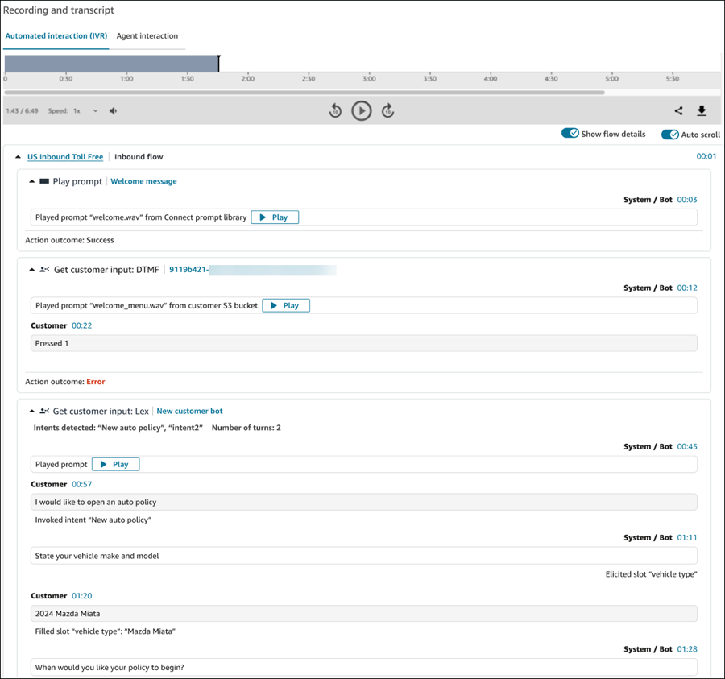

# Monitor automated interactions

(IVR) in Amazon Connect

You can use automated interaction logs to review the automated portion of your
customers' Amazon Connect experience . The interaction logs appear on the **Contact
details** page. They include the following information:

- Key interaction points, that is, flows, prompts, menus, keypad
  selections.
- A full bot transcript.
  You can use the logs to monitor and improve your automated customer interactions, and
  maintain audio and system execution records of the interaction for compliance
  purposes.

## Enable automated interaction

logs

Complete the following steps to check that automated interaction logs are enabled
for your Amazon Connect instance.

###### Note

Currently, Amazon Connect doesn’t support S3 buckets with [Object
Lock](../../../AmazonS3/latest/userguide/object-lock.md "../../../AmazonS3/latest/userguide/object-lock.md") enabled.

1. Open the Amazon Connect console at
   [https://console.aws.amazon.com/connect/](https://console.aws.amazon.com/connect/ "https://console.aws.amazon.com/connect/").
2. Automated interactions logs are saved to the **S3 bucket you
   configured for call recordings**. If the call recordings
   feature is not yet enabled for your instance, enable it now.
   1. On the navigation pane, choose **Data storage**,
      **Call recordings**, **Edit**,
      **Enable call recording**, and create or select
      your S3 bucket.

3. In the navigation pane, choose **Flows**.
4. Select **Enable Bot Analytics and Transcripts in Amazon Connect**.
   Choose this option to log a full transcript of the Amazon Lex portion of the
   customer's experience. The transcript is then available for you to read on
   the **Contact details** page.
5. Select **Enable automated interaction logs**. Choose this
   option to log key interaction points such as flows, prompts, menus, and
   keypad selections. The can view the interaction log, and a listen to the
   audio recording if available, on the **Contact details**
   page.

## Permissions for automated

interaction logs

To keep customer data secure, you can set up permissions to have granular control
over who can access automated interaction logs. Access to automated interaction logs
are gated by the following security profile permissions:

- **Flows** and **Flow modules – View**
  permissions: These permissions are required to see flow and module specific
  data on the automated interaction logs.
- **Analytics and Optimization** - **Automated
  interaction voice (IVR) transcripts (unredacted)** permissions:
  These permissions are required to access logs of the IVR interaction such as
  keypad inputs in response to IVR prompts, transcripts of Lex interactions,
  and more.

## Navigate automated

interactions logs and audio recording

The following image shows an example of an automated interaction log on the
**Contact details** page on the Amazon Connect admin website.

###### To navigate the log

1. Use tabs to toggle between the automated interaction and agent interaction
   to see the end-to-end interaction of your customer.
2. Choose **Show flow details** to hide system details about
   the flows and flow blocks.
3. Choose the flow and block hyperlinks to open the flow designer in a new
   tab, enabling you to quickly follow along with your flow.
4. Choose **Play** to play the specific prompt within your
   audio recording file.

###### Note

If no audio recording is available, there is no option to play the
prompt. 5. Quickly see where errors have occurred including customer timeouts or
Lambda function errors. 6. See where bot intents are detected and resolved.
