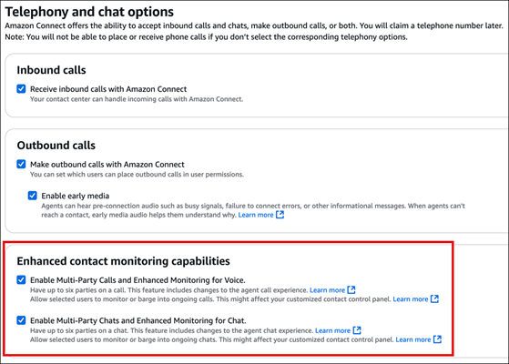
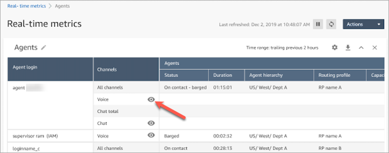
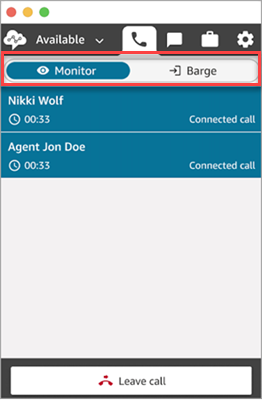
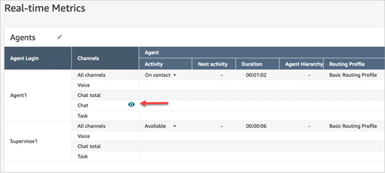
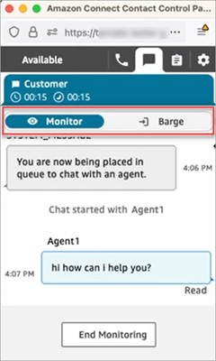
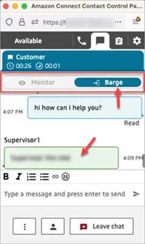

# Barge into live voice and chat conversations between contact center agents and

customers

###### Tip

**New user?** Check out the [Amazon Connect Supervisor Experience
Workshop](https://catalog.workshops.aws/amazon-connect-supervisor-experience "https://catalog.workshops.aws/amazon-connect-supervisor-experience"). This online course has a section on how to monitor contacts.

Supervisors and managers can barge into live voice and chat conversations between agents and customers.
To set this up, you need to turn on the **Enhanced monitoring** capability
in the Amazon Connect console, provide managers with the appropriate permissions, and show them how
to barge into conversations.

**Looking for how many people can barge the same conversation at one
time?** See [Amazon Connect feature specifications](feature-limits.md "feature-limits.md").

There is no limit to the number of conversations that you can barge in an instance.

The barge feature is included in Amazon Connect voice service fees. For pricing, see
the [Amazon Connect Pricing](https://aws.amazon.com/connect/pricing/ "https://aws.amazon.com/connect/pricing/")
page.

## Set up barge for voice and chat

In the Amazon Connect console, select the following telephony options:

- **Enable Multi-Party Calls and Enhanced
  Monitoring for Voice**. This option enables access to multi-party calling, detailed
  contact records, silent monitoring, and barge capabilities.
- **Enable Multi-Party Chats and Enhanced
  Monitoring for Chat**. This option enables users with the appropriate security profile permissions to barge chats.

The following image shows these options on the **Telephony and chat options**
page.

###### Note

- If multi-party calling is already enabled, to also enable enhanced
  monitoring you need to use the
  _UpdateInstanceAttribute_ API with the
  `ENHANCED_CONTACT_MONITORING` attribute for the first time.
  Or, you can turn the feature OFF and then back ON to update your settings.
  For more information, see [UpdateInstanceAttribute](../APIReference/API_UpdateInstanceAttribute.md "../APIReference/API_UpdateInstanceAttribute.md") in the _Amazon Connect API Reference
  Guide_.
- Any new instances will automatically have this feature enabled.
- Before enabling **Enhanced contact monitoring capabilities**,
  ensure that you are using the latest version of the [Contact
  Control Panel](upgrade-to-latest-ccp.md "upgrade-to-latest-ccp.md") (CCP) or [Agent
  workspace](agent-user-guide.md "agent-user-guide.md"). If you are using [StreamsJS](https://github.com/amazon-connect/amazon-connect-streams "https://github.com/amazon-connect/amazon-connect-streams") to customize or embed the CCP, upgrade to version
  2.4.2 or later.
- For instances that do not have a service-linked role, you must create one
  in order to enable the feature. For more information on how to enable
  service-linked roles, see [Use service-linked
  roles for Amazon Connect](connect-slr.md "connect-slr.md").

## Assign security profile permissions

For managers to barge live conversations, you assign them the
**CallCenterManager** and **Agent** security
profiles.

To allow specific supervisors to barge live conversations, we recommend that you create a
security profile specific for this purpose. They need the following security profile permissions:

- **Access metrics**. Enables you to access
  real-time metrics reports, which is where you choose which
  conversation you would like to monitor and barge.
- **Real-time contact monitoring**: Enables you to monitor both voice and chat conversations.
- **Real-time contact barge-in**: Enables you to barge both voice and chat conversations.
- **Access Contact Control Panel**

## Barge live calls with contacts

###### Tip

For the number of supervisors who can monitor a call at the same time, see [Amazon Connect feature specifications](feature-limits.md "feature-limits.md").

1. Log in to the Amazon Connect admin website at https://`instance name`.my.connect.aws/. Use an account that is assigned the
   **CallCenterManager** security profile or that has the
   required security profile permissions.
2. Open your CCP. It must be open before you can barge a call.
3. On the Amazon Connect admin website navigation menu, choose **Analytics and
   optimization**, **Real-time metrics**,
   **Agents**.
4. Choose the eye icon that appears next to the **Voice**
   channel of the agent that you want to monitor, as shown in the following image.
   You can barge into a conversation that you had been monitoring already.

 5. This takes you to the open CCP, as shown in the following image.
You can monitor the call and toggle between the **Monitor** and
**Barge** states. The following image shows the **Monitor** state.

## Barge live chats with contacts

1. Log in to the Amazon Connect admin website at https://`instance name`.my.connect.aws/. Use an account that is assigned the
   **CallCenterManager** security profile or that has the
   required security profile permissions.
2. Open your CCP. It must be open before you can barge a chat.
3. On the Amazon Connect admin website navigation menu, choose **Analytics and
   optimization**, **Real-time metrics**,
   **Agents**.
4. Choose the eye icon that appears next to the **Chat**
   channel of the agent that you want to monitor, as shown in the following image.
   You can barge into a conversation that you had been monitoring already.

 5. This takes you to the open CCP, as shown in the following image.
You can monitor the chat conversation and toggle between the **Monitor** and
**Barge** states. The following image shows the **Monitor** state.

Following is an example of what the CCP looks like when a supervisor barges into a chat.

