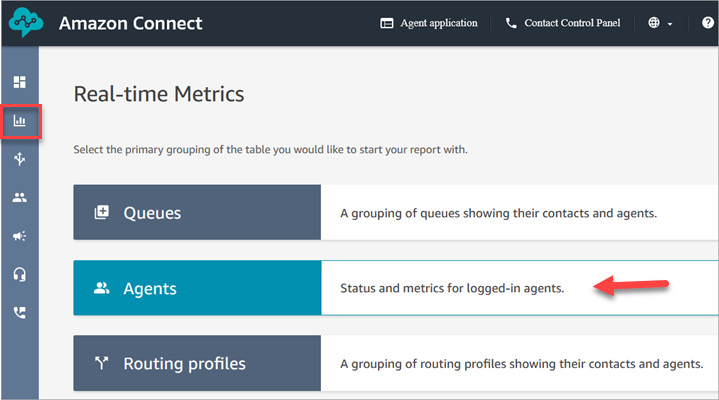
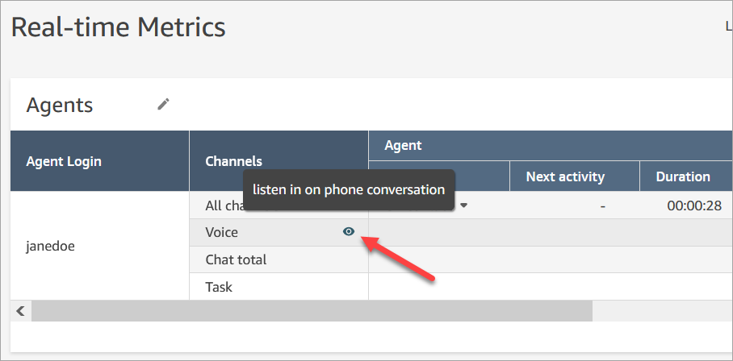

# Listen to live conversations or read live

chats in Amazon Connect

Before you can listen to live conversations or read live chats, the Amazon Connect
admin needs to [enable](monitor-conversations.md "monitor-conversations.md") the feature, [assign you permissions](monitor-conversations-permissions.md "monitor-conversations-permissions.md"), and
ensure you are assigned to a routing profile that supports the channel being monitored.
After that's done, you can do these steps.

For information about how many people can listen in to a conversation or follow a
chat, see [Amazon Connect feature specifications](feature-limits.md "feature-limits.md").

1. Log in to Amazon Connect with a user account that is assigned the
   **CallCenterManager** security profile, or that has the
   **Real-time contact monitoring** security profile
   permission.
2. Open the Contact Control Panel (CCP) by choosing the phone icon in the
   top-right corner of your screen. You'll need the CCP open to connect to the
   conversation.
3. To choose the agent conversation you want to monitor, in Amazon Connect choose
   **Analytics and optimization**, **Real-time
   metrics**, **Agents**. The following image shows
   the **Real-time metrics** page, with an arrow pointing to the
   **Agents** option.

 4. To monitor voice conversations: Next to the names of agents in a live voice
conversation, there is an eye icon. Choose the icon to start monitoring the
conversation. The following image shows the eye icon next to the
**Voice** channel.

###### Note

**Firefox users**: When using the Firefox
browser to monitor and barge, you need to switch to the CCP tab after
starting to monitor. The CCP conforms to Firefox microphone usage guidance,
and only has access to connect to your microphone when CCP tab is in
focus.

When you're monitoring a conversation, the status in your CCP changes to
**Monitoring**. 5. To monitor chat conversations: For each agent you'll see the number of live
chat conversations they're in. Click on the number. Then choose the conversation
you want to start monitoring.

When you're monitoring a conversation, the status in your CCP changes to
**Monitoring**. 6. To stop monitoring the conversation, in the CCP choose **End
call** or **End chat**.

When the agent ends the conversation, monitoring stops automatically.
