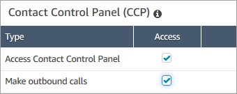

# Assign permissions to monitor live

conversations in the Amazon Connect Contact Control Panel (CCP)

For managers to monitor live conversations, you assign them the
**CallCenterManager** and **Agent** security
profiles. To allow agent trainees to monitor live conversations, you may want to create
a security profile specific for this purpose.

###### To assign a manager permissions to monitor a live conversation

1. Go to **Users**, **User management**, choose
   the manager, and then choose **Edit**.
2. In the Security Profiles box, assign the manager to the
   **CallCenterManager** security profile. This security
   profile also includes a setting that makes the icon to download recordings
   appear in the results of the **Contact search** page.
3. Assign the manager to the **Agent** security profile so they
   can access the Contact Control Panel (CCP), and use it to monitor the
   conversation.
4. Choose **Save**.

###### To create a new security profile for monitoring live conversations

1. Choose **Users**, **Security profiles**.
2. Choose **Add new security profile**.
3. Expand **Analytics and optimization**, then choose
   **Access metrics** and **Real-time contact
   monitoring**.

**Access metrics** is needed so they can access the real-time
metrics report, which is where they choose which conversations to
monitor. 4. Expand **Contact Control Panel**, then choose
**Access Contact Control Panel** and **Make
outbound calls**.

These permissions are needed so they can monitor the conversation through the
Contact Control Panel. 5. Choose **Save**.
Next, show your managers how to monitor conversations. Continue to [Listen to live conversations or read live
chats in Amazon Connect](monitor-conversations-howto.md "monitor-conversations-howto.md").
