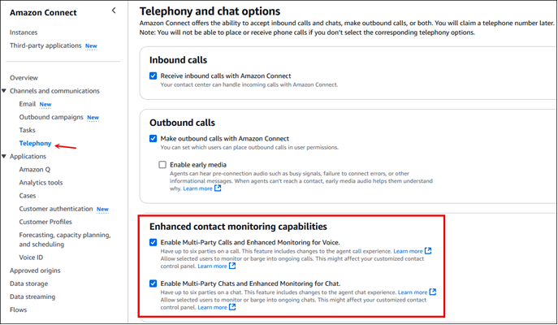

# Enable enhanced multi-party contact monitoring

in Amazon Connect

Enhanced contact monitoring applies to voice calls and all supported types of chats:
chat/SMS, WhatsApp, and Apple Messages for Business.

## Calls

Enhanced contact monitoring enables agents to [host](multi-party-calls.md "multi-party-calls.md") up to 6 participants on a call. Two supervisors can [monitor](monitor-conversations-howto.md "monitor-conversations-howto.md") the call. It also enables
managers to [barge](monitor-barge.md "monitor-barge.md") into conversations.

For example, agents can have a group of six participants in the call at the same
time. Two supervisors can monitor the call. The two supervisors can do two silent
monitor sessions, or one silent monitor and one barge-in session.

The total number of participants on a call would look like this:

1. Customer - participant
2. Agent 1 - participant
3. Agent 2 - participant
4. Agent 3 - participant
5. Agent 4 - participant
6. Agent 5 - participant
7. Supervisor who can listen but not barge in the call
8. Supervisor who can listen or barge in the call

There is no limit to the number of conversations that can be monitored in an
instance.

## Chats

Enhanced contact monitoring enables agents to [host](multi-party-chat.md "multi-party-chat.md") four additional participants on an ongoing customer service chat,
for a total of six participants: the agent, the customer, and four other people.
Agents can use quick connects to add participants.

Regardless of whether the enhanced contact monitoring capability is enabled for an
instance, you can have up to five people monitor a chat at the same time. Only one
supervisor can be in barged in mode for a given chat.

The total number of participants on the chat would look like this:

1. Customer
2. Agent
3. Supervisor who can monitor the chat and barge in
4. Supervisor who can monitor the chat but not barge in
5. Supervisor who can monitor the chat but not barge in
6. Supervisor who can monitor the chat but not barge in
7. Supervisor who can monitor the chat but not barge in

## Important things to

know

- New events are added to the agent event stream when you choose
  **Enhanced contact monitoring capabilities** on the
  Amazon Connect console.

However, if you instead choose to start with the default three-party
capability enabled by the [Set recording and analytics
behavior](set-recording-behavior.md "set-recording-behavior.md") block, and then later
switch to **Enhanced contact monitoring capabilities**,
know that new events will be added to the agent event stream. This will
cause problems if you have customized your contact center based on the
previous agent event stream.

- If you do not enable **Enhanced contact monitoring
  capabilities** at the instance level, you need to add and
  configure a [Set recording and analytics
  behavior](set-recording-behavior.md "set-recording-behavior.md") block to your flow in
  order to get the chat monitoring and barge features.
- By default, calls can have three participants, such as two agents and a
  caller, or an agent, a caller, and an external party. When you enable
  enhanced contact monitoring, the agent's experience changes. See [Comparison of
  multi-party and three-party functionality](three-party-multi-party-comparison.md "three-party-multi-party-comparison.md").
- All agents have a ParticipantRole of 'AGENT' in the transcript.
  Supervisors have a ParticipantRole of 'SUPERVISOR' in the transcript.
- The initiation method for the contact where the agent is invited is
  TRANSFER. For information about how to distinguish in reporting how often a
  participant is being invited instead of being transferred to, see [Identify conferences and transfers by using
  Amazon Connect contact records](identify-conferences-transfers.md "identify-conferences-transfers.md").
- This feature is only available in CCPv2. That is, the URL to access the
  CCP is https://`instance
name`.my.connect.aws/ccp-v2/ and the URL to access the agent
  workspace is https://`instance
name`.my.connect.aws/agent-app-v2/. It's also available in
  custom CCP using Amazon Connect Streams.js.
- Before enabling the multi-party calls, if you are using
  Contact Lens or planning to do so in the future, see [Multi-party calls and
  conversational analytics](enable-analytics.md#multiparty-calls-contactlens "enable-analytics.md#multiparty-calls-contactlens"). Contact Lens
  supports calls with up to 2 participants. We recommend that you disable
  Contact Lens in the [Set recording and analytics
  behavior](set-recording-behavior.md "set-recording-behavior.md") block for contacts that
  are expected to have 3 and more participants.
- In custom CCPs, use the updated Amazon Connect Streams API to enable multi-party
  calling, up to six parties. See the [Amazon Connect Streams](https://github.com/amazon-connect/amazon-connect-streams/blob/master/Documentation.md#connectcoreinitccp "https://github.com/amazon-connect/amazon-connect-streams/blob/master/Documentation.md#connectcoreinitccp") documentation on GitHub.
- AWS GovCloud (US-West): You can't enable this feature using the console
  user interface. Instead, use the [UpdateInstanceAttribute](../APIReference/API_UpdateInstanceAttribute.md "../APIReference/API_UpdateInstanceAttribute.md") API or contact
  AWS Support.

## How to enable enhanced multi-party

contact monitoring

1. In the Amazon Connect console, on the menu pane, choose
   **Telephony**.
2. On the **Telephony and chat options** page, scroll to the
   **Enhanced contact monitoring capabilities**
   section.

 3. Choose the options you want to enable, and then choose
**Save**. 4. Log in to the Amazon Connect admin website. [Assign security
profile permissions](assign-permissions-to-review-recordings.md "assign-permissions-to-review-recordings.md") to managers so they can monitor and barge
live conversations, and review recordings. 5. Show managers how to [monitor
live conversations](monitor-conversations-howto.md "monitor-conversations-howto.md"), [barge live
conversations](monitor-barge.md "monitor-barge.md") and [review past recordings](review-recorded-conversations.md "review-recorded-conversations.md") in Amazon Connect.
