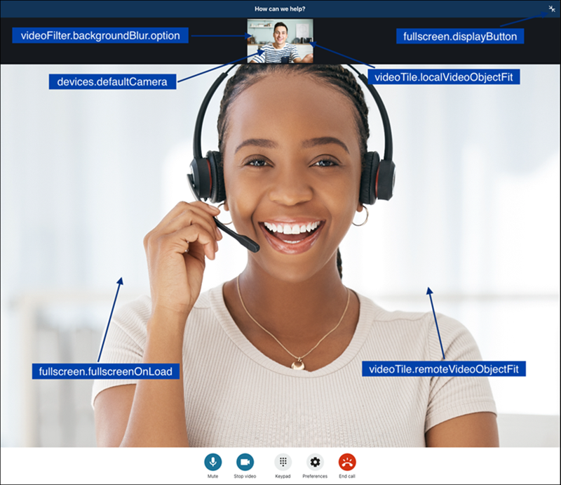
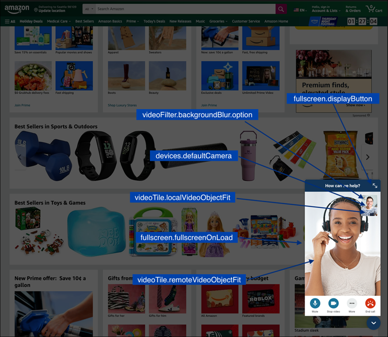

# Additional customizations for

your Amazon Connect web calling widget

You can add the following additional customizations to your web calling widget:

- Apply [background blur](#background-blur "#background-blur") to your
  customer's video tile.
- Set the widget to [fullscreen](#fullscreen-mode "#fullscreen-mode").
- Select the [default camera
  device](#choose-default-camera "#choose-default-camera").
- [Resize the video](#resize-video "#resize-video") to fit its
  container.
  The following sections explain the details of the customizations, their use cases, and
  how to configure them. You manage these customizations by configuring
  `WebCallingCustomizationObject`.

###### Contents

- [Background blur](#background-blur "#background-blur")
- [Fullscreen mode](#fullscreen-mode "#fullscreen-mode")
- [Choose the default camera
  device](#choose-default-camera "#choose-default-camera")
- [Resize video](#resize-video "#resize-video")
- [Configure the
  customization object](#configure-customization-object-web "#configure-customization-object-web")
- [Supported options and
  constraints](#supported-options-web-calling "#supported-options-web-calling")

## Background blur

This customization controls the background blur behavior of the customer's video.
When enabled, the customer's background is blurred when video is active. This helps
protect their personal information or private spaces that may be visible in the
background during the video call.

To enable background blur, set `videoFilter.backgroundBlur.option` to
`ENABLED_ON_BY_DEFAULT` in
`WebCallingCustomizationObject`.

## Fullscreen mode

Use this customization to control the widget's fullscreen behavior. There are two
ways you can enable fullscreen:

- Add a fullscreen button to the widget. The customer can use the button to
  toggle fullscreen on and off.

To add a fullscreen button, set `fullscreen.displayButton` to
`ENABLED`.

OR

- Set the widget to fullscreen upon load.

To enable fullscreen upon load, set
`fullscreen.fullscreenOnLoad` to `ENABLED`.

It's particularly helpful to use fullscreen mode when the customer needs to focus
on the widget, such as during screen sharing.

You can use these two options individually or in combination.

## Choose the default camera device

This customization allows the widget to select default camera device when your
customer enables video, offering options for front or back camera. This ability is
useful for diagnosing appliances remotely, for example. The customer can use back
camera to show the appliance to agent.

To select back camera as default, set `devices.defaultCamera` to
`Back`.

## Resize video

This customization controls how the video tiles for both the customer and agent
are resized in the widget. For example, the video frame can be resized to fill the
entire video tile, or scaled to fit the video tile, leaving empty spaces if the
aspect ratio of the video frame does not match the video tile.

- To resize the video for customer, set
  `videoTile.localVideoObjectFit` to the target value.
- To resize the video for agent, set
  `videoTile.remoteVideoObjectFit` to the target value.

For more information, see [Supported options and
constraints](#supported-options-web-calling "#supported-options-web-calling").

## Configure the customization

object

The following example shows how to implement optional customizations for web
calling. For a detailed description of these options, see [Supported options and
constraints](#supported-options-web-calling "#supported-options-web-calling").

You can implement some or all of the fields shown in the following example. When
you don't implement customizations, default behaviors are used for the missing
fields.

```
amazon_connect('webCallingCustomizationObject', {
        videoFilter: {
            backgroundBlur: {
                option: "ENABLED_OFF_BY_DEFAULT"
            }
        },
        fullscreen: {
            displayButton: "ENABLED",
            fullscreenOnLoad: "DISABLED"
        },
        devices: {
            defaultCamera: "Front"
        },
        videoTile: {
            localVideoObjectFit: "cover",
            remoteVideoObjectFit: "cover"
        },
        copyDisplayNameFromAuthenticatedChat: true
});
```

The following image shows how the customizations look when not in full-screen
mode.



The following image shows how the customizations look when in full-screen
mode.



## Supported options and

constraints

The following table lists the supported customization fields and recommended value
constraints.

| Custom layout option                   | Type         | Values                                                                                                                                                                                                                                                                                                                                                                                                                                                                                                                                                                                                                                                                                                                                                                                           | Description                                                                                                                                                                                                     |
| -------------------------------------- | ------------ | ------------------------------------------------------------------------------------------------------------------------------------------------------------------------------------------------------------------------------------------------------------------------------------------------------------------------------------------------------------------------------------------------------------------------------------------------------------------------------------------------------------------------------------------------------------------------------------------------------------------------------------------------------------------------------------------------------------------------------------------------------------------------------------------------ | --------------------------------------------------------------------------------------------------------------------------------------------------------------------------------------------------------------- | --------------------------------------------------------------------------------------------------------------------------------------------------------------------------------------------------------------------------------------------------------------------------------------------------------------------------------------------------------------------------------------------------------------------------------------------------------------------------------------------------------------------------------------------------------------------------------------------------------------------------------------------- | -------------------------------------------------------- |
| `videoFilter.backgroundBlur.option`    | string       | `ENABLED_ON_BY_DEFAULT`                                                                                                                                                                                                                                                                                                                                                                                                                                                                                                                                                                                                                                                                                                                                                                          | `ENABLED_OFF_BY_DEFAULT`                                                                                                                                                                                        | Sets your customer's video tile background blur. By default, when your customer enables video, the background blur filter will be applied to the video tile, if you don't want to enable the filter by default, you can set it to `ENABLED_OFF_BY_DEFAULT`, your customer can still manually enable the filter in the widget's preferences page.                                                                                                                                                                                                                                                                                              |
| `fullscreen.displayButton`             | string       | `ENABLED`                                                                                                                                                                                                                                                                                                                                                                                                                                                                                                                                                                                                                                                                                                                                                                                        | Adds a button to the top right corner of the widget to make it fullscreen in the browser. By default, this button will not be added to the widget, if you want to add this button, you can set it to `ENABLED`. |
| `fullscreen.fullscreenOnLoad`          | string       | `ENABLED`                                                                                                                                                                                                                                                                                                                                                                                                                                                                                                                                                                                                                                                                                                                                                                                        | Makes the widget fullscreen in the browser. By default, the widget will be anchored to the bottom right corner of the webpage, setting it to `ENABLED` will make the widget fullscreen in the browser.          |
| `devices.defaultCamera`                | string       | `Front`                                                                                                                                                                                                                                                                                                                                                                                                                                                                                                                                                                                                                                                                                                                                                                                          | `Back`                                                                                                                                                                                                          | Sets the default camera device when your customer enables video. This is for mobile or tablet use cases. By default, the default camera is selected([detail](https://developer.mozilla.org/en-US/docs/Web/API/MediaDevices/enumerateDevices "https://developer.mozilla.org/en-US/docs/Web/API/MediaDevices/enumerateDevices")). (For more information, see the [MediaDevices: enumerateDevices() method](https://developer.mozilla.org/en-US/docs/Web/API/MediaDevices/enumerateDevices "https://developer.mozilla.org/en-US/docs/Web/API/MediaDevices/enumerateDevices") in the Mozilla developers documentation.) When you set it to `Front | Back`, it selects the corresponding camera if available. |
| `copyDisplayNameFromAuthenticatedChat` | boolean      | `true`                                                                                                                                                                                                                                                                                                                                                                                                                                                                                                                                                                                                                                                                                                                                                                                           | `false`                                                                                                                                                                                                         | In the case that the end customer is authenticated using the [Authenticate Customer](authenticate-customer.md "authenticate-customer.md") flow block, setting the value to `true` will copy the display name to the voice contact. The default is `false`.                                                                                                                                                                                                                                                                                                                                                                                    |
| `videoTile.localVideoObjectFit`        | string       | `fill`                                                                                                                                                                                                                                                                                                                                                                                                                                                                                                                                                                                                                                                                                                                                                                                           | `contain`                                                                                                                                                                                                       | `cover`                                                                                                                                                                                                                                                                                                                                                                                                                                                                                                                                                                                                                                       |
| `none`                                 | `scale-down` | Sets the [object-fit](https://developer.mozilla.org/en-US/docs/Web/CSS/object-fit "https://developer.mozilla.org/en-US/docs/Web/CSS/object-fit") property of your customer's video tile in the widget. By default, the value is determined by the width and height of the video resolution: if height is greater than width, it will be `contain`, else it will be `cover`. For a detailed description of each value, see [object-fit](https://developer.mozilla.org/en-US/docs/Web/CSS/object-fit "https://developer.mozilla.org/en-US/docs/Web/CSS/object-fit") in the Mozilla developer documentation. NoteThis attribute is applied to only the display height and width of the customer's video in the widget. The height and width of the customer's video sent to the agent is unaltered. |
| `videoTile.remoteVideoObjectFit`       | string       | `fill`                                                                                                                                                                                                                                                                                                                                                                                                                                                                                                                                                                                                                                                                                                                                                                                           | `contain`                                                                                                                                                                                                       | `cover`                                                                                                                                                                                                                                                                                                                                                                                                                                                                                                                                                                                                                                       |
| `none`                                 | `scale-down` | Sets the [object-fit](https://developer.mozilla.org/en-US/docs/Web/CSS/object-fit "https://developer.mozilla.org/en-US/docs/Web/CSS/object-fit") property of your customer's video tile in the widget. By default, the value is determined by the width and height of the video resolution: if height is greater than width, it will be `contain`, else it will be `cover`. For a detailed description of each value, see [object-fit](https://developer.mozilla.org/en-US/docs/Web/CSS/object-fit "https://developer.mozilla.org/en-US/docs/Web/CSS/object-fit") in the Mozilla developer documentation. NoteThis attribute is applied to only the display height and width of agent's video in the widget.                                                                                     |
