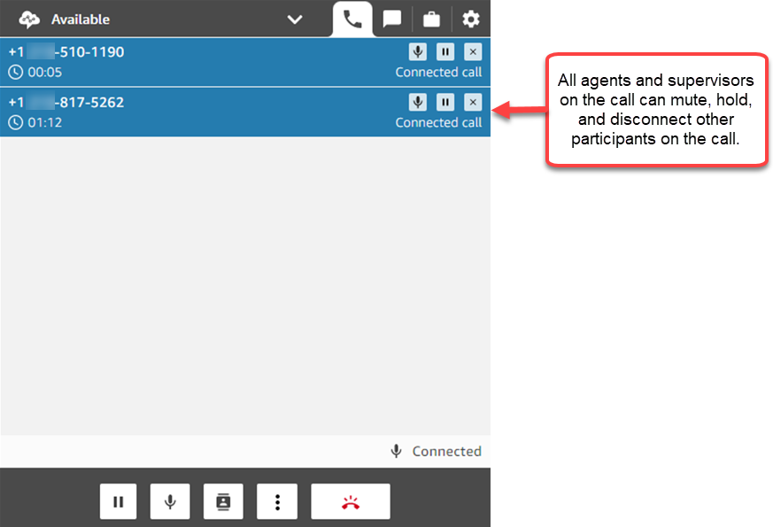
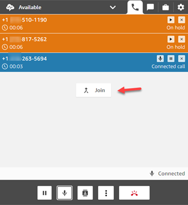
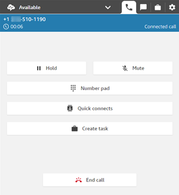
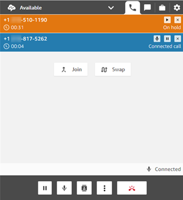
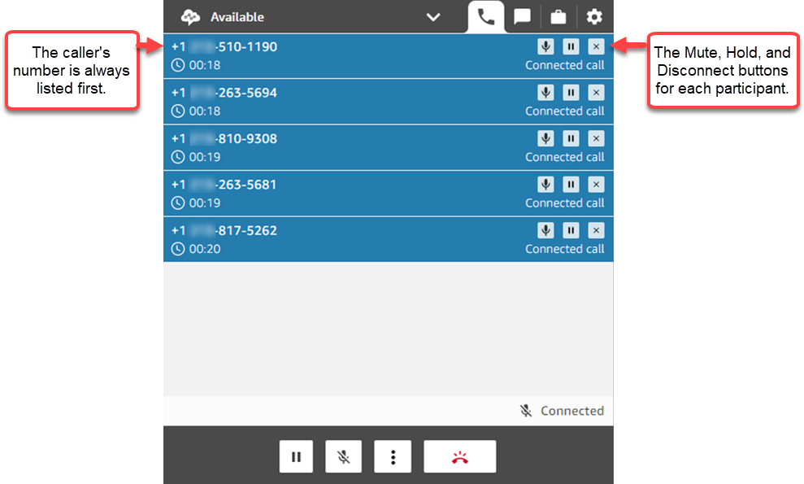
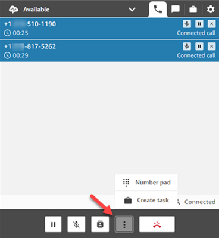

# Host multiple participants on an ongoing

customer service call in the Contact Control Panel (CCP)

You can add up to four additional participants to an ongoing customer service
call, for a total of six participants: you, the caller, and four other people. You
can use quick connects or your number pad to add participants.

For example, to help close a mortgage transaction, an agent at a financial
services company can add a mortgage broker, the customer's spouse, a translator, and
a supervisor to the call to help resolve any issues quickly.

For information about how your experience hosting multi-party calls differs from
the default three-party calls, see [Comparison of
multi-party and three-party functionality](three-party-multi-party-comparison.md "three-party-multi-party-comparison.md").

Amazon Connect also supports adding additional users to join the web, in-app, and
video call. To learn how to enable multi-user web, in-app and video calling, see
[Enable multi-user in-app, web, and
video calling](enable-multiuser-inapp.md "enable-multiuser-inapp.md").

###### Note

IT admins: For important information about enabling this feature, see [Enable enhanced multi-party contact
monitoring](monitor-conversations.md "monitor-conversations.md").

## Important things to know

about hosting multi-party calls

- If the primary agent leaves the call, you must have at least three
  participants on the call in order to add more participants.
- When you have multiple agents on the call, such as three agents and a
  caller, all agents on the call can view all parties and have the option
  to put any participant or another agent on hold, mute, and disconnect
  participants from the call.

- Every time you add a new participant to the call, you are prompted to
  greet and talk to them before adding them to the call. Choose
  **Join** to take all parties off hold.

## How to add participants to

a multi-party call

The following image shows the contact and you (the agent) on a call. The
customer always appears at the top.

###### To add participants

1. While you're connected to the caller, choose **Quick
   connects** to add another agent or to make an external
   call. The caller is put on hold while you do this.

When you add the third participant to the call, you can greet and talk
to them before adding them to the call. For example, you can tell
explain why you're adding them to the call.

The following image shows the CCP after you add a third participant to
the call. The contact is on hold, and you're talking to the third
party.

 2. Choose **Join** to take all parties off hold.

–OR–

Choose **Swap** to toggle between the parties on hold
and the party you just called.

###### Note

**Swap** is only available for three-party calls,
such as you, the caller, and another agent or external party. It is
not available when you have more than three parties on the
call.

## How to manage

participants

Every agent on a call can mute, hold, or disconnect individual
participants.

You can transfer a multi-party call to another agent, or disconnect yourself
from the ongoing call.

###### To transfer or disconnect

- Choose the **More** button to open the number pad and
  to create a task:

## When do multi-party calls end?

A multi-party call stays up as long as the caller or the agent is on the call.
For example, add an external party to a call and then you disconnect. The caller
and external party continue the call.

If only third-parties are left on the line, the contact is terminated.
However, as the agent you can choose to disconnect and allow only the caller and
the third-party participants to remain on the call.
