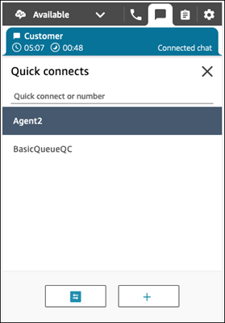
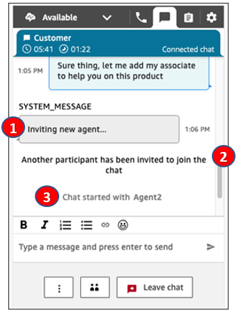
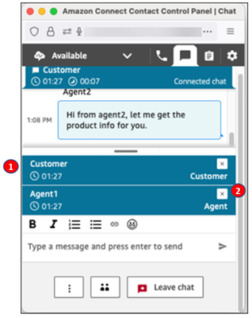
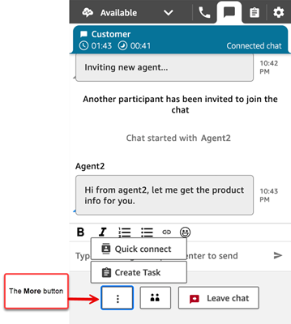

# Host multiple participants on an ongoing customer

service chat in the agent workspace or CCP

You can add up to four additional participants to an ongoing customer service
chat, for a total of six participants: you, the customer, and four other people. You
can use quick connects to add participants.

## Prerequisites

- This feature is only available in CCPv2, agent workspace, and custom
  CCP using Amazon Connect Streams.js.
  - **IT administrators**:
    - By default, chats can have two participants, such as
      an agent and a customer. To enable agents to connect up
      to six parties on a chat, you need to select
      **Enable Multi-party Chats and Enhanced
      Monitoring for Chat** in the Amazon Connect console.
      For instructions, see [Update telephony and chat options](update-instance-settings.md#update-telephony-options "update-instance-settings.md#update-telephony-options").

  - **Developers**: In custom CCPs,
    use the updated Amazon Connect Streams API to enable multi-party chats,
    up to six parties. See the [Amazon Connect Streams](https://github.com/amazon-connect/amazon-connect-streams/blob/master/Documentation.md#connectcoreinitccp "https://github.com/amazon-connect/amazon-connect-streams/blob/master/Documentation.md#connectcoreinitccp") documentation on GitHub.

- **AWS GovCloud (US-West)**: This feature
  is not available in the AWS GovCloud (US-West) Region.

## Important things to

know

- This feature works for all supported forms of chat: chat/SMS,
  WhatsApp, and Apple Messages for Business.
- When you have multiple agents on the chat, such as three agents and a
  customer, all agents on the chat can view all parties and have the
  option to disconnect participants from the chat.
- If a customer leaves a chat with multiple agents, the chat ends for
  all participants.
- If an agent in a multi-party chat transfers the chat to another agent,
  all existing agents are disconnected.
- Read/Delivered receipts do not work with multi-party chat. They do
  start working again when the chat returns to two participants.
- If enhanced monitoring for chat is already enabled, to also enable
  multiparty chats you need to use the UpdateInstanceAttribute API with
  the `MULTI_PARTY_CHAT_CONFERENCE` attribute for the first
  time. Or, you can turn the feature OFF and then back ON to update your
  settings. For more information, see [UpdateInstanceAttribute](../APIReference/API_UpdateInstanceAttribute.md "../APIReference/API_UpdateInstanceAttribute.md") in the _Amazon Connect API Reference
  Guide_.

## How to add participants to a

multi-party chat

The following image shows the contact and you (the agent) connected on a chat.
The customer always appears at the top of the CCP.

###### To add participants

- While you're connected to the customer, choose **Quick
  connects** to add another agent.

###### Tip

Your admin can add a message in the flow to be played before the
third party is added to the session.

The following image shows the CCP after you invite a third participant
to join the chat.

    1. **Inviting new agent ...** - This is an
     example of a custom message that an Admin or Contact Center
     Manager can configure in the [Play prompt](play.md "play.md") block.
    2. **Another participant has been invited** -
     This is a message from Amazon Connect to let the agent know that they
     (the agent) made a request to add a participant to this
     chat.
    3. **Chat started with Agent2** - This message
     is displayed when the second agent joins/accepts the chat on
     their end.

## How to manage

participants

The following image shows Agent2's CCP. From the perspective of Agent2, the
customer and Agent1 are the other active participants.

Every agent on a chat can disconnect other individual participants.

1. The customer and Agent1 are the other participants on the chat.
2. Agent2 can choose the **x** to disconnect any
   participant from the chat.

You can transfer a multi-party chat to another agent, or disconnect yourself
from the ongoing chat.

###### To transfer

- Choose the **More** button, and then choose
  **Quick connect**.

###### To disconnect

- Choose **Leave chat**.

## When do multi-party chats end?

A multi-party chat continues as long as the customer is on the chat.
