# Multiple knowledge base setup and content segmentation

When using orchestration AI agents, you can configure Retrieve tools that allow your AI agent to search knowledge bases and return relevant information to answer user questions.

Each Retrieve tool queries a single knowledge base. By configuring multiple retrieve tools, you enable your AI agent to query multiple knowledge bases simultaneously or intelligently select which one to search based on the user's question. Well-defined tool descriptions and prompt instructions allow the model to automatically route queries to the most relevant knowledge base.

You can control how your AI agent queries content at two levels:

- **Knowledge base level:** Configure multiple retrieve tools to query different knowledge bases. Use this approach when your content is organized into multiple knowledge bases.
- **Content level:** Use content segmentation to query only specific content within a single knowledge base.

###### Contents

- [How to configure your orchestration agent to query multiple knowledge bases](#w2aac28c50c13 "#w2aac28c50c13")
- [Content segmentation](#w2aac28c50c15 "#w2aac28c50c15")

## How to configure your orchestration agent to query multiple knowledge bases

You can configure multiple Retrieve tools to query different knowledge bases. Depending on your use case, you can either:

- Query all knowledge bases simultaneously (parallel invocation)
- Query specific knowledge bases based on the context of the request (conditional invocation)

### Setting up multiple Retrieve tools

Both configurations require the same initial setup. Complete these steps first, then follow the instructions for your specific use case.

1. From the AWS Console, you can add additional knowledge bases by choosing Add Integration and following the guided experience. In this example, we added demo-byobkb as the additional knowledge base.

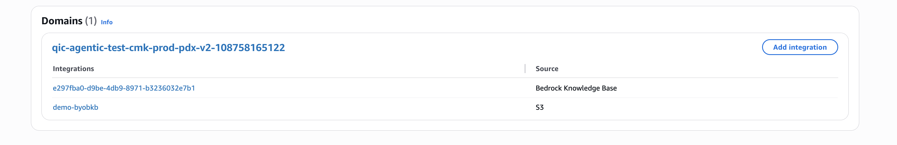 2. From AI Agent Designer, create a new Orchestration AI agent, and edit the default Retrieve tool

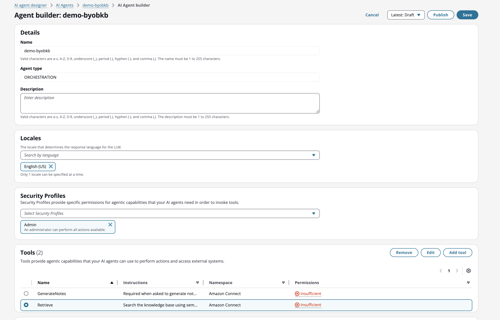 3. Associate existing knowledge base to the Retrieve Tool. AI agent will use this knowledge base as the default

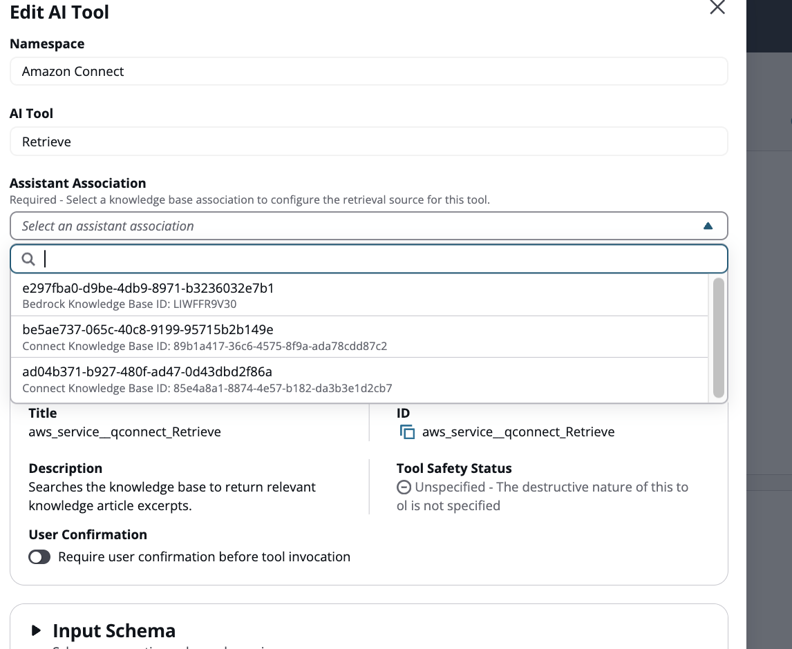 4. Add an additional Tool, choose Amazon Connect as the namespace and choose Retrieve type of AI Tool

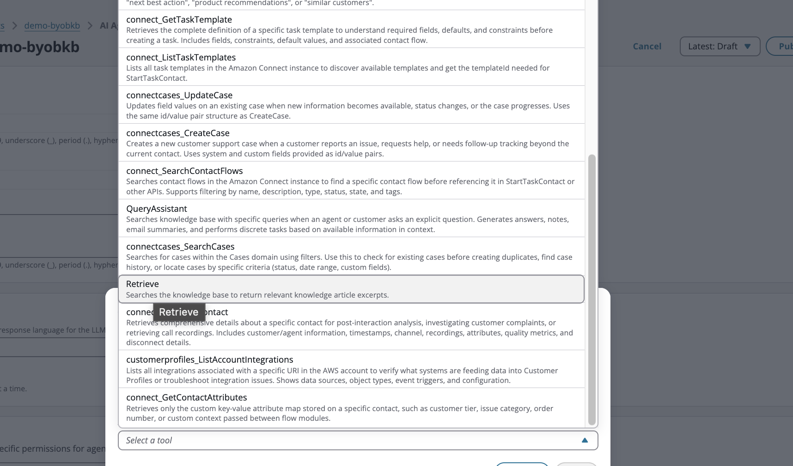 5. Now select the additional knowledge base that you want to associate beyond the default knowledge base

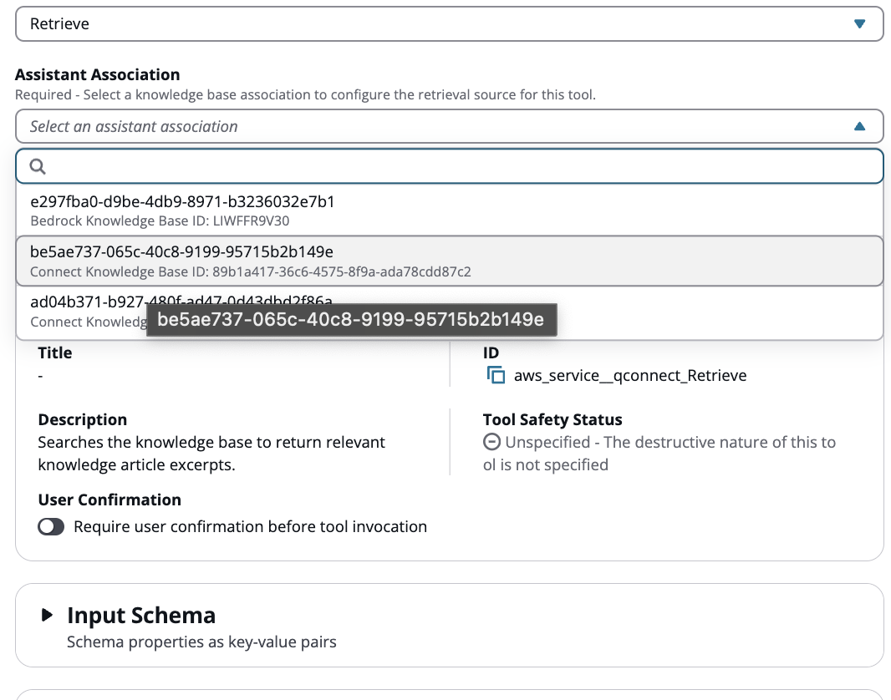 6. Name each additional Retrieve tool starting with "Retrieve" (e.g., Retrieve2, Retrieve3, RetrieveProducts, RetrievePolicies).

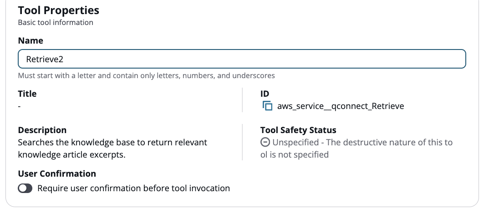 7. Next, configure the tool instructions and examples. The configuration varies depending on your use case. The following sections cover two scenarios: querying all knowledge bases simultaneously and querying knowledge bases selectively.

### Querying all knowledge bases simultaneously

Use this configuration when you want the agent to search all knowledge bases simultaneously for every query.

#### Configuring tool instructions

1. Fill in the tool instructions by copying over the instructions and examples from the default Retrieve tool.

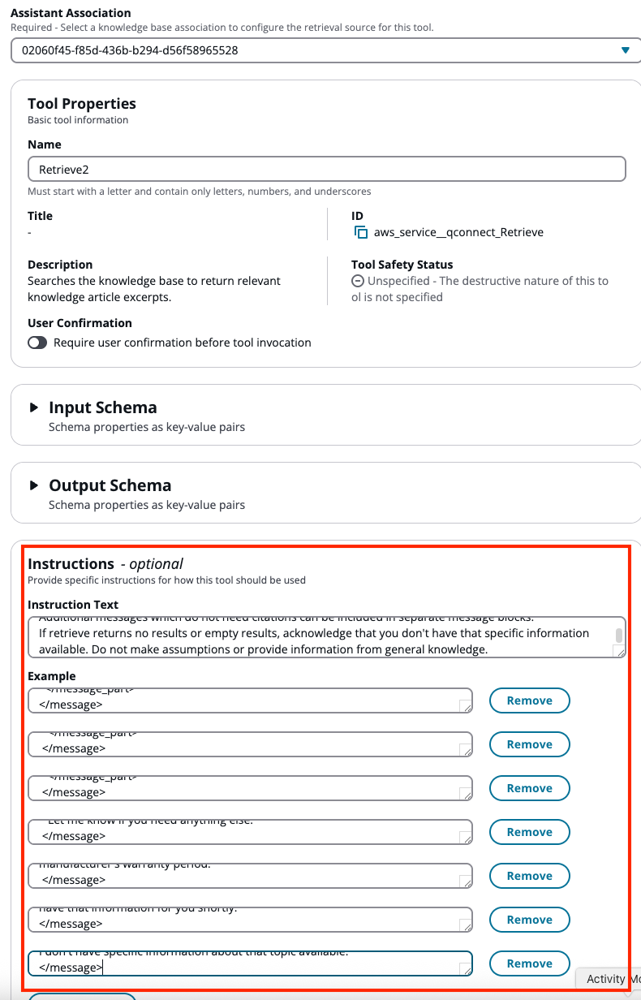 2. Click the Add button to create the new Retrieve tool. Your tool list should now have the new Retrieve tool.

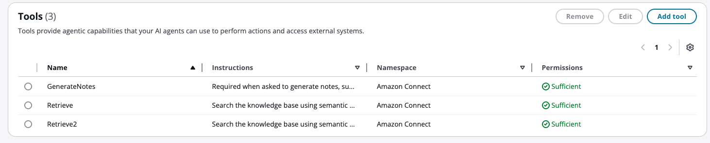

You now have a second Retrieve tool. To use all Retrieve tools together, you must modify the prompt with instructions to invoke them simultaneously. Without this change, only one Retrieve tool will be used.

#### Updating your prompt for parallel invocation

1. Modify the prompt to instruct it to use multiple Retrieve tools. Default orchestration prompts cannot be edited directly, so you'll need to create a copy with your changes.

Create a new prompt by copying the default orchestration prompt that matches your use case. In this example, we copy from the AgentAssistanceOrchestration prompt.

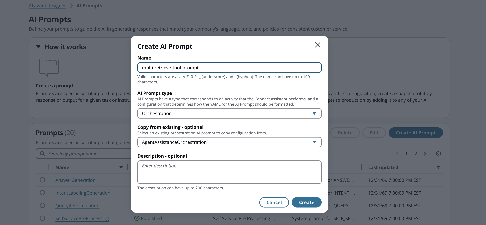 2. Click the **Create button** and you will be taken to a page where you can modify the prompt. 3. Modify your prompt based on your orchestration type:

    * ###### For Agent Assistance orchestration prompts:

    Locate the numbered rules section in your orchestration prompt. This section begins with a line similar to:

    `Your goal is to resolve the customer's issue while also being responsive. While responding, follow these important rules:`

    Add the following as the last numbered rule in this section:

    `CRITICAL - Multiple Retrieve Tools: When multiple Retrieve-type tools are available ([Retrieve], [Retrieve2]), you MUST invoke ALL of them simultaneously for any search request. Never use only one Retrieve tool when multiple are available-always select and invoke them together to ensure comprehensive results from all knowledge sources.`
    * ###### For Self-Service orchestration prompts:

    Locate the `core_behavior` section. Add the following rule within that section:

    `CRITICAL - Multiple Retrieve Tools: When multiple Retrieve-type tools are available ([Retrieve], [Retrieve2]), you MUST invoke ALL of them simultaneously for any search request. Never use only one Retrieve tool when multiple are available—always invoke them together to ensure comprehensive results from all knowledge sources.`###### Note

Replace the bracketed placeholders with your actual tool names.

### Querying knowledge bases selectively

Use this configuration when you want the agent to select the appropriate knowledge base based on the type of question or context.

#### Configuring tool instructions for each knowledge base

Unlike parallel invocation, each Retrieve tool needs distinct instructions that describe when it should be used. This includes the default Retrieve tool—you must update its instructions to differentiate it from the additional Retrieve tools. Use descriptive names that reflect each knowledge base's content (e.g., RetrieveProducts, RetrievePolicies) to help the model select the correct tool.

1. For each Retrieve tool, including the default, write specific instructions that describe the content of its associated knowledge base and when to use it.

 2. Click the Add button to create the new Retrieve tool. Your tool list should now have the new Retrieve tool.

You now have a second Retrieve tool. To have the agent select the appropriate tool based on context, you must modify the prompt with instructions on when to use each tool.

#### Updating your prompt for conditional invocation

1. Modify the prompt to instruct it to choose the appropriate Retrieve tool based on context. Default orchestration prompts cannot be edited directly, so you'll need to create a copy with your changes.

Create a new prompt by copying the default orchestration prompt that matches your use case. In this example, we copy from the AgentAssistanceOrchestration prompt.

 2. Click the **Create button** and you will be taken to a page where you can modify the prompt. 3. Modify your prompt based on your orchestration type:

    * ###### For Agent Assistance orchestration prompts:

    Locate the numbered rules section in your orchestration prompt. This section begins with a line similar to:

    `Your goal is to resolve the customer's issue while also being responsive. While responding, follow these important rules:`

    Add the following as the last numbered rule in this section:

    `CRITICAL - Retrieve Tool Selection: You have multiple Retrieve tools. Each queries a different knowledge base. You MUST select only ONE tool per question based on the topic.
     - [Retrieve] contains [description].
     - [Retrieve2] contains [description].
     Evaluate the question, match it to the most relevant tool, and invoke only that tool.`
    * ###### For Self-Service orchestration prompts:

    Locate the `core_behavior` section. Add the following rule within that section:

    `CRITICAL - Retrieve Tool Selection: You have multiple Retrieve tools. Each queries a different knowledge base. You MUST select only ONE tool per question based on the topic.
     - [Retrieve] contains [description].
     - [Retrieve2] contains [description].
     Evaluate the question, match it to the most relevant tool, and invoke only that tool.`###### Note

Replace the bracketed placeholders with your actual tool names, descriptions, and example questions.

###### Best practices for accurate tool selection

The model's ability to select the correct Retrieve tool depends on several factors: tool name, tool description, tool examples, and prompt instructions. Follow these guidelines:

    * **Use descriptive tool names:** Names like RetrieveProducts or RetrievePolicies help the model understand each tool's purpose.
    * **Be specific in descriptions:** Avoid vague descriptions like "general information." List the specific topics, document types, or question categories each knowledge base handles.
    * **Add example questions:** Include sample questions in the tool instructions to help the model understand intended use cases.
    * **Avoid overlap:** Ensure tool names, descriptions, and examples are mutually exclusive. Overlapping content can cause the model to choose inconsistently.
    * **Match terminology to user language:** Use the same words and phrases your users typically use, not just internal or technical terminology.Your use case may require additional prompt modifications beyond the examples provided here.

## Content segmentation

Content segmentation allows you to tag your knowledge base content and filter retrieval results based on those tags. When your LLM tool queries the knowledge base, it can specify tags to retrieve only content matching those tags, enabling targeted responses from specific content subsets.

###### Note

Content segmentation is not available with the Web crawler data source type.

### Tagging content by data source type

The process for tagging content varies depending on your data source type.

#### S3, Salesforce, SharePoint, Zendesk, and ServiceNow

After creating your knowledge base, you can apply tags to individual content items for segmentation. Tags are applied at the content level, meaning each piece of content must be tagged individually.

To tag content, use the Amazon Connect [TagResource API](../../../amazon-q-connect/latest/APIReference/API_TagResource.md "../../../amazon-q-connect/latest/APIReference/API_TagResource.md"). This API allows you to programmatically add tags to knowledge base content, which can then be used for content segmentation filtering during retrieval.

For examples of tagging content, see the [content segmentation workshop](https://catalog.workshops.aws/amazon-q-in-connect/en-US/01-foundation/07-content-segmentation "https://catalog.workshops.aws/amazon-q-in-connect/en-US/01-foundation/07-content-segmentation").

##### Using tags in the Retrieve tool

Once your content is tagged, you can filter retrieval results by specifying tag filters in the Retrieve tool configuration.

1. In the Retrieve tool configuration, navigate to the Override Input Values section.
2. Add key-value pairs to define your tag filter. You need two overrides to filter by a single tag. In this example, we use `equals` as the filter operator:
   - Set the Property Key to `retrievalConfiguration.filter.equals.key` with the value as your tag name (for example, `number`).

   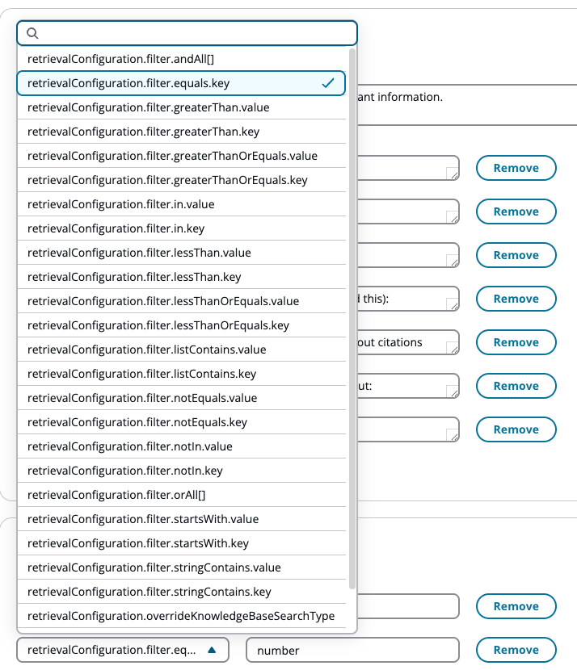
   - Set the Property Key to `retrievalConfiguration.filter.equals.value` with the value as your tag value (for example, `one`).

   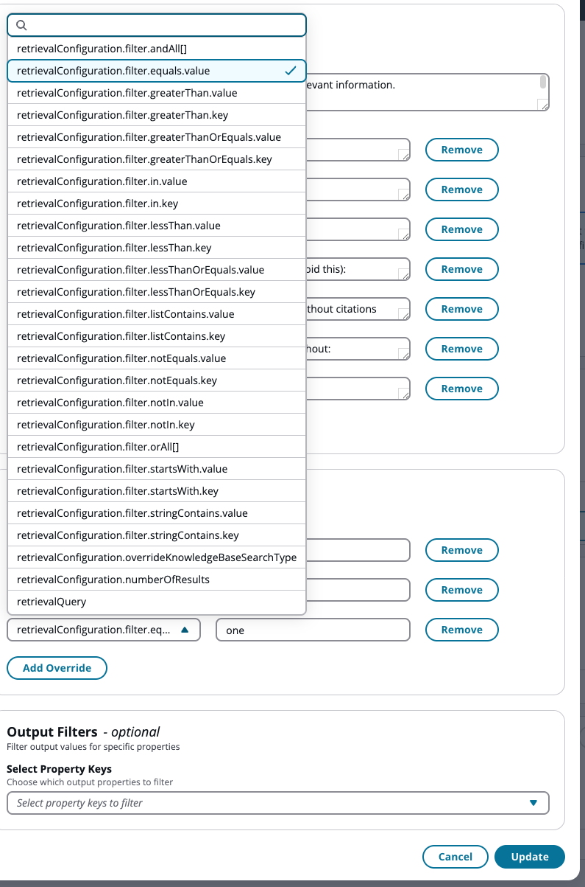

You can use any filter configuration that starts with `retrievalConfiguration.filter` to define your tag filtering criteria.

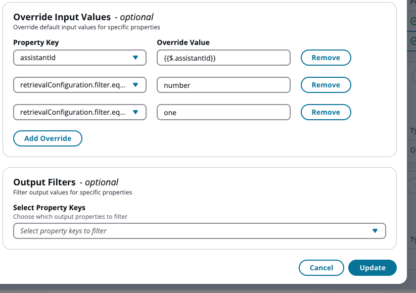

#### Bedrock knowledge base

For Bedrock knowledge base data sources, content is not stored as Amazon Connect resources, so tagging through the TagResource API is not available. Instead, you must define metadata fields directly on your Bedrock knowledge base data sources.

For S3 data sources, see the Document metadata fields section in the [Amazon Bedrock S3 data source connector](../../../bedrock/latest/userguide/s3-data-source-connector.md "../../../bedrock/latest/userguide/s3-data-source-connector.md") user guide.

For other data source types, see [Custom transformation during ingestion](../../../bedrock/latest/userguide/kb-custom-transformation.md "../../../bedrock/latest/userguide/kb-custom-transformation.md") in the Amazon Bedrock documentation.

##### Using metadata fields in the Retrieve tool

Bedrock knowledge bases automatically provide built-in metadata fields on all files. You can use these fields to filter retrieval results in the Retrieve tool using the same configuration method shown in the example above.

To retrieve results from only a specific data source within your Bedrock knowledge base, configure the filter overrides as follows:

- `retrievalConfiguration.filter.equals.key` = `x-amz-bedrock-kb-data-source-id`
- `retrievalConfiguration.filter.equals.value` = `[your-data-source-id]`

This filters the Retrieve tool to only fetch results from that specific data source. You can also filter by custom metadata fields you've defined on your Bedrock data sources using the same override configuration.
