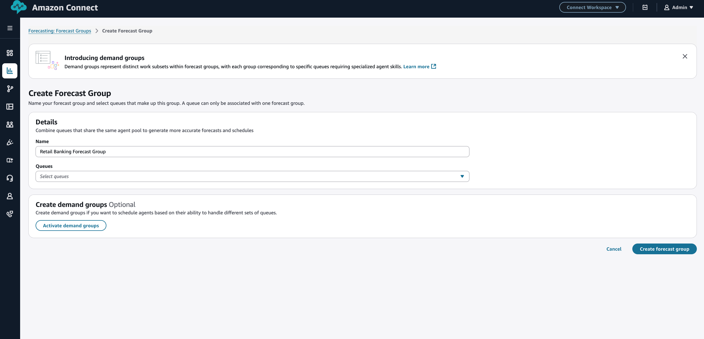
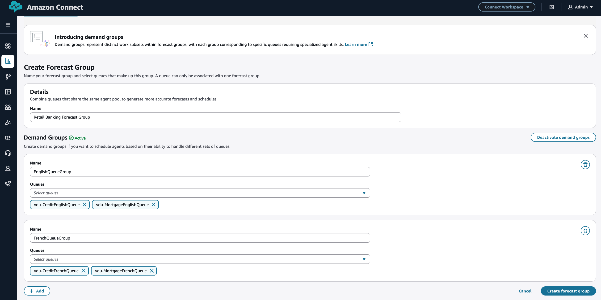
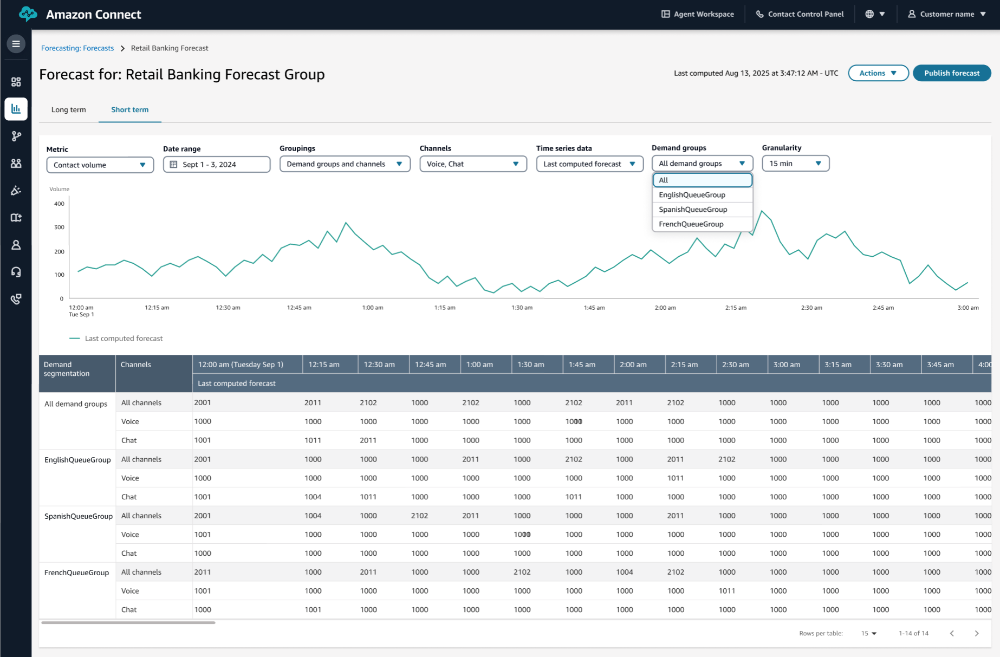

# Multi skill forecasting in Amazon Connect

The multi-skill feature optimizes staffing by scheduling agents based on their specialized capabilities. It introduces "demand groups" as distinct subsets of work within forecast groups, where each demand group represents specific workloads that are independently forecasted and require specialized agent skills. A demand group can contain one or more queues.

## Important things to know

- You can enable demand groups within a forecast group if you want to schedule agents for specific queues.
- A forecast group can contain multiple demand groups, each demand group can contain one or more queues.
- Each queue can belong to only one demand group within the forecast group.
- Before generating the first forecast for the forecast group, we strongly advise creating all necessary demand groups.

## Creating demand groups

- Log in to the Amazon Connect admin website with an account that has security profile permissions for **Analytics, Forecasting - Edit**

For more information, see [Assign
permissions](required-optimization-permissions.md "required-optimization-permissions.md")

- Create a forecast group.

For more information, see [Create forecast
groups](create-forecast-groups.md "create-forecast-groups.md")

- Click on Activate demand groups.

- Create demand groups by searching and adding queues.

## Generate and publish forecast

Generate and publish your forecast. Forecasting requires additional configurations including - time zone selection, setting up an interval of granularity (15/30m) and importing of historical data if there is no history on connect. Once these settings are enabled,
forecasters can generate both long term (64 weeks ahead) and short term (18 weeks ahead) forecasts for the forecast group. You can view both contact volume and average handle time forecasts at interval level detail. You may examine forecasts for individual demand groups to assess peak and lull period variations and may override if required. Once you are satisfied, you may publish your forecast.

For more information, see [Publish a forecast](publish-forecast.md "publish-forecast.md")

