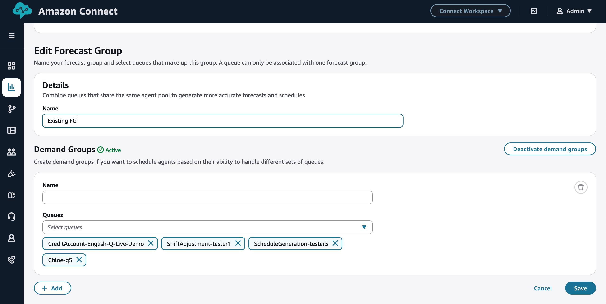
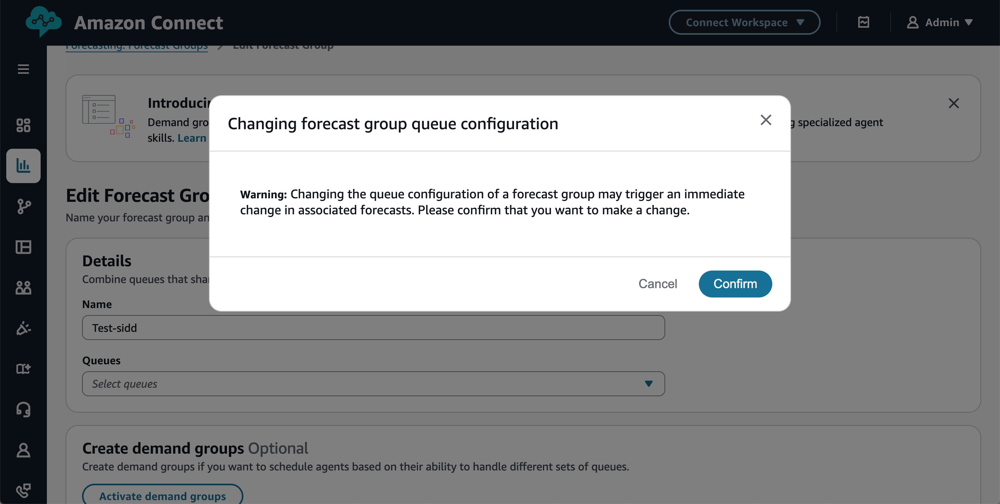

# Migration from non multi-skill to multi-skil

When upgrading from non multi-skill to multi-skill in Amazon Connect forecasting capacity planning and scheduling, you may fall into two possible categories: either you have existing large forecast groups and need to create demand groups for independent agent
scheduling, or you have multiple small forecast groups that require consolidation into a single forecast group. Both scenarios are detailed below.

## Enabling multi-skill in an existing forecast group

- Log in to the Amazon Connect admin website with an account that has security profile permissions for **Analytics, Forecasting - Edit**

For more information, see [Assign
permissions](required-optimization-permissions.md "required-optimization-permissions.md")

- Navigate to the forecast group you wish to change.
- Activate demand groups and notice the queues automatically move into a new demand group.

For more information, see [Multi skill forecasting](multiskill-forecasting.md "multiskill-forecasting.md")

- You may now create additional demand groups and move queues accordingly.

## Consolidating multiple forecast groups

- Log in to the Amazon Connect admin website with an account that has security profile permissions for **Analytics, Forecasting - Edit**

For more information, see [Assign
permissions](required-optimization-permissions.md "required-optimization-permissions.md")

- Create your new forecast group.
- Go to old forecast groups and remove all queues.

- Go back to new forecast group and create demand groups.

For more information, see [Multi skill forecasting](multiskill-forecasting.md "multiskill-forecasting.md")

- Add corresponding queues to the demand groups.
- Download group allowance from all forecast groups, consolidate offline and add to new forecast group.

For more information, see [Set group allowance for time
off](config-group-allowance-to.md "config-group-allowance-to.md")

- Direct all applicable staffing groups to the new forecast group and link them with corresponding demand groups. Note that each staffing group connected to your new forecast group must be associated with at least one demand group.
- Create necessary trade groups as trade groups are not carried forward o between forecast groups.
