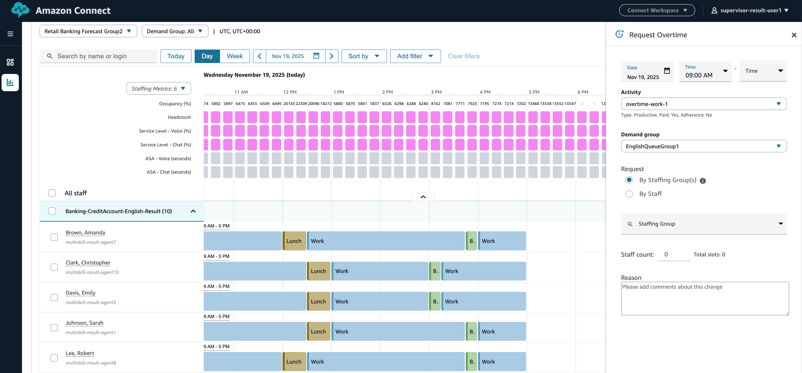

# Overtime for multi-skill forecast groups

Supervisors and Managers can restrict over time slots to specific demand groups.

For information on multi-skill, see [Multi skill scheduling](multiskill-scheduling.md "multiskill-scheduling.md")

## To use the feature

Mention the demand group while requesting for overtime. Only agents who are associated with the demand group will be approved for over time slots

