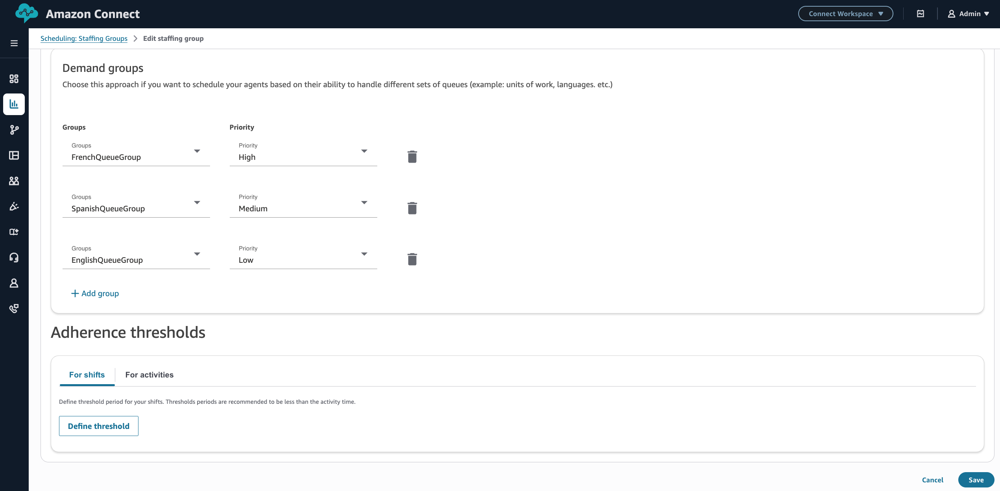
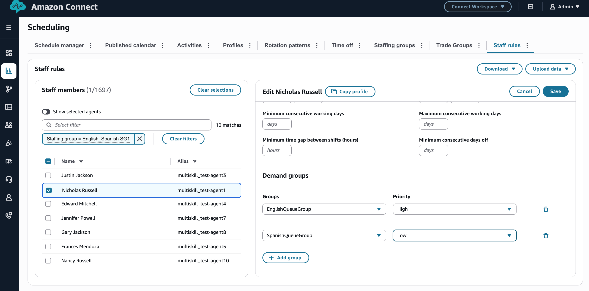
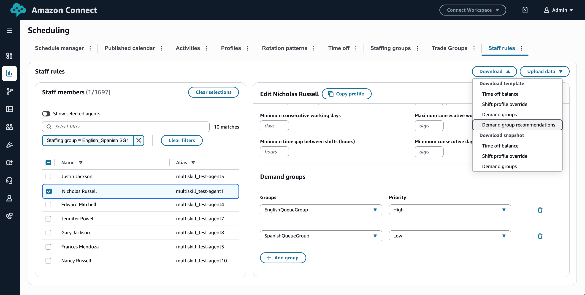
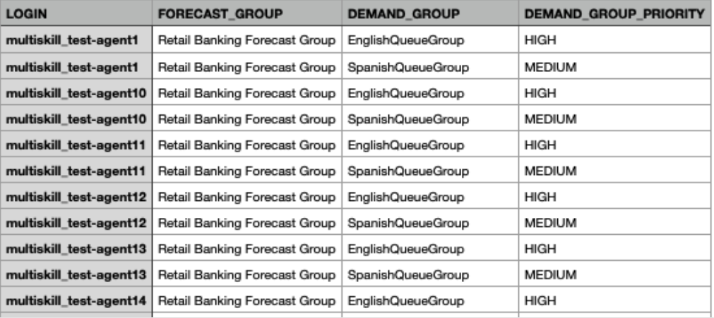
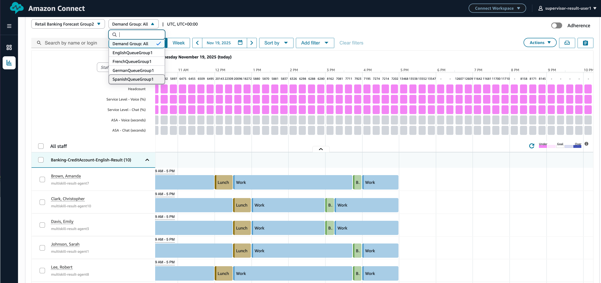

# Multi skill scheduling in Amazon Connect

The multi-skill feature moves beyond the previous model, which assumed that all agents could handle all queues within their line of business (Forecast Group), with a skill-aware scheduling system that reflects real-world contact center complexity. It introduces demand groups, which represent distinct work subsets within forecast groups, each comprising specialized skill requirements that are independently forecasted. Agents are scheduled exclusively for their allocated demand groups, ensuring that their unique skills are deployed strategically. Multi-skilled agents can be assigned across multiple relevant demand groups, with their schedules optimized to accommodate demand variations across all assigned areas.

## Important things to know

- Multi-skill scheduling requires a forecast group to have a minimum of two demand groups to be defined within the corresponding forecast group.

For more information, see [Multi skill forecasting](multiskill-forecasting.md "multiskill-forecasting.md")

- Staffing Groups or agents can be associated with multiple demand groups within a forecast group.
- If a staffing group is associated with a forecast group that contains demand groups, then the staffing group must be linked to at least one of the demand groups.
- Staffing Groups or agents can be prioritized (high/ medium/ low) for specific demand groups. A higher priority means those agents get scheduled first for that demand group.
- The scheduling system independently calculates the required agent headcount for each demand group using forecasted contact volumes, then creates agent shifts according to demand group assignments.

## Assigning agents to demand groups

- Amazon Connect forecasting capacity planning and scheduling utilizes staffing groups to organize agents into teams. Each staffing group accommodates up to 250 agents under the supervision of one or more supervisors. For details please refer to
  [Create staffing
  groups and rules](scheduling-create-staffing-groups.md "scheduling-create-staffing-groups.md"). After you create the staffing group, you can link it to the "forecast group", and then to the corresponding demand groups. You can set priority levels
  (high/ medium/ low) for each demand group. Higher priority means those agents get scheduled first for that demand group.

- Demand group assignments can be modified through the Staff Rules page, allowing for customization when agents develop additional skills or when teams consist of members with varied capabilities rather than skill-specific groupings.

- Demand groups can also be defaulted based on routing settings. The system suggests demand groups and priorities according to agent routing profiles.

- These recommendations are available for download in CSV format and can be bulk uploaded for agents. Demand group recommendations can be edited to specify agents before re-uploading.

## Generate and publish schedule

- Generate your schedule. For detailed configuration instructions, please refer to [Generate, review, and
  publish a schedule](scheduling-publish-schedule.md "scheduling-publish-schedule.md").
- Amazon Connect generates a draft schedule that is hidden from agents until it is published. Schedulers can address warnings or failures and regenerate the draft schedule iteratively before publishing the final version. Amazon Connect independently calculates the required agent headcount for each demand group using forecasted contact volumes, then creates agent shifts according to demand group assignments. The calendar allows filtering by demand groups, displaying metrics and agents specific to the selected demand group.

