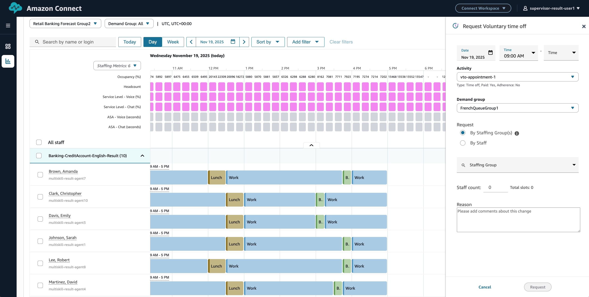

# Voluntary time off for multi-skill forecast groups

Supervisors and Managers can restrict voluntary time off slots to specific demand groups

For information on multi-skill, see [Multi skill scheduling](multiskill-scheduling.md "multiskill-scheduling.md")

## To use the feature

Mention the demand group while requesting for voluntary time off. Only agents who are associated with the demand group will be approved for voluntary time off slots

