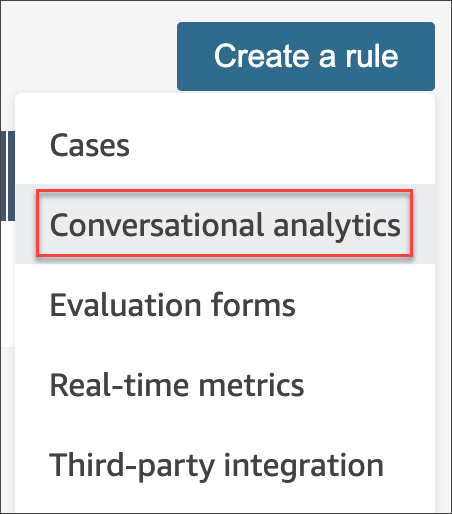
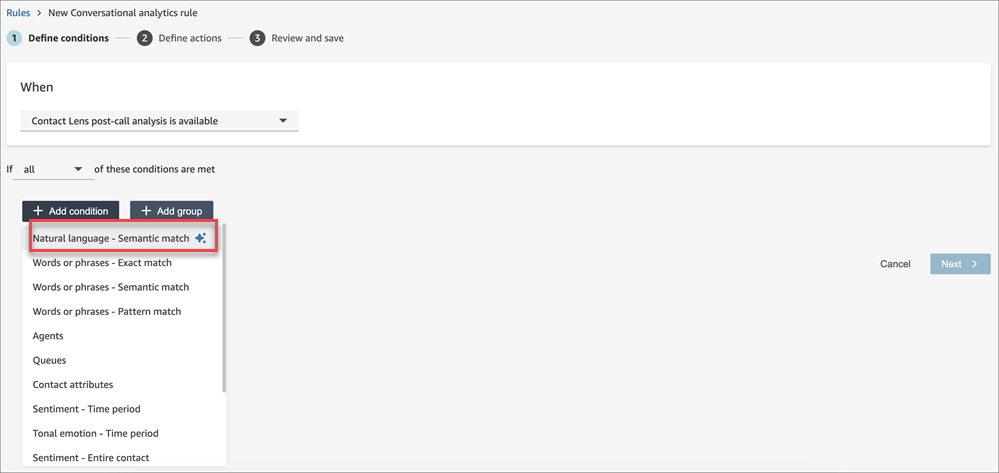
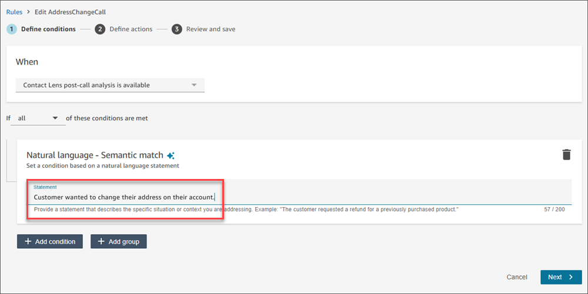

# Use Generative AI to

semantically match contacts with natural language statements

Within a Contact Lens
**conversational analytics** rule, you have the option to
specify a **Natural language - semantic match** condition that
uses generative AI to find contacts that match a natural language statement.
Natural language - Semantic match is used when you want to match contacts with
context-specific criteria (for example, the customer’s issue was resolved during
the call) or when there are too many possible words or phrases to use the
**Words or phrases** conditions.

Pro Tip: Use generative AI-powered Natural language- Semantic match if you
previously used Words or Phrases - Semantic Match.

## How to use Natural

language - semantic match

######

1. Log in to Amazon Connect with a user that has permissions
   **Rules** and **Rules - Generative
   AI** permissions.
2. On the navigation menu, choose **Analytics and
   optimization**, and then
   **Rules**.
3. Then select **Create a Rule** and choose
   **Conversational analytics**.

 4. Select either "A Contact Lens post-call analysis is
available" or "A Contact Lens post-chat analysis is
available". 5. Select **Add condition** and then choose
**Natural language - semantic match**.

 6. Enter a natural language statement that can be evaluated by
Generative AI as true or false by matching with the conversation
transcript.

 7. Add any additional conditions, for example, queues, custom contact
attributes, etc. 8. Choose **Next** and provide a category name (with
no spaces) that would be used to label contacts with the natural
language statement, for example,
**CustomerAddressChange**. 9. You can specify additional actions, such as [generating
tasks](contact-lens-rules-create-task.md "contact-lens-rules-create-task.md"), [sending email
notifications](contact-lens-rules-email.md "contact-lens-rules-email.md"), [automatically submit evaluations](contact-lens-rules-submit-automated-evaluation.md "contact-lens-rules-submit-automated-evaluation.md"), among others. 10. Choose **Next** to review the rule before you
**Save and Publish** the rule. If you are not
ready to publish the rule, you can also **Save as
draft**.

## Guidelines to use

semantic-match

The following list details how to best use semantic-match:

- The statement should be something that can be evaluated as true or
  false.
- Natural language - semantic match only uses the transcript of the
  conversation. If you want to use other contact attributes (for
  example, queues) in your match criteria, then those need to be
  specified as separate conditions within the rule.
- If possible, use the term 'agent' instead of terms like
  'colleague', 'employee', 'representative', 'advocate', or
  'associate'. Similarly use the term 'customer', instead of terms
  like 'member', 'caller', 'guest', or 'subscriber'.
- Only use double quotes if you want to check for exact words being
  spoken by the agent or the customer. For example, If the instruction
  is to check for the agent saying "Have a nice day", then the
  generative AI will not detect "Have a nice afternoon". Instead the
  natural language statement should say "The agent wished the customer
  a nice day".

**Example statements to use with semantic-match**

- The customer wanted to make a change to their subscription
  plan.
- The customer conveyed gratitude towards the agent's
  support.
- The customer indicated a desire to terminate their current
  services.
- The customer requested a subsequent interaction.
- The customer asked the agent to repeat information, indicating a
  lack of understanding.
- The customer asked to talk to the agent’s manager.
- The agent asked the customer for additional information or
  validation before providing a definitive answer.
- The agent offered multiple payment options
- The agent assured the customer that their call was important and
  requested additional waiting time.
- The agent resolved all of the customer’s issues.
