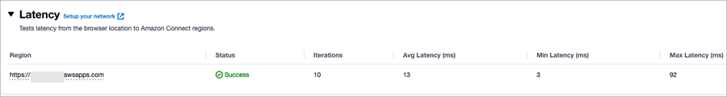
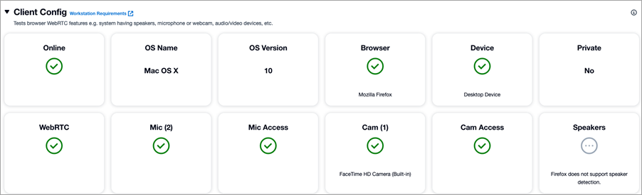

# Troubleshoot your network for call quality and disconnect

problems

Network issues are the number one reason for call quality and disconnect problems in
contact centers. Before reading this topic, we recommend that you review [Set up your network to use the Amazon Connect Contact Control Panel
(CCP)](ccp-networking.md "ccp-networking.md") to verify that your
network is setup correctly for Amazon Connect.

This topic explains how to investigate and fix underlying network problems.

## Get started

Ensure your environment is set up as follows:

- Determine which router(s) is experiencing congestion and increase its
  bandwidth to resolve this issue (or use a powerful router that can handle
  the full bandwidth of your internet connection).
- Use fixed Ethernet (not Wi-Fi) wherever possible.
- Reduce packet conflicts on Wi-Fi by reducing number of devices operating
  on the same channel.
- Avoid large data file transfers going over the same Wi-Fi environment
  concurrently.

## Run the Endpoint Test Utility

Run the [Endpoint Test Utility](check-connectivity-tool.md "check-connectivity-tool.md") tool
from the affected agent's computer and check the results:

- This tool helps determine the latency between your Amazon Connect instance and the
  agent browser. For a successful test, the status is
  **Success**. The average latency should be not be more
  than 300 ms. Latency that is above this value could result in potential
  audio quality issues.

The following image shows example results from a latency test.

You can also test latency by using the different AWS Regions to test
connectivity to from agent browser.

- Check whether the agent's workstation is set up correctly: verify they are
  using a supported browser and verify network connectivity across required
  ports for media streams. The following image shows the results for an agent
  workstation that meets all of requirements for Amazon Connect

- Higher latency also leads to packet loss.

## Investigate network components and devices

- Confirm whether the agents who are experiencing the issue are logging in
  using the same network or are logging in remotely.
- If they are using VPN/firewall, does this issue happen only on the company
  VPN or over the public internet as well?
- If there is a VDI setup, follow recommendations in [Use Amazon Connect in a VDI environment](using-ccp-vdi.md "using-ccp-vdi.md"). Were there any
  changes made? Does the issue occur in a non-VDI setup (in a simple desktop
  environment).
- Ensure there aren't any anti-viruses/software on the agent's machine or in
  the agent network that could impact the calls and cause audio quality
  issues.
- Ensure the agent(s) do not experience any network connectivity or
  bandwidth issues.
- Firewalls - Firewalls, proxies or security groups blocking required ports
  and protocols can cause audio issues, drops, and delays. Ensure UDP 3478,
  TCP 443, and web sockets are allowed.
- NAT Devices - NAT traversal can cause one-way or no audio if not properly
  configured. Use static NAT when possible and enable keep-alives.
- VPNs - Encrypted VPN tunnels add overhead and latency that degrade audio.
  Prioritize quality over encryption for real-time traffic.
- Wi-Fi - Wireless connections are prone to interference and congestion
  leading to jitter and packet loss. Use wired connections when
  possible.
