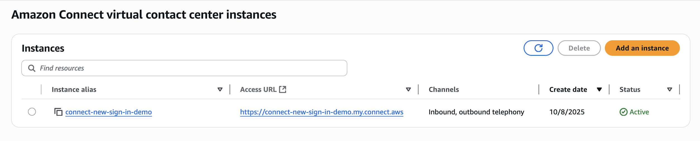
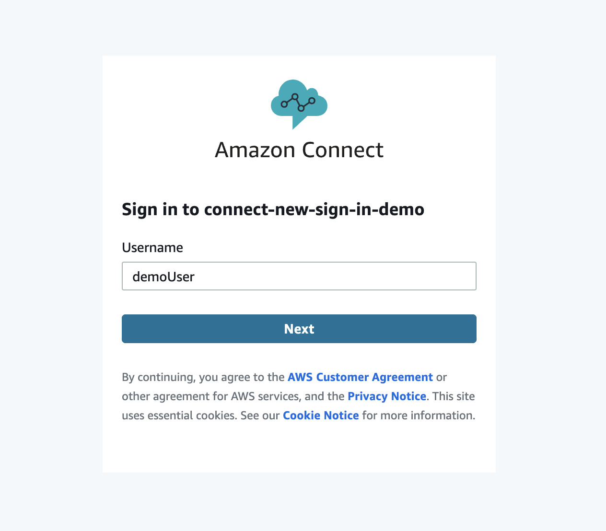
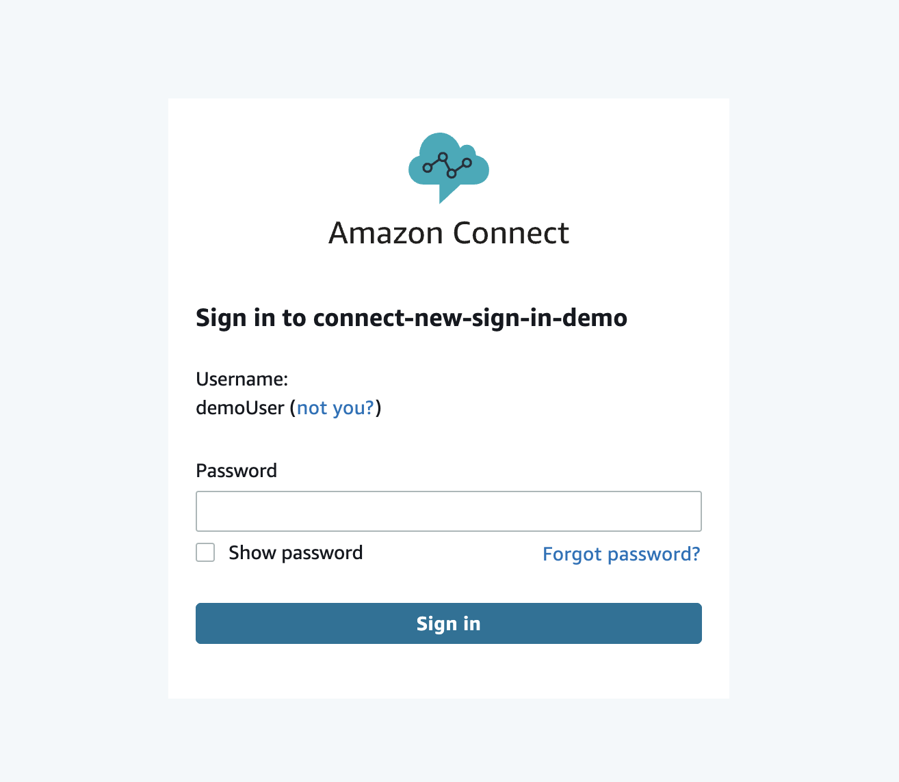

# Testing the new Connect Customer sign-in experience

## Overview

Connect Customer is implementing an enhanced sign-in experience with improved security features. This topic explains how to test the new sign-in interface before the mandatory transition.

###### Important

The new sign-in experience applies only to non-SAML (Connect Customer managed or existing directory) instances. If your instance uses SAML 2.0-based authentication, this change does not apply to you.

### New sign-in experience features

The enhanced sign-in experience introduces the following features:

- Comprehensive AWS CloudTrail event logging for sign-in activities
- Enhanced accessibility features for all users
- Additional security measures to protect your instance

Starting April 7, 2026, all newly created instances will use the new sign-in experience by default. Existing instances can begin testing the new experience on this date.

### Migration timeline

The migration to the new sign-in experience will occur in the following phases:

- **April 7, 2026** – All newly created instances will use the new sign-in experience by default.
- **July 7, 2026** – Instances that can already reach the new sign-in endpoints will be automatically migrated.
- **October 7, 2026** – All remaining instances will be migrated. Ensure your network configuration is updated before this date to maintain uninterrupted access.

## Testing instructions

Before testing the new sign-in experience, allowlist the following endpoints to make sure they are accessible from your network:

- `*.apps.signin.aws`
- `*.signin.aws`
- `*.threat-mitigation.aws.amazon.com`
- `*.s3.dualstack.`[Region]`.amazonaws.com`

Replace `[Region]` with us-east-1, us-west-2, and the
location of your Connect Customer instance.

If you are an AWS GovCloud (US) user, also allowlist the following endpoints:

- `*.signin-fips.amazonaws-us-gov.com`
- `*.apps.signin-fips.aws-us-gov.com`
- `*.apps.signin.aws-us-gov.com`

###### To test the new sign-in experience

1. Navigate to the Connect Customer console `https://`[region]`.console.aws.amazon.com/connect/v2/app/instances?region=`[region]``

For example, if operating in the us-west-2 region, the URL will be `https://us-west-2.console.aws.amazon.com/connect/v2/app/instances?region=us-west-2` 2. **Locate your instance URL** – Your Connect Customer instance URL will be in one of these formats:

    * `https://`[instance-alias]`.my.connect.aws`
    * `https://`[instance-alias]`.awsapps.com/connect`

You can find this in the AWS console as shown in the following image.

 3. **Add the testing parameter** – To access the new sign-in experience, append `?use-new-experience=true` to your instance's login URL:

    * `https://`[instance-alias]`.my.connect.aws/login?use-new-experience=true`

or

    * `https://`[instance-alias]`.awsapps.com/connect/login?use-new-experience=true`

The new experience looks like the following:

 4. **Verify access** – Navigate to the modified URL and attempt to sign in using your existing credentials. Confirm that you can successfully access your Connect Customer instance.

## Testing recommendations

We recommend the following when testing the new sign-in experience:

- **Browser coverage** – Test across the browsers your agents and administrators commonly use, including Chrome, Firefox, Safari, and Edge.
- **Network configurations** – Test from behind your corporate firewall and VPN to confirm the required URLs are accessible.
- **User roles** – Verify sign-in with different user roles, including agents, supervisors, and administrators.
- **Password reset flow** – Test the password reset process to confirm that reset emails from `no-reply@signin.aws` are received and not blocked by email filters.

## Support resources

When seeking support, prepare your instance ID and document any error messages you encounter. Screenshots of issues can be helpful for faster resolution. For more information about contacting AWS Support, see [Get administrative support for Connect Customer](get-admin-support.md "get-admin-support.md").

## FAQs

### Will I need to update any configuration on my end to support this new page?

You might need to allowlist the URLs listed in the [Testing instructions](#new-signin-testing "#new-signin-testing") section to ensure the new sign-in endpoint is accessible from your network.

### Will my existing users credentials be affected in any way by this update?

No, your existing users can continue signing in with their existing credentials using the new experience.

### Will the password reset email come from a different email address?

Yes, you'll receive reset password emails from `no-reply@signin.aws` going forward.

### Do I need to add new IP ranges to my allowlist for the new sign-in endpoints?

Yes. You need to add the S3 IP ranges to your allowlist for us-east-1,
us-west-2, and the Region where your Connect Customer instance is located. The existing EC2
and CLOUDFRONT IP ranges in the AWS [ip-ranges.json](../../../vpc/latest/userguide/aws-ip-ranges.md "../../../vpc/latest/userguide/aws-ip-ranges.md") file already cover the other new sign-in endpoints
(`*.apps.signin.aws`, `*.signin.aws`,
`*.threat-mitigation.aws.amazon.com`).

For more information about IP-based allowlisting for Connect Customer, see [Set up your network to use the Connect Customer Contact Control Panel (CCP)](ccp-networking.md "ccp-networking.md").
