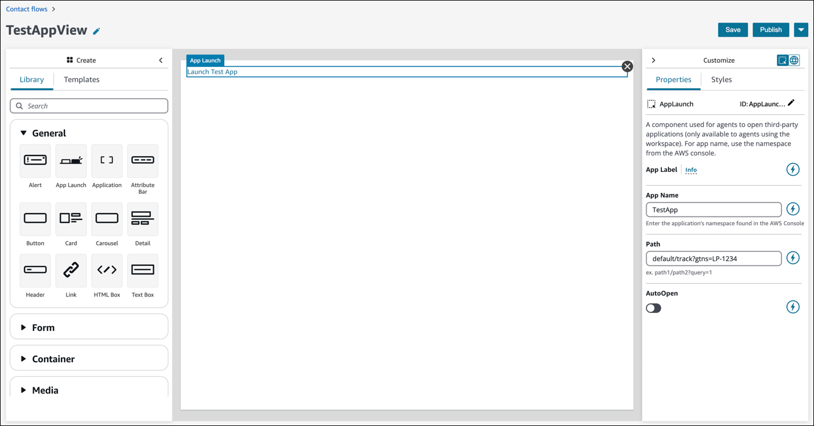
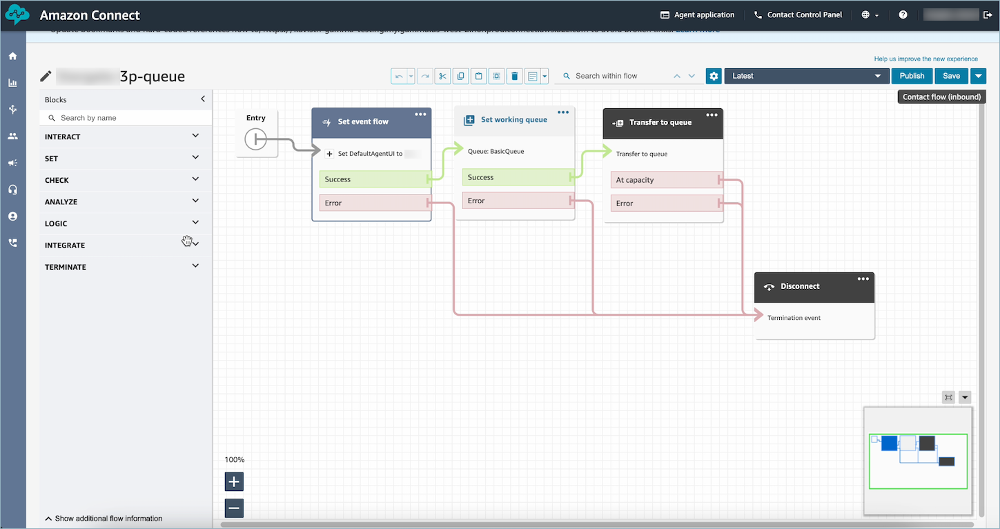

# Use screen pop functionality of

third-party applications in the Amazon Connect agent workspace

For screen pop functionality of third-party applications, you can use step-by-step
guides or you can use app pinning. For more information, see [Access third-party
applications in the agent workspace](3p-apps-agent-workspace.md "3p-apps-agent-workspace.md"). When the contact comes in, the **Guides** tab opens as the
first one in the agent workspace. You can [configure the step-by-step guides](how-to-invoke-a-flow-sg.md "how-to-invoke-a-flow-sg.md") using flows.

###### Note

When you configure a view:

- Ensure that the app name registered in the AWS Management Console exactly matches
  the app name that you are providing to the [Application](https://d3irlmavjxd3d8.cloudfront.net/?path=/story/ui-component-application--with-agent-workspace-example "https://d3irlmavjxd3d8.cloudfront.net/?path=/story/ui-component-application--with-agent-workspace-example") and/or App Launch component.
- If you get errors, and you think the names are matching, edit the
  AWS Management Console application name. Ensure there are no leading or trailing
  spaces.

- With the [Application](https://d3irlmavjxd3d8.cloudfront.net/?path=/story/ui-component-application--with-agent-workspace-example "https://d3irlmavjxd3d8.cloudfront.net/?path=/story/ui-component-application--with-agent-workspace-example") component, you are embedding the third-party
  application into Guides. The application displays in the first tab when the
  contact comes in.
- With the App Launch component, you are configuring the application to open
  as a tab in the agent workspace. You can turn on auto-open, the Guide will
  take the focus as the first tab, and the application will open as another
  tab.
- You can always use the [Link](https://d3irlmavjxd3d8.cloudfront.net/?path=/story/ui-component-link--default-case "https://d3irlmavjxd3d8.cloudfront.net/?path=/story/ui-component-link--default-case") component with auto-open to configure any browser link to
  open in a new browser window.
  You have the option to provide a path to give a more specific destination or
  parameter for the contact. When you provide the path, it will be shortened to the
  domain. Provide a forward slash at the end of the app domain.

**Example 1 (Recommended)**:

```

**App Domain registered in AWS Management Console**: https://example.com/
**Path**: cats/siamese
**Guides will attempt to render**: Domain https://example.com/ + Path cats/siamese
https://example.com/cats/siamese
Success if website exists!

```

**Example 2**:

```

**App Domain registered in AWS Management Console**: https://example.com/dogs/
**Path**: cats/siamese
**Guides will attempt to render**: Domain https://example.com/ + Path cats/siamese
https://example.com/cats/siamese
Fails because only subdomains of https://example.com/dogs/ are allowed

```

**Example 3**:

```

**App Domain registered in AWS Management Console**: https://example.com/cats
**Path**: cats/siamese
**Guides will attempt to render**: Domain https://example.com/ + Path cats/siamese
https://example.com/cats/siamese
Success if website exists!

```

The following image shows an App Launch component that's been dropped onto the
canvas. The **Customize** panel shows an example of specifying the
app name and app path.


The following image shows an example [Flow block in Amazon Connect: Set event flow](set-event-flow.md "set-event-flow.md") block that's added to the flow, and configured
to the **DefaultAgentUI** event hook.


