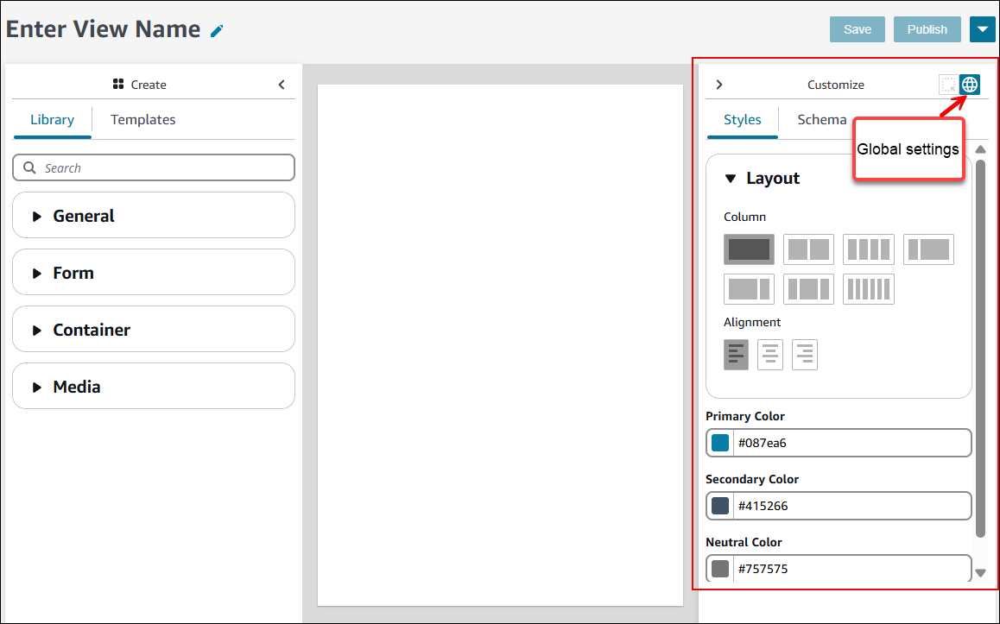
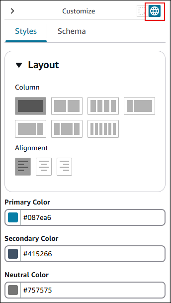
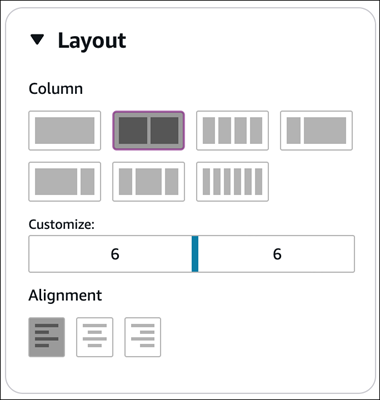
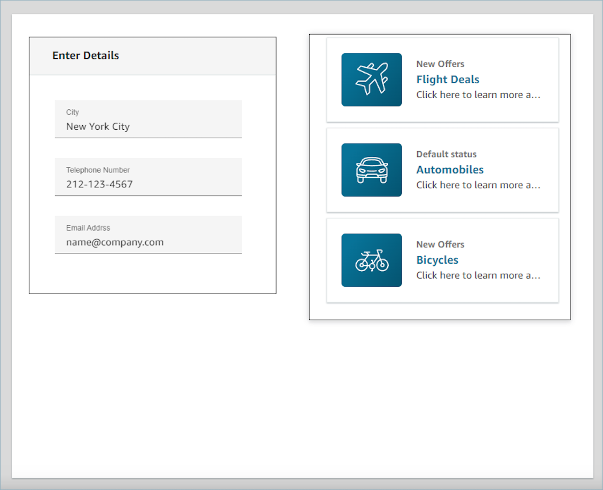
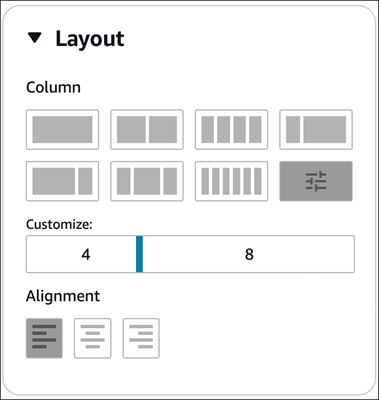
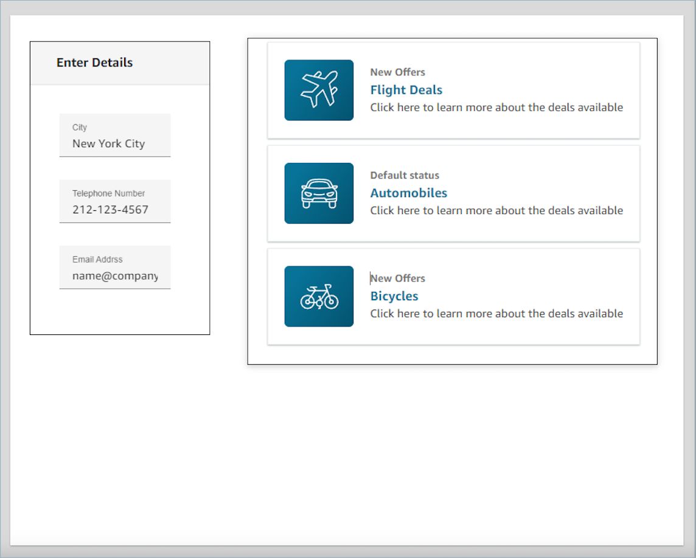

# Configure column layouts,

colors, and data definitions in a view

This topic explains how to configure column layouts, colors, and dynamic data
fields in the Amazon Connect No-code UI builder to customize views for contact center
agents.

In the No-code UI builder, the **Customize** panel is located on
the right side, as shown in the following image.

You use the **Customize** panel to configure:

- Global settings for the entire view resource.
- Local settings at the component level. Each component has its own set of
  properties.
  You use the **Customize** panel to set a range of settings for
  your view, including:

- Column layouts
- Colors
- Dynamic data mapping
- Sample data
- Static data definitions

## Configure global

layouts and colors for a view

To configure global settings, navigate to the **Customize**
panel, and then choose the global settings icon, as shown in the following
image.

You use global settings to set the overall layout and colors of your
view:

- Use the **Alignment** section to specify the relative
  location of components to the left, center, or right of the view.
- Choose three color fields:
  - Primary color
  - Secondary color
  - Neutral color

Each component in the view applies these settings by default. However, when
customizing a component, you can override these global color settings.

## Layout columns

The view resource uses a flexbox pattern with 12 columns. Components occupy a
relative position to one another. They aren't placed onto the canvas in a pixel
perfect manner. This allows the view to scale up and down in size responsively,
without losing the composition of the view.

In the global settings you can determine how you want to group your columns.
For example, in the **Column** section, you can divide the view
into two sections of six columns each, as shown in the following image.

The following image shows an example of what this layout would look like to an
agent.

You can also use the **Customize** slider to alter the ratios
of these groupings. For example, you can set it so the left side of the view is
four columns and the right side is eight, as shown in the following
image:

The following image shows an example of how this layout would appear to the
user.

