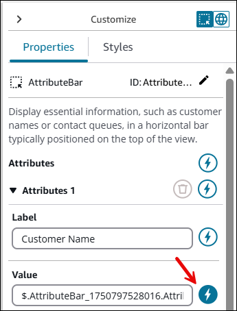
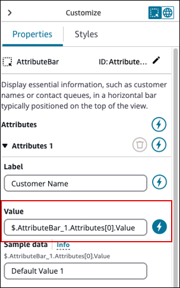
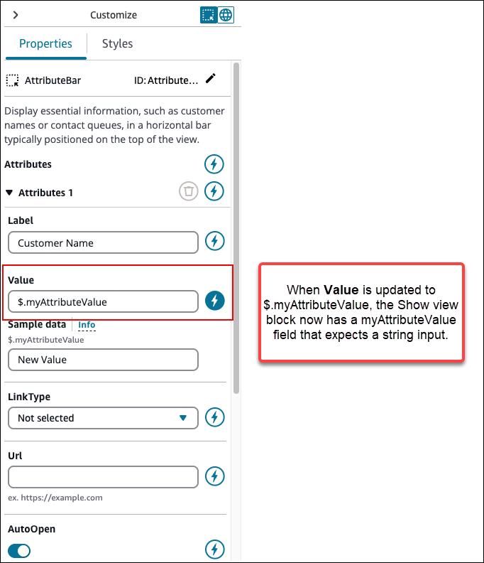
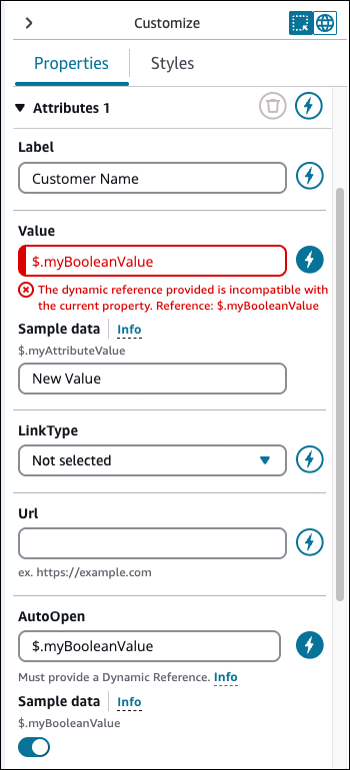
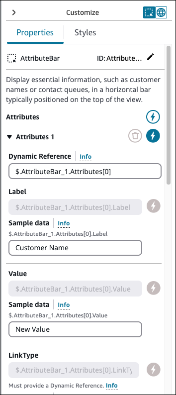
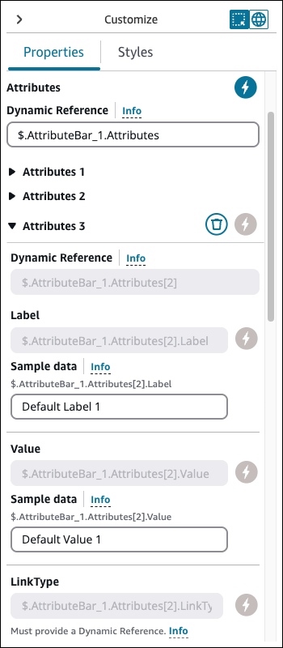

# Configure dynamic

fields in the No-code builder UI in Amazon Connect

This topic explains how to configure dynamic fields in components to display
runtime data instead of hardcoded values when building agent and customer interfaces
using the No-code builder UI in Amazon Connect.

You may have scenarios where you want the data displayed to an agent or customer
to be dynamically populated instead of hardcoded. For example, if you are making a
screen pop, you might want to surface the customer's name and profile ID. You need
the data to be dynamic because the values of these fields change from contact to
contact.

To dynamically populate a component field:

1. Open the properties tab for that component.
2. Select the dynamic icon (the lighting bolt icon) that appears next to the
   field you want to be dynamic.
   The most common fields that require dynamic values are:

- The **Value** field for display fields.
- The **DefaultValue** field in form inputs.
  It's technically possible for any field that is both visible and hidden to an
  agent to be dynamically determined at runtime. This is why every field in the
  **Properties** tab can be set to dynamic (the lightning bolt
  icon).

For example, look at the **AttributesBar** component in the
following image.

- The Label of Attribute 1 is statically defined as **Customer
  Name**.
- The **Value** of the attribute is set to dynamic (the
  lightning bolt icon is selected).
  With these settings, the value of **AttributesBar** is determined
  by the data that gets passed in at runtime into the [Show view](show-view-block.md "show-view-block.md") block.

When a field is set to dynamic, its static value is replaced with a dynamic
reference. A **Sample Data** section appears below the field. You
use this section to define [sample
data](no-code-ui-builder-sample-data.md "no-code-ui-builder-sample-data.md").

The dynamic reference reflects the data structure expected by the [Show view](show-view-block.md "show-view-block.md") block when
setting up runtime data. For example, consider the **Value** of
Attribute 1 in the [AttributesBar](https://d3irlmavjxd3d8.cloudfront.net/?path=/docs/ui-component-attributebar--with-attributes "https://d3irlmavjxd3d8.cloudfront.net/?path=/docs/ui-component-attributebar--with-attributes") component, shown in the following image.

- When set to dynamic, the field becomes
  `$.AttributeBar_1.Attributes[0].Value` where
  `AttributeBar_1` is the Id of the component.
- This indicates that in the [Show view](show-view-block.md "show-view-block.md") block, the
  `AttributeBar_1` field should receive an object.
- The object contains an `Attributes` array where the first item
  (`[0]`) is expected to be an object with a `Value`
  field.
  You can edit dynamic references for clarity or reusability. Dynamic references can
  be shared across multiple fields and components within the View. For example, in the
  following image of the [AttributeBar](https://d3irlmavjxd3d8.cloudfront.net/?path=/docs/ui-component-attributebar--with-attributes "https://d3irlmavjxd3d8.cloudfront.net/?path=/docs/ui-component-attributebar--with-attributes") component, we update its dynamic reference to
  `$.myAttributeValue`. The [Show view](show-view-block.md "show-view-block.md") block now has a
  `myAttributeValue` field that expects a string input.

###### Important

The type of the dynamic reference must match the expected type of the field.
For example, you can't use a string-based dynamic reference in a Boolean field.
The following image shows an example error message when the dynamic reference
doesn't match.

You also have the option to set all properties of an attribute in a component as
dynamic. In the following image, everything about this attribute, including the
label, is determined at runtime based on the values passed into the [Show view](show-view-block.md "show-view-block.md") block. For
example, **Customer Name** is now sample data that you can use to
get a sense of what the agent will see when they use a guide. However, this value is
not viewable to the agent.

For certain components, such as [AttributesBar](https://d3irlmavjxd3d8.cloudfront.net/?path=/docs/ui-component-attributebar--with-attributes "https://d3irlmavjxd3d8.cloudfront.net/?path=/docs/ui-component-attributebar--with-attributes"), you can also set all properties of the component as
dynamic. For example, with the AttributeBar, you can set choose the dynamic icon
(the lightning bolt) to make all of the attributes dynamic. The attributes are
determined by whatever is passed to the [Show view](show-view-block.md "show-view-block.md") block at runtime.

