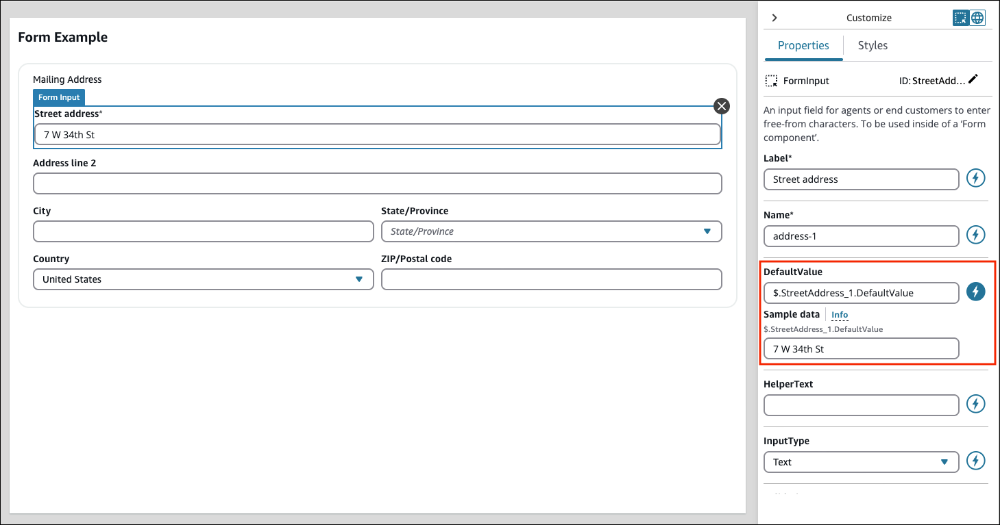

# Use sample data to preview your

view in Amazon Connect

You can use sample data to see what the view will look like to the user. You can
even see data fields that are dynamically determined at runtime. When a field is set
to dynamic (the lightning bolt is selected), sample data can be entered in the input
field under the **Sample Data** section of that property. This
sample data is for view purposes only. It appears only in the Amazon Connect UI
builder.

For example, the following image shows an example of a **Mailing address
form**.

- **Street address** is a dynamic default value. It is
  populated at runtime by the address found in the customer profile.
- To see how the final UI appears to the agent, you can enter a text default
  value.
- The value `7 W 34th St` is for display purposes only in the
  Amazon Connect admin website. It does not appear to the agent.
