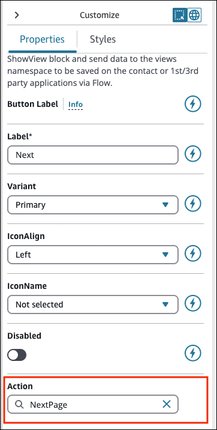

# Set actions that

appear as flow branches in the Show view block

In step-by-step guides, users must choose a button to proceed to a new page in
guides. You configure these buttons in the no-code UI builder by setting an Action
for each button. For example, you can configure a button to submit a form.

When a user chooses the button at runtime, the guide sends a response message to
flows. The **Action** value determines the branching path from the
[Show view](show-view-block.md "show-view-block.md")
block.

For example, a view can have three buttons with different actions. These actions
appear as different branching paths on the [Show view](show-view-block.md "show-view-block.md") block. This allows you to configure
appropriate branching logic in your guide flows.

The following image shows an example of the **Action** section in
the **Customize** panel of the no-code builder.

