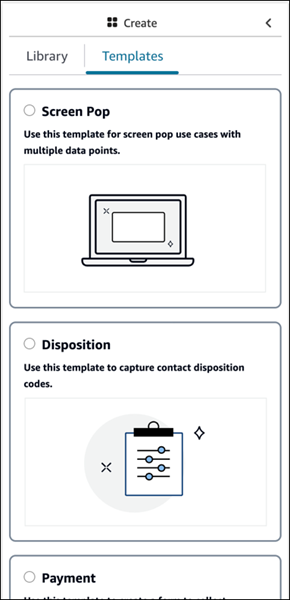

# UI builder templates to get

started quickly

The UI builder includes templates that you can use to pre-populate your
canvas with components. To access the templates:

1. In the no-code builder, open the **Create** panel.
2. Choose the **Templates** tab.
3. Choose the template you want to use, and drag and drop it onto the view
   canvas.
   After the template appears on the canvas, you can:

- Add more components
- Delete components
- Apply any other type of configuration you can do with a view resource
  built from scratch
  If you have already placed UI components onto the canvas, these components are
  overwritten and the template takes their place. These changes are completed after
  you **Save** the view resource. If you use a template in error, you
  can leave the page and come back to return to your last saved view resource
  version.

The following image shows an example of a few of the templates available in the
**Create** panel: Screen Pop, Disposition, Payment

