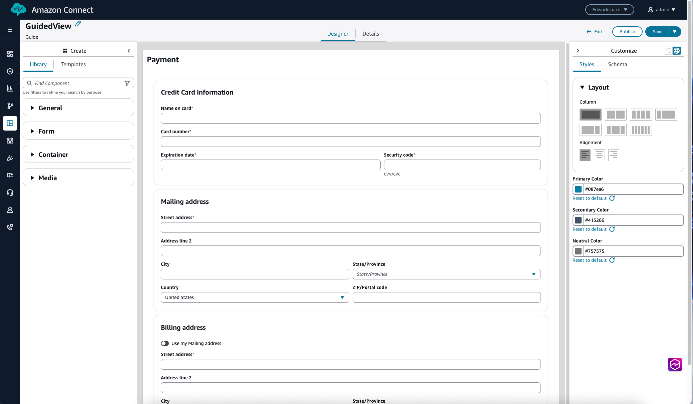

# Use the UI builder in Amazon Connect for resources

in step-by-step guides

You can create the view resources used in step-by-step guides by using the UI
builder in Amazon Connect. With the UI builder, you can:

- Drag and drop UI components onto a canvas.
- Arrange your layout.
- Edit the properties and styles of each component.
  The following image shows an example of the UI builder page.

1. The **Create** panel, where you choose from the library of UI
   components, or use one of the available templates.
2. The components are grouped inside collapsible containers. Drag and drop these
   components onto the canvas of the view resource.
3. The canvas of the view resource.
4. The **Customize** panel, and the global settings icon. This
   is where you set the global properties for the page, such as columns, alignment,
   and colors. It's also where you set the properties for the individual components
   that are on the canvas.

The following image shows an example of the **Properties**
tab for the **Address** component. When you select the dynamic
icon (the lightning bolt), the field is populated at runtime.

## Access the UI builder

1. Log in to the Amazon Connect admin website at https://`instance name`.my.connect.aws/. Use an Admin account, or an account that has
   **Channels and flows - Views** permission in its
   security profile.
2. In the Amazon Connect admin website, choose **UI Management**.
3. Choose **Create View**. In the **Create View** dialog box,
   specify a name for the view and select the **Purpose type**.

Views have two purposes:

    * **Guide Views**: Used to structure single or multi-step workflows that can be displayed to agents, end-customers, or managers to access contact-specific or third-party data in a unified interface.
    * **Workspace Views**: Used to build Workspace pages such as the home page, these views provide general interface components and functionality independent of contact handling.

4. The UI builder page appears.
   Quickly start with templates or build your views from scratch.
5. Choose **Create new**. An empty UI builder page
   appears, as shown in the following image.

