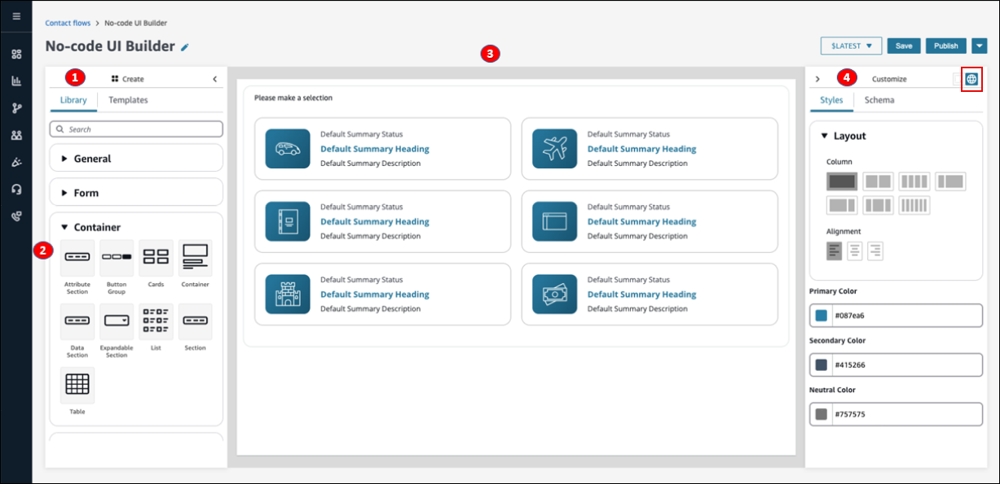
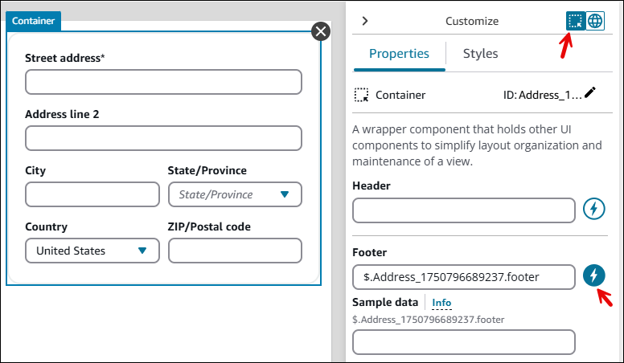
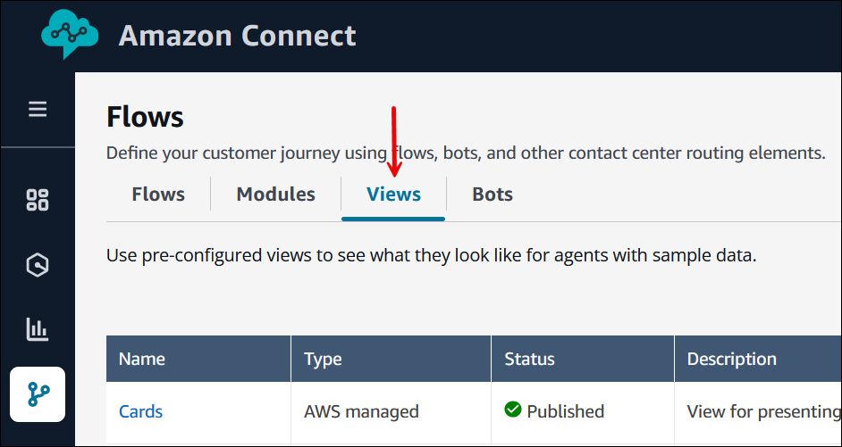
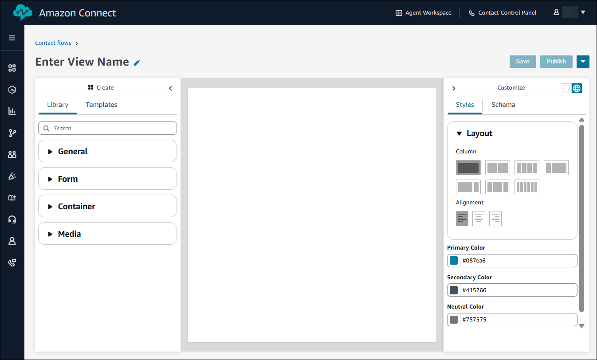

# Use the no-code UI builder in Amazon Connect for resources

in step-by-step guides

You can create the view resources used in step-by-step guides by using the no-code UI
builder in Amazon Connect. With the UI builder, you can:

- Drag and drop UI components onto a canvas.
- Arrange your layout.
- Edit the properties and styles of each component.
  The following image shows an example of the No-code UI Builder page.

1. The **Create** panel, where you choose from the library of UI
   components, or use one of the available templates.
2. The components are grouped inside collapsible containers. Drag and drop these
   components onto the canvas of the view resource.
3. The canvas of the view resource.
4. The **Customize** panel, and the global settings icon. This
   is where you set the global properties for the page, such as columns, alignment,
   and colors. It's also where you set the properties for the individual components
   that are on the canvas.

The following image shows an example of the **Properties**
tab for the **Address** component. When you select the dynamic
icon (the lightning bolt), the field is populated at runtime.

## Access the no-code UI

builder

1. Log in to the Amazon Connect admin website at https://`instance name`.my.connect.aws/. Use an Admin account, or an account that has
   **Channels and flows - Views** permission in its
   security profile.
2. In the Amazon Connect admin website, choose **Routing**,
   **Flows**, **Views**. The following
   image shows an example of the **Flows** page, the
   **Views** tab.

 3. Choose **Create new**. An empty no-code UI builder page
appears, as shown in the following image.

