# Configure Amazon Nova Sonic Speech-to-Speech

You can configure Amazon Nova Sonic as a Speech-to-Speech (S2S) model for a Conversational AI bot locale in Amazon Connect. With Speech-to-Speech, the bot converts customer speech directly into natural, expressive speech responses using Nova Sonic. Amazon Connect continues to manage orchestration, intents, and flows.

## Part 1: Configure Speech-to-Speech for a Bot Locale

### Prerequisites

- A Conversational AI bot exists in Amazon Connect.
- The locale you want to use with Nova Sonic is already created.
- You have permissions to edit the bot configuration and build the language.

### Step 1: Open the Speech model configuration

1. Sign in to the Amazon Connect admin website.
2. Choose **Bots**, then select the **Configuration** tab.
3. Select the locale you want to configure.
4. In the Speech model section, choose **Edit**.

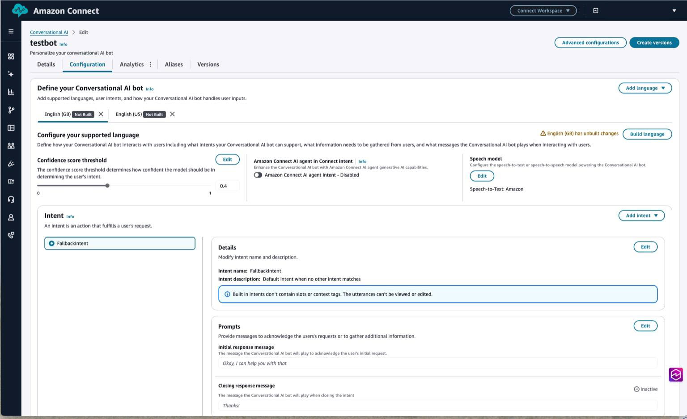

### Step 2: Select Speech-to-Speech

In the Speech model modal, open the Model type dropdown and choose **Speech-to-Speech**.

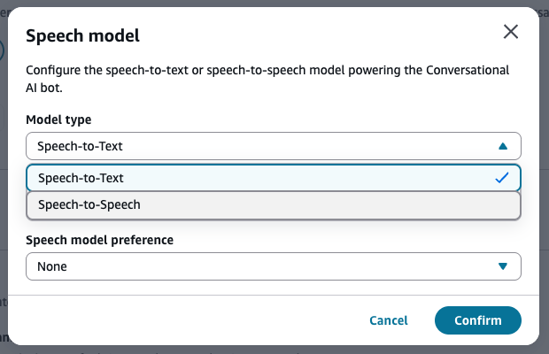

### Step 3: Choose Amazon Nova Sonic

After selecting Speech-to-Speech, open Voice provider and select **Amazon Nova Sonic**. Then choose **Confirm**.

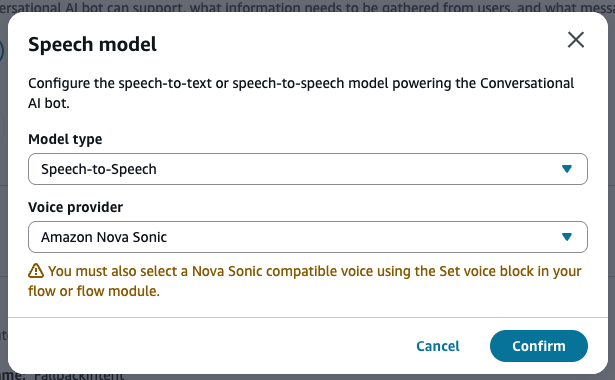

### Step 4: Review Speech model status

The Speech model card now shows Speech-to-Speech: Amazon Nova Sonic and displays a warning to select a Nova Sonic compatible voice in your Set voice block.

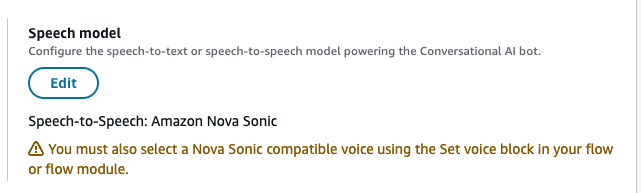

### Step 5: Build and activate the locale

If the locale shows **Unbuilt changes**, choose **Build language**. The new STT settings become active after a successful build.

## Part 2: Configure a Nova Sonic Compatible Voice in a Flow

After enabling Nova Sonic at the bot level, you must configure a matching Nova Sonic–compatible expressive voice in your flow using the Set voice block.

### Supported Nova Sonic Voices (Launch Set)

- Matthew (en-US, Masculine)
- Amy (en-GB, Feminine)
- Olivia (en-AU, Feminine)
- Lupe (es-US, Feminine)

### Step 1: Add or open a Set voice block

1. Open the target flow in the Flow designer.
2. Search for Set voice in the block library.
3. Drag a Set voice block onto the canvas or open an existing one.

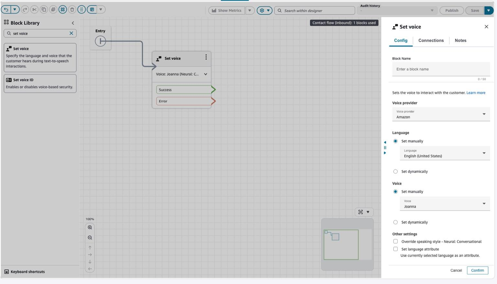

### Step 2: Select Override and Generative speaking style

In Other settings, choose **Override speaking style** and select **Generative** to enable Nova Sonic expressive output.

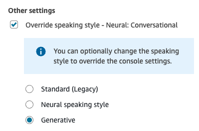

### Step 3: Select a Nova Sonic compatible voice

1. Set Voice provider to **Amazon**.
2. Under Language, select the locale that corresponds to the voice you want.
3. Under Voice, select one of the Nova Sonic–compatible voices.

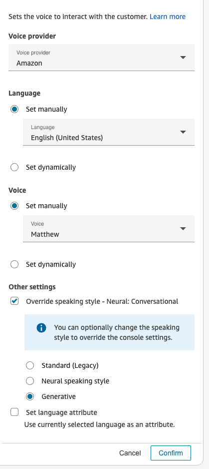

### Step 4: Review selected voice

The Set voice block now shows the selected voice and style, such as Voice: Matthew (Generative).

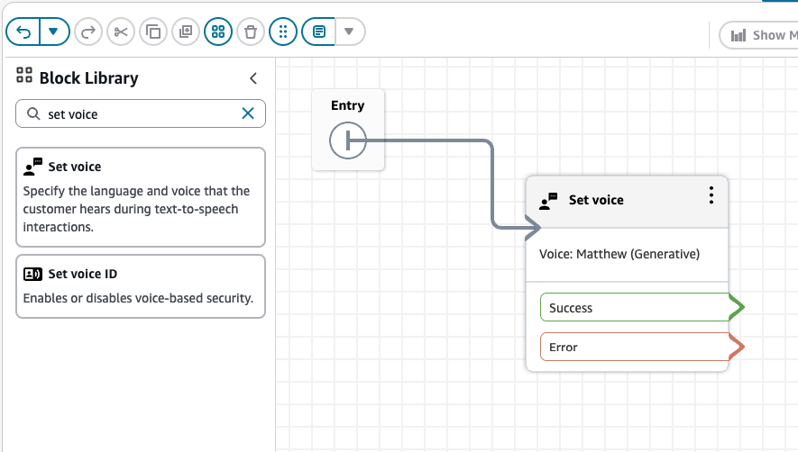

### Step 5: Save and publish the flow

Choose **Save**, then **Publish** to activate the configuration.

## Part 3: Configure Nova Sonic–Only and Beta Voices Using Session Attributes

You can configure Nova Sonic–only voices and beta voices for your Amazon Connect Conversational AI bot. These voices are supported by Nova Sonic Speech-to-Speech (S2S) but are not available as Amazon Polly TTS voices. Because they are not surfaced in the Set voice block, you must configure them using session attributes in the Get Customer Input (GCI) block.

When you use a Nova Sonic–only or beta voice, Amazon Connect will generate Nova Sonic expressive audio for that segment. However, any prompts rendered using Amazon Polly in the same flow may sound inconsistent, because Polly does not support these voices. Choose this option only if you are comfortable with this variability.

### Step 1: Add a GCI block to your flow

Open the flow that interacts with your Nova Sonic bot. In the block library, search for **GCI** and drag the block into the designer.

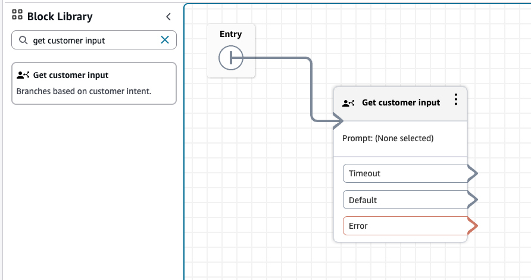

### Step 2: Select Amazon Lex in the GCI block configuration

In the GCI block configuration panel, select **Amazon Lex**.

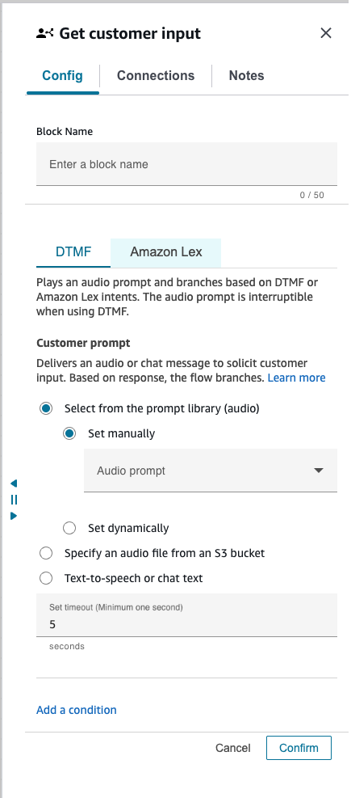

### Step 3: Set the bot and alias

Choose the bot and alias that is configured to use Speech-to-Speech: Amazon Nova Sonic.

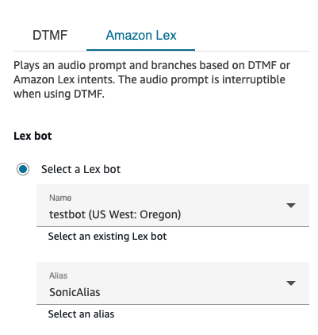

### Step 4: Add a session attribute override

In the Lex Configuration, scroll to **Session attributes** and choose **Add an attribute**.

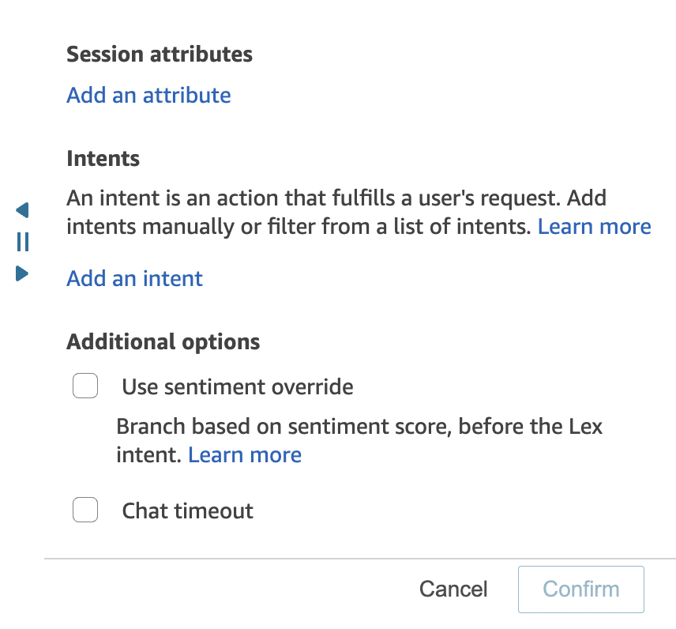

### Step 5: Set the override key and beta voice name

Use the following key to override the default S2S voice: **x-amz-lex:audio:speaker-model-voice-override**

For the value, enter the Nova Sonic–only or beta voice ID. The value must match the exact case expected by the model. For example, the following sets the voice to **tiffany**.

After adding the key and value, choose **Confirm**.

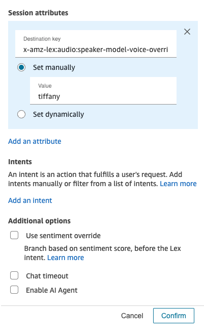

### Runtime behavior

- Nova Sonic uses the Nova Sonic–only or beta voice for the duration of the session.
- If the session later reaches a Set voice block using Amazon Polly, the audio may switch back to the Polly voice.

### Troubleshooting

- **Voice not applied:** Confirm that the voice ID is typed exactly as required (case sensitive).
- **Unexpected voice switching:** Ensure no downstream Set voice block uses a Polly voice.
- **No S2S response:** Verify that the locale is configured for Speech-to-Speech: Amazon Nova Sonic.
