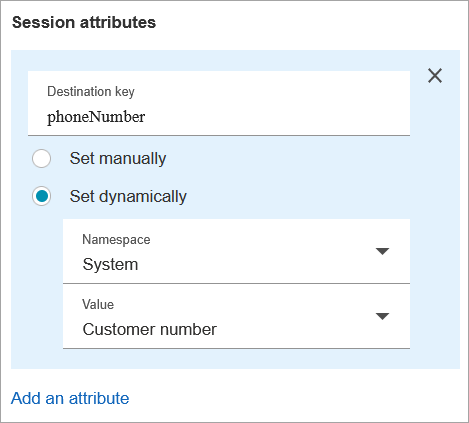
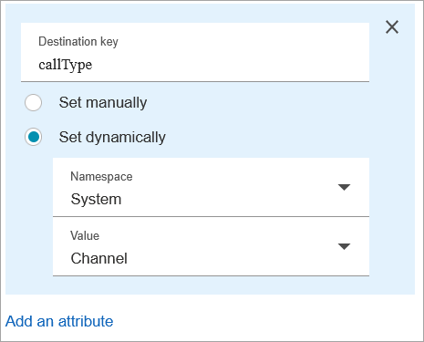

# How to use the same Amazon Lex bot for voice and

chat

You can use the same bot for voice and chat. However, you may want the bot to respond
differently based on the channel. For example, you want to return SSML for voice so a number
is read as a phone number, but you want to return normal text to chat. You can do this by
passing the **Channel** attribute.

1. In the **Get customer input** block, choose the
   **Amazon Lex**
   tab.
2. Under **Session attributes**, choose **Add an
   attribute**. In the **Destination key** box, enter
   **phoneNumber**. Choose **Set dynamically**. In the
   **Namespace** box, choose **System**, and in the
   **Value** box, choose **Customer Number**, as shown
   in the following image.

 3. Choose **Add an attribute** again. 4. Choose **Set dynamically**. In the **Destination
key** box, enter **callType**. In the
**Namespace** box, choose **System**, and in the
**Value** box choose **Channel**, as shown in the
following image.

 5. Choose **Save**. 6. In your Lambda function, you can access this value in the
`SessionAttributes` field in the incoming event.
