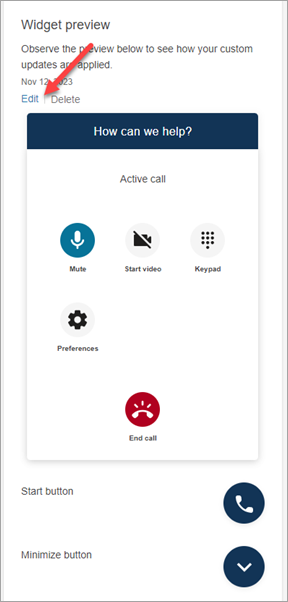

# Personalize the customer experience for in-app,

web, and video calling in Amazon Connect

The steps in this topic are optional but recommended. They enable you to personalize
the customer's experience based on their actions previously taken within your app. This
option provides you more control when initiating new calls, including the ability to
pass contextual information as attributes.

After doing these steps, you'll need to work with your website administrator to set
up your web servers to issue JSON Web Tokens (JWTs) for new calls

1. If you've already created your communications widget, on the **Communication
   widgets** page, choose the widget to edit it.
2. In the **Domain & Security** section, choose
   **Edit**.
3. Under **Add security for your communications widget requests**, choose
   **Yes**.

 4. Choose **Save and continue**. Amazon Connect creates the widget along
with the following:

    * Amazon Connect provides a 44-character security key on the next page that you
     can use to create JWTs.
    * Amazon Connect adds a callback function within the communications widget embed script
     that checks for a JWT when a call is initiated.


    You must implement the callback function in the embedded snippet, as
     shown in the following example.


    ```
    amazon_connect('authenticate', function(callback) {
      window.fetch('/token').then(res => {
        res.json().then(data => {
          callback(data.data);
        });
      });
    });
    ```

In the next step you'll get a security key for all calls initiated on your
websites. Ask your website administrator to set up your web servers to issue
JWTs using this security key. 5. Choose **Save and continue**. 6. Copy the custom HTML code snippet and insert it into your website's source
code.

## Alternate method: Pass contact attributes

directly from snippet code

###### Note

Although these attributes are scoped with the `HostedWidget-`
prefix, they are still mutable client-site. Use the JWT setup if you require PII
or immutable data in your contact flow.

The following example shows how to pass contact attributes directly from snippet
code without enabling widget security.

```
<script type="text/javascript">
  (function(w, d, x, id){ /* ... */ })(window, document, 'amazon_connect', '`widgetId`');
  amazon_connect('snippetId', '`snippetId`');
  amazon_connect('styles', /* ... */);
  // ...

  amazon_connect('contactAttributes', {
   `foo`: '`bar`'
  })
<script/>
```

### Using the attributes in contact

flows

The [Check contact attributes](check-contact-attributes.md "check-contact-attributes.md")
flow block provides access to these attributes via the **User
defined** namespace, as shown in the following image. You can use
the flow block to add branching logic. The full path is
`$Attribute.HostedWidget-`attributeName``.


## Copy communications widget code and security

keys

In this step, you confirm your selections and copy the code for the communications widget
and embed it in your website. You can also copy the secret keys for creating the
JWTs.

### Security key

Use this 44-character security key to generate JSON web tokens from your web
server. You can also update, or rotate, keys if you need to change them. When
you do this, Amazon Connect provides you with a new key and maintains the previous key
until you have a chance to replace it. After you have the new key deployed, you
can come back to Amazon Connect and delete the previous key.


When your customers interact with the start call icon on your website, the
communications widget requests your web server for a JWT. When this JWT is provided, the
widget will then include it as part of the end customer’s call to Amazon Connect. Amazon Connect
then uses the secret key to decrypt the token. If successful, this confirms that
the JWT was issued by your web server and Amazon Connect routes the call to your contact
center agents.

#### JSON Web Token specifics

- Algorithm: **HS256**
- Claims:

      + **sub**:
       `widgetId`


      Replace `widgetId` with your own widgetId. To
       find your widgetId, see the example [Communications widget script](add-chat-to-website.md#chat-widget-script "add-chat-to-website.md#chat-widget-script").
      + **iat**: \*Issued At Time.
      + **exp**: \*Expiration (10 minute
       maximum).

  \* For information about the date format, see the following
  Internet Engineering Task Force (IETF) document: [JSON Web Token
  (JWT)](https://tools.ietf.org/html/rfc7519 "https://tools.ietf.org/html/rfc7519"), page 5.

The following code snippet shows an example of how to generate a JWT in
Python:

```
payload = {
'sub': `widgetId`, // don't add single quotes, such as 'widgetId'
'iat': datetime.utcnow(),
'exp': datetime.utcnow() + timedelta(seconds=JWT_EXP_DELTA_SECONDS)
}

header = {
'typ': "JWT",
'alg': 'HS256'
}

encoded_token = jwt.encode((payload), CONNECT_SECRET, algorithm=JWT_ALGORITHM, headers=header) // CONNECT_SECRET is the security key provided by Amazon Connect

```

#### Communications widget script

The following image shows an example of the JavaScript that you embed on
the websites where you want customers to be able to call your contact
center. This script displays the widget in the bottom-right corner of your
website.

The following image shows an example of where to find your
widgetId.


When your website loads, customers first see the
**Start** icon. When they choose this icon, the
communications widget opens and customers are able to call your agents.

To make changes to the communications widget at any time, choose
**Edit**.

###### Note

Saved changes update the customer experience in a few minutes. Confirm
your widget configuration before saving it.



To make changes to widget icons on the website, you will receive a new
code snippet to update your website directly.
