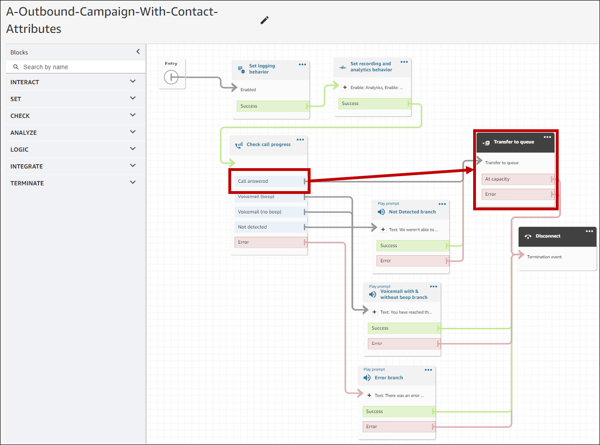
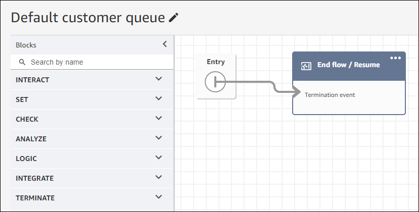
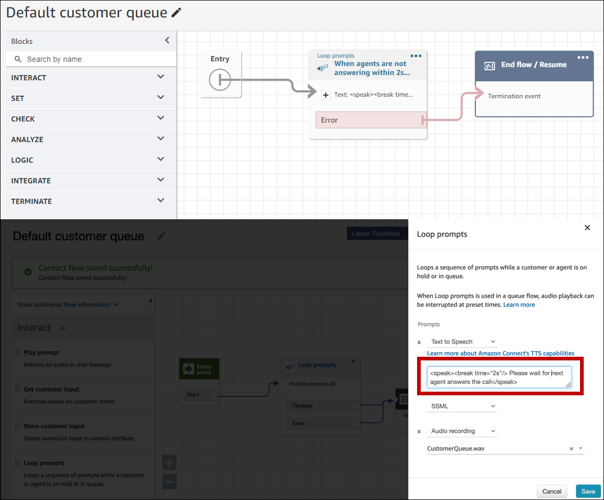
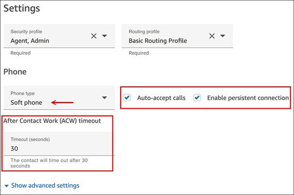

# Best practices for Amazon Connect outbound campaigns

The topics in this section explain best practices for outbound campaigns. These practices
can increase agent productivity, help you comply with regulations, and help protect the integrity
of your phone numbers.

###### Contents

- [Choose the right mode for voice communication](#right-campaign-for-vc "#right-campaign-for-vc")
- [Agent staffing best practices for voice
  communication](#agent-staffing-vc "#agent-staffing-vc")
- [Connection latency best practices](#call-latency-oc "#call-latency-oc")
- [Best practices for answering machine detection](#machine-detection-oc "#machine-detection-oc")

## Choose the right mode for voice communication

Amazon Connect outbound campaign provides several types of voice communication. The following
sections describe each type so that you can implement the campaign that best meets your
needs.

###### Contents

- [Predictive (Agent assisted voice)](#predictive-campaigns-oc "#predictive-campaigns-oc")
- [Progressive (Agent assisted voice)](#progressive-campaigns-oc "#progressive-campaigns-oc")
- [Agentless (Automated voice)](#agentless-campaigns-oc "#agentless-campaigns-oc")

### Predictive (Agent assisted voice)

When agent productivity, cost per calls, or contact center efficiency are critical
metrics, use predictive. Predictive mode anticipate that many calls won't be answered. They
counterbalance that by dialing as many phone numbers in a list as possible during an agent's
shift by making predictions about agent availability.

The predictive algorithm calls ahead based on certain performance metrics. This means that
calls can be connected before an agent becomes available, and a customer is connected to the
next available agent. The predictive algorithm constantly analyzes, evaluates, and makes agent
availability predictions in real-time so that agent productivity and efficiency can
improve.

### Progressive (Agent assisted voice)

When you need to reduce answer speeds, use progressive.

A progressive mode campaign dials the next phone number in a list after an agent completes
the previous call. If there are multiple campaigns targeting the same set of agents, then each
of them may end up dialing contacts for the same agents. There are two ways to prevent this:

- Change the bandwidth allocation of the campaigns so the sum of the bandwidth allocation
  of each of those campaigns is less than or equal to 100%. This greatly reduces the likelihood
  of multiple campaigns dialing contacts for the same agents, but it does not completely
  eliminate it.
- If a 1:1 guarantee is required, then have an exclusive set of agents for each campaign.
  To do this, assign the campaign's queue to a single routing profile. That routing profile
  must only have this campaign's queue, must only allow voice calls, and no inbound contacts
  should be put into this queue.

You can use integrated answering machine detection to help identify a live customer pickup
or a voicemail, and customize your contact strategy accordingly. For example, if a person
answers a call, you can present options for them to select. If a call goes to voicemail, you
can leave a message.

You can also manage pacing by specifying capacity for each campaign. For example, you can
send more voice notifications faster by setting a higher capacity for a given agentless
campaign compared to other dialer campaigns.

### Agentless (Automated voice)

You use agentless mode to send high-volume personalized voice notifications, appointment
reminders, or to enable self-service using the Interactive Voice Response (IVR) with no agents
needed.

## Agent staffing best practices for voice

communication

When call recipients answer a call and hear silence in return, they often hang up. For
predictive mode, use the following best practices to help reduce that silence:

- Ensure that you have enough agents logged in to your call queue. For more information
  about staffing, see [Forecasting, capacity planning, and scheduling in Amazon Connect](forecasting-capacity-planning-scheduling.md "forecasting-capacity-planning-scheduling.md").
- Consider using Amazon Connect's machine learning services.
  - [Forecasting](forecasting.md "forecasting.md"). Analyze and predict contact volume
    based on historical data. What will future demand—the contact volume and handle time—look
    like? Amazon Connect forecasting provides accurate and auto-generated forecasts that are
    automatically updated daily.
  - [Capacity planning](capacity-planning.md "capacity-planning.md"). Predict how many agents
    your contact center will require. Optimize plans by scenarios, service level goals, and
    metrics, such as shrinkage.
  - [Scheduling](scheduling.md "scheduling.md"). Generate agent schedules for day-to-day
    workloads that are flexible, and meet business and compliance requirements. Offer agents
    flexible schedules and work-life balance. How many agents are needed in each shift? Which
    agent works in which slot?

  [Schedule adherence](schedule-adherence.md "schedule-adherence.md"). Enable contact center
  supervisors to monitor schedule adherence and improve agent productivity. Schedule adherence
  metrics are available after the agent schedules are published.

## Connection latency best practices

Successful outbound calling campaigns avoid silent calls, the period of silence after a
person answers a call and before an agent comes on the line. Legal requirements to limit the
number of silent or abandoned calls and keep the called party informed may also apply. You can
configure Amazon Connect in different ways to reduce call connection delays.

###### Contents

- [Outbound agent-staffed calling](#outbound-agent-staffed-oc "#outbound-agent-staffed-oc")
- [Outbound agentless calling](#outbound-agentless-oc "#outbound-agentless-oc")
- [Whisper and queue flow best practices](#whisper-and-queue-oc "#whisper-and-queue-oc")
- [User administration best practices](#user-admin-oc "#user-admin-oc")
- [Workstation and network best practices](#workstations-oc "#workstations-oc")
- [Testing best practices](#testing-oc "#testing-oc")

### Outbound agent-staffed calling

When using the [Check call progress](check-call-progress.md "check-call-progress.md") flow block:

- Call Answered branch - Remove all flow blocks between the [Check call progress](check-call-progress.md "check-call-progress.md") and [Transfer to queue](transfer-to-queue.md "transfer-to-queue.md") blocks. This minimizes
  delay between the dialed party saying hello, and the agent answer time.
- Not Detected branch - This branch should be treated in the same manner as a Call
  Answered with routing to a [Transfer to queue](transfer-to-queue.md "transfer-to-queue.md") block. This branch is used when the ML-model was
  not able to classify the answer type. Since this could be a voicemail or a live person, you
  can play a message before to the **Transfer to queue** block in the event
  that there is a voicemail answering a message can be left.

For example, "This is Example Corp. calling to confirm your appointment. We couldn't
tell if you or your voicemail answered this call. Please stay on the line while we connect
you with an agent."

### Outbound agentless calling

Outbound campaigns often use custom greetings and self service functions. Do not use
Lambda functions to get contact attributes. Instead, provide customer data (attributes) via the
campaign segment. Use these attributes from the campaign segment to play custom
greetings.

- Example - Call Answered or Not Detected: "Hello, `$.Attributes.FirstName`.
  This is `$.Attributes.CallerIdentity` calling to confirm your upcoming appointment
  on `$.Attributes.AppointmentDate` at `$.Attributes.AppointmentTime`. If
  this is still a good time and date for you, just say, "Confirm". If you would like to use our
  self service system to modify your appointment, just say, "self service" or stay on the line
  and we will connect you with the next available agent."
- Example - Voicemail with or without beep: "Hello, `$.Attributes.FirstName`.
  This is `$.Attributes.CallerIdentity` calling to confirm your upcoming appointment
  on `$.Attributes.AppointmentDate` at `$.Attributes.AppointmentTime`. If
  this is still a good time and date for you, we will see you then. If you would like to modify
  your appointment, please call us back at `$.SystemEndpoint.Address` to reschedule
  your appointment"
- Error branch - Occasionally there could be an issue that causes a call to follow the
  Error branch. As a best practice, use a [Play prompt](play.md "play.md")
  block with a message that applies to the contact that was dialed, with instruction to "Please
  call us at `$.SystemEndpoint.Address` to confirm or reschedule your appointment."
  Do this before the [Disconnect / hang up](disconnect-hang-up.md "disconnect-hang-up.md") block in case the call recipient answered, but an
  error occurred in the processing.

### Whisper and queue flow best practices

- Remove the **Loop prompts** from the **Default customer
  queue** flow and replace them with **End flow / Resume**.

- If agents don't answer within 2 seconds of calls going to queue, you can minimize silent
  calls by using **Loop prompts** and play a message for the customer. The
  following image shows a typical flow block with a Loop prompt.

- Use the **Disable agent whisper** and **Disable customer
  whisper** options on the [Set whisper flow](set-whisper-flow.md "set-whisper-flow.md") block. This is so customers perceive less
  connection latency as part of an outbound campaign. The following image shows the location of
  the **Disable agent whisper** setting on the block's properties page.

### User administration best practices

We recommend setting the following options for your users to reduce connection times. To
access these settings, in the Amazon Connect admin website navigate to **Users**, **User
management**, **Edit**.

These options apply to soft phones only.

- [Enable the Auto-accept calls](enable-auto-accept.md "enable-auto-accept.md"). It reduces the
  potential for call connection latency/delay after a dialed party answers.
- [Set After Contact Work (ACW) timeout](configure-agents.md "configure-agents.md") to 30.
  Minimizing the ACW time will optimize the dialing algorithm when using Predictive dialing
  campaigns.
- [Enable persistent connection](enable-persistent-connection.md "enable-persistent-connection.md"). This
  maintains agent connection after a call ends. It enables subsequent calls to connect
  faster.

The following image shows the **Settings** section of the **Edit
user** page.

### Workstation and network best practices

The following best practices can help optimize agent efficiency by ensuring adequate
hardware and network resources.

- Ensure that agent workstations meet the minimum requirements. For more information, see
  [Agent headset and workstation requirements for using
  the Contact Control Panel (CCP)](ccp-agent-hardware.md "ccp-agent-hardware.md").
- Ensure that the agent has the CCP or agent workspace open and present on their desktop.
  This reduces the time spent bringing the screen to the front before greeting the
  caller.
- Ensure that agents use a wired network connection. This mitigates potential wireless
  network latency.
- If possible, minimize the geographic distance between the AWS Region that hosts your
  Amazon Connect instance and the agents that interact with the outbound campaigns. The greater the
  geographic distance between your agents and the hosting Region, the higher the possible
  latency.

###### Note

Outbound campaigns have limitations on the numbers that agents can dial, depending on the
origin of the Amazon Connect instance. For more information, see the [Amazon Connect
Telecoms Country Coverage Guide](https://d1v2gagwb6hfe1.cloudfront.net/Amazon_Connect_Telecoms_Coverage.pdf "https://d1v2gagwb6hfe1.cloudfront.net/Amazon_Connect_Telecoms_Coverage.pdf").

### Testing best practices

As a best practice, run tests at scale. To achieve the lowest call connection latency, use
outbound campaigns to make hundreds of thousands of continuous calls to mimic your production
environment. Call connection latency can be relatively high when making a handful of campaign
calls.

## Best practices for answering machine detection

To use Answering Machine Detection (AMD) in a campaign, use the [Check call progress](check-call-progress.md "check-call-progress.md") flow block. It
provides call progress analysis. This is an ML-model that detects an answered call condition so
that you can provide different experiences for calls answered by people and calls answered by
machine, with or without a beep. The flow block also provides a branch for routing calls when
the ML-model can't distinguish between people and voicemail, or when errors occur in call
processing.

AMD uses the following criteria to detect live calls:

- Background noise associated with a pre-recorded message.
- Long strings of words such as "Hello, I am sorry I missed your call. Please leave a
  message at…"
- A live caller saying something similar to "Hello, hello?" followed by a post-greeting
  silence.

Forty to 60-percent of calls to consumers go to voicemail. AMD helps eliminate the number
of voicemail calls over live calls. However, the detection accuracy has limitations.

- If the voicemail greeting is a short "Hello" or includes a pause, AMD detects it as a
  live customer (a false negative).
- Sometimes a long greeting by a live customer is incorrectly detected as a voicemail (a
  false positive).
- There is a small delay while the system connects the call to an agent, which could result
  in the customer possibly hanging up.
- PBX (private branch exchange) numbers with multiple levels of voicemail prompts are not
  supported.

### The pros, cons, and best uses of Answering Machine

Detection

The use of Answering Machine Detection (AMD) may not comply with telemarketing laws. You
are responsible for implementing AMD in a manner that is compliant with applicable laws, and
you should always consult your legal advisor regarding your specific use case.

Use case 1: AMD is on and leaving automatic voicemails

- **Pros** – Agents primarily interact with live calls
  95-percent of the time, maximizing talk time. AMD can leave automatic voicemails if a
  voicemail is detected.
- **Cons** – The technology leaves a voicemail
  50-percent to 60-percent of the time due to false positives due to the large variety of
  answering machine types. Also, AMD can irritate customers because it adds a short delay to
  live calls.
- **Best uses** – Calling consumers during the day
  when you may get a large quantity of answering machines and it’s not urgent to ensure every
  call receives a voicemail.

Use case 2: AMD is on but not leaving automatic voicemails

- **Pros** – Agents primarily interact with live calls
  95-percent of the time, maximizing talk time.
- **Cons** – Cannot leave any voicemails. Adds a delay
  to live calls which can annoy customers.
- **Best uses** – Calling consumers during the day
  when you may get a large quantity of voicemails and you don’t want to leave any
  voicemails.

Use case 3: AMD is off and agents can leave manual voicemails

- **Pros** – Voicemails can be left 100-percent of the
  time.
- **Cons** – Agents must determine whether they are
  receiving a live call or voicemail. Must manually leave a voicemail. Most time consuming and
  can lower the number of calls your agents make in a day.
- **Best uses** – Calling consumers or businesses and
  leaving customized voicemails.

Use case 4: AMD is off and agents can leave a prerecorded voicemail

- **Pros** – Agents can leave a personalized,
  pre-recorded voicemail 100% of the time saving significant time by avoiding repeating the
  same message over and over with 'Voicemail Drop'.
- **Cons** – Agents must determine whether they are
  receiving a live call or voicemail. More time consuming than AMD but quicker than manually
  leaving a voicemail.
- **Best uses** – Calling consumers or businesses and
  leaving generic voicemails.
