# Outbound campaigns

performance dashboard

You can use the outbound campaigns performance dashboard to understand the performance
of your outbound campaigns across your email, SMS, and telephony delivery modes. You can
view and compare campaigns performance over a configurable period of time using key
metrics such as delivery attempts, delivered rate, human answered rate, campaign contact
abandoned rate, spam, bounces and more.

###### Contents

- [Enable access to the
  dashboard](#campaigns-dashboard-enable-access "#campaigns-dashboard-enable-access")
- [Campaign performance overview
  chart](#campaigns-perf-overview-chart "#campaigns-perf-overview-chart")
- [Campaign progress over time
  chart](#campaigns-progress-over-time-chart "#campaigns-progress-over-time-chart")
- [Campaign progress comparison
  chart](#campaigns-progress-comparison-chart "#campaigns-progress-comparison-chart")
- [Delivery classification stacked bar
  charts](#delivery-classification-chart "#delivery-classification-chart")
- [Campaign metrics by recipients
  table](#campaign-metrics-recipients-table "#campaign-metrics-recipients-table")
- [Campaign send exclusions
  breakdown](#campaign-send-exclusions-breakdown "#campaign-send-exclusions-breakdown")
- [Campaign metrics table](#campaign-metrics-table "#campaign-metrics-table")
- [Dashboard
  functionality limitations](#campaign-dashboard-functionality-limitations "#campaign-dashboard-functionality-limitations")

## Enable access to the

dashboard

Ensure users are assigned the appropriate security profile permissions:

- **Access metrics - Access** permission or the
  **Dashboard - Access** permission. For information
  about the difference in behavior, see [Assign permissions to view dashboards
  and reports in Amazon Connect](dashboard-required-permissions.md "dashboard-required-permissions.md").
- **Outbound Campaign - Campaigns - View** permission: This
  permission is required to view outbound campaigns data on the
  dashboard.

## Campaign performance overview

chart

The Campaign performance overview chart provides aggregated metrics based on your
filters. Each metric within the chart is compared to your "compare to" benchmark
time range filter.

The following image shows an example chart for a telephony campaign. It shows the
following information:

- Delivery attempts during your time range selection was 35,600 which is
  down 1% compared to your benchmark of Prior day same time range and time
  with 36,000
- The percentages are rounded up or down.
- The colors that appear for the metrics indicate positive (green) or
  negative (red) compared to your benchmark.

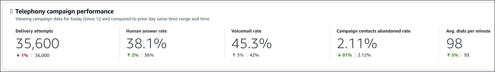

The following image shows an example chart for an SMS campaign.

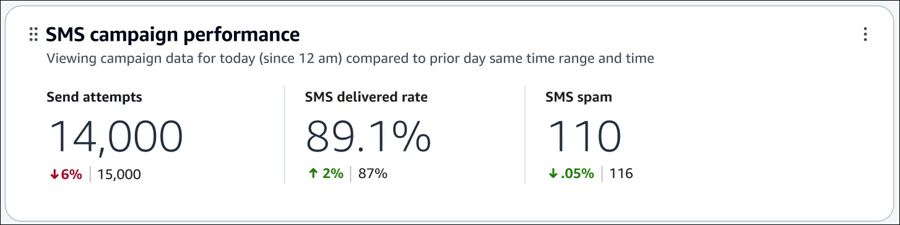

The following image shows an example chart for an email campaign.

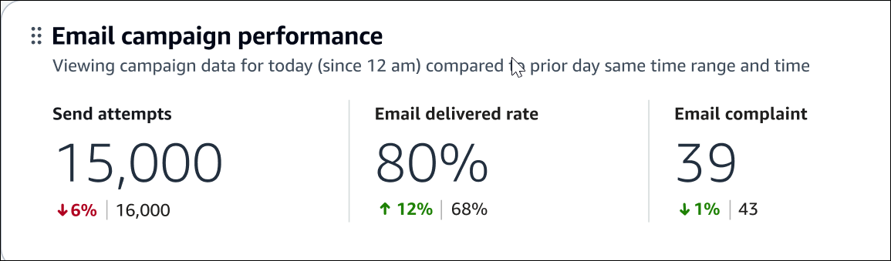

The following image shows an example chart for a WhatsApp campaign.

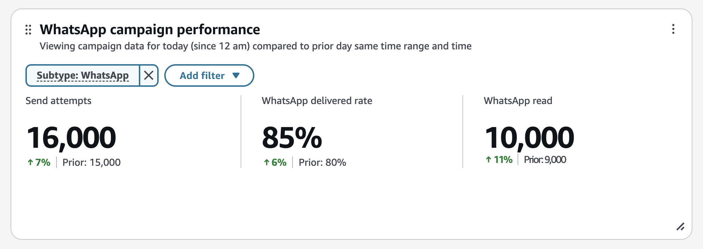

###### Note

The widget must be manually added to your dashboard. Refer to [Add or remove widgets on a dashboard](dashboard-customize-widgets.md#dashboard-add-widgets "dashboard-customize-widgets.md#dashboard-add-widgets"), then locate the `WhatsApp campaign performance` widget under the Campaign section.

The charts include the following metrics:

- **Delivery attempts**: The count of outbound campaign
  contacts dialed by the Amazon Connect dialer.
- **Human answer rate**: The count of outbound campaign
  calls that were connected to a live customer divided by total dials
  attempted. This metric is only available with answering machine detection
  enabled.
- Voicemail with beep rate: The count of outbound voice campaign contacts
  that were answered by a voicemail with a beep divided by total Dials
  attempted. This metric is only available with answering machine detection
  enabled.
- **Voicemail rate**: The count of outbound campaign calls
  that were answered by a voicemail divided by total dials attempted. This
  metric is only available with answering machine detection enabled.
- **Campaign contacts abandoned after 2 seconds rate**: The
  percentage of outbound campaign calls that were connected to a live customer
  but did not get connected to an agent within 2 seconds, divided by the count
  of outbound campaign calls that were connected to a live customer. This
  metric is only available with answering machine detection enabled.
- **Avg. dials per minute**: The average of outbound
  campaign contacts dialed per minute by the Amazon Connect dialer.
- **Send attempts**: The count of outbound campaign send
  requests sent by Amazon Connect for delivery. A campaign send request represents an
  attempt made to reach out to an recipient by email, SMS, or a telephony
  dial.
- **Delivered rate**: The percentage of delivered and
  successful messages over the total number of outbound campaign send
  attempts.
- **Spam**: The count of SMS messages identified as spam by
  the mobile carrier.
- **Complaint**: The count of email messages reported as
  spam or unsolicited email by the recipients.

###### Note

By default, data for deleted campaigns won't appear in the dashboard. The
Performance overview chart includes data from deleted campaigns when there is no
campaign filter selected. You can apply a campaign filter to filter out deleted
campaign data.

## Campaign progress over time

chart

The Campaign progress chart is a time-series chart that displays the
Dials attempted metric per campaign over a specific time
period broken down by intervals (15min, daily, weekly, monthly).

To configure different time range intervals, choose **Interval**,
as shown in the following image.

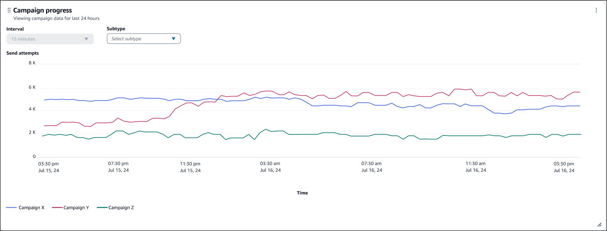

The available intervals depend on the page-level time range filter at the top of
the page. For example:

- If you have a **Trailing** time range filter at the top
  of your dashboard, you can only see an interval of 15min for the last 24
  hours.
- If you have a **Day** time range filter at the top of
  your dashboard, you can see a trailing 8 day interval trend, or a 15min
  interval trend for the trailing 24 hours.

You can use the Subtype filter to select the type of campaign delivery mode you
want to track. This filter applies only to the widget.

This widget holds up to 5 campaigns sorted in alphabetical order. If you are
filtering for more than 5 campaigns, additional campaigns will not display in the
visualization. You can select specific campaign(s) you want to see in this visual by
using the campaign filter.

## Campaign progress comparison

chart

The Campaign progress comparison chart shows the Send attempts metric in its
current period broken down by campaign, compared to the Prior send attempted metric
from the "compare to" benchmark time range selected. You can use the Subtype filter
to select the type of campaign delivery mode you want to track. This filter applies
only to the widget. This chart is sorted by Send attempts in descending order from
left to right.

This widget holds up to 10 campaigns. If you are filtering for more than 10
campaigns, additional campaigns will not display in the visualization. You can
select specific campaign(s) you want to see in this visual by using the campaign
filter.

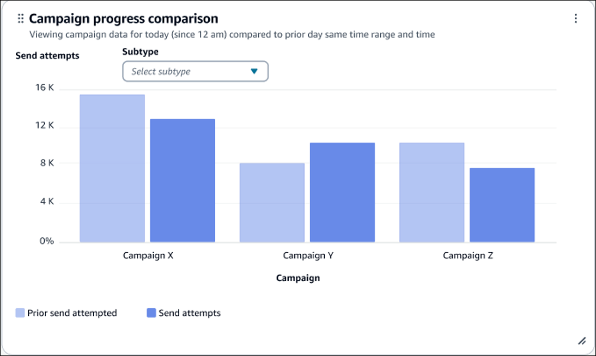

## Delivery classification stacked bar

charts

The Telephony, SMS, Email, and WhatsApp classification by campaign charts drill down into
the delivery outcomes of each delivery attempt for each campaign delivery mode. The
charts show the count of each delivery classification across a campaign.

### Telephony classification

stacked bar chart

This chart shows the telephony classifications that include the following AMD
(Answering Machine Detection) statuses:

- Human answered
- Voicemail with beep
- Voicemail with no beep
- AMD unanswered
- AMD unresolved
- AMD not applicable
- Any remaining classifications grouped under Other

For the full list of available telephony classifications, see DisconnectReason
for outbound campaigns and AnsweringMachineDetectionStatus in the [ContactTraceRecord](ctr-data-model.md#ctr-ContactTraceRecord "ctr-data-model.md#ctr-ContactTraceRecord").
This chart is most effective with [answering
machine detection enabled](outbound-campaign-best-practices.md#machine-detection-oc "outbound-campaign-best-practices.md#machine-detection-oc").

The following image shows a sample Telephony classification stacked bar
chart.

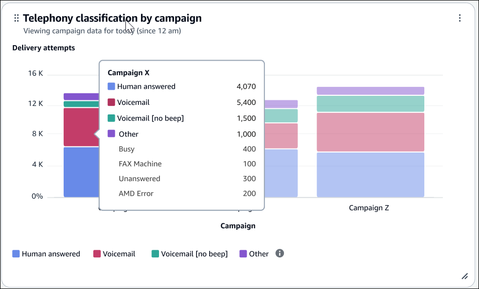

### SMS classification stacked bar

chart

This chart shows the following delivery outcomes:

- Delivered
- Successful
- Invalid
- Any remaining classifications—such as Invalid message, Blocked,
  and Spam—are grouped under Other.

For the full list of available SMS events, see
`campaign_event_type` in the [Outbound campaign events](data-lake-outbound-campaigns-data.md#data-lake-oc-events "data-lake-outbound-campaigns-data.md#data-lake-oc-events") table.

The following image shows a sample SMS classification stacked bar
chart.

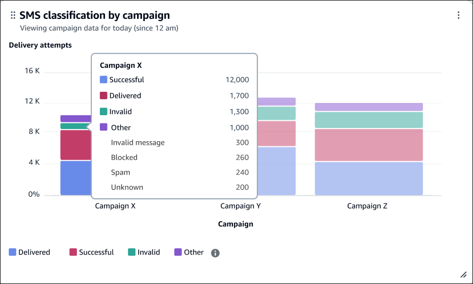

### Email classification stacked bar

chart

The Email classifications displayed include the following delivery
outcomes:

- Delivered
- Bounce
- Reject
- any remaining classifications grouped under Other

For the full list of available email events, see
`campaign_event_type` in the [Outbound campaign events](data-lake-outbound-campaigns-data.md#data-lake-oc-events "data-lake-outbound-campaigns-data.md#data-lake-oc-events") table.

The following image shows a sample Email classification stacked bar
chart.

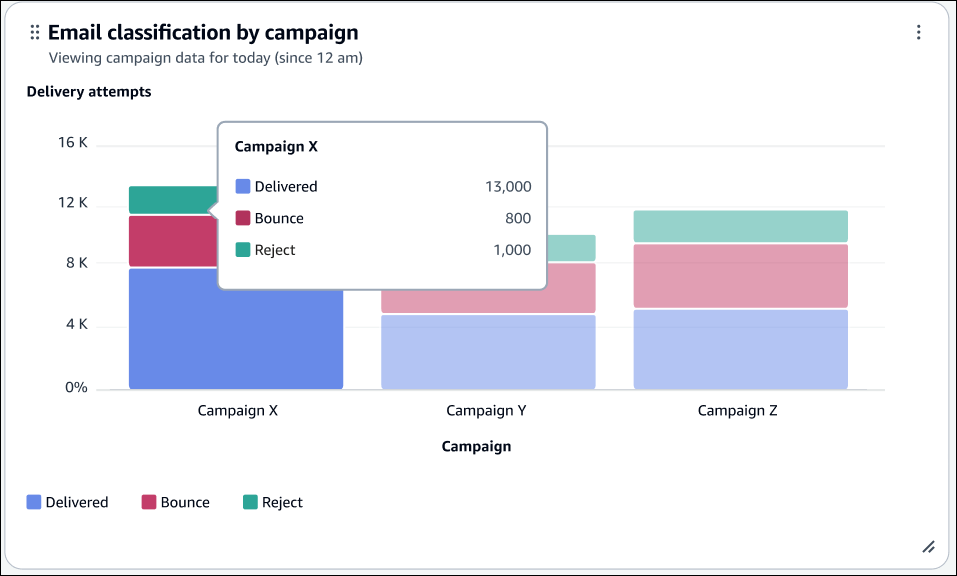

### WhatsApp classification stacked bar chart

The WhatsApp classifications displayed include the following delivery outcomes:

- Delivered
- Failed
- Any remaining classifications grouped under Other

For the full list of available WhatsApp events, see `campaign_event_type` in the [Outbound campaign events](data-lake-outbound-campaigns-data.md#data-lake-oc-events "data-lake-outbound-campaigns-data.md#data-lake-oc-events") table.

The following image shows a sample WhatsApp classification stacked bar chart.

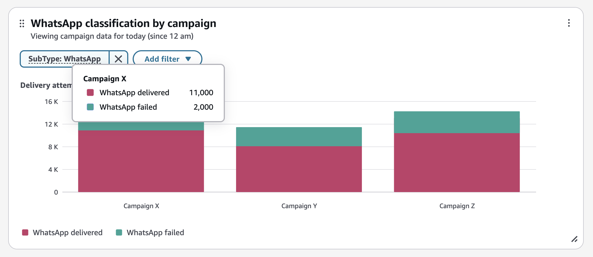

###### Note

The widget must be manually added to your dashboard. Refer to [Add or remove widgets on a dashboard](dashboard-customize-widgets.md#dashboard-add-widgets "dashboard-customize-widgets.md#dashboard-add-widgets"), then locate the `WhatsApp classification by campaign` widget under the Campaign section.

## Campaign metrics by recipients

table

A detailed view of recipient-level outbound campaigns metrics over the selected
time range, with drill-down capabilities to view metrics for individual campaign
executions.

Metrics include:

- Recipients targeted: The count of outbound campaign recipients identified
  as the target audience for the campaign.
- Recipients attempted: An approximate count of outbound campaign recipients
  attempted for delivery.
- Campaign progress rate: The percent of outbound campaign recipients
  attempted for delivery, out of total number of recipients targeted.
- Recipients interacted: The approximate count of outbound campaign
  recipients who interacted with the engagement after a successful delivery
  attempt. Example interactions include: Open, Click, Complaint

###### Note

Campaign execution breakdown is only available for segment-based campaigns. If
removed from the grouping, it must be re-added through a new table.

## Campaign send exclusions

breakdown

A detailed view of campaign send exclusions, including reasons why outbound
engagements were excluded from sending.

Metrics include:

- Campaign send exclusion: The count of outbound campaign send attempts that
  were excluded from the targeted segment during a campaign execution. Example
  exclusion reasons include: MISSING_TIMEZONE, MISSING_CHANNEL

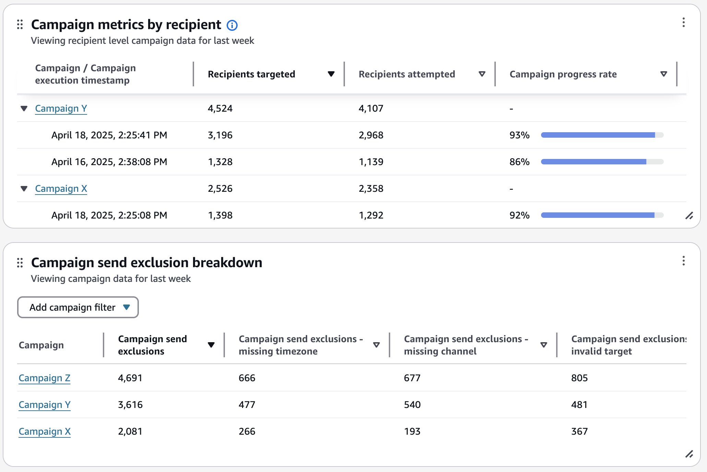

## Campaign metrics table

A detailed view of outbound campaigns metrics aggregated over the selected time
range.

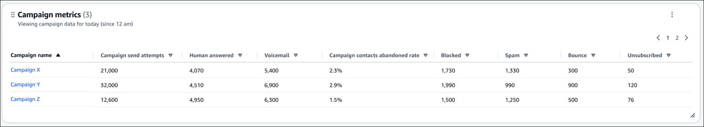

This table includes the following metrics.

- **Campaign send attempts**: The count of outbound
  campaign send requests sent by Amazon Connect for delivery. A campaign send request
  represents an attempt made to reach out to an recipient using email, SMS, or
  a telephony dial.
- **Human answered**: The count of outbound campaign calls
  that were connected to a live customer. This metric is only available with
  answering machine detection enabled.
- **Voicemail**: The count of outbound campaign calls that
  reached a voicemail. This metric is only available with answering machine
  detection enabled.
- Voicemail with beep: The count of outbound voice campaign contacts that
  reached a voicemail with beep. This metric is only available with answering
  machine detection enabled.
- Voicemail with no beep: The count of outbound voice campaign contacts that
  reached a voicemail with no beep. This metric is only available with
  answering machine detection enabled.
- Campaign contacts abandoned after 2 seconds: The count of outbound voice
  campaign contacts that were connected to a human but did not get connected
  to an agent within 2 seconds. This metric is only available with answering
  machine detection enabled.
- Avg. dials per minute: The average of outbound voice campaign contacts
  dialed per minute by the Amazon Connect voice dialer within the selected time range
  filter.
- **Campaign contacts abandoned after 2 seconds**: The
  count of outbound voice campaign calls that were connected to a human but
  did not get connected to an agent within 2 seconds. This metric is only
  available with answering machine detection enabled.
- **SMS successful**: The count of SMS messages
  successfully accepted by the recipient's carrier.
- **SMS delivered**: The count of SMS messages delivered to
  the specified location.
- **SMS delivered total**: The total count of SMS messages
  delivered to the specified location and successfully accepted by the
  recipient's carrier. Whether a message results in a "delivered" or a
  "successfully" outcome depends on the country where the delivery is taking
  place. It is not possible to have both a delivered and successfully outcome
  for the same message.
- **SMS spam**: The count of sms messages identified as
  spam by the mobile carrier.
- **WhatsApp delivered**: The count of WhatsApp messages delivered.
- **Read**: The count of WhatsApp messages opened by the recipients.
- **Email delivered**: The count of email messages
  delivered.
- **Email complaint**: The count of email messages reported
  as spam or unsolicited email by the recipients.
- **Email rejected**: The count of email messages with
  malware detected and got rejected.
- **Email opened**: The total number of times the email
  message was opened.
- **Email unique opened**: The number of unique recipients
  who opened the email message.
- **Email clicked**: The total number of times the email
  message was clicked.
- **Email unique clicked**: The number of unique recipients
  who clicked the email message.

## Dashboard

functionality limitations

The following limitations apply to the Outbound campaigns performance
dashboard:

- Tag-based access controls are not currently supported by the dashboard.
  You can restrict access through the Dashboard permissions pertaining to a
  security profile.
- Data for this dashboard is available starting from June 25, 2024 0:00:00
  GMT for the Telephony delivery mode and November 6, 2024 0:00:00 GMT for the
  Email and SMS delivery modes. This may impact dashboard functionalities such
  as monthly benchmarks where data won't be available prior to June 25, 2024
  0:00:00 GMT or November 6, 2024 0:00:00 GMT for comparison.
- Saved reports before November 6, 2024 0:00:00 GMT could contain stale data
  due to newly added feature enhancements. To ensure you have accurate data
  from the latest features, we recommend replacing any saved dashboards with
  the most recent version of the Outbound campaigns performance
  dashboard.
