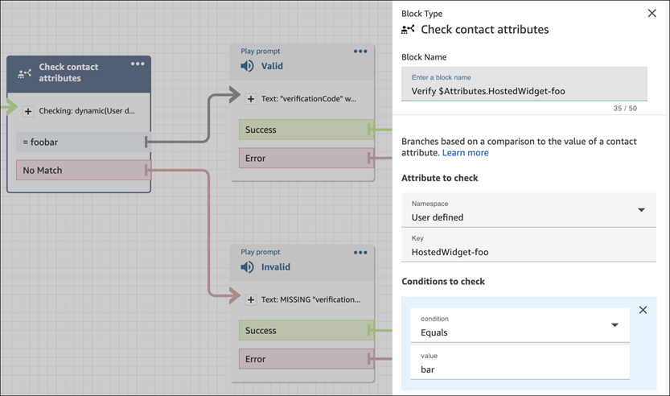
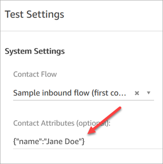

# Pass contact attributes to an agent in

the Contact Control Panel (CCP) when a chat starts

You can use [contact attributes](what-is-a-contact-attribute.md "what-is-a-contact-attribute.md") to
capture information about the contact who is using the communications widget. Then, you can
display that information to the agent through the Contact Control Panel (CCP), or use it
elsewhere in the flow.

For example, you can customize your flow to say the name of the customer in your
welcome message. Or, you can use attributes specific to your business, such as
account/member IDs, customer identifiers like names and emails, or other metadata
associated with a contact.

## How to pass contact

attributes into the communications widget

1. Enable security in the communications widget as described in [Add a chat user interface to your website hosted by
   Amazon Connect](add-chat-to-website.md "add-chat-to-website.md"), if
   you haven't already:
   1. In Step 2, under **Add security for your chat
      widget**, choose **Yes**.
   2. In Step 3, use the security key to generate JSON web
      tokens.

2. Add the contact attributes to the payload of your JWT as an
   `attributes` claim.

Following is an example of how you might generate a JWT with contact
attributes in Python:

###### Note

JWT should be installed as a prerequisite. To install it, run
`pip install PyJWT` in your terminal.

```
import jwt
import datetime
CONNECT_SECRET = "`your-securely-stored-jwt-secret`"
WIDGET_ID = "widget-id"
JWT_EXP_DELTA_SECONDS = 500

payload = {
'sub': WIDGET_ID,
'iat': datetime.datetime.utcnow(),
'exp': datetime.datetime.utcnow() + datetime.timedelta(seconds=JWT_EXP_DELTA_SECONDS),
'segmentAttributes': {"connect:Subtype": {"ValueString" : "connect:Guide"}}, 'attributes': {"name": "Jane", "memberID": "123456789", "email": "Jane@example.com", "isPremiumUser": "true", "age": "45"} }
header = { 'typ': "JWT", 'alg': 'HS256' }
encoded_token = jwt.encode((payload), CONNECT_SECRET, algorithm="HS256", headers=header) // CONNECT_SECRET is the security key provided by Amazon Connect


```

In the payload, you must create a string key `attributes`
(as-is, all lowercase), with an object as its value. That object must have
string-to-string key-value pairs. If anything other than a string is passed
in any one of the attributes, the chat will fail to start.

The contact attributes must follow the limitations set by the [StartChatContact](../APIReference/API_StartChatContact.md#connect-StartChatContact-request-Attributes "../APIReference/API_StartChatContact.md#connect-StartChatContact-request-Attributes") API:

    * Keys must have a minimum length of 1
    * Values can have a minimum length of 0

Optionally, you can add the segmentAttributes string to [SegmentAttributeValue](../APIReference/API_SegmentAttributeValue.md "../APIReference/API_SegmentAttributeValue.md") object map, in the payload. The attributes are
standard Amazon Connect attributes. They can be accessed in flows. The contact
attributes must follow the limitations set by the [StartChatContact](../APIReference/API_StartChatContact.md#connect-StartChatContact-request-SegmentAttributes "../APIReference/API_StartChatContact.md#connect-StartChatContact-request-SegmentAttributes") API.

## Alternative method: Pass contact

attributes directly from snippet code

###### Note

- The snippet code prepends `HostedWidget-` to all the
  contact attribute keys that it passes. In the following example, the
  agent side will see the key value pair `HostedWidget-foo:
'bar'`.
- Although these attributes are scoped with the
  `HostedWidget-` prefix, they are still mutable
  client-site. Use the JWT setup if you require PII or immutable data in
  your flow.

The following example shows how to pass contact attributes directly from snippet
code without enabling widget security.

```
<script type="text/javascript">
  (function(w, d, x, id){ /* ... */ })(window, document, 'amazon_connect', '`widgetId`');
  amazon_connect('snippetId', '`snippetId`');
  amazon_connect('styles', /* ... */);
  // ...

  amazon_connect('contactAttributes', {
   `foo`: '`bar`'
  })
<script/>
```

### Using the attributes in flows

The [Check contact attributes](check-contact-attributes.md "check-contact-attributes.md")
flow block provides access to these attributes by using the **User
defined** namespace, as shown in the following image. You can use
the flow block to add branching logic. The full path is
`$.Attributes.HostedWidget-`attributeName``.



## Things you need to

know

- The communications widget has a 6144 bytes limit for the entire encoded token.
  Because JavaScript uses UTF-16 encoding, 2 bytes are used per character, so
  the maximum size of the `encoded_token` should be around 3000
  characters.
- The encoded_token should be passed in to `callback(data)`. The
  `authenticate` snippet does not need any additional changes.
  For example:

```
amazon_connect('authenticate', function(callback) {
  window.fetch('/token').then(res => {
    res.json().then(data => {
      callback(data.data);
    });
  });
});
```

- Using a JWT to pass contact attributes ensures the integrity of the data.
  If you safeguard the shared secret and follow appropriate security
  practices, you can help ensure that the data cannot be manipulated by a bad
  actor.
- Contact attributes are only encoded in the JWT, not encrypted, so it's
  possible to decode and read the attributes.
- If you want to test the chat experience with the [simulated chat experience](chat-testing.md#test-chat "chat-testing.md#test-chat") and include contact attributes, be
  sure to enclose both the key and value in quotes, as shown in the following
  image.


