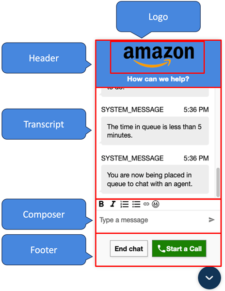

# Pass custom properties to override the defaults in

the communications widget in Amazon Connect

To further customize your chat user interface, you can override the default properties
by passing your own values. For example, you can set the widget width to 400 pixels and
the height to 700 pixels (in contrast to the default size of 300 pixels by 540 pixels).
You can also use your preferred font colors and sizes.

## How to pass custom styles for the

communications widget

To pass custom styles, use the following example code block and embed it in your
widget. Amazon Connect retrieves the custom styles automatically. All of the
fields shown in the following example are optional.

```
amazon_connect('customStyles', {
 global: {
     frameWidth: '400px',
     frameHeight: '700px',
     textColor: '#fe3251',
     fontSize: '20px',
     footerHeight: '120px',
     typeface: "'AmazonEmber-Light', serif",
     customTypefaceStylesheetUrl: "https://ds6yc8t7pnx74.cloudfront.net/etc.clientlibs/developer-portal/clientlibs/main/css/resources/fonts/AmazonEmber_Lt.ttf",
     headerHeight: '120px',
 },
 header: {
     headerTextColor: '#541218',
     headerBackgroundColor: '#fe3',
 },
 transcript: {
     messageFontSize: '13px',
     messageTextColor: '#fe3',
     widgetBackgroundColor: '#964950',
     agentMessageTextColor: '#ef18d3',
     systemMessageTextColor: '#ef18d3',
     customerMessageTextColor: '#ef18d3',
     agentChatBubbleColor: '#111112',
     systemChatBubbleColor: '#111112',
     customerChatBubbleColor: '#0e80f2',
 },
 footer: {
     buttonFontSize: '20px',
     buttonTextColor: '#ef18d3',
     buttonBorderColor: '#964950',
     buttonholer: '#964950',
     buttonBackgroundColor: '#964950',
     backgroundColor: '#964950',
     footerBackgroundColor: '#0e80f2',
     backgroundColor: '#0e80f2',
     startCallButtonTextColor: '#541218',
     startChatButtonBorderColor: '#fe3',
     startCallButtonBackgroundColor: '#fe3',
 },
 logo: {
     logoMaxHeight: '61px',
     logoMaxWidth: '99%',
 },
  composer: {
     fontSize: '20px',
 },
  fullscreenMode: true // Enables fullscreen mode on the widget when a mobile screen size is detected in a web browser.
})
```

## Supported styles and

constraints

The following table lists the supported custom style names and recommended value
constraints. Some styles exist at both the global and component levels. For example,
the `fontSize` style exists globally and in the transcript component.
Component level styles have higher priority and will be honored on the chat
widget.

| Custom style name                       | Description                                                                                   | Recommended constraints                                                                                                                                                                                                                                                                                                                                                                                                                                                                                                                                                                                                        |
| --------------------------------------- | --------------------------------------------------------------------------------------------- | ------------------------------------------------------------------------------------------------------------------------------------------------------------------------------------------------------------------------------------------------------------------------------------------------------------------------------------------------------------------------------------------------------------------------------------------------------------------------------------------------------------------------------------------------------------------------------------------------------------------------------ | -------------------------------------------------------------------------------------------------------------------------------------------------------------------------------------------------------------------------------------------------------------------------------------------------------------------------------------------------------------------------------------------------------------------------------------------------------------------------------------------------------------------------------------------------------------------------------------------------------------------------------------------------------------------------------------------------------------------------------------------------------------------------------------------------------------------------------------------------------------------------------------------------------------------------------------------------------------------------------------------------------------------------------------------------------------------------------- |
| `global.frameWidth`                     | Width of the entire widget frame                                                              | Minimum: 300 pixels Maximum: Window width Recommended to adjust based on window size                                                                                                                                                                                                                                                                                                                                                                                                                                                                                                                                           |
| `global.frameHeight`                    | height of the entire widget frame                                                             | Minimum: 480 pixels Maximum: Window height Recommended to adjust based on window size                                                                                                                                                                                                                                                                                                                                                                                                                                                                                                                                          |
| `global.textColor`                      | Color for all texts                                                                           | Any CSS legal color value. For more information, see [CSS Legal Color Values](https://www.w3schools.com/cssref/css_colors_legal.php "https://www.w3schools.com/cssref/css_colors_legal.php").                                                                                                                                                                                                                                                                                                                                                                                                                                  |
| `global.fontSize`                       | Font size for all texts                                                                       | Recommended 12 pixels to 20 pixels for different use cases                                                                                                                                                                                                                                                                                                                                                                                                                                                                                                                                                                     |
| `global.footerHeight`                   | Height of the widget footer                                                                   | Minimum: 50 pixels Maximum: Frame height Recommended to adjust based on frame size                                                                                                                                                                                                                                                                                                                                                                                                                                                                                                                                             |
| `global.typeface`                       | The typeface used in the widget.                                                              | Any typeface from this list: Arial, Times New Roman, Times, Courier New, Courier, Verdana, Georgia, Palatino, Garamond, Book man, Tacoma, Trebuches MS, Arial Black, Impact, Comic Sans MS. You can also add a custom typeface/font-family but you need to host the typeface file with public Read access. For example, you can view the documentation to use Amazon Ember font family in the [Amazon developer library](https://developer.amazon.com/en-US/alexa/branding/echo-guidelines/identity-guidelines/typography "https://developer.amazon.com/en-US/alexa/branding/echo-guidelines/identity-guidelines/typography"). |
| `global.customTypefaceStylesheetUrl`    | Location where the custom typeface file is hosted with public Read access.                    | Link to the public HTTP location where typeface file is hosted. For example, AmazonEmber Light typeface CDN location is `https://ds6yc8t7pnx74.cloudfront.net/etc.clientlibs/developer-portal/clientlibs/main/css/resources/fonts/AmazonEmber_Lt.ttf`                                                                                                                                                                                                                                                                                                                                                                          |
| `header.headerTextColor`                | Text color for the header message                                                             | Any CSS legal color value. For more information, see [CSS Legal Color Values](https://www.w3schools.com/cssref/css_colors_legal.php "https://www.w3schools.com/cssref/css_colors_legal.php").                                                                                                                                                                                                                                                                                                                                                                                                                                  |
| `header.headerBackgroundColor`          | Text color for header background                                                              | Any CSS legal color value. For more information, see [CSS Legal Color Values](https://www.w3schools.com/cssref/css_colors_legal.php "https://www.w3schools.com/cssref/css_colors_legal.php").                                                                                                                                                                                                                                                                                                                                                                                                                                  |
| `global.headerHeight`                   | Height of the widget header                                                                   | Recommended to adjust based on using title or image logo or both.                                                                                                                                                                                                                                                                                                                                                                                                                                                                                                                                                              |
| `transcript.messageFontSize`            | Font size for all texts                                                                       | Recommended 12 pixels to 20 pixels for different use cases                                                                                                                                                                                                                                                                                                                                                                                                                                                                                                                                                                     |
| `transcript.messageTextColor`           | Text color for transcript messages                                                            | Any CSS legal color value. For more information, see [CSS Legal Color Values](https://www.w3schools.com/cssref/css_colors_legal.php "https://www.w3schools.com/cssref/css_colors_legal.php").                                                                                                                                                                                                                                                                                                                                                                                                                                  |
| `transcript.widgetBackgroundColor`      | Text color for transcript background                                                          | Any CSS legal color value. For more information, see [CSS Legal Color Values](https://www.w3schools.com/cssref/css_colors_legal.php "https://www.w3schools.com/cssref/css_colors_legal.php").                                                                                                                                                                                                                                                                                                                                                                                                                                  |
| `transcript.customerMessageTextColor`   | Text color for customer messages                                                              | Any CSS legal color value. For more information, see [CSS Legal Color Values](https://www.w3schools.com/cssref/css_colors_legal.php "https://www.w3schools.com/cssref/css_colors_legal.php").                                                                                                                                                                                                                                                                                                                                                                                                                                  |
| `transcript.agentMessageTextColor`      | Text color for agent messages                                                                 | Any CSS legal color value. For more information, see [CSS Legal Color Values](https://www.w3schools.com/cssref/css_colors_legal.php "https://www.w3schools.com/cssref/css_colors_legal.php").                                                                                                                                                                                                                                                                                                                                                                                                                                  |
| `transcript.systemMessageTextColor`     | Text color for system messages                                                                | Any CSS legal color value. For more information, see [CSS Legal Color Values](https://www.w3schools.com/cssref/css_colors_legal.php "https://www.w3schools.com/cssref/css_colors_legal.php").                                                                                                                                                                                                                                                                                                                                                                                                                                  |
| `transcript.agentChatBubbleColor`       | Background color for agent message bubbles                                                    | Any CSS legal color value. For more information, see [CSS Legal Color Values](https://www.w3schools.com/cssref/css_colors_legal.php "https://www.w3schools.com/cssref/css_colors_legal.php").                                                                                                                                                                                                                                                                                                                                                                                                                                  |
| `transcript.customerChatBubbleColor`    | Background color for customer message bubbles                                                 | Any CSS legal color value. For more information, see [CSS Legal Color Values](https://www.w3schools.com/cssref/css_colors_legal.php "https://www.w3schools.com/cssref/css_colors_legal.php").                                                                                                                                                                                                                                                                                                                                                                                                                                  |
| `transcript.systemChatBubbleColor`      | Background color for system message bubbles                                                   | Any CSS legal color value. For more information, see [CSS Legal Color Values](https://www.w3schools.com/cssref/css_colors_legal.php "https://www.w3schools.com/cssref/css_colors_legal.php").                                                                                                                                                                                                                                                                                                                                                                                                                                  |
| `footer.buttonFontSize`                 | Font size for the action button text                                                          | Recommended to adjust based on footer height                                                                                                                                                                                                                                                                                                                                                                                                                                                                                                                                                                                   |
| `footer.buttonTextColor`                | Color for the action button text                                                              | Any CSS legal color value. For more information, see [CSS Legal Color Values](https://www.w3schools.com/cssref/css_colors_legal.php "https://www.w3schools.com/cssref/css_colors_legal.php").                                                                                                                                                                                                                                                                                                                                                                                                                                  |
| `footer.buttonBorderColor`              | Color for the action button border                                                            | Any CSS legal color value. For more information, see [CSS Legal Color Values](https://www.w3schools.com/cssref/css_colors_legal.php "https://www.w3schools.com/cssref/css_colors_legal.php").                                                                                                                                                                                                                                                                                                                                                                                                                                  |
| `footer.buttonBackgroundColor`          | Color for the action button background                                                        | Any CSS legal color value. For more information, see [CSS Legal Color Values](https://www.w3schools.com/cssref/css_colors_legal.php "https://www.w3schools.com/cssref/css_colors_legal.php").                                                                                                                                                                                                                                                                                                                                                                                                                                  |
| `footer.BackgroundColor`                | Color for the footer background                                                               | Any CSS legal color value. For more information, see [CSS Legal Color Values](https://www.w3schools.com/cssref/css_colors_legal.php "https://www.w3schools.com/cssref/css_colors_legal.php").                                                                                                                                                                                                                                                                                                                                                                                                                                  |
| `footer.startCallButtonTextColor`       | Color for the start call button text                                                          | Any CSS legal color value. For more information, see [CSS Legal Color Values](https://www.w3schools.com/cssref/css_colors_legal.php "https://www.w3schools.com/cssref/css_colors_legal.php").                                                                                                                                                                                                                                                                                                                                                                                                                                  |
| `footer.startCallButtonBorderColor`     | Color for the start call button border                                                        | Any CSS legal color value. For more information, see [CSS Legal Color Values](https://www.w3schools.com/cssref/css_colors_legal.php "https://www.w3schools.com/cssref/css_colors_legal.php").                                                                                                                                                                                                                                                                                                                                                                                                                                  |
| `footer.startCallButtonBackgroundColor` | Color for the start call button background                                                    | Any CSS legal color value. For more information, see [CSS Legal Color Values](https://www.w3schools.com/cssref/css_colors_legal.php "https://www.w3schools.com/cssref/css_colors_legal.php").                                                                                                                                                                                                                                                                                                                                                                                                                                  |
| `logo.logoMaxHeight`                    | Max height of the logo                                                                        | Minimum: 0 pixels Maximum: Header height Recommended to adjust based on image size and frame height                                                                                                                                                                                                                                                                                                                                                                                                                                                                                                                            |
| `logo.logoMaxWidth`                     | Max width of the logo                                                                         | Minimum: 0 pixels Maximum: Header width Recommended to adjust based on image size and frame width                                                                                                                                                                                                                                                                                                                                                                                                                                                                                                                              |
| `composer.fontSize`                     | Font size for the composer text                                                               | Recommended 12 pixels to 20 pixels for different use cases                                                                                                                                                                                                                                                                                                                                                                                                                                                                                                                                                                     |
| `fullscreenMode`                        | Enables fullscreen mode on the widget when a mobile screen size is detected in a web browser. | type: boolean                                                                                                                                                                                                                                                                                                                                                                                                                                                                                                                                                                                                                  | Following are the elements that make up the communications widget.  ## How to pass override system and bot display names and logos for the communications widget To override the System/Bot display name and logo configurations set in the Amazon Connect admin website, embed the following code block into your widget code snippet. All of the fields shown in the following example are optional. ``amazon_connect('customDisplayNames', { header: { headerMessage: "`Welcome!`", logoUrl: "`https://example.com/abc.png`", logoAltText: "`Amazon Logo Banner`" }, transcript: { systemMessageDisplayName: "`Amazon System`", botMessageDisplayName: "`Alexa`" }, footer: { textInputPlaceholder: "`Type Here!`", endChatButtonText: "`End Session`", closeChatButtonText: "`Close Chat`", startCallButtonText: "`Start Call`" }, })`` ### Supported properties and constraints                                                                                                          |
| Custom style name                       | Description                                                                                   | Recommended constraints                                                                                                                                                                                                                                                                                                                                                                                                                                                                                                                                                                                                        |
| ---                                     | ---                                                                                           | ---                                                                                                                                                                                                                                                                                                                                                                                                                                                                                                                                                                                                                            |
| `header.headerMessage`                  | Text for the header message                                                                   | Minimum length: 1 character Maximum length: 11 characters Recommended to adjust based on header width                                                                                                                                                                                                                                                                                                                                                                                                                                                                                                                          |
| `header.logoUrl`                        | URL pointing to the logo image                                                                | Maximum length: 2048 characters Must be a valid URL pointing to a .png, .jpg or .svg file                                                                                                                                                                                                                                                                                                                                                                                                                                                                                                                                      |
| `header.logoAltText`                    | Text to override the `alt` attribute for the logo banner                                      | Maximum length: 2048 characters                                                                                                                                                                                                                                                                                                                                                                                                                                                                                                                                                                                                |
| `transcript.systemMessageDisplayName`   | Text to override `SYSTEM_MESSAGE` display name                                                | Minimum length: 1 character Maximum length: 26 characters                                                                                                                                                                                                                                                                                                                                                                                                                                                                                                                                                                      |
| `transcript.botMessageDisplayName`      | Text to override BOT display name                                                             | Minimum length: 1 character Maximum length: 26 characters                                                                                                                                                                                                                                                                                                                                                                                                                                                                                                                                                                      |
| `footer.textInputPlaceholder`           | Text to override placeholder in text input                                                    | Minimum length: 1 character Maximum length: 256 characters                                                                                                                                                                                                                                                                                                                                                                                                                                                                                                                                                                     |
| `footer.endChatButtonText`              | Text to override end chat button text                                                         | Minimum length: 1 character Maximum length: 256 characters Recommended to adjust based on button width                                                                                                                                                                                                                                                                                                                                                                                                                                                                                                                         |
| `footer.closeChatButtonText`            | Text to override close chat button text                                                       | Minimum length: 1 character Maximum length: 256 characters Recommended to adjust based on button width                                                                                                                                                                                                                                                                                                                                                                                                                                                                                                                         |
| `footer.startCallButtonText`            | Text to override start call button text                                                       | Minimum length: 1 character Maximum length: 256 characters Recommended to adjust based on button width                                                                                                                                                                                                                                                                                                                                                                                                                                                                                                                         | ## Preview your communications widget with custom properties Make sure to preview your communications widget with the custom properties before putting it into production. Custom values can break the communications widget user interface if not set properly. We recommend testing it on different browsers and devices before releasing it to your customers. Following are a few examples of things that might break when improper values are used and the suggested fixes. <br>• **Issue:** The widget window takes up too much of the screen. **Fix:** Use a smaller `frameWidth` and `frameHeight`. <br>• **Issue:** The font size is too small or too large. **Fix:** Adjust the font size. <br>• **Issue:** There is a blank area below end chat (footer). **Fix:** Use a smaller `frameHeight` or a larger `footerHeight`. <br>• **Issue:** The end chat button is too small or too big. **Fix:** Adjust `buttonFontSize`. <br>• **Issue:** The end chat button is going outside the footer area. **Fix:** Use a larger `footerHeight` or a smaller `buttonFontSize`. |
