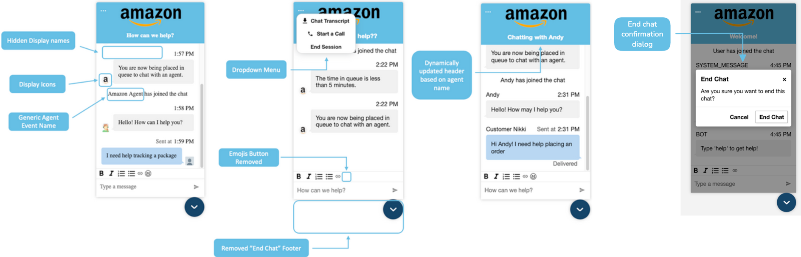

# Additional customizations for your Amazon Connect

chat widget

You can add the following optional customizations to your chat user interface:

- Display the **End chat** button in the header dropdown menu
  instead of in the footer.
- Mask or hide display names.
- Add message icons.
- Override event messages.
- Configure a confirmation dialog that will be presented to customers when they
  choose the **End chat** button. This dialog verifies that
  customers intend to actually end the chat session. You can customize the
  confirmation dialog, title, message, and button text.
- Override the attachment rejection message.

## Configure the customization

object

This example shows how to implement some of the optional customizations. For a
list of all possible customizations, see [Supported options and
constraints](#customization-options-constraints "#customization-options-constraints"). Because these
customizations are optional, you can implement some or all of the fields shown in
the following example. Replace the `eventNames.customer`,
`eventNames.agent`, `eventNames.supervisor`,
`eventMessages.participantJoined`,
`eventMessages.participantDisconnect`,
`eventMessages.participantLeft`,
`eventMessages.participantIdle`,
`eventMessages.participantReturned`, and
`eventMessages.chatEnded` strings as needed. Icons must be hosted on
public URLs.

```
amazon_connect('customizationObject', {
        header: {
            dropdown: true,
            dynamicHeader: true,
        },
        transcript: {
            hideDisplayNames: false,
            eventNames: {
                customer: "`User`",
                agent: "`Webchat Agent`",
                supervisor: "`Webchat Supervisor`"
            },
            eventMessages: {
                participantJoined: "{name} has joined the chat",
                participantDisconnect: "",
                participantLeft: "{name} has dropped",
                participantIdle: "{name}, are you still there?",
                participantReturned: "",
                chatEnded: "Chat ended",
            },
            displayIcons: true,
            iconSources: {
                botMessage: "`imageURL`",
                systemMessage: "`imageURL`",
                agentMessage: "`imageURL`",
                customerMessage: "`imageURL`",
            },
        },
        composer: {
            disableEmojiPicker: true,
            disableCustomerAttachments: true,
            alwaysHideToolbar: true,
        },
        footer: {
            disabled:true,
            skipCloseChatButton: true,
        },
        endChat: {
            enableConfirmationDialog: true,
            confirmationDialogText: {
                title: "End Chat",
                message: "Are you sure you want to end this chat?",
                confirmButtonText: "End Chat",
                cancelButtonText: "Cancel",
        },
    },
    attachment: {
         // Default rejectedErrorMessage: Attachment was rejected.
        rejectedErrorMessage: "Custom Error Message: Files cannot exceed 15 MB." //this is customizable attribute
    }
});
```

The following image shows how the customizations look if you use the
example:



## Supported options and

constraints

The following table lists the supported customization fields and recommended value
constraints.

| Custom layout option                               | Type    | Description                                                                                                                                                                                                                                                                                                                                                                                          |
| -------------------------------------------------- | ------- | ---------------------------------------------------------------------------------------------------------------------------------------------------------------------------------------------------------------------------------------------------------------------------------------------------------------------------------------------------------------------------------------------------- |
| `header.dropdown`                                  | Boolean | Renders the header dropdown menu instead of the default<br>footer<br>NoteWhen you set this option to `true`, the<br>\*_Transcript download_<br>• button appears<br>and remains visible until you set the option to<br>`false`, or until you remove the<br>option.                                                                                                                                    |
| `header.dynamicHeader`                             | Boolean | Dynamically sets the header title to "Chatting with<br>Bot/AgentName".                                                                                                                                                                                                                                                                                                                               |
| `header.hideTranscriptDownloadButton`              | Boolean | Hide the [download<br>transcript](chat-widget-download-transcript.md "chat-widget-download-transcript.md") button in the header dropdown menu. The<br>default value is `false`.                                                                                                                                                                                                                      |
| `transcript.hideDisplayNames`                      | Boolean | Hides all display names, will apply default name masks if<br>`eventNames` is not provided.                                                                                                                                                                                                                                                                                                           |
| `transcript.eventNames.customer`                   | String  | Masks the display name of customer.                                                                                                                                                                                                                                                                                                                                                                  |
| `transcript.eventNames.agent`                      | String  | Masks the display name of agent.                                                                                                                                                                                                                                                                                                                                                                     |
| `transcript.eventNames.supervisor`                 | String  | Masks the display name of supervisor.                                                                                                                                                                                                                                                                                                                                                                |
| `transcript.eventMessages.participantJoined`       | String  | Overrides event message in the transcript for when a<br>participant has joined the chat. If an empty string is<br>specified, the event message will be omitted from the<br>transcript. `{name}` can be passed in the message,<br>and will be replaced with the display name of the corresponding<br>participant. The default message is `{name} has joined the<br>chat`.                             |
| `transcript.eventMessages.participantDisconnect`   | String  | Overrides event message in the transcript for when a<br>participant is disconnected from the chat. If an empty string is<br>specified, the event message will be omitted from the<br>transcript. `{name}` can be passed in the message,<br>and will be replaced with the display name of the corresponding<br>participant. The default message is {`name} has been idle<br>too long, disconnecting`. |
| `transcript.eventMessages.participantLeft`         | String  | Overrides event message in the transcript for when a<br>participant has left the chat. If an empty string is specified,<br>the event message will be omitted from the transcript.<br>`{name}` can be passed in the message, and will<br>be replaced with the display name of the corresponding<br>participant. The default message is `{name} has left the<br>chat`.                                 |
| `transcript.eventMessages.participantIdle`         | String  | Overrides event message in the transcript for when a<br>participant is idle. If an empty string is specified, the event<br>message will be omitted from the transcript. `{name}`<br>can be passed in the message, and will be replaced with the<br>display name of the corresponding participant. The default<br>message is `{name} has become idle`.                                                |
| `transcript.eventMessages.participantReturned`     | String  | Overrides event message in the transcript for when a<br>participant has returned to the chat. If an empty string is<br>specified, the event message will be omitted from the<br>transcript. `{name}` can be passed in the message,<br>and will be replaced with the display name of the corresponding<br>participant. The default message is `{name} has<br>returned`.                               |
| `transcript.eventMessages.chatEnded`               | String  | Overrides event message in the transcript for when the chat<br>has ended. If an empty string is specified, the event message<br>will be omitted from the transcript. `{name}` can be<br>passed in the message, and will be replaced with the display<br>name of the corresponding participant. The default message is<br>`Chat has ended!`                                                           |
| `transcript.displayIcons`                          | Boolean | Enables message display icons.                                                                                                                                                                                                                                                                                                                                                                       |
| `transcript.iconSources.botMessage`                | String  | Icon displayed for bot messages, must be hosted on a public<br>URL.                                                                                                                                                                                                                                                                                                                                  |
| `transcript.iconSources.systemMessage`             | String  | Icon displayed for system message, must be hosted on a public<br>URL.                                                                                                                                                                                                                                                                                                                                |
| `transcript.iconSources.agentMessage`              | String  | Icon displayed for agent message, must be hosted on a public<br>URL.                                                                                                                                                                                                                                                                                                                                 |
| `transcript.iconSources.customerMessage`           | String  | Icon displayed for customer message, must be hosted on a<br>public URL.                                                                                                                                                                                                                                                                                                                              |
| `composer.alwaysHideToolbar`                       | Boolean | Hides the formatting toolbar that includes text styling features such as Bold,<br>Italic, and both bulleted and numbered list options.                                                                                                                                                                                                                                                               |
| `composer.disableEmojiPicker`                      | Boolean | Disables the emoji picker when using the [rich text<br>editor.](enable-text-formatting-chat.md "enable-text-formatting-chat.md")                                                                                                                                                                                                                                                                     |
| `composer.disableCustomerAttachments`              | Boolean | Prevents customers from sending or uploading<br>attachments.                                                                                                                                                                                                                                                                                                                                         |
| `footer.disabled`                                  | Boolean | Hides the default footer and **End chat**<br>button.                                                                                                                                                                                                                                                                                                                                                 |
| `footer.skipCloseChatButton`                       | Boolean | Directly closes the widget on click of the **End<br>chat\*<br>• button instead of showing<br>**Close\*<br>• button.                                                                                                                                                                                                                                                                                  |
| `endChat.enableConfirmationDialog`                 | Boolean | Enables the End Chat confirmation dialog. Default texts are used<br>if `confirmationDialogText` is not provided.                                                                                                                                                                                                                                                                                     |
| `endChat.confirmationDialogText.title`             | String  | Overrides the title of End Chat confirmation dialog.                                                                                                                                                                                                                                                                                                                                                 |
| `endChat.confirmationDialogText.message`           | String  | Overrides the message of End Chat confirmation dialog.                                                                                                                                                                                                                                                                                                                                               |
| `endChat.confirmationDialogText.confirmButtonText` | String  | Overrides the confirm button text in End Chat confirmation<br>dialog.                                                                                                                                                                                                                                                                                                                                |
| `endChat.confirmationDialogText.cancelButtonText`  | String  | Overrides the cancel button text in End Chat confirmation<br>dialog.                                                                                                                                                                                                                                                                                                                                 |
| `attachment.rejectedErrorMessage`                  | String  | Overrides the error message for chat widget attachment<br>rejection.                                                                                                                                                                                                                                                                                                                                 |
