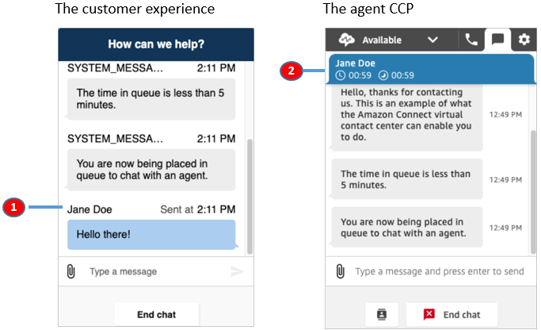

# Pass the customer display name when an Amazon Connect

chat starts

To deliver a more personalized experience for both your customers and agents, you can
customize the Amazon Connect communications widget to pass the customer display name during contact
initialization. The name is visible to both the customer and agent throughout the chat
interaction. This display name is recorded in the chat transcript.

The following images show the customer's display name in their chat experience, and
their name in the agent's CCP.



1. How the customer display name may appear to the customer using the chat user
   interface.
2. How the customer display name may appear to the agent using the CCP.

## How to pass a customer display name in the

communications widget

To pass a customer display name, implement your callback function in the snippet.
Amazon Connect retrieves the display name automatically.

1. Complete the steps in [Add a chat user interface to your website hosted by
   Amazon Connect](add-chat-to-website.md "add-chat-to-website.md"), if you haven't already.
2. Augment your existing widget snippet to add a
   `customerDisplayName` callback. It might look something like
   the following example:

```
amazon_connect('customerDisplayName', function(callback) {
  const displayName = '`Jane Doe`';
  callback(displayName);
});
```

The important thing is that the name is passed to
`callback(name)`.

## What you need to know about the

customer display name

- Only one `customerDisplayName` function can exist at a
  time.
- The customer display name must follow the limitations set by the [StartChatContact](../APIReference/API_StartChatContact.md#connect-Type-ParticipantDetails-DisplayName "../APIReference/API_StartChatContact.md#connect-Type-ParticipantDetails-DisplayName") API. That is, the name must be a string
  between 1 and 256 characters.
- An empty string, null, or undefined is invalid input for the display name.
  To protect against accidentally passing of these inputs, the widget logs an
  error, `Invalid customerDisplayName provided`, in the browser
  console, and then starts the chat with the default display name,
  **Customer**.
- Because the snippet is in the front end of your website, do not pass
  sensitive data as the display name. Be sure to follow the appropriate
  security practices to keep your data safe and protect against attacks and
  bad actors.
