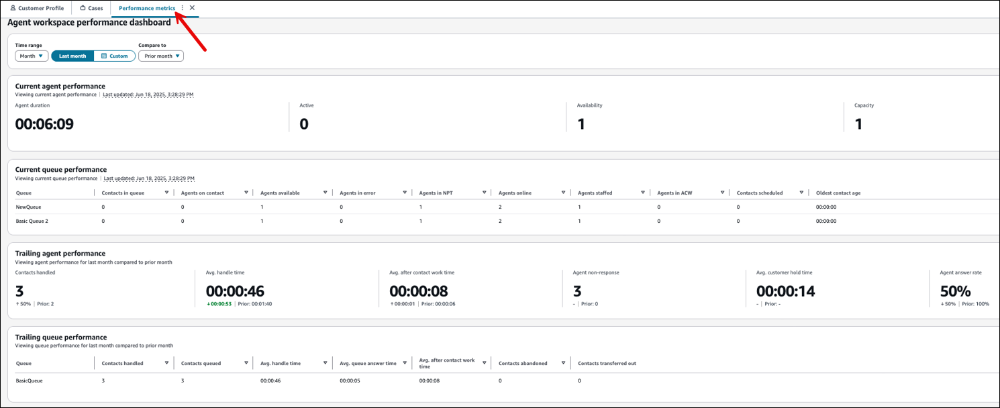
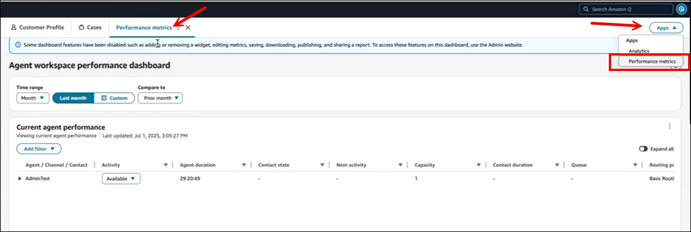

# Access the performance dashboard directly in

the agent workspace

You can enable users to view queue and agent performance metrics through the agent
workspace. Agents can view their own metrics for the queues and contacts they work on.
For example:

- **Current agent performance**: [Agent duration](metrics-definitions.md#duration-real-time "metrics-definitions.md#duration-real-time"), [Capacity](metrics-definitions.md#capacity-real-time "metrics-definitions.md#capacity-real-time"), [Availability](metrics-definitions.md#availability-real-time "metrics-definitions.md#availability-real-time"),
  [Active](metrics-definitions.md#active-slots "metrics-definitions.md#active-slots").
- **Current queue performance**: [Contacts in queue](metrics-definitions.md#contacts-in-queue "metrics-definitions.md#contacts-in-queue"), [Agents on contact](metrics-definitions.md#agents-on-contact "metrics-definitions.md#agents-on-contact"), [Agents available](metrics-definitions.md#available-real-time "metrics-definitions.md#available-real-time"), [Agents in error](metrics-definitions.md#agent-error "metrics-definitions.md#agent-error"), [Agents in NPT](metrics-definitions.md#agent-non-productive "metrics-definitions.md#agent-non-productive"), [Agents online](metrics-definitions.md#online-agents "metrics-definitions.md#online-agents"), [Agents staffed](metrics-definitions.md#staffed-agents "metrics-definitions.md#staffed-agents"), [Agents in
  ACW](metrics-definitions.md#agent-after-contact-work "metrics-definitions.md#agent-after-contact-work"), [Contacts Scheduled](metrics-definitions.md#scheduled "metrics-definitions.md#scheduled"), [Oldest contact age](metrics-definitions.md#oldest-real-time "metrics-definitions.md#oldest-real-time")
- **Trailing agent performance**: [Contacts handled](metrics-definitions.md#contacts-handled "metrics-definitions.md#contacts-handled"), [Avg handle time](metrics-definitions.md#average-handle-time "metrics-definitions.md#average-handle-time"), [Avg after contact work
  time](metrics-definitions.md#average-after-contact-work-time "metrics-definitions.md#average-after-contact-work-time"), [Agent non-response](metrics-definitions.md#agent-non-response "metrics-definitions.md#agent-non-response"), [Avg customer hold time](metrics-definitions.md#average-customer-hold-time "metrics-definitions.md#average-customer-hold-time"), [Agent answer rate](metrics-definitions.md#agent-answer-rate "metrics-definitions.md#agent-answer-rate").
- **Trailing queue performance**: [Contacts handled](metrics-definitions.md#contacts-handled "metrics-definitions.md#contacts-handled"), [Contacts queued](metrics-definitions.md#contacts-queued "metrics-definitions.md#contacts-queued"), [Avg handle time](metrics-definitions.md#average-handle-time "metrics-definitions.md#average-handle-time"), [Avg. queue answer time](metrics-definitions.md#average-queue-answer-time "metrics-definitions.md#average-queue-answer-time"), [Avg. after contact work
  time](metrics-definitions.md#average-after-contact-work-time "metrics-definitions.md#average-after-contact-work-time"), [Contacts abandoned](metrics-definitions.md#contacts-abandoned "metrics-definitions.md#contacts-abandoned"), [Contacts transferred out](metrics-definitions.md#contacts-transferred-out "metrics-definitions.md#contacts-transferred-out").
  Agents can't customize their view of the performance metrics dashboard or take any
  other action such as saving or downloading it.

You can customize what metrics and widgets appear on the agent's dashboard. You then
integrate your customized dashboard as a third-party app into the agent workspace. For
an overview of steps, see [Integrate a published dashboard into the
agent workspace](integrate-published-dashboard.md "integrate-published-dashboard.md").

The following image shows an example of the **Agent workspace performance
dashboard** as it appears in the agent workspace. Notice it appears on the
**Performance metrics** tab.

## Assign permissions

Assign users the following permissions in their security profile so they can
access the **Agent workspace performance dashboard**:

- Assign to agents:
  - **Agent Applications** - **Performance
    metrics** - **Access**: Displays the
    **Performance metrics** option in the
    **Apps** dropdown menu in the agent
    workspace.
  - **Analytics and Optimization** - **View
    my own data in dashboards** -
    **View**: Grants access to the Dashboards to view
    individual agent performance metrics and the metrics of queues in
    the agent's routing profile.

- If supervisors or managers want to view the dashboard in the agent
  workspace, assign them the **Agent Applications - Performance
  metrics - Access** permission, and one of the following
  permissions:
  - **Analytics and Optimization** -
    **Dashboards** - **Access**:
    Grants access to only the **Dashboards**
    tab.
  - OR, **Analytics and Optimization** -
    **Access metrics** -
    **Access**: Grants access to all the tabs on
    the **Dashboards and reports** page.

## View the Agent workspace performance

dashboard

1.  Access the agent workspace using the following URL:

        * **https://`instance
         name`.my.connect.aws/agent-app-v2/**
        * If you access your instance using the awsapps.com domain, use the
         following URL: **https://`instance
         name`.awsapps.com/connect/agent-app-v2/**

    Where `instance name` is provided by your IT
    department or the individuals that set up Amazon Connect for your business.

2.  In the agent workspace, choose the **Apps** dropdown
    menu, and then choose **Performance metrics** to display
    the **Agent workspace performance dashboard**.

The following image shows the **Apps** option and the
**Performance metrics** tab on the agent
workspace.

## Limitations

The following limitations apply when accessing the **Agent workspace
performance dashboard** in the agent workspace:

- Agents can't customize the dashboard. For example, they can't add or
  remove widgets or metrics, or save the dashboard as a saved report.
- Agents can't take actions on the dashboard. For example, they can't
  download or share the dashboard.
