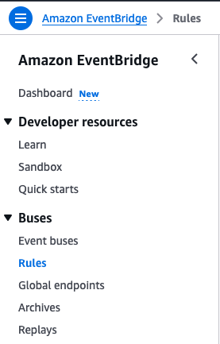
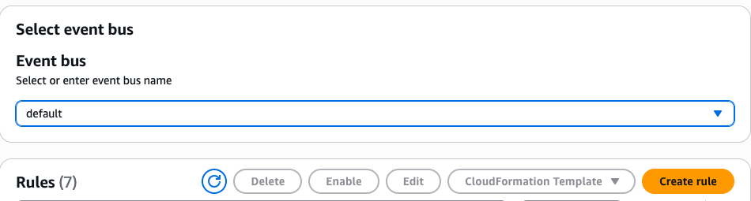
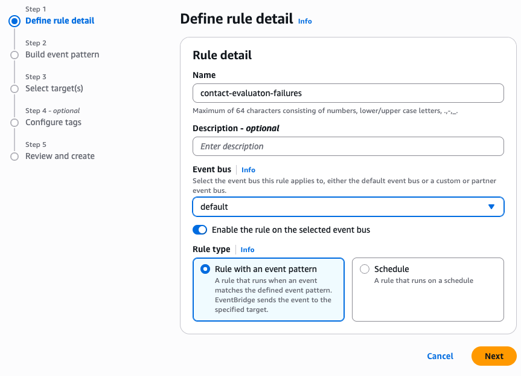
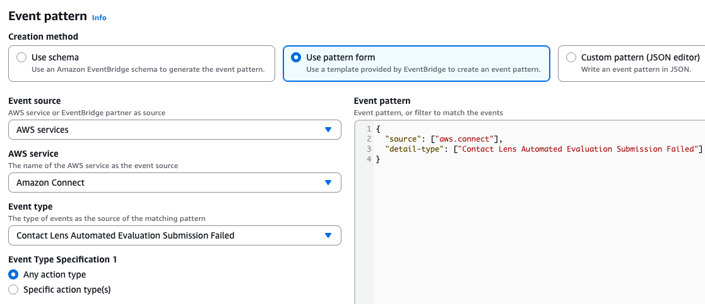
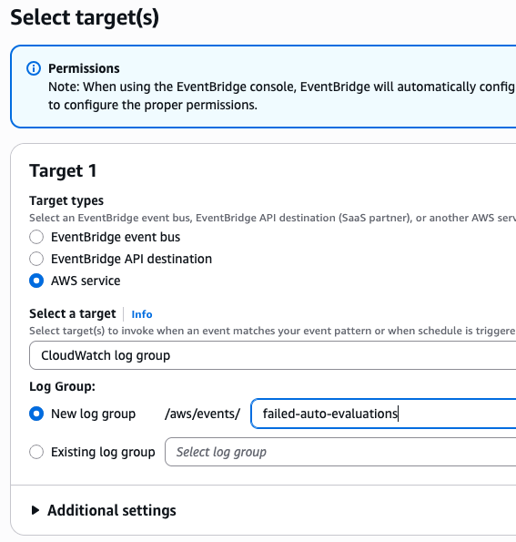
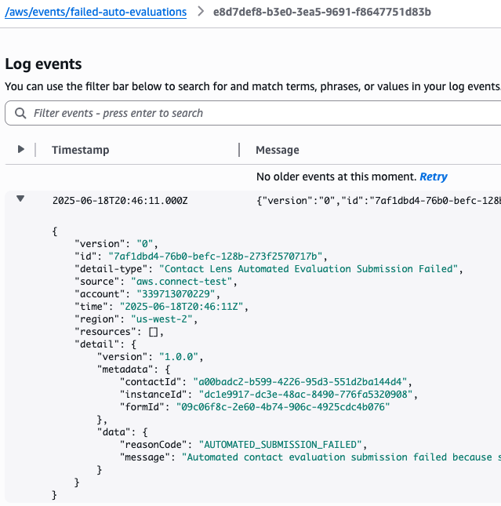

# Monitor performance evaluation failure events

You can monitor failures of automated evaluations as well as S3 exports of contact
evaluations using EventBridge and CloudWatch. You can use these events to investigate and fix failures.
The following guide is a walk through of the process of creating custom EventBridge rules to
monitor performance evaluation failure events.

## Step-by-step guide

This is a guide on how to create an EventBridge rule to log Connect Customer failed auto-evaluation
submission events and failed S3 exports of contact evaluations in your AWS console.

1. Log into your AWS account and navigate to the EventBridge console. Choose
   **Rules** under the **Buses** section.

 2. Choose **Create rule** with the default Event bus selected.

 3. Give the rule a name and select **Rule with an event pattern**
for the Rule type. Choose **Next**.

 4. With **AWS events or EventBridge partner events** selected
under **Events**, select the **Use pattern form**
option under **Event pattern**. This is where you will define
the pattern to match for triggering the rule. 5. Type and select **Amazon Connect** under the
**AWS service** dropdown to narrow down the event types.
Select the desired event type in the dropdown below. Choose **Next**
after the pattern is set up.

To subscribe to EventBridge event types, create a custom EventBridge rule that matches
the following:

    * `"source"` = `"aws.connect"`
    * `"detail-type"` can be one of the following:


    	+ `"Contact Lens Automated Evaluation Submission Failed"`
    	+ `"Contact Lens Evaluation Export Failed"`

 6. In the next step, you can configure the target(s) to process/receive the
matched events. For simplicity, select the **CloudWatch log group**
option under **Select a target** and choose a log group. 7. Choose **Next** and advance to the final
**Review and create** step. Choose **Create rule**
once more to complete the rule creation process. 8. Now, if the rule is in the **Enabled** state and a matching
event occurs, corresponding logs should show up in the configured CloudWatch log group
with the relevant IDs under the metadata section and the failure reason under
the data section.





## Example EventBridge payload

The following is an example EventBridge payload when the rule is matched:

```
{
  "version": "0",
  "id": "00005435-d12d-c93b-d9d2-b64cba85fbb6",
  "detail-type": "Contact Lens Automated Evaluation Submission Failed",
  "source": "aws.connect",
  "account": "Your AWS account ID",
  "time": "2025-10-02T10:34:56Z",
  "region": "us-west-2",
  "resources": [],
  "detail": {
    "version": "1.0.0",
    "metadata": {
      "contactId": "4266f8e9-8420-4ee7-96cd-515d2edae1f2",
      "instanceId": "d9b0b09d-7dab-47e5-9f82-d6787fbc068c",
      "formId": "8b1365bd-1415-41a9-a491-af226e1bda4e"
    },
    "data": {
      "reasonCode": "ANALYSIS_FILE_ERROR",
      "message": "Automated contact evaluation submission failed due to an error when searching/retrieving/parsing the analysis file."
    }
  }
}
```

## Common errors

The following errors might occur when the system eventually fails to process evaluations
after multiple retry attempts.

### Automated evaluation submission errors

| Error                         | Error message                                                                                                                                                                            |
| ----------------------------- | ---------------------------------------------------------------------------------------------------------------------------------------------------------------------------------------- |
| `AUTOMATED_SUBMISSION_FAILED` | Automated contact evaluation submission failed because some of<br>the questions could not be answered. Please verify the evaluation<br>form or the Connect Customer rule configurations. |
| `ANALYSIS_FILE_ERROR`         | Automated contact evaluation submission failed due to an error<br>when searching/retrieving/parsing the analysis file.                                                                   |
| `INTERNAL_SERVER_ERROR`       | Automated contact evaluation submission failed due to an internal<br>server error. Please expect delayed processing.                                                                     |
| `QUOTA_EXCEEDED_ERROR`        | Automated contact evaluation submission failed because the<br>remaining quota for using generative AI to automatically answer evaluation<br>questions for the contact is insufficient.   |

### Evaluation S3 export errors

| Error                       | Error message                                                                                                                |
| --------------------------- | ---------------------------------------------------------------------------------------------------------------------------- |
| `S3_BUCKET_ACCESS_DENIED`   | Contact evaluation JSON export failed due to insufficient permissions.                                                       |
| `S3_STORAGE_NOT_CONFIGURED` | The export S3 bucket is not configured for your instance.                                                                    |
| `INTERNAL_SERVER_ERROR`     | Contact evaluation JSON export failed due to an internal server<br>error. Please expect delayed delivery of the export file. |
